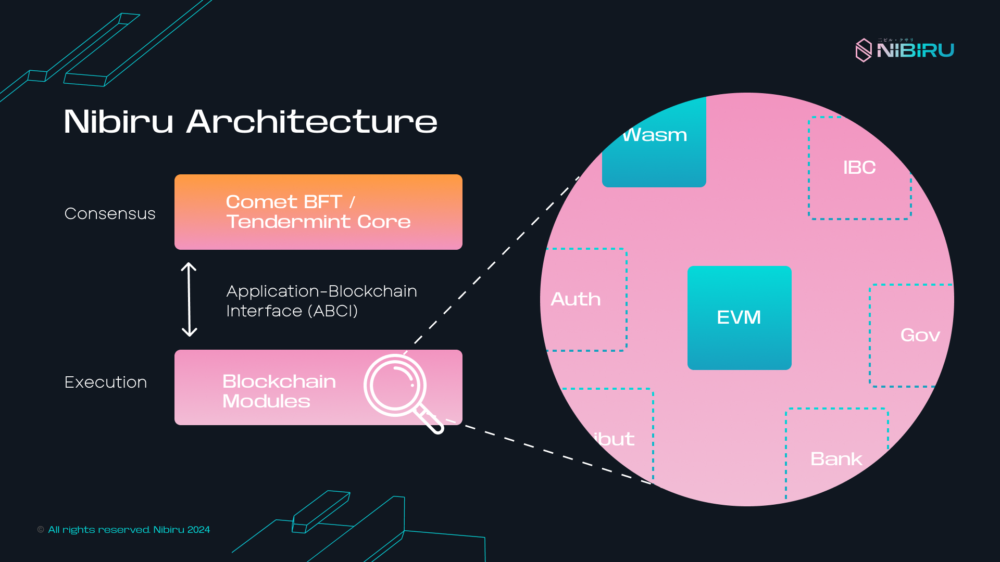
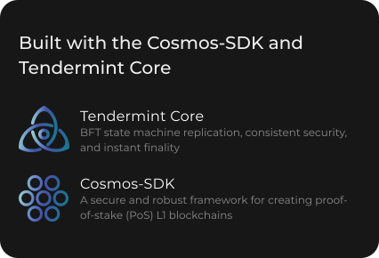

# Nibiru

Nibiru is a breakthrough L1 blockchain and smart contract ecosystem
providing superior throughput and unparalleled security. Nibiru  aims to be the
most **developer-friendly and user-friendly** smart contract platform in Web3. 

<!--
"If there are two evils in this world, they're centralization and complexity." — George Hotz
-->

<template>
  <HeroBoxes :boxes="boxesMain" />
</template>

## For Users

Engage with Nibiru's fast-growing community or get started by accessing a wealth of resources and tutorials below.

- [Nibiru Community Hub](./community/)
- [Nibiru Web App](https://app.nibiru.fi/)
- [Guide: Set Up a Nibiru Chain Wallet](./wallets/)
- [Guide: Staking on Nibiru](./use/stake.html)

## For Devs

<template>
  <HeroBoxes :boxes="boxesDevs" />
</template>

- [Smart Contract Sandbox (NibiruChain/nibiru-wasm)](https://github.com/NibiruChain/nibiru-wasm/tree/main)
- [TypeScript SDK: NibiJS](./dev/tools/kickstart.html)
- [Rust SDK: `nibiru_std`](https://github.com/NibiruChain/nibiru-wasm/tree/main/contracts#example-contracts)
- [Golang SDK: Gonibi](./dev/tools/go-sdk.html)
- [Python SDK](./dev/tools/py-sdk.html)

## Learn About Nibiru

Nibiru acts as a permission-less platform for developers to deploy secure,
production-grade smart contracts.

- [Smart Contracts on Nibiru](./ecosystem/wasm)
- [Learn: Core Concepts](./concepts/tx-msgs.html)
- [Learn: Blockchain Modules](./arch/)

<template>
  <HeroBoxes :boxes="boxesEnd" />
</template>

## Nibiru Ecosystem: Featured Apps

::: tip
Explore a more comprehensive set of projects building on Nibiru in our [Ecosystem Hub](https://nibiru.fi/ecosystem).
:::

- [**Sai.fun Perps Exchange**](./ecosystem/apps/sai-fun-perps.md): A perpetual futures exchange where
  users can take leveraged exposure and trade on a plethora of assets —
  completely on-chain, completely non-custodially, and with minimal gas fees.

- [**Astrovault**](https://nibiru.fi/ecosystem/apps/astrovault): A unique
exchange prioritizing efficiency, low-friction trading, and rewards.

- [**Nibiru Oracle**](./ecosystem/oracle/index.md): Nibiru accurately prices assets
  using a native, system of decentralized oracles. Both external APIs and smart
  contracts can tap into the Oracle Module for secure, low-latency feeds.

<!-- 
- [**Coded Estate**](https://codedestate.com/):  Coded Estate is about bringing
  homes on chain, rentals on chain, and democratizing access into the real estate
  system.  Coded Estate is reimagining ownership, decentralized allowing
  ownership for any and everybody.
-->

---

<!--TODO Extract content from below SVGs for use on dedicated page. -->
<!--  -->
<!--  -->

<!--TODO Write and add link to local IBC page-->
<!-- - [Inter-Blockchain Communication (IBC)](https://ibc.cosmos.network/):  Nibiru communicates -->
<!--   with other Cosmos layer-1 chains using the IBC protocol. IBC enables secure -->
<!--   and censorship-resistant transfers of funds between blockchains, cross-chain -->
<!--   computation, and transmission of arbitrary data. -->

<!--
Ref: https://github.com/cosmos/ibc

This includes cross-chain smart contract calls, fee payments, NFTs, and
fungible token transfers. IBC is not reliant on a multi-sig or centralized
bridging solution.
-->

<!--
The security of the Nibiru blockchain relies on a set of validators to commit
new blocks and participate in Tendermint BFT consensus by brodcasting votes
that contain cryptographic signatures signed by each validator's private key.
Validators stake **NIBI**, the protocol's native token used for gas,
governance, and "mining". Users can delegate NIBI to validators that record and
verify transactions in exchange for rewards.
-->

## Contribution Guidelines

You can contribute to improve this documentation by submitting a
GitHub ticket in our [`website-help` repository](https://github.com/NibiruChain/website-help).
