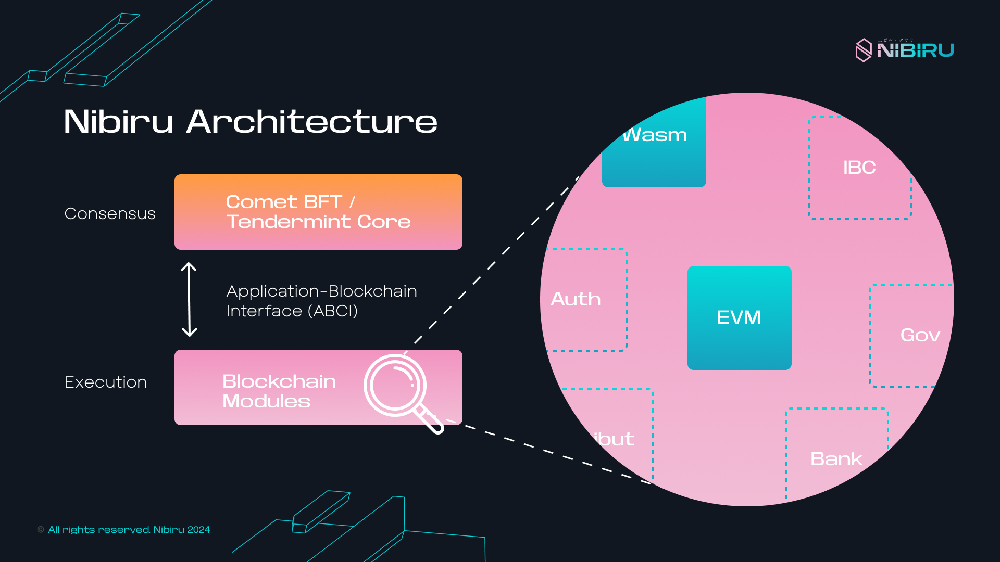

# Nibiru Architecture

The technical architecture of Nibiru consists of an execution engine and a
consensus engine. The [execution engine](#execution-engine) is what computes new
state updates given some transactions, while the [consensus
engine](#nibirubft-consensus-engine) validates and handles the gossiping of
blocks, ultimately adding them to the chain. {synopsis}

## [Execution Engine](./execution/README.md)

The execution engine of Nibiru is the overarching component that implements
business logic and manages the "state" that makes Nibiru a [state
machine](../concepts/tx-msgs.md#state-machine). This is where transactions are processed and disseminated.

This piece of the architecture includes the [Nibiru EVM](../evm/) and
[Wasm](../ecosystem/wasm/) execution
environments for smart contracts and other [custom "modules"](#modules-nibiru).  

## NibiruBFT Consensus Engine

Nibiru uses [NibiruBFT, an evolution on CometBFT](./nibiru-bft/README.md), as its
consensus algorithm. In blockchain networks, the consensus engine is responsible
for block building, the gossip of blocks on the peer-to-peer (P2P) network, and
management of consensus for new blocks to be added to the chain. 

## Block

A [block is an ordered sequence of transactions](../concepts/blocks.md) along
with a cryptographic hash that references the prior, or parent, block that came
before. A block's hash is derived from the data and resulting state of executing
the state transitions (transactions) it contains.

<!-- TODO: Terminology -->
<!-- - [ ] The Cosmos-SDK -->

## Appendix: Module Reference

- [Modules — Nibiru](#modules-nibiru)
- [Modules — Cosmos-SDK](#modules-cosmos-sdk)
- [Inter-Blockchain Communication (IBC)](#inter-blockchain-communication-ibc)

## Modules — Nibiru

| Module | Active?   | Description |
| --- | --- | --- |
| [EVM][code-x-evm] |   ✔️ | Implements Nibiru EVM, which manages an Ethereum Virtual Machine (EVM) state database and enables the execution of Ethereum smart contracts. Nibiru EVM is an extension of "[geth](https://github.com/ethereum/go-ethereum)" along with "web3" and "eth" JSON-RPC methods. |
| [Wasm][code-x-wasm] |  ✔️ |  Handles Wasm smart contracts.  This is the interface with the Wasm VM. |
| [Dev Gas][code-x-devgas] |  ✔️  |  Implements a Smart contract gas royalties mechanism allowing builders to capture the value they create. |
| [Epochs][code-x-epochs] |  ✔️ | Often in the SDK, we would like to run certain code every so often. The purpose of `epochs` module is to allow other modules to set that they would like to be signaled at regular intervals. So another module can specify it wants to execute code once a week, starting at UTC-time = x. `epochs` creates a generalized epoch interface to other modules so that they can easily be signaled upon such events. |
| [Oracle][code-x-oracle] |  ✔️  |  Handles the decentralized oracle module. |
| [Common][code-x-common]    |  ✔️ | Holds helper and utility functions to be utilized by other `x/` cosmos-sdk modules. |
| [Common/testutil][code-x-testutil] |  ✔️ | Helper functions for unit and integration tests. |

[code-x-evm]: ../evm/README.md
[code-x-common]: https://github.com/NibiruChain/nibiru/tree/v1.1.0/x/common
[code-x-devgas]: ./devgas
[code-x-epochs]: https://github.com/NibiruChain/nibiru/tree/v1.1.0/x/epochs
[code-x-testutil]: https://github.com/NibiruChain/nibiru/tree/v1.1.0/x/common/testutil
[code-x-wasm]: ./wasm/
[code-x-oracle]: https://github.com/NibiruChain/nibiru/tree/v1.1.0/x/oracle

## Modules — Cosmos-SDK

Production-grade modules imported from the Cosmos-SDK:

| Module | Active?   | Description |
| --- | --- | --- |
|  [auth][cosmos-x-auth]    |  ✔️ | Authentication of accounts and transactions for Cosmos SDK application. |
|  [authz][cosmos-x-authz]    |  ✔️ | Authorization for accounts to perform actions on behalf of other accounts. |
|  [bank][cosmos-x-bank]    |  ✔️ | Token transfer functionalities. |
|  [base][cosmos-x-base]    |  ✔️ |
|  [capability][cosmos-x-capability]  |  ✔️ | Object capability implementation. |
|  [crisis][cosmos-x-crisis]  |  ✔️ | Halting the blockchain under certain circumstances (e.g. if an invariant is broken). |
|  [crypto][cosmos-x-crypto]  |  ✔️ |
|  [distribution][cosmos-x-distribution]  |  ✔️ | Fee distribution, and staking token provision distribution. |
|  [evidence][cosmos-x-evidence]  |  ✔️ | Evidence handling for double signing, misbehaviour, etc. |
|  [feegrant][cosmos-x-feegrant]  |  ✔️ |
|  [genutil][cosmos-x-genutil]  |  ✔️ |
|  [gov][cosmos-x-gov]  |  ✔️ | On-chain proposals and voting. |
|  [mint][cosmos-x-mint]  |  ✔️ | Creation of tokens native to the chain. |
|  [params][cosmos-x-params]  |  ✔️ | Globally available parameter store. |
|  [slashing][cosmos-x-slashing]  |  ✔️ | Validator punishment mechanisms. |
|  [staking][cosmos-x-staking]  |  ✔️ | Proof-of-Stake layer for public blockchains. |
|  [tx][cosmos-x-tx]  |  ✔️ |
|  [upgrade][cosmos-x-upgrade]  |  ✔️ | Software upgrades handling and coordination. |
|  [vesting][cosmos-x-vesting]  |  ✔️ |

[cosmos-x-auth]: ./cosmos-sdk/auth
[cosmos-x-authz]: ./cosmos-sdk/authz
[cosmos-x-bank]: ./cosmos-sdk/bank
[cosmos-x-base]: https://github.com/cosmos/cosmos-sdk/tree/v0.47.5/x/base
[cosmos-x-capability]: ./cosmos-sdk/capability
[cosmos-x-crisis]: ./cosmos-sdk/crisis
[cosmos-x-crypto]: https://github.com/cosmos/cosmos-sdk/tree/v0.47.5/x/crypto
[cosmos-x-distribution]: ./cosmos-sdk/distribution
[cosmos-x-evidence]: ./cosmos-sdk/evidence
[cosmos-x-feegrant]: ./cosmos-sdk/feegrant
[cosmos-x-genutil]: https://github.com/cosmos/cosmos-sdk/tree/v0.47.5/x/genutil
[cosmos-x-gov]: ./cosmos-sdk/gov
[cosmos-x-mint]: https://github.com/cosmos/cosmos-sdk/tree/v0.47.5/x/mint
[cosmos-x-params]: https://github.com/cosmos/cosmos-sdk/tree/v0.47.5/x/params
[cosmos-x-slashing]: https://github.com/cosmos/cosmos-sdk/tree/v0.47.5/x/slashing
[cosmos-x-staking]: ./cosmos-sdk/staking
[cosmos-x-tx]: https://github.com/cosmos/cosmos-sdk/tree/v0.47.5/x/tx
[cosmos-x-upgrade]: ./cosmos-sdk/upgrade
[cosmos-x-vesting]: https://github.com/cosmos/cosmos-sdk/tree/v0.47.5/x/vesting

## Inter-Blockchain Communication (IBC)

The IBC module has its [own repository, `ibc-go`](https://github.com/cosmos/ibc-go).
