# Securing the EVM for a Quantum Future: Cryptographic Primitives, Threats, and ML-DSA

"Explore how quantum computing threatens EVM security through Shor's and Grover's algorithms, and learn how ML-DSA's lattice-based cryptography offers quantum-resistant protection for blockchain networks. {synopsis}

## 1 - Introduction: Fortifying the EVM for the Quantum Era

Cryptography is the backbone of blockchain security. The Ethereum Virtual Machine (EVM) relies on Elliptic Curve Cryptography (ECC) and hash functions like Keccak-256 to ensure privacy, data integrity, and consensus. However, **quantum computing** breakthroughs—most recently highlighted by Google’s Willow chip—pose a growing threat to these very algorithms.

This research piece explores:

1. **EVM Cryptographic Primitives:** How **ECC** and **Keccak-256** underpin key operations such as transaction signing, block hashing, and address generation.
2. **Security Foundations:** Why properties like **collision resistance** and **preimage resistance** protect blockchain data and why they matter.
3. **Quantum Threat Landscape:** How **Shor’s Algorithm** can threaten ECC-based signatures and **Grover’s Algorithm** can weaken hash security.
4. **Practical Realities & Hardware:** Why current quantum hardware remains insufficient for full-scale attacks, but is advancing rapidly.
5. **Toward Quantum-Resistant Solutions:** Overview of **ML-DSA** and other lattice-based algorithms that can withstand quantum attacks.

By understanding both the **limits** of current cryptography and the **potential** of post-quantum approaches, blockchain networks—including those running on the EVM—can proactively prepare for a safer, quantum-ready future.


## 2 - Cryptographic Primitives in the EVM

### 2.1 - The Core Building Blocks: ECC and Hash Functions

Let’s take a quick dive into the cryptographic primitives that secure the Ethereum Virtual Machine. There are two main classes of cryptographic primitives used in EVM: 

- Elliptic Curve Cryptography (ECC)
- Hash Functions


If you're not familiar with ECC, we recommend reviewing our research piece on ECC/BLS [link upon BLS signatures article release]. In short, ECC functions are characterized by **asymmetry** and **partial reversibility**. In contrast, hash functions do not share these properties—hash functions are strictly **one-way**, meaning they cannot be reversed.

#### 2.1.1 - Why ‘Partial Reversibility’ Matters in ECC

What do we mean by partial reversibility? Consider this simple example: a signer uses their private key to generate a signature. Since the associated public key is derived from the private key, anyone can verify the signature without exposing or revealing the private key itself.

The hashed message digest can be "reversed" using the public key to retrieve the original hash. In other words, the signature is partially reversible because it can be traced back to the private key’s owner (through the public key) to confirm authenticity—yet the private key itself remains securely hidden.

#### 2.1.2 - The One-Way Nature of Hash Functions

Hash functions, on the other hand, are designed to be **irreversible**. In other words, with classical computing, it’s computationally infeasible to derive the original input or its properties from the output. This one-way nature is extremely useful for **data integrity**—for example, when generating Ethereum addresses from public keys or creating transaction hashes.

### 2.2 - Real-World Use: Signatures, Hashing, and Addresses

Elliptic Curve Cryptography (ECC) includes popular algorithms such as ECDSA and EdDSA, while hash functions encompass SHA-3 variants, particularly the Keccak-256 function in the EVM. ECDSA and EdDSA handle transaction signing, signature verification, and public key generation on the secp256k1 curve (referenced in the BLS article). Meanwhile, Keccak-256 is used throughout the EVM for block header hashing, transaction hashing, address generation, and various trie operations.


> For example, during consensus, validators compare Keccak-256 hashes to confirm they are voting on the same final state. Identical hashes mean the validators share a consistent state after execution. Because hashing is one-way, there’s no need for partial reversibility in these processes.

Choice of primitive class relies heavily on its use case.

## 3 - Understanding Security Guarantees: Collision and Preimage Resistance

To understand the security guarantees provided by current encryption algorithms, we begin by examining the core security properties that underlie blockchain technology: Collision Resistance and Preimage Resistance.

### 3.1 - Collision Resistance: The First Layer of Defense

A central property is **collision resistance**, which ensures it is computationally infeasible to find two distinct inputs that produce the same hash output. In the case of Keccak-256, there is a 128-bit security against collisions. This means it would require approximately 2^128 operations to discover a single collision. 

#### 3.1.1 - Birthday Paradox: Why 2^128 Collisions Matter

The birthday paradox demonstrates that the probability of a collision increases quadratically with the number of hashes generated. For a hash function with an n-bit output, there are `2^n` possible hash values. Therefore, the number of hash pairs that could potentially collide are `k^2/2`, where k is the number of hashes generated. 

Given that the total number of possible hash outputs is `2^n`, the probability of no collision can be approximated as `e^(-k^2/(2*2^n)`. Thus, the probability of at least one collision is `1-e^(-k^2/(2*2^n))`. 

To find the number of hashes `k` needed for a 50% (0.5) probability, we solve for `k=(sqrt(2^n))` . For `n=256`, as in Keccak-256, the result is `k=2^128`, indicating 128-bit resistance.

#### 3.1.2 - ECC vs. Hash Functions: Two Paths to Collision Resistance

Collision resistance in elliptic curve cryptography (ECC) differs from that in hash functions like Keccak-256. In ECC, a collision refers to two distinct private keys producing the same signature, rather than two inputs hashing to the same output. For the secp256k1 curve, collision resistance provides approximately 128-bit security, based on the same principles as the birthday attack.

### 3.2 - Preimage Resistance: Protecting Against Reverse Engineering

The second major property is that of preimage resistance, where there exist two forms of preimage resistance. 

#### 3.2.1 - First Preimage Attacks: Why Finding the Original Input Is Hard

First preimage resistance ensures that, given a hash output `h`, it is computationally infeasible to find an input `i` such that `hash(i) = h`. While similar to collision resistance, the two concepts differ. Collision resistance involves finding two distinct inputs that hash to the same output, whereas preimage resistance focuses on reverse-engineering an input that corresponds to a given hash.

#### 3.2.2 - Second Preimage Attacks: Stopping Duplicate Hash Matches

The second form of preimage resistance, known as second preimage resistance, is defined as follows: given an input `i1`, it is computationally infeasible to find a different input `i2` where `hash(i1)=hash(i2)`.

### Example in Smart Contracts

Consider a smart contract that uses Keccak-256 hashing for access control. The contract takes various input parameters, hashes them with Keccak-256, and compares the resulting hash against a predefined whitelisted hash. If the hashes match, the user gains access to restricted functions within the contract. If an attacker compromises Keccak-256's hashing, they could brute-force a combination of parameters that produces a hash matching the authorized user's hash, granting them unauthorized access. This scenario illustrates the importance of first preimage resistance.

Both forms of preimage resistance can be viewed as specific subsets of collision resistance. Collision resistance is a stronger property, encompassing the ability to resist finding any two distinct inputs that hash to the same output. Consequently, Keccak-256 provides a 256-bit security guarantee for both forms of preimage resistance but only a 128-bit guarantee for collision resistance due to the birthday attack rationale.


## 4 - Quantum Computing Threats: Shor, Grover, and Beyond

### 4.1 - Shor’s Algorithm: Cracking ECDSA at Its Core

Some algorithms pose threats to public-key cryptography. One example is Shor’s algorithm, which efficiently reduces the discrete logarithm problem (see BLS article) from exponential time to polynomial time - an exponential speedup.

#### 4.1.1 - Revisiting the ECDLP: How ECC Security Could Fall

As a quick recap of the Elliptic Curve Discrete Logarithm Problem (ECDLP), there is a known elliptic curve point `G` from which the public key `pk` is derived from the private key `sk` (`pk= skG`). The security of ECC relies on the computational infeasibility of reverse engineering `sk` from `pk`, as there are large enough number of points on `G` that when multiplied by generator `G`, result in `pk`.

#### 4.1.2 - The Quantum Fourier Transform: Shor’s Secret Weapon

Shor’s algorithm can solve ECDSA in polynomial time by using the Quantum Fourier Transform (QFT) to analyze periodicity in the `G` and `P` relationship. Unlike the classical Fast Fourier Transform (FFT), QFT operates on quantum states, which can exist in superposition. Simply put, this allows QFT to process multiple inputs simultaneously, resulting in a substantial parallel computing speed-up.

By doing so, Shor’s algorithm can derive private keys from public keys in `O(log^3n)` time. However, this is currently impractical due to the technological limitations of quantum computing. Researchers estimate that approximately 2,330 logical qubits are required to break ECC-256 (including secp256k1 used in ECDSA). Additionally, it would require about 360n^3 quantum gates, where nn is the bit length of the elliptic curve order (256 for ECDSA). This translates to roughly 6 billion quantum gates needed to break ECDSA.

### 4.2 - Grover’s Algorithm: A Warning Shot for Keccak-256

In contrast, Keccak-256 is generally considered quantum-resistant. Grover’s algorithm offers a quadratic speedup for brute-forcing Keccak-256, reducing its security guarantees for collision resistance and preimage resistance from 128-bit and 256-bit, respectively, to 64-bit and 128-bit.

#### 4.2.1 - Amplitude Amplification: How Grover’s Halves the Security Bits

Grover’s algorithm utilizes quantum computing similarly to Shor’s algorithm by leveraging state superposition to create a quantum system encompassing all possible inputs to the hash function. It employs a specialized oracle function to identify the probability of solution states that produce the correct hash. Using a technique called "amplitude amplification," the algorithm iteratively increases the amplitude of the target state while decreasing the amplitudes of other states. With carefully selected iterative cycles, Grover's algorithm maximizes the probability of measuring the correct state, achieving a peak at an optimal number of iterations. Research indicates that, assuming sufficient hardware, Grover’s algorithm can achieve a solution probability exceeding 90% (Lee, https://www.mdpi.com/2079-9292/13/23/4830).

## Example Layered Attack on Ethereum

Let’s examine a complex attack targeting both Keccak-256 and ECDSA. Consider the Ethereum address `0xDD71164D71A8488559d75feFcBe02B7D0F6857A8`. Ethereum addresses are derived from the last 20 bytes of the Keccak-256 hash of a valid public key, which exists as a point on the secp256k1 curve. A first preimage attack would involve reversing these steps.

First, we would need to find a valid preimage—a public key that, when hashed with Keccak-256, produces the last 20 bytes matching the target Ethereum address. Next, we would have to break the Elliptic Curve Discrete Logarithm Problem (potentially using Shor’s Algorithm) to determine the private key corresponding to the public key on the secp256k1 curve.

This illustrates how Ethereum’s security depends on the layered protection provided by both ECDSA and Keccak-256. Successfully compromising one algorithm is insufficient; both must be broken to uncover the private key and steal the address’s funds.


## 5 - Where Quantum Hardware Stands Today: Hype vs. Reality

Google’s Willow chip reportedly operates at around 105 qubits. Although it might seem that using 23 of these chips could break ECDSA, this overlooks an important distinction between **physical qubits** and **logical qubits**. Physical qubits are defined by the hardware itself, while logical qubits are abstractions that bundle multiple physical qubits together. The ratio between physical and logical qubits varies with factors like qubit stability and error tolerance, so simply combining raw qubits does not equate to the computational power needed to break ECDSA.

[Research](https://pubs.aip.org/avs/aqs/article/4/1/013801/2835275/The-impact-of-hardware-specifications-on-reaching) estimates that running Shor’s algorithm to break ECDSA in under an hour would require around **317 million physical qubits**—a scale far beyond current capabilities.

In 2023, IBM unveiled plans to develop a **100,000-qubit** quantum chip by 2030. While this projection remains speculative, it highlights the importance of **exploring quantum-resistant algorithms** to prepare for emerging quantum computing threats.

## 6 - Readying for the Post-Quantum Shift: Nibiru’s QRC Strategy

### 6.1 - Nibiru’s Quantum-Resistant Vision: Why We’re Moving Now

At Nibiru, we believe **proactive architectural innovation** is essential in the face of quantum computing’s rapid progress. Traditionally, cryptography’s evolution was guided by Moore’s law—growing transistor density indicated how quickly we needed to strengthen our algorithms. But quantum hardware developments, like Google’s Willow chip solving certain tasks in minutes that would keep classical supercomputers busy for ten septillion years, have completely shifted this paradigm.

This article leads to a clear call-to-action: while classical cryptography such as ECDSA and Keccak-256 can withstand current threats, they risk becoming obsolete once quantum machines achieve sufficient qubit counts. Thus, we introduce **quantum-resistant solutions**—especially **lattice-based** options like ML-DSA—in the sections that follow. Our aim is to show how transitioning to these next-generation cryptographic methods can future-proof decentralized systems and prevent the catastrophic failure of security assumptions that could arise if quantum capabilities surpass today’s standards.

### 6.2 - The QRC Roadmap: Phasing Out Vulnerabilities

Given these developments, our research team has made **quantum-resistant algorithms** a top priority. We intend to **replace ECDSA** with quantum-safe alternatives first, and eventually **address Keccak-256** in the Ethereum Virtual Machine as well.


## 7 - ML-DSA: A Quantum-Safe Signature Scheme

Currently, a few promising quantum-resistant alternatives are emerging, with *ML-DSA* and *Fast-Fourier Lattice-Based Compact Signatures over NTRU (FALCON)* standing out as prime candidates to replace ECDSA.

### 7.1 - ML-DSA 101: The Lattice-Based Leap Beyond ECC

The Modular Lattice Digital Signature Algorithm (ML-DSA) marks a departure from the elliptic curve foundation of ECDSA and EdDSA. Unlike its predecessors, which rely on the Elliptic Curve Discrete Logarithm Problem (ECDLP) for security, ML-DSA derives its security from the Modular Learning With Errors (MLWE) and Module Short Integer Solution (MSIS) problems.

To grasp the foundations of ML-DSA, it is important to first understand what the MLWE and MSIS problems entail.

#### 7.1.1 - MLWE: The Puzzle That Strengthens ML-DSA

The Modular Learning With Errors (MLWE) problem is an extension of the Learning With Errors (LWE) problem, adapted to operate within the framework of module lattices. It can be described as follows:

 Given a random matrix `A ∈ R^(k x l)_q`, where `R_q` is a polynomial ring, the objective is to find a secret vector `s ∈ R^l_q` and an error vector `e ∈ R^k_q` such that:

- `As + e = b`, where `b ∈ R^k_q` is a given vector.

The hardness of MLWE lies in distinguishing between `(A, As + e)` and `(A, u)`, where `u`  is uniformly random. This distinguishing challenge forms the basis of the problem’s security.

::: tip
Think of MLWE as solving a puzzle where the pieces don’t fit perfectly. You’re given a set of mathematical equations, but each one includes a small random error. The challenge is to uncover the secret numbers that were used to create these equations, despite the errors being mixed in. The more intricate and complex the equations (or puzzle), the harder it becomes for anyone to deduce the secret numbers within a feasible amount of time.
:::

#### 7.1.2 - MSIS: Ensuring Short Solutions Stay Secret

Similarly, the MSIS problem is a module-based variant of the Short Integer Solution (SIS) problem. It is defined as follows:

Given the same random matrix `A`, the objective is to find a short non-zero vector `x ∈ R^l_q` such that:

- `Ax = 0 mod q`

The hardness of MSIS arises from the challenge of finding a solution `x` with small coefficients, making it computationally infeasible to solve efficiently.

::: tip
Think of MSIS as a system of scales with a set of weights (represented by matrix `A`). The challenge is to find a specific combination of counterweights (represented by vector `x`) that perfectly balances all the scales simultaneously. As the number of scales in the system increases, finding a solution becomes increasingly complex. The larger and more intricate the system, the harder it is to discover an arrangement of counterweights that achieves perfect balance, making the problem computationally infeasible.
:::


## 7.2 - Lattice Foundations: Harnessing Polynomial Rings for Security

ML-DSA is based on lattice-based cryptography, utilizing module lattices, which are mathematical structures extending vector spaces over rings. The algorithm operates on polynomials within a ring `R`, where `R` is defined as:

`R = Z[X]/(X^n +1)`

where n is chosen as a power of 2 (usually 256 or 512). Similar to how ECDSA relies on the choice of elliptic curve to define the properties of the encryption system, the choice of ring `R` in ML-DSA is carefully selected based on the desired needs and security requirements of its application. For ML-DSA, n=256 and n=512 are often salient choices, as they enable fast polynomial multiplication with Number Theoretic Transform (NTT), analogous to FFT. Analogous to ECC, naming conventions reflect ring choice (e.g. secp256k1 specifies a prime field p with 256-bit prime using the first Koblitz curve, `k1`), where `n=256` corresponds to the 256 in ML-DSA-256.

The same tradeoffs found in ECC also apply to ML-DSA when choosing `n`. Larger `n` values offer stronger security guarantees but come with increased computational overhead and larger key and signature sizes.


## 7.3 - Generating Keys in ML-DSA: From Random Seeds to Public Keys

Key generation in ML-DSA is more complex than in its elliptic curve predecessors. While ECC relies on scalar multiplication on the chosen elliptic curve, ML-DSA requires:

1. Random sampling of matrices `A ∈ R^(k x l)` uniformly and randomly, where matrix `A` is pseudorandomly derived from public seed `ρ`
2. Sampling smaller polynomials `s1 ∈ Rq^l` and `s2 ∈ Rq^k` from a centered binomial distribution
3. Computing `t = As1 +s2 mod q`

The corresponding public key and private keys are then:
- `pk = (ρ, t1)`
- `sk = (ρ, K, tr, s1, s2, t0)`

### 7.3.1 - Decoding the Key Parameters: ρ, t1, and More

If these variables are confusing at first, let’s break it down:

- `k` and `l` represent the number of rows and columns, respectively, in matrix `A`
    - The choice of `k` and `l` determines the security guarantees of ML-DSA. While a detailed discussion of these parameters is beyond the scope of this research, it is sufficient to note that pre-defined `k`/`l` pairs provide varying levels of security in accordance with NIST specifications
- `q` is defined as a prime number in the ML-DSA specification, specifically `2^23 - 2^13 + 1` or `8380417`. This value is chosen for its balance between security and efficiency, as well as its suitability for efficient NTT operations mentioned earlier
- `ρ` is defined as the 256-bit public seed used to generate matrix `A`
- `t1` contains the high-order bits of `t`
- `t0` contains the low-order bits of `t`
- `tr` is a hash of the public key, defined as `tr = H(pkEncode(ρ, t1), 64)` , where hash function `H` is SHAKE-256 and `pkEncode` outputs an encoded byte string representation of the public key

Now that we know how public and private keys are generated over matrix `A`, pseudorandomly generated over public seed `ρ`, let’s examine how ML-DSA implements signature generation and verification.


## 7.4 - Crafting a Signature: The ML-DSA Process Explained

ML-DSA differs significantly from ECC both in how it derives public keys and how it generates signatures. Rather than depending on modular arithmetic over an elliptic curve—an approach vulnerable to quantum algorithms—ML-DSA uses a **lattice-based** framework. This framework relies on polynomial operations and a technique called **rejection sampling**, ensuring the resulting signatures remain secure against both classical and quantum threats. Let’s look closer at how ML-DSA achieves this.

### 7.4.1 - How Signatures Are Formed: An Overview

The signature generation process in ML-DSA is described as follows:

- Generating a masking vector `y`
- Computing `w = Ay mod q` and deriving `w1`
- Generating a challenge hash `c̃` based on message and `w1`
- Computing `z = y + cs1`
- Computing hint `h` for reconstruction of `w1`

The signature then consists of `(c̃, z, h)` , where verification involves checking that:

- `c` matches the recomputed challenge
- `Az - ct1 * 2^d` is reasonably close to the expected value given hint `h`

### 7.4.2 - Step-by-Step: Tying y, c, and s1 Together

Let’s break these steps down. 

1. Generating a masking vector `y`
    1. Masking is not a new concept - the masking vector is used later in the “compute `z = y + cs1`" step. This is similar to the random nonce used in traditional Schnorr signatures.
2. Computing `w = Ay mod q`
    1. `w` is the result of the matrix multiplication of `A`, the matrix derived from public seed `ρ`, serving as the initial commitment value in the signature scheme and used to generate challenge `c`. It serves as the initial commitment value in the signature scheme and is used to generate the challenge `c`
3. Deriving `w1`
    1. As mentioned previously, `w1` is defined as the high-order bits of `w`. This maintains security and increases efficiency of verification, while compressing signature size
4. Computing `z = y + cs1`
    1. Here, we bind together the random mask `y`, challenge `c`, and secret key `s1` to ensure that signatures created can only be created by the owner of secret key `s1`
5. Computing hint `h` for reconstruction of `w1`
    1. Because the public key is compressed in step 3, the verifier needs additional information to be able to properly verify the signature. This hint provides the necessary information for the verifier to determine whether the reconstructed commitment `w1` is within error tolerance of the signer’s commitment

### 7.4.3 - The MLWE Connection: Why Hidden Errors Protect You

Let’s recall the MLWE problem. In ML-DSA, the public key is derived from an MLWE instance, where the secret key serves as the solution to this instance. The commitment step (step 2) conceals the random error in the commitment value, making it computationally infeasible to deduce the secret key used to generate the signature.


## 7.5 - Verifying an ML-DSA Signature: Checking the ‘Close Enough’ Principle

### 7.5.1 - Two Critical Checks: The Challenge and the Reconstruction

Breaking down verification:

1. The verifier first recomputes challenge `c` using the provided `c̃`, the message, and reconstructed `w1`  - this is the first of the two checks: the challenge check
2. The verifier computes `Az - ct1 * 2^d` 
3. If this value is reasonably close to the expected `w` (which is analogous to the commitment value `g^r` in Schnorr signatures, then the verifier is able to verify that the signer is indeed the owner of secret key `s1` - this is the second of the two checks: the reconstruction check
    1. This takes advantage of the relationship between `w`, `z`, and `pk`

### 7.5.2 - MSIS in Action: Balancing the Scales to Confirm Validity

Let’s recall the MSIS problem. The verification process implicitly invokes the MSIS problem, checking that the signature corresponds to a short vector solution. The steps to this proof are a bit more complex:

1. We begin with our original verification condition:
    1. `Az - ct1 * 2^d **≈ w**`
2. Let’s rewrite this as:
    1. `Az - ct1 * 2^d - w **≈ 0**`
3. Because `Az` is a matrix vector multiplication, `-ct1 * 2^d` is a scalar vector multiplication, and `-w` is a vector, this can be represented as a single matrix-vector multiplication by constructing an extended matrix and multiplying it by a scalar vector:
    1. `A' = [A | -t1 * 2^d | -w]` and
    2. `v = [z, c, 1]`
4. Thus, our equation becomes:
    1. `A'v ≈ 0`

This rewritten form of the verification condition resembles the MSIS problem and checks whether there exists a vector `v` that when multiplied by our random matrix `A`, generates a vector close to zero.

In other words, we verify that the provided “counterweights” (`v`) from the signer can reasonably balance the “scales” (`A`) mentioned earlier, confirming that the signature was indeed generated by the owner of the secret key associated with the public key.


## 8 - Looking Ahead: Nibiru’s Commitment to a Quantum-Secure EVM

Classical cryptography in the Ethereum Virtual Machine—particularly ECC-based signatures and Keccak-256 hashing—currently offers robust security. However, the advent of quantum computing poses serious threats to ECDLP-based mechanisms, like those used in ECDSA and EdDSA. Though current physical qubit counts remain insufficient to run Shor’s algorithm at scale, rapid hardware advancements demand **proactive** preparation.

Lattice-based schemes, such as ML-DSA and FALCON, represent promising alternatives that are resistant to quantum attacks. ML-DSA, in particular, provides a novel and reliable solution to replace ECDSA in anticipation of future quantum breakthroughs.

At Nibiru, we’re dedicated to researching the feasibility of integrating these new techniques and evaluating other options like FALCON as part of our long-term technical roadmap. Staying ahead of emerging threats is essential for ensuring that decentralized systems can rely on secure, next-generation cryptographic standards. ML-DSA is just the first step in our ongoing efforts to protect the future of decentralized technology.

