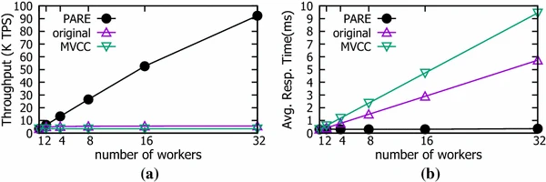
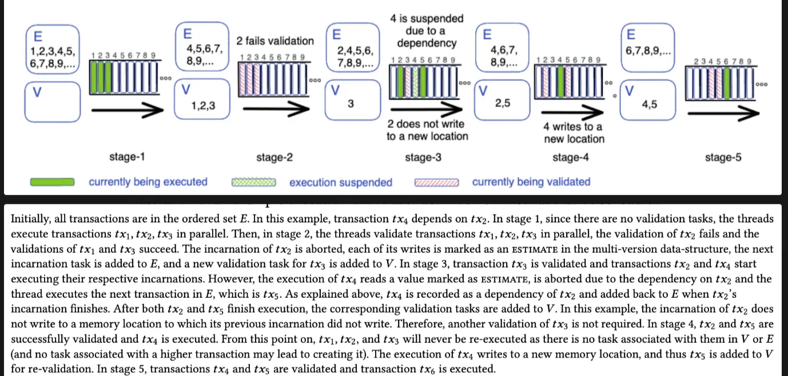

# Nibiru Adapative Execution 

As part of its Lagrange Point roadmap, the Nibiru blockchain is implementing
Nibiru Adaptive Execution, a novel approach to parallel transaction processing on
the Nibiru blockchain. Inspired by Pipeline-Aware Reordered Execution (PARE) from
high-frequency trading, this upgrade aims to significantly enhance Nibiru's
performance and scalability, particularly for demanding Web3 applications. {synopsis}

## 1 - Scaling Concurrency Control in Web3

Web3 blockchains face the persistent challenge of scaling transaction throughput to meet the demands of increasingly complex decentralized applications (dApps). Maintaining low latency and data integrity under high transaction volumes is crucial for a performant and usable blockchain. Nibiru, like many blockchains, initially implemented optimistic parallel processing for transaction concurrency. This approach, which assumes infrequent transaction conflicts, allows parallel execution with rollbacks to resolve conflicts.

While suitable for initial network development, optimistic parallel processing encounters performance limitations as dApp complexity and user activity increase.  Rising transaction contention increases the frequency of rollbacks, negatively impacting throughput and latency. This is particularly relevant for dApps like decentralized exchanges (DEXs), on-chain games, and NFT marketplaces, where multiple users frequently interact with shared state.

Within Nibiru's development roadmap, the Lagrange Point upgrades address these scaling challenges.  A core component is Nibiru Adaptive Execution, a new approach designed to overcome the performance limitations of standard optimistic parallel processing under high-contention workloads. By dynamically managing transaction ordering and minimizing rollbacks, Nibiru Adaptive Execution aims to enhance transaction throughput and reduce latency.  This article presents the design and performance evaluation of Nibiru Adaptive Execution, analyzing its potential to improve Nibiru's support for demanding Web3 applications.

## 2 - Parallel Execution Models: Optimistic, Deterministic, and Adaptive

When it comes to parallelizing transaction processing, the conversation often centers on two main strategies: *optimistic* and *deterministic*. In **optimistic** models, transactions are executed in parallel under the assumption that conflicts will be rare—if a conflict occurs, the system rolls back the affected transactions to a prior valid state. **Deterministic** models take a more prescriptive approach by precomputing transaction dependencies (often expressed as a Directed Acyclic Graph, or DAG) to ensure conflicting transactions never run simultaneously.

### 2.1 - Optimistic Execution

Optimistic models typically allow all transactions to run in parallel. If a conflict is detected—where multiple transactions compete for the same resource—any transaction that cannot safely continue is rolled back to a known valid state. This approach works well when conflicts are rare but becomes less efficient when contention is high, as frequent rollbacks generate significant overhead. 

- Examples: Sei, Monad, Nibiru prior to Lagrange Point Upgrades.

::: tip
A **rollback** is the process of reverting a transaction's changes to a previous valid state when a conflict is detected during parallel execution. It is commonly used in optimistic concurrency control, where transactions execute concurrently under the assumption that conflicts will be rare, and any conflicting transaction is rolled back and retried to ensure data integrity.
:::

### 2.2 - Deterministic Execution

Deterministic execution precomputes transaction dependencies, often represented as a Directed Acyclic Graph (DAG), to ensure that conflicting transactions never execute concurrently.  This eliminates rollbacks but introduces the overhead of dependency computation.  While offering predictable performance, deterministic models can be less adaptable to dynamic transaction patterns and may become less efficient as transaction volume increases.  Solana and Sui are examples of blockchains that utilize deterministic execution.

- Examples: Solana Sealevel, Sui.

### 2.3 - Adaptive Execution

Adaptive execution models offer a dynamic approach to managing transaction
concurrency.  Rather than assuming low contention (optimistic) or precomputing
all dependencies (deterministic), adaptive models execute transactions in
parallel while dynamically monitoring for conflicts at runtime. 

When a conflict is detected, only the conflicting operations are retried,
minimizing rollback overhead. Block-STM, a method used by Aptos for managing
multiple transactions in parallel, exemplifies this approach by grouping
operations into blocks and only retrying the parts that conflict, instead of
entire transactions.

Adaptive execution offers a balance between performance and flexibility, making
it suitable for a range of workloads.  Nibiru Adaptive Execution builds upon this
approach by incorporating real-time contention tracking and transaction
reordering, further optimizing performance under high-contention conditions.
While Block-STM focuses on minimizing the scope of rollbacks within a
transaction, Nibiru Adaptive Execution aims to proactively avoid conflicts
through intelligent transaction scheduling.

### 2.4 - Examples of existing parallelization types across blockchains

This table provides an overview of parallel execution models employed by various
blockchains, illustrating the spectrum from non-parallel to optimistic,
deterministic, and adaptive strategies. 

|  | Parallelization | State Access | Virtual Machine |
| --- | --- | --- | --- |
| Ethereum, L2s | Not parallel | LevelDB / RocksDB | EVM |
| Sei / Monad | Optimistic | SeiDB / MonadDB | EVM |
| Solana | Deterministic | AccountsDB | SVM |
| Sui | Deterministic | RocksDB | Move VM |
| Aptos (BlockSTM) | Adaptive | RocksDB | Move VM |
| Nibiru | Optimistic → Adaptive  | PebbleDB / RocksDB | EVM |

Similar to Aptos' use of BlockSTM, Nibiru Adaptive Execution dynamically manages
transaction concurrency and builds on the other approaches by incorporating
**real-time contention tracking and transaction reordering**, reducing execution
overhead and improving throughput in high-contention scenarios.

## 3 - Nibiru Adaptive Execution: Next-generation Scaling

Nibiru Adaptive Execution is a new approach to parallel transaction processing
developed for the specific requirements of Web3 applications on the Nibiru
blockchain.  Drawing inspiration from concepts such as Pipeline-Aware Reordered
Execution (PARE) used in high-frequency trading, Nibiru Adaptive Execution
dynamically reorders transactions based on real-time contention analysis.  This
strategy aims to prioritize the execution of transactions less likely to
conflict, reducing delays and potentially increasing throughput.

A key characteristic of Nibiru Adaptive Execution is its hybrid nature.  It seeks
to balance the benefits of optimistic and deterministic models.  It reduces
reliance on rollbacks, unlike purely optimistic approaches, and avoids the need
for precomputed dependency graphs, unlike deterministic models. This allows it to
adapt to the dynamic transaction flow on the Nibiru network.

A critical aspect of Nibiru Adaptive Execution is the distinction between
"inevitable" and "harmful" delays.  "Inevitable" delays are inherent in
transaction processing, such as when transactions genuinely conflict for a shared
resource.  "Harmful" delays occur when non-conflicting transactions are
unnecessarily delayed due to the ordering of operations.  Nibiru Adaptive
Execution is designed to identify and mitigate these "harmful" delays through
intelligent transaction reordering.

## 4 - Why Adaptive Execution Works Well in High-Contention Scenarios

In high-contention environments, multiple transactions often target the same
data. Traditional mechanisms like Multi-Version Concurrency Control (MVCC)
alleviate such conflicts by maintaining multiple versions of the same data; each
transaction sees its own consistent snapshot. While effective, multi-versioning
adds memory overhead and management complexity.

*Adaptive Execution* takes a dynamic approach by monitoring which operations are
most likely to conflict, based on live usage data. Leveraging this information,
the system reorders operations to prevent them from stalling or causing rollbacks
for other, non-conflicting transactions.

This strategy delivers two main benefits in environments with high contention:

1. **Increased Throughput** – By proactively avoiding conflicts, more
   transactions can be processed in parallel.
2. **Reduced Latency** – Fewer rollbacks and stalls translate to faster overall
   response times.

As illustrated in the figure, PARE, which represents Adaptive Execution, delivers
lower response time compared to MVCC in workloads where resources are heavily
contended. Additionally, it achieves this performance improvement with minimal
overhead—less than 5% of the total execution time.

## 5 - Comparing Adaptive Execution to Block STM and MVCC

The execution stages of an abstract Block-STM collaborative scheduler,
demonstrating how transactions are processed in parallel and validated.

In the blockchain space, **Block STM** (as used by the Aptos network) is a
well-known parallel execution framework. It employs MVCC-like logic, preserving
multiple data versions so that parallel transactions read from separate
snapshots, then coordinates a final commit order.  For each potential conflict,
the system might have to roll back to a prior cached state, handle multiple
versions, or maintain complex scheduling structures. By contrast, Adaptive
Execution uses a *single-version* model and focuses on reordering to bypass
conflicts. This reduces the storage and computational complexity inherent in
multi-version strategies. PARE also relaxes some of the strict scheduling
constraints found in deterministic systems, allowing it to adapt on the fly to
shifting contention patterns.

Adaptive Execution vs. Traditional Approaches: The diagram highlights how Adaptive Execution employs real-time contention estimation, flexible ordering, and proactive conflict avoidance—thus avoiding many pitfalls of older models.

## 6 - Key Components of Adaptive Execution

### 6.1 - Contention Estimation

Adaptive Execution dynamically tracks contention each time a transaction attempts
to read or write a resource. A counter notes how often each resource is accessed,
building a real-time map of “hot spots.” A time-sliding window ensures data stays
current, discarding stale metrics.

### 6.2 - Extraction of Reordering Blocks

Each transaction is divided into reordering blocks—segments that do not conflict
internally, making them safe to shuffle around. Adaptive Execution then reorders
these blocks based on their contention scores, giving priority to highly
contended operations. Throughout this process, the system maintains
serializability by preventing any transaction from committing if its dependencies
are either unresolved or potentially invalid.

## 7 - How Adaptive Execution Distinguishes Between Inevitable and “Harmful”
Delays

A key innovation in Adaptive Execution is its ability to distinguish between
inevitable delays and “harmful” delays. If two transactions truly conflict (for
example, both want to write to the same resource at the same time), the resulting
stall is unavoidable. However, if a nonconflicting operation ends up waiting
behind a conflicting one, that is considered a harmful delay—something that
Adaptive Execution proactively avoids by shuffling the order of independent
operations.

Internally, Adaptive Execution constructs a static conflict graph (SC-graph) to
represent possible read-write or write-write overlaps. If no overlap exists, a
block can be safely reordered. If a genuine conflict is detected, Adaptive
Execution enforces the necessary constraints so that no transaction commits
prematurely or out of order. This approach yields more flexibility than
deterministic DAG scheduling without incurring the complexity of multi-version
storage.

Adaptive Execution analyzes transaction conflicts using a Static Conflict Graph to distinguish between inevitable delays (true resource conflicts), independent operations (no conflicts), and harmful delays (unnecessary waiting) to optimize transaction processing.

## 8 - Connection to Classical Concurrency Control

Many classical concurrency-control mechanisms—such as Two-Phase Locking (2PL),
Multi-Version Concurrency Control (MVCC), and Optimistic Concurrency Control
(OCC)—each have well-known shortcomings when faced with high-contention
workloads. Two-Phase Locking can cause deadlocks and cascading rollbacks, MVCC
requires significant memory overhead to maintain multiple data versions, and OCC
may trigger rollbacks at commit time whenever conflicting writes are detected. By
contrast, Adaptive Execution (inspired by PARE) uses minimal runtime conflict
tracking to address contention in real time, sidestepping the overhead and
rigidity of these legacy approaches. Nibiru’s implementation of Adaptive
Execution tends to outperform purely optimistic or deterministic models when
conflicts are frequent.

### 8.1 - 2-Phase Locking Concurrency Control (2PL CC)

Two-Phase Locking organizes a transaction’s life cycle into two phases: growing
and shrinking. In the growing phase, a transaction acquires all necessary locks
(possibly upgrading shared locks to exclusive locks), but cannot release any.
Once it moves to the shrinking phase, it can release locks (and potentially
downgrade exclusive locks to shared locks), but cannot acquire new ones. Shared
locks allow multiple transactions to read a resource, whereas exclusive locks
allow only one transaction to read and write.

Despite helping ensure serializability, 2PL can lead to cascading rollbacks if a
transaction releases a lock on modified data that another transaction
subsequently reads before the first transaction commits. It also suffers from
deadlocks when multiple transactions hold exclusive locks and each waits for the
other to release a locked resource. Stricter variants of 2PL, such as Strict 2PL
and Rigorous 2PL, delay the release of locks until the transaction commits,
reducing dirty reads but failing to eliminate deadlocks altogether.

### 8.2 - Why Adaptive Execution Stands Out

Unlike 2PL, MVCC, or OCC, Adaptive Execution avoids extensive lock-handling
overhead, frequent multi-versioning, and excessive commit-time rollbacks. Rather
than requiring each transaction to specify dependencies ahead of time, or risking
large-scale rollbacks, Adaptive Execution identifies conflicts dynamically and
reorders only the operations that need it. This approach preserves many
correctness guarantees of traditional concurrency methods without incurring their
significant performance drawbacks.

By allowing highly contended operations to be prioritized or rearranged, Adaptive
Execution adapts quickly to bursts of conflicting workloads. This flexibility is
especially valuable for decentralized systems like Nibiru, where transaction
demand can rapidly fluctuate, making robust throughput and low latency key design
goals.

## 9 - Next Steps and Open Questions

Although Adaptive Execution—originally inspired by Pipeline-Aware Reordered
Execution (PARE)—demonstrates strong potential for improving parallel execution
in high-contention settings, several challenges remain before it can see
widespread adoption in blockchain and other domains. One critical question is how
to determine which parts of a transaction can be rearranged without violating
logical constraints or introducing hidden dependencies. This requires a careful
balance between maximizing concurrency and ensuring correctness. Furthermore,
reordering is often NP-hard, making it vital to investigate which heuristics or
approximation methods are most appropriate for large-scale blockchain scenarios.

Another key obstacle is establishing formal proof of correctness. Dynamically
modifying transaction orders increases the risk of violating serializability
unless handled meticulously, so rigorous proofs will be essential for
demonstrating that Adaptive Execution preserves safety. This concern resonates
strongly in contexts like Ethereum, where research (such as the MegaETH
whitepaper) indicates that only a small number of transactions per block (around
2.75) can be trivially parallelized. These findings underscore the pressing need
for more advanced concurrency models, capable of uncovering hidden parallelism
while minimizing costly conflicts.

### 9.1 - Adaptive Execution as a Compelling New Avenue for Parallel Execution

Ultimately, Adaptive Execution stands out by blending characteristics of both
optimistic and deterministic concurrency. Rather than suffering from the frequent
rollbacks seen in optimistic models or the high overhead common to deterministic
DAG-based scheduling, it offers a middle ground that applies real-time contention
tracking and proactive reordering. Early evidence suggests that in
high-contention scenarios, Adaptive Execution consistently outperforms
Multi-Version Concurrency Control (MVCC) by providing better throughput and lower
latency, all while maintaining correctness.

As blockchains and other transaction-intensive systems continue to grow in scale,
the need for a robust, high-throughput concurrency solution will become even more
critical. By focusing on dynamic adjustments, a simplified single-version
approach, and intelligent conflict monitoring, Adaptive Execution delivers a
novel solution that can handle the pressures of real-world workloads without
sacrificing performance or safety. 

While open questions remain—particularly
concerning heuristic selection and formal proofs—Adaptive Execution’s
demonstrated ability to efficiently manage conflict-ridden workloads makes it a
strong candidate for the next generation of parallel processing in decentralized
systems.

## References

- Zhou et al., *Pipeline-Aware Reordered Execution (“PARE”)*, [Springer Link](https://link.springer.com/article/10.1007/s41019-017-0054-0)
- [Block-STM in Aptos](https://medium.com/aptoslabs/block-stm-how-we-execute-over-160k-transactions-per-second-on-the-aptos-blockchain-3b003657e4ba)
- [MegaETH Whitepaper](https://megaeth.systems/research)
