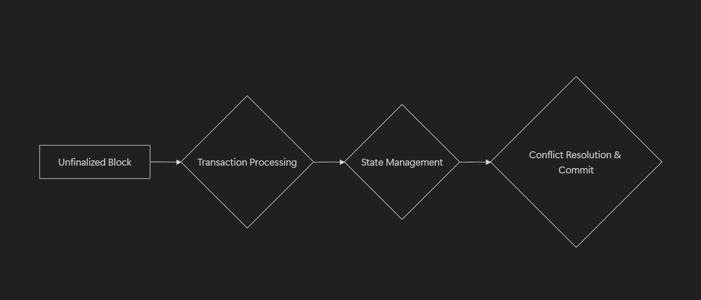
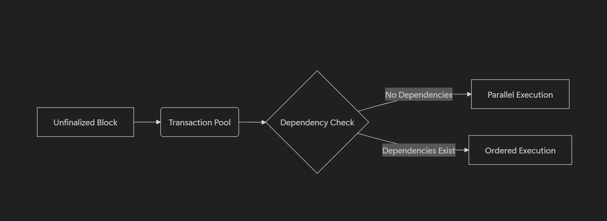
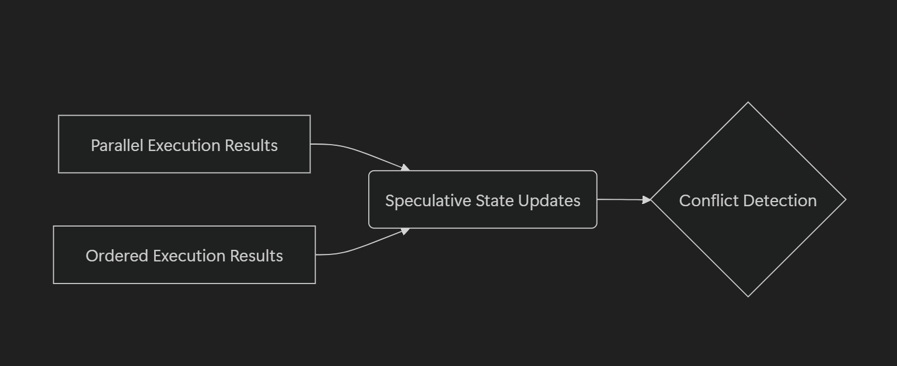

# Parallel Optimistic Execution

Designed for performance and scalability, Nibiru leverages parallel optimistic
execution to achieve high transaction throughput and reduced latency. This
technique overlaps consensus and execution, optimizing for a superior user
experience. {synopsis}

## 1 - Introduction

As blockchain networks scale, the need for higher throughput and lower latency
becomes critical. Traditional execution models process transactions sequentially,
causing delays in block finalization. Parallel optimistic execution (OE)
addresses this inefficiency by allowing transactions to be executed speculatively
before consensus is reached. If the proposed block is accepted, the precomputed
results are committed; otherwise, they are discarded. This approach improves
performance without compromising security.

## 2 - Background: Traditional Execution Flow

In a conventional execution model, block processing follows a strictly sequential
order:

1. A block proposal is received.
2. The consensus engine (CE) ensures the block gains sufficient validator votes.
3. Only after finalization does the execution engine (EE) process the block.
4. Execution results in a new state and its corresponding state hash.

This structure enforces correctness but introduces latency, as execution cannot
begin until consensus is reached.

## 3 - The Mechanics of Parallel Optimistic Execution

Parallel optimistic execution enables the execution engine to process
transactions in parallel before consensus finalization. This speculative
execution allows the network to compute state transitions while consensus
mechanisms operate concurrently.

### Execution Flow with OE

  

1. **Block Proposal & Preprocessing:** The block executor calls `EE.ProcessProposal` (`abci.RequestProcessProposal`).
2. **Speculative Execution:** The EE receives an unfinalized block and executes it optimistically.
3. **Consensus Decision:** The CE continues its process to finalize the block.
    
  
    
4. **Commit or Discard:**
    - If the block is finalized, the precomputed execution results are used immediately.
    - If the block is rejected, the speculative execution is discarded.
    
  
    

This approach ensures that the majority of proposed blocks—often over 99%—can
leverage precomputed execution results, significantly reducing processing time.

## 4 - Why Parallel Optimistic Execution Increases Throughput

Comparing Execution Timelines: In the traditional, sequential execution model,
consensus must be reached *before* transaction execution can begin.  The total
time is therefore the sum of the consensus time and the execution time.  

With parallel optimistic execution, consensus and execution occur *concurrently*.
The total time is then determined by whichever process takes longer, effectively
overlapping the two phases.

### Key Takeaways

- **Eliminates Sequential Bottlenecks:** Execution begins as soon as a block is
proposed, rather than waiting for consensus.
- **Reduces Block Finalization Latency:** If consensus confirms the block,
execution results are immediately available.
- **Minimal Downsides:** If a different block wins consensus, the speculative
work is discarded without delaying finalization.

## 5 - Why Doesn’t Every Blockchain Implement OE?

### Technical Dependencies

Parallel optimistic execution is enabled by ABCI++ (introduced in CometBFT),
which provides:

- **`PrepareProposal`** – Allows block proposers to modify blocks before
submission.
- **`ProcessProposal`** – Enables nodes to see and execute unfinalized blocks
before consensus completion.

### Implementation Challenges

- **Infrastructure Requirements:** Chains must support ABCI++ or equivalent
mechanisms.
- **Speculative Execution Complexity:** Systems must efficiently manage
speculative results to prevent excessive wasted computation.

## 6 - Future Directions and Open Questions

Parallel optimistic execution offers a significant path to increased blockchain
throughput by overlapping consensus and execution.  While ABCI++ facilitates its
implementation, efficient management of speculative state and conflict resolution
remain key engineering challenges.  Further research is needed to optimize
dependency tracking, minimize wasted computation, and develop robust mechanisms
for handling complex state interactions within a parallel execution environment.
Exploring the security implications of speculative execution and developing
appropriate validation strategies are also crucial for wider adoption.  As
blockchain technology matures, addressing these open questions will be essential
for realizing the full potential of parallel optimistic execution and achieving
truly scalable decentralized systems.
