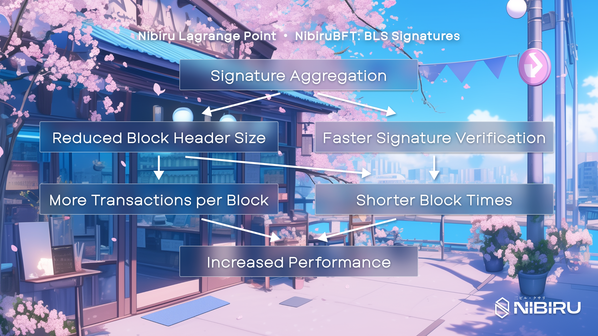

# NibiruBFT Consensus

Nibiru uses NibiruBFT as its consensus mechanism. NibiruBFT encompasses a suite
of consensus-related improvements developed as part of the Nibiru Lagrange Point
roadmap, a long-term initiative aimed at enhancing the scalability and
decentralization of the Nibiru blockchain. Similar to the gradual release of the
Ethereum roadmap, upgrades for NibiruBFT will roll out phase-wise after Nibiru
V2. {synopsis}

## What the Heck is Consensus?

A consensus mechanism is the entire set of rules, protocols, and economic
incentives that enables a distributed network of nodes to agree on the state of a
blockchain. In the context of blockchains, consensus ensures all nodes agree on
the order and validity of transactions within the ledger, preventing
inconsistencies and double-spending.

Byzantine Fault Tolerance (BFT) allows a distributed system to function even in
the presence of "Byzantine faults". Byzantine faults describe situations where
nodes can fail, exhibit malicious behavior, or deviate from the protocol
arbitrarily. In a blockchain context, BFT ensures that validators (or miners)
agree on the order of transactions, even if some validators are faulty.

## NibiruBFT Optimizations for Scalability

Building upon the foundation of existing Byzantine Fault Tolerance (BFT)
protocols, NibiruBFT introduces several key innovations to address the specific
challenges of the Nibiru ecosystem. These include:

1. **[Reducing Overhead in Consensus with BLS Signatures](./bls-signatures.md)**: Aggregates multiple validator signatures into a single proof through BLS, lowering block verification overhead and paving the way for higher throughput and faster block times.
    - Key Benefits: Throughput/scalability
  
1. **[Validator Clustering](./validator-clusters.md)**: Splits Nibiru validators into subgroups to reduce $n^2$ communication overhead to $O(n\log n)$, enabling scalable and larger validator sets for enhanced decentralization without sacrificing instant finality.
    - Key Benefits: Security and decentralization
1. **[QUIC (Quick UDP Internet Connections)](./quic.md)**: Tackles the performance hurdles of traditional TCP while preserving instant finality and BFT robustness guarantees 
1. **[Block and Mempool Lanes](./block-lanes.md)**: Block and mempool lanes refer to a segregation mechanism within Nibiru's mempool and block construction process. Transactions are categorized into different "lanes" based on their type, priority, or metadata. This structure allows for parallel processing and prioritization of specific transaction types without the inefficiencies of a single-lane mempool.
    <!-- - Block SDK: Block SDK is what provides the tooling and framework necessary to implement much of the innovations that make up NibiruBFT, such as mempool lanes. -->
    - Key Benefits: Predictable resource allocation, prioritization of certain types of transactions over others, lower fee spikes, and streamlined congestion management.

## Core Principles of NibiruBFT

NibiruBFT builds upon the established foundation of BFT protocols, introducing key advancements to address the unique challenges of the Nibiru ecosystem:

- **Instant Finality**: 
Transactions are finalized immediately upon block creation. This eliminates the need for multiple confirmations or waiting periods, enhancing security and user experience (unlike blockchains like Bitcoin or Ethereum).

- **State Machine Replication**: NibiruBFT is an extension building from Tendermint, which can be used to create arbitrary Web3 applications through the Application Blockchain Interface (ABCI). This empowers NibiruBFT to serve not just cryptocurrencies but also a broad spectrum of distributed applications.

- **Byzantine Fault Tolerance**: Nibiru utilizes PBFT (Practical Byzantine Fault Tolerance), a specific BFT consensus protocol. PBFT ensures all network nodes agree on the transaction order within the blockchain, even if up to one-third of nodes exhibit Byzantine behavior (i.e., malicious or faulty). PBFT achieves consensus through a two-phase commit process: nodes first propose a block, followed by validation via multiple voting rounds. This process safeguards network integrity by guaranteeing agreement on transaction order and preventing malicious nodes from compromising the system.

- **Rotating Proposers**: To ensure fairness, the responsibility of proposing the next block rotates among validators based on their stake and proposal history.

- **Evolution from Proven Technology**: NibiruBFT inherits security guarantees from the battle-tested Tendermint Core consensus algorithm, building upon CometBFT's foundation.

## Byzantine Fault Tolerance

In a Byzantine Fault Tolerant system like Nibiru, the network can tolerate
up to one-third of nodes being faulty (either failing or acting maliciously).

If a network partition occurs and neither section has more than two-thirds of
the nodes, the network will halt to prevent any forks or double spends. This is
because Tendermint prioritizes safety (consistency) over liveness
(availability).

If a node failure occurs, as long as there are more than two-thirds of the
remaining nodes functioning properly, the network continues to operate. If a
failed node comes back online, it can sync up with the rest of the network and
resume its operations.

<!--
## Double-spending
## Finality Types
-->

