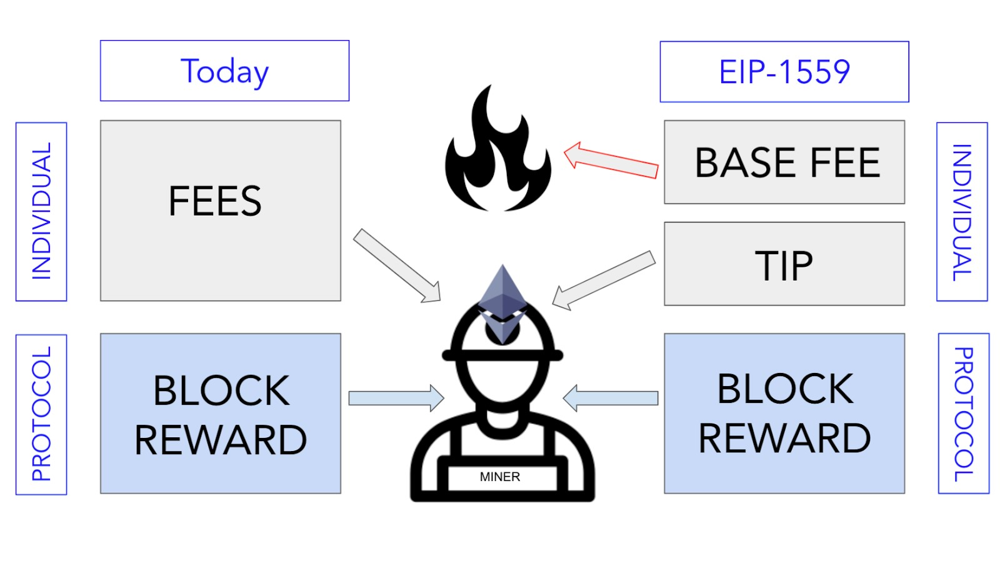
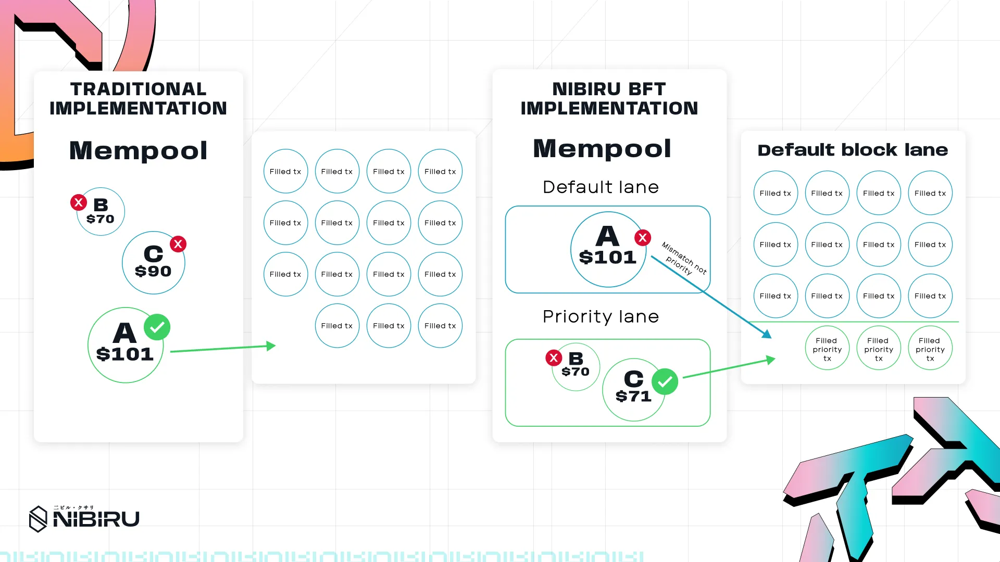

# NibiruBFT: Block Lanes

NibiruBFT introduces block lanes to solve blockchain congestion, MEV, and scaling
issues. Learn how multi-lane mempools and dedicated MEV lanes improve transaction
efficiency and fairness. {synopsis}

## TL;DR / Takeaways

1. Multi-Lane mempools segregate transactions by priority, ensuring critical
   transactions bypass congestion
2. Improved network performance reduces wasted block space and ensures timely
   execution of essential transactions
3. Efficient gas markets prevent MEV-driven gas wars and optimize transaction
   costs.
4. Dedicated MEV lanes contain extractive behaviors, ensuring fair and
   predictable execution
5. Backward compatibility allows seamless adoption without disrupting existing
   applications

## 1 - The Legacy Mempool Model: Where We Started

The blockchain ecosystem has expanded significantly since Bitcoin introduced
Proof-of-Work, yet it still struggles to meet the increasingly complex demands of
today’s web3 environment.

### 1.1 - First-Price Auctions: When Overbidding Ruled

Traditional mempool structures treat all transactions equally or rely solely on
primitive gas markets (such as in EIP-1559) for prioritization. Prior to
EIP-1559, Ethereum used a [first-price auction
model](https://quickonomics.com/terms/first-price-auction/) whereby users bid for
transaction inclusion by specifying their gas fee. This model led to
inefficiencies, as the ability for a user’s transaction to be included in the
block depended solely on the relative value of their specified gas fee versus
their peers. This caused users to unnecessarily overbid for inclusion. 

### 1.2 - EIP-1559 Gas Markets: A Meaningful Yet Partial Fix

EIP-1559 attempted to address these inefficiencies by dissecting gas into two
parts: a base fee and an optional priority fee. The base fee, dynamically
calculated based on network demand, added some predictability and reduced
complexity and guesswork in determining transaction fees. Previously, users would
overpay or experience delays due to underpayment.

<figure>
  
  <figcaption>[Figure] EIP-1559 updated Ethereum's fee structure by splitting
    transaction costs into a predictable base fee that gets burned and an
    optional "tip" for miners, replacing the earlier single-fee
    system.</figcaption>
</figure>

Nowadays, many blockchains have adopted a similar base + priority fee structure.
While this is an improvement over pre-EIP-1559 gas markets, the gas market
structure remains too simplistic. It fails to account for time-sensitive
transactions that may require prioritized execution and for different transaction
types with varying resource requirements.

### 1.3 EIP-1559 and Its Single-Lane Blocks Constraints

In an auction where every bidder must pay a fee to participate, even though only
the highest bidder wins the prize. This means that even if most bidders lose,
their bids still need to be processed and clog the system—much like how losing
transactions in Ethereum’s gas auction consume block space and compute despite
failing. 

Similarly, single-lane approaches often result in wasteful inefficiencies. When
certain transaction types dominate, block space may be underutilized. In the
primitive gas auction model, transactions that bid the most gas are most likely
to be included by miners, who directly profit from a portion of the gas bid. The
nature of gas markets in Ethereum is structured around the partial all-pay
auction model, where only the top bidder “wins,” and other bidders still pay
partial gas fees despite their transaction reverting (a penalty on “loss”).
Similarly, despite these “losing” bids failing and reverting on-chain, they still
consume and waste block space. Despite this being an intentional design choice to
mitigate network DDoS, reverted transactions still unnecessarily consume
computation costs and block space.

## 2 - How Network Congestion Drives Up Gas Costs

Gas pricing is also inflated during times of network congestion, which stifles crucial transactions unless sufficiently high gas fees are paid.

### 2.1 - A High-Stakes Example: Gas Wars vs. Critical Operations

Consider the example of a perpetual futures platform on Ethereum. Recent memecoin mania has caused extreme network congestion, where the mempool is dominated by DEX swaps. Imagine a liquidator attempting to liquidate an underwater position on this platform. Due to the network congestion caused by memecoin activity, gas fees are exorbitantly high. 

The liquidator’s model suggests the liquidation is profitable, but:

1. The liquidator must compete in gas markets, bidding a higher gas fee, which cuts into their profits and may make the liquidation unprofitable (negative EV).
2. The liquidator must sign the transaction and hope that by the time it is executed, the collateral has not moved further against the position.

### 2.2 - Congestion’s Ripple Effects: Liquidations, Protocols, and User Experience

Both outcomes are suboptimal for the liquidator, the trader, the LPs, and the protocol’s insurance fund. Liquidations must be executed in a timely manner to ensure effective risk assessments and sufficient liquidity of assets. Network congestion muddles EV calculations, reduces profits, and can render certain liquidations unprofitable, leading to unnecessary bad debt and potential insolvency.

These limitations negatively affect user experience. As a result of single-lane mempool and block designs, users experience unpredictable transaction confirmation times, gas price volatility and bidding wars, inconsistent transaction ordering, and difficulty executing time-sensitive operations.

## 3 - The Multi-Lane Solution: Creating Dedicated Transaction Pathways

Block and mempool lanes represent a sophisticated approach to addressing these challenges by introducing priority processing paths for different transaction types. 

### 3.1 - Understanding Gas PvP: The Real Cost of Competition

> **The Floating Balls Analogy: Understanding Mempool Priority**
Imagine the mempool as a bucket of water, with each pending transaction
represented by a plastic ball. In a simple mempool design, a validator just
scoops up a ball at random for block inclusion. Introducing priority fees is like
making certain balls out of a lighter material, causing them to float higher and
get picked first. But if everyone can pay extra to use the lighter material, it
becomes a free-for-all where only the highest payers float to the top. Without
any differentiation for transaction types, even urgent or critical transactions
must battle all others in this pay-to-win scenario.
> 

<figure>
  
  <figcaption>[Figure, Right] Charlie outbids Bob for the liquidation, but is unable to
    be displaced by Alice for the allocated high priority slot in the block as
    her swap is not a whitelisted high priority transaction.</figcaption>
</figure>

### 3.2 - Multi-Lane Mempools: Curbing PvP on a Network-Wide Scale

Mempool/block lanes introduce segregation for critical transactions. Instead of
one bucket, there are two: one for base priority transactions and another for
higher priority transactions. Validators are required to select a certain number
of transactions per block from the higher priority bucket. PvP competition still
exists but is limited to transactions within the same priority bucket. Base
priority transactions cannot displace higher priority ones, ensuring crucial
transactions are included even during congestion.

The core concepts behind such an implementation are fairly simple. 

### 3.1 - Lane Segregation: Smarter Queues and Dynamic Resource Allocation

The first step is lane segregation, where transactions are categorized into
different lanes based on metadata flags. Each lane maintains its own priority
queue and resource allocation, allowing for separate gas markets. Block space is
pre-allocated across lanes to ensure balanced processing.

Having separate lanes also enables dynamic resource allocation. If one lane isn’t
fully utilized during certain network conditions, its unused capacity can be
shifted to other lanes.

:::tip 
One interesting point of discussion within the Nibiru research team is to
capitalize on  recent AI developments and the potential to integrate AI into
Nibiru's long term V2 roadmap. One possibility here is to utilize AI to be able
to predict when priority lanes may become congested and adjusting lane
allocations ahead of time. Our team (notably our CEO, Unique) have backgrounds in
AI to facilitate such an undertaking.
:::

Lanes are generally split into a fast lane and a standard lane, with the option
for further subdivisions if needed. High-priority, time-sensitive transactions
(like liquidations or oracle updates) are whitelisted for the fast lane, while
routine transactions such as token transfers, NFT mints, and general contract
calls go through the standard lane.

> **Example: How Lane-Based Mempools Shield Liquidators from Costly Bidding
> Wars**
Imagine Alice, a memecoin trader, and two liquidators, Bob and Charlie, all vying
for the last slot in a block. Under a basic mempool design, Alice can offer an
exorbitantly high gas fee, forcing Bob and Charlie to outbid her—potentially
making their liquidations unprofitable. However, in a lane-based model, Bob and
Charlie only compete with each other in the high-priority lane, ensuring one of
their transactions gets included without needing to surpass Alice’s excessive
bid. In a lane-based block and mempool model, if the high-priority lane still has
capacity, Bob and Charlie only compete against each other. Without needing to
outbid Alice, they avoid excessive fees and prevent bad debt, helping maintain
the protocol’s solvency.

<!-- TODO: img -->

<!-- TODO: img -->

<!-- TODO: img -->

### 3.2 - Transaction Payloads and Execution Flows: Adding Lane Identifiers

Lane-based mempool and block designs require modifications to both transaction
data and the execution process. Each transaction now includes a lane
identifier—either through protobuf flags (for Wasm) or markers in the transaction
payload (for EVM). Here, it would be up to the validator to decode the protobuf
to determine the transaction type. This does not require consensus - mempools and
their contents are defined locally. If no lane identifier is provided, the
transaction defaults to the standard lane, maintaining backward compatibility.

On the execution side, each lane enforces its own gas rules. Block producers
validate transactions by checking that total lane usage does not exceed the
allocated quota. Fast lanes might demand higher base fees or require that a
transaction be whitelisted (e.g., for liquidations), while standard lanes allow
typical throughput. This approach segregates fees, priorities, and resources
across lanes, enabling time-critical transactions to execute efficiently without
competing against less-urgent activity.

### 3.3 - Ordering and Compatibility: Respecting Lanes Without Breaking Legacy Apps

Once lanes are established, the block builder must respect each lane’s priority
and allocation when ordering transactions. For example, Skip’s [Block SDK’s lane
configuration](https://github.com/skip-mev/block-sdk/blob/main/docs/0-integrate-the-sdk.md)
allows developers to list lanes in a specific order—fast lane first and standard
lane last—so the most time-sensitive transactions automatically receive earlier
inclusion. This ensures fast-lane transactions aren’t displaced by higher-paying
but less-urgent operations.

At the same time, backward compatibility is critical. Legacy transactions
without lane metadata (e.g., older dApps that haven’t upgraded) should seamlessly
fall back to the default or standard lane. This “graceful fallback” approach
maintains consistent behavior for existing contracts and user flows. It also
means both lane-aware and legacy transactions share the same gas market logic—if
an untagged transaction simply enters the base-priority lane with no special
privileges, network participants can continue using older tooling without
interruption. By avoiding a hard cutover, chains can phase in lane-based upgrades
at their own pace, reducing disruption and fostering a smooth transition.

## 4 - MEV Lanes: Containing Maximal Extractable Value

Building on the recognized need for lane segregation in blockchain architectures,
we analyze how Block SDK’s MEV lanes could impact MEV extraction in the context
of priority gas auctions (PGA). While lanes serve as infrastructure for
transaction segregation, it is crucial to understand how MEV functions within
these lanes, especially when designing an architecture specifically aimed at MEV
management.

### 4.1 - MEV 101: Why It Matters to Everyone

First, let's explore what MEV is and why an MEV lane is necessary. Initially
termed **Miner Extractable Value**, MEV described the maximum value a miner could
extract by controlling block ordering. Over time, the definition evolved into
**Maximal Extractable Value**, reflecting a broader scope beyond miners. By
leveraging the public mempool and priority gas auction (PGA) mechanics, not only
miners but also independent actors—commonly known as searchers—can extract value
from the way transactions are organized within a block.

MEV encompasses not only the ability to extract value by rearranging transactions
within a block but also the power to include or exclude specific transactions.
These opportunities include:

- **Arbitrage**: Profiting from price discrepancies between decentralized
exchanges.
- **Liquidations**: Seizing undercollateralized positions on lending protocols.
- **Frontrunning, Backrunning, and Sandwich Attacks**: Manipulating pending
transactions to gain an advantage, often at the expense of regular users.

The presence of MEV introduces unique challenges, including network congestion,
transaction reordering, and resource competition.

- **Network Congestion & Resource Competition:** Searchers engage in bidding
wars, continuously raising priority fees to secure transaction inclusion. This
bidding and counterbidding process inflates gas fees. Even failed bids can still
be included in a block but ultimately revert on-chain, needlessly consuming block
space and computational resources.
- **Transaction Reordering**: Since priority gas auctions (PGA) incentivize block
builders to prioritize transactions with the highest fees, MEV-related
transactions can outcompete essential network processes, such as oracle updates
and liquidations, potentially leading to inefficiencies and market distortions.

### 4.2 - Carving Out an MEV Lane: Keeping Searchers in Check

The need for MEV lanes arises from these challenges. By isolating MEV-related
transactions into dedicated lanes, networks can contain extractive behaviors
within specific sections of a block while ensuring that high-priority, critical
operations have their own reserved block space.

Additionally, segregating MEV activity allows for the creation of distinct gas
markets, preventing MEV-driven counterbidding from artificially inflating gas
prices for regular transactions. This also introduces predictable transaction
ordering for both searchers and general users, improving network efficiency and
fairness.

Building on the necessity of lane segregation in blockchain architecture, let’s
examine how Block SDK’s MEV lanes could help manage MEV extraction in the context
of priority gas auctions (PGA).

### 4.3 - Block SDK MEV Lanes: Key Assumptions and Benefits

The Block SDK implementation recognizes that MEV extraction cannot be
eliminated—this is inherently true when operating with a public mempool, where
searchers continuously scan for MEV opportunities. Instead, Block SDK’s MEV lanes
serve as a mechanism to contain these potentially extractive behaviors within
designated lanes.

This approach acknowledges MEV as an unavoidable aspect of blockchain operation
and focuses on managing it effectively. By doing so, it ensures the integrity of
core primitives, such as oracles, while also protecting high-liquidity and
latency-sensitive transactions from disruption.

### 4.4 - Top-of-Block Placement: Securing MEV Bundles

MEV transactions are inherently latency-sensitive. Block SDK’s MEV lane provides
a dedicated space for MEV-specific transactions, ensuring top-of-block placement
and atomic execution of ordered transaction bundles.

By reserving the top of the block for MEV transactions, searchers no longer need
to compete in a block-wide race for the first transaction slot. Instead, they
compete only within the allocated MEV space at the top of the block. In effect, a
separate priority gas auction (PGA) is enforced specifically for MEV
transactions.

This implementation can be observed in `lanes/mev/mempool.go`:

```go
// TxPriority returns a TxPriority over mev lane transactions only. It
// is to be used in the mev index only.
func TxPriority(config Factory) base.TxPriority[string] {
	return base.TxPriority[string]{
		GetTxPriority: func(_ context.Context, tx sdk.Tx) string {
			bidInfo, err := config.GetAuctionBidInfo(tx)
			if err != nil || bidInfo == nil || bidInfo.Bid.IsNil() {
				return ""
			}

			return bidInfo.Bid.String()
		},
		Compare: func(a, b string) int {
			aCoins, _ := sdk.ParseCoinsNormalized(a)
			bCoins, _ := sdk.ParseCoinsNormalized(b)

			switch {
			case aCoins == nil && bCoins == nil:
				return 0

			case aCoins == nil:
				return -1

			case bCoins == nil:
				return 1

			default:
				switch {
				case aCoins.IsAllGT(bCoins):
					return 1

				case aCoins.IsAllLT(bCoins):
					return -1

				default:
					return 0
				}
			}
		},
		MinValue: "",
	}
}
```

This priority system illustrates how MEV extraction can be confined to a
dedicated lane. While transactions still compete based on bid amounts, the
competition remains within the lane’s allocated block space, preventing
MEV-driven bidding wars from dominating the entire block.

### 4.5 - Safeguarding Critical Transactions: Preserving Essential Blockspace

As discussed earlier, this implementation enables sophisticated transaction
management, ensuring that critical operations such as liquidations and oracle
updates retain their allocated block space. This functionality is evident in
`ProcessLaneHandler()` within `lanes/mev/abci.go`:

```go
bidTx := partialProposal[0]
if !h.lane.Match(ctx, bidTx) {
  // If the transaction does not belong to this lane, we return the remaining transactions
  // If there are no matches in the remaining transactions after this index.
  if len(partialProposal) > 1 {
    if err := h.lane.VerifyNoMatches(ctx, partialProposal[1:]); err != nil {
      return nil, nil, fmt.Errorf("failed to verify no matches: %w", err)
    }
  }

  return nil, partialProposal, nil
}
```

Notably, the lane handler processes the first transaction in the proposal. If the
first transaction (`bidTX`) is not an MEV transaction, the system enforces that
no MEV transactions appear later in the block. This is necessary to uphold the
rule that MEV transactions must be confined to the top of the block. This
approach ensures two key outcomes:

1. MEV transactions are always executed at the top of the block. Oracle updates
   and liquidations should be classified as MEV transactions, and further
segregation of the MEV lane should enforce that oracle updates/liquidations are
executed at the top of the MEV block.
2. MEV transactions do not interfere with regular transactions further down in
   the block.

Additionally, protocol-level resource controls are implemented in
`VerifyBidBasic()` within `lanes/mev/abci.go`:

```go
if totalSize > limit.MaxTxBytes {
  return nil, fmt.Errorf(
    "partial proposal is too large: %d > %d",
    totalSize,
    limit.MaxTxBytes,
  )
}

if totalGasLimit > limit.MaxGasLimit {
  return nil, fmt.Errorf(
    "partial proposal consumes too much gas: %d > %d",
    totalGasLimit,
    limit.MaxGasLimit,
  )
}
```

These hard limits - again, enforced at the protocol level- prevent resource
exploitation and egregious PvP. By implementing these constraints, it provides
stronger guarantees on network resource usage compared to market-driven, economic
incentive approaches.

### 4.6 - Why Block SDK

At Nibiru, we have also closely examined alternative approaches to managing MEV,
including private auction systems like Flashbots. Now, let’s explore why, for our
specific purposes, implementing Block SDK’s MEV lanes may serve as a more
effective initial approach compared to Flashbots.

The primary consideration is user experience. For newer chains where complex MEV
patterns have not yet developed, Block SDK’s lane implementation offers a
significantly simpler approach. This simplicity is valuable, as integrating
validators into the Flashbots architecture can be challenging, requiring a deep
understanding of searchers, relayers, and related components.

Additionally, private auction systems tend to disproportionately benefit advanced
validators capable of executing complex modeling to optimize bids, raising
concerns about centralization. In this sense, the key advantage of Flashbots—its
private auction structure—is also a drawback, as it reduces transparency and
predictability in transaction ordering.

Secondly, laned systems fundamentally reshape execution economics by establishing
separate gas markets for each lane. This segmentation creates isolated economic
incentives, allowing for more refined and controlled gas dynamics compared to
block-wide PGA systems.

Block SDK’s MEV lanes offer a structured yet practical approach to managing MEV,
which is inherently unavoidable. For newer chains like Nibiru, the protocol-level
guarantees, streamlined infrastructure, and predictable resource management
present clear advantages over more complex MEV extraction frameworks.

While advanced solutions like Flashbots may become more relevant as Nibiru
matures and MEV behaviors grow more sophisticated, Block SDK’s lane
implementation currently provides a strong foundation for effectively managing
transaction priorities.

<!-- TODO: img -->

To bridge the gap between our choice of Block SDK’s MEV lanes and the practical
steps for implementation, we now turn to the design of a structured rollout.
Ensuring a smooth transition requires careful consideration of network stability,
validator participation, and the phased introduction of lane-based execution.
This next section outlines the planned approach for integrating MEV lanes while
maintaining compatibility with existing validator infrastructure.

## 5 - Designing a Lane-Based Rollout

### 5.1 - Rebooting the Network with Lane Defaults

The planned approach is to undergo a total network upgrade where, by default, all
transactions are assigned to the base priority lane and transactions will undergo
a gradual whitelisting process. As mempools vary locally and blocks are proposed
with the sole discretion of the block proposer, not all validators must upgrade
to the latest lane-supported software to participate in consensus. Validators who
upgrade can utilize the application logic to assign priorities to lanes, but
validators still on legacy software would have non-segregated mempools and also
would propose legacy blocks without laning.

## 6 - Practical Integration with the Skip Block SDK

The team at Skip Protocol are at the forefront of such laned innovations. Their
Block SDK provides tooling to implement both mempool and block lanes. To do so
appears fairly simple looking at Block SDK documentation. Below specifies the
structure for initializing a new lane in `app/app.go` as per Block SDK
[specifications](https://github.com/skip-mev/block-sdk/blob/main/docs/0-integrate-the-sdk.md):

```go
// Configure fast lane 
fastLaneConfig := base.LaneConfig{
    Logger:        app.Logger(),
    TxEncoder:     app.txConfig.TxEncoder(),
    TxDecoder:     app.txConfig.TxDecoder(),
    MaxBlockSpace: math.LegacyNewDecWithPrec(x, 1), // x% of block space
    MaxTxs:        a,                            
}
fastLane := NewFastLane(fastLaneConfig)

// Configure default lane
defaultConfig := base.LaneConfig{
    Logger:        app.Logger(),
    TxEncoder:     app.txConfig.TxEncoder(),
    TxDecoder:     app.txConfig.TxDecoder(),
    MaxBlockSpace: math.LegacyNewDecWithPrec(y, 1), // y% of block space
    MaxTxs:        b,                           
}
defaultLane := defaultlane.NewDefaultLane(defaultConfig)
```

We see that Block SDK allows us to specify what percentage of the block space
should be occupied by transactions of the specific lane, as well as the maximum
number of transactions. In the code above, `x%` (maximum `a`) of the block should
be occupied by fast-laned transactions, while `y%` (maximum `b`) of the block
should be occupied by default laned transactions.

Lane priorities should then be specified by the ordering as shown below:

```go
lanes := []block.Lane{
        fastLane, // ordered first, highest priority
        defaultLane, // ordered last, base priority
}
mempool := block.NewLanedMempool(app.Logger(), true, lanes...)
app.SetMempool(mempool)
```

We must then implement new lane antehandlers and proposal handlers, but for
brevity, these implementations will not be discussed.

Finally, in `app/mempool` we must implement the logic for each lane (e.g. for
`fastLane` we must implement `app/mempool/fast_lane.go`). Here, we would examine
transaction metadata to determine if a transaction qualifies for fast lane access
(e.g. is it a liquidation? Is it an oracle update? Is it a high priority contract?,
etc.).

## 7 - Final Thoughts: Security, Future Research, and Best Practices

Although implementing the Block SDK may seem straightforward, the introduction of
block and mempool lanes brings new security considerations. Priority lanes create
potential avenues for economic exploits and malicious strategies, including
cross-lane MEV extraction by exploiting gas price differentials—leading to
sandwich attacks. Attackers might also misuse priority lanes by inserting
deceptive transaction metadata to push lower-priority transactions into
higher-priority lanes, or orchestrate lane-flooding attacks.

Implementing block and mempool lanes achieves more granular control over block
building and transaction processing. However, several key factors still require
research and refinement. These include dynamic lane allocation based on network
conditions and economic modeling for optimal lane pricing. Additionally,
cross-lane behavior optimizations must be explored, along with scalability
concerns such as state growth, network bandwidth, and node hardware requirements.
The success of lane-based approaches will hinge on addressing these concerns
while maintaining backward compatibility, and on delivering improvements in both
processing efficiency and user experience.
