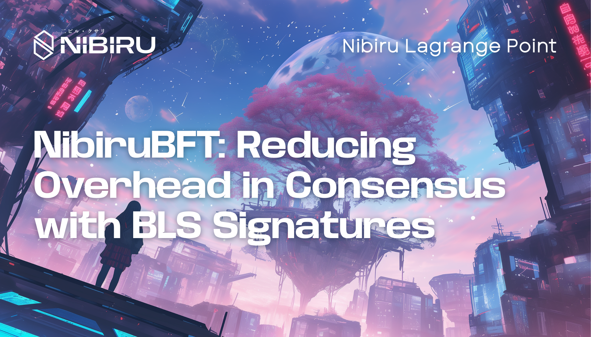
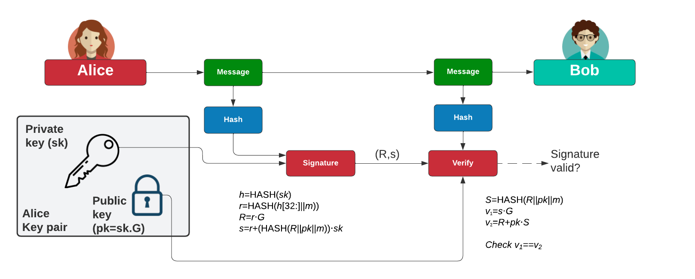
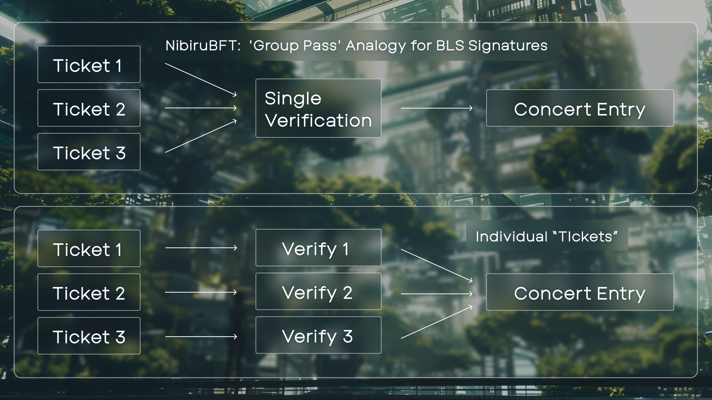
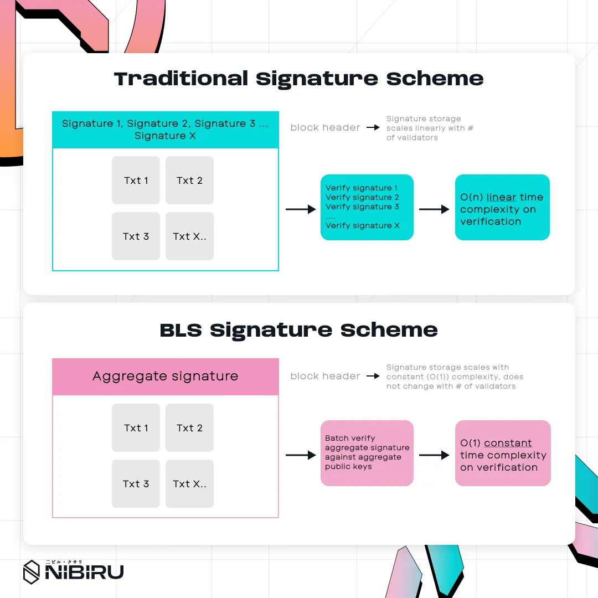

# NibiruBFT: BLS Signatures 

NibiruBFT integrates BLS signatures to aggregate validator approvals, reducing
signature overhead, optimizing block validation, and improving blockchain
efficiency. {synopsis}

## TL;DR / Takeaways

1. As one element of NibiruBFT, Nibiru's consensus mechanism, we propose the integration of BLS signatures to reduce consensus overhead, enabling faster block times and higher network efficiency.
2. Current signature validation in consensus is inefficient—each validator must
   sign and verify individually, increasing storage and bandwidth costs. Signature aggregation significantly reduces storage and network overhead.
3. BLS verification scales more efficiently in large validator sets, lowering block finalization times and improving transaction throughput.
4. This upgrade strengthens Nibiru’s ability to compete with high-performance Web2 applications while maintaining decentralized security.

## 1 - Signature Overhead in Consensus

Digital signatures play a critical role in blockchain consensus, ensuring that validator approvals are verifiable and tamper-resistant. However, as validator sets grow, the storage and communication overhead of handling individual signatures increases. This overhead directly impacts transaction throughput and block finalization times, creating a bottleneck in high-performance blockchain environments.

NibiruBFT, the consensus engine underpinning Nibiru, aims to mitigate these constraints. This research article proposes one avenue for improvement in the adoption of **Boneh–Lynn–Shacham (BLS) signatures**, which allow for **signature aggregation** in NibiruBFT by combining multiple validator signatures into a single compact proof. This significantly reduces network bandwidth consumption and computational overhead while maintaining security guarantees.

## 2 - The Need for Scalable Blockchain Infrastructure

As blockchain adoption grows, transaction throughput (TPS) remains a critical metric for comparing Web3 and Web2 performance. Payment processors such as Visa, Stripe, and Square  far surpass the capabilities of most blockchains today. For instance, Visa handles an average of **6,105 TPS**, peaking at **65,000 TPS**. By contrast, decentralized applications (dApps) aiming to compete with traditional financial infrastructure must overcome limitations in **network efficiency, consensus speed, and computational overhead**.

| Network          | Average TPS | Maximum TPS |
|-----------------|------------|------------|
| Visa (Visanet)  | 6,105      | 65,000     |
| MasterCard      | 412        | 5,000      |
| PayPal          | 707        | Unknown    |

Payment Network Performance Comparison: Visa processes the [highest volume](https://blog.ton.org/100000-transactions-per-second-ton-sets-the-world-record-on-its-first-performance-test) at 6,105 TPS average and 65,000 TPS peak, outpacing MasterCard and PayPal's transaction processing capabilities.

Payment Network Performance Comparison: Visa processes the highest volume at 6,105 TPS average and 65,000 TPS peak, outpacing MasterCard and PayPal's transaction processing capabilities.

[Nibiru](https://nibiru.fi/) has prioritized infrastructure optimizations to address these challenges. By augmenting the standard BFT configuration for **consensus timeouts**, Nibiru achieves **10,000 TPS with 1.8-second block times**, significantly improving network efficiency. However, further gains require tackling **signature overhead**, which directly impacts validator communication and block finalization speeds.

Yet, to push these improvements even further, we must address another critical factor: **signature overhead**. As the number of validators increases, the costs associated with transmitting, storing, and verifying individual signatures become a bottleneck. Overcoming this limitation is essential to scale consensus mechanisms effectively. One promising solution is leveraging Boneh–Lynn–Shacham (BLS) signatures, which enable signature aggregation to substantially reduce overhead.

## 3 - Current Approach: Elliptic Curve Cryptography (ECC) and Its Trade-offs

Nibiru, similar to many chains built with the Cosmos-SDK, currently use Elliptic Curve Cryptography Algorithms (ECC) as its signature scheme for private and public keys (specifically ECDSA). ECDSA offers a good balance of security and performance. In Nibiru, each block's `LastCommit` field contains the signatures of the validators who participated in the previous block's consensus.

<figure style="margin: 2rem 0;">

<figcaption>ECC Digital Signature Workflow: Illustrates the Cosmos SDK's current signature scheme, where each validator's 64-byte signature contributes to block validation overhead.</figcaption>
</figure>

With ECC, each signature is 64 bytes.  Therefore, a block signed by, for example, 100 validators incurs a 6.4 KB overhead just for these signatures. This overhead presents a significant challenge to scaling. By reducing this overhead, we can free up space for the inclusion of additional transactions in the block, further increasing TPS. Alternatively, if block size is held constant, then faster block times can be achieved by reducing the network overhead of communicating 6.4KB.

While ECC supports batch verification—allowing multiple signatures to be verified simultaneously—this doesn't reduce the storage or transmission costs associated with the individual signatures.  The `verifyCommitBatch` function in CometBFT, which NibiruBFT uses, can indeed verify multiple Ed25519 signatures at once, but the underlying complexity remains O(N), meaning the verification time scales linearly with the number of validators.  Furthermore, if any signature in the batch fails verification, the system falls back to verifying each signature individually, further increasing the computational load.

This linear scaling of verification time, coupled with the substantial storage and bandwidth requirements for propagating individual ECC signatures, makes it a limiting factor for NibiruBFT as the validator set grows.  For larger validator sets, the overhead becomes increasingly burdensome, impacting both throughput and block finality times.

## 4 - **Boneh–Lynn–Shacham (BLS) Signatures: Compact Aggregation and Verification**

Boneh-Lynn-Shacham (BLS) signatures offer a powerful alternative to traditional signature schemes like ECC, primarily due to their unique property of signature aggregation.  This property allows multiple individual signatures to be combined into a single, compact signature, drastically reducing storage and bandwidth overhead.  This section delves into the mechanics of BLS signatures and explains why this matters for consensus mechanisms like NibiruBFT.

### 4.1 - How BLS Signatures Work

BLS12-381 signatures leverage the properties of elliptic curves and bilinear pairings.  A key concept is that private and public keys are mapped to two different subgroups ($G_1$ and $G_2$) of the same elliptic curve.  This allows for the unique properties of BLS signatures, including aggregation.

Unlike ECC, which uses a single elliptic curve with a single generator, BLS signatures utilize two related elliptic curve groups, often denoted as $G_1$ and $G_2$, with an efficiently computable bilinear map, $e$, defined by $e: G_1 \times G_2 \to G_t$, where $G_t$ is another group. For BLS12-381, a commonly used curve for BLS signatures, $G_1$ and $G_2$ are subgroups of the same elliptic curve defined over different finite fields. Typically, subgroup $G_1$ is defined over the base field $\mathbb{F}_q$, while $G_2$ is defined over the extended field $\mathbb{F}_{q^2}$ (actually $\mathbb{F}_{q^{12}}$, but a unique transformation called a sextic twist reduces this to the quadratic $\mathbb{F}_{q^2}$). The fact that both subgroups are defined on the same elliptic curves allows us to leverage properties of bilinearity to verify signatures. In signature aggregation, multiple individual signatures can be combined into a single, compact aggregated signature.

This aggregated signature can then be verified against an aggregated public key to confirm it comprises the individual signatures of specific validators. This bilinear map allows us to establish relationships between elements of these groups.

A validator's signing process involves the following steps in the construction of a BLS signature:

1. **Hashing the Message:** The message $m$ to be signed is first hashed using a cryptographic hash function $H$ and mapped to a point on the elliptic curve group $G_1 : h = H(m) \in G_1$.
2. **Scalar Multiplication:** The validator's private key $sk$ (a randomly chosen integer) is then used to perform scalar multiplication with the hashed message point, $\sigma$, defined by: $\sigma = sk \cdot h \in G_1$. This resulting point $\sigma$ is the BLS signature. This “multiplication” is not traditional scalar multiplication like the product of two integers but rather a series of repeated point additions on the elliptic curve, following specific rules defined by the curve’s equations.

Given:

- $\sigma$ as the BLS signature,
- $P$ as a generator point of the group $G_2$,
- $h$ as the hashed message point ($h = H(m)$,
- $pk$ as the validator's public key, derived from $pk = sk\cdot P \in G_2$,

The verification process involves checking the following equation using the bilinear map *e*:

$$
e(\sigma, P) = e(h, pk).
$$

This equation holds true if and only if the signature σ was generated using the private key $sk$ corresponding to the public key $pk$.  Because the signature is generated by multiplying the hashed message point by the secret key, and because the public key is created by multiplying the generator point by the secret key, bilinearity allows us to verify the inclusion of the secret key in both instances. Therefore, if the pairing of the signature with the generator point matches the pairing of the hashed message point with the public key, we can be confident that the owner of the public key has indeed signed the message with their private key.

### 4.2 - Bilinear Pairings Enable Aggregation

The key advantage of BLS signatures is that they can be aggregated.  Suppose we have *n* validators, each with their own signature σᵢ generated for the same message *m* (or different messages, depending on the specific BLS variant used).  These individual signatures can be aggregated into a single signature σₐ as follows:

$$
\sigma_a = \sigma_1 + \sigma_2 + \ldots + \sigma_n \in G_1
$$

This aggregated signature $\sigma_a$ can then be verified against the aggregated public key $PK$, which is simply the sum of all the individual public keys:

$$
PK = pk_1 + pk_2 + \ldots + pk_n \in G_2
$$

The verification equation for the aggregated signature becomes:

$$
e(\sigma_a, P) = e(h, PK)
$$

This single equation verifies the validity of all *n* individual signatures simultaneously.  This is the core strength of BLS signatures:  instead of performing *n* separate signature verifications, we only need to perform one pairing operation.

### 4.3 - Mathematical Properties and Security

The security of BLS signatures relies on the hardness of the Bilinear Diffie-Hellman (BDH) problem.  Let $G_1$ and $G_2$ be two groups of prime order $p$, and let $e:G_1 \times G_2 \to G_t$ be a bilinear pairing. $P$ is a generator of $G_1$. The BDH problem is defined as follows: Given $P \in G_1$, $aP$, $bP$, and $cP$, where $a,b, c\in\mathbb{Z}_p$ (integers modulo $p$) are unknown, compute $e(P,P)^{abc}\in G_t$. In simpler terms, an adversary is given $(P, aP, bP, cP)$ and their goal is to find $e(P,P)^{abc}$.  Solving this problem is assumed to be computationally infeasible for large enough $p$, and this assumption underlies the security of BLS signatures. If an adversary could efficiently solve the BDH problem, they could forge BLS signatures. 

### 4.4 - Why This Matters for Consensus

In a consensus mechanism like NibiruBFT, validators need to sign their votes or proposals.  Without BLS, each validator's signature must be individually transmitted, stored, and verified.  As the number of validators grows, this overhead becomes a significant bottleneck.

With BLS, validators can aggregate their individual signatures into a single compact proof before broadcasting it.  This drastically reduces the amount of data that needs to be transmitted and stored.  Furthermore, because the aggregated signature can be verified with a single pairing operation, the computational cost of verification is also significantly reduced.  This translates to faster block times and improved overall consensus efficiency.

Consensus Flow With and Without BLS:

*Without BLS:* Each validator broadcasts its individual signature.  The block proposer collects all these signatures and includes them in the block.  Every node then needs to verify each signature individually.

*With BLS:* Each validator signs its message.  These signatures are aggregated into a single signature.  This aggregated signature is included in the block.  Nodes verify this block by verifying only the aggregated signature.

> **The 'Group Pass' Analogy for BLS Signatures:** Think of BLS signatures like a “group pass” for entry into a concert. Traditionally, each participant would need their own ticket, and the security staff would have to scan them all (similar to verifying multiple ECC signatures). With BLS, everyone combines their individual tickets into one single “group pass,” requiring only one scan at the gate. Once the pass is verified, the entire group is allowed in at once. This drastically cuts down on the time and overhead needed to check each ticket separately.

This difference in workflow highlights the substantial performance gains achievable with BLS signatures, particularly in large validator sets.  The reduced storage, bandwidth, and computation requirements make BLS signatures a compelling choice for optimizing blockchain consensus mechanisms.

## **5 - Implementation in NibiruBFT**

Implementing BLS signatures in NibiruBFT presents several challenges.  A naive approach of incrementally aggregating signatures as they are received risks double-counting due to the gossip protocol's inherent redundancy. Double-counting can artificially inflate the perceived supermajority, potentially leading to incorrect block commitments. While validators could individually check if their signature is already included before adding it to an aggregation, this introduces significant computational overhead due to the required cryptographic operations.

### 5.1 - Optimizing Signature Collection and Aggregation

To address these challenges, we propose a two-stage mechanism for signature collection and aggregation.  Upon receiving a valid message, each validator stores the attached BLS signature locally.  During the pre-commit phase, when a validator observes a supermajority of *commit* messages (indicating other validators are ready to commit), it broadcasts its *intention to commit*.  Crucially, validators do *not* immediately aggregate signatures. Instead, they wait for a supermajority of these "intention to commit" messages.  

Once this supermajority is reached, the block proposer for the next height aggregates the locally stored signatures for inclusion in the block header’s `LastCommit` field.  This two-stage process—first storing signatures, then broadcasting intent, and finally aggregating—ensures that each validator’s signature is counted only once, preventing double-counting and its associated risks.

No Double Counting:  Imagine you’re gathering signatures for a neighborhood petition. People might sign multiple times at different tables, so duplicates could make it look like you reached your majority when you haven’t. While each table could check every name, that would be slow. Instead, each table stores signatures it collects, and once there’s a clear majority (of tables indicating they have a majority), the organizer compiles those into a single list, attaching a short checklist (the bitfield) to show exactly who signed. This helps everyone confirm the final tally without worrying about double-counting.

A crucial consideration is preventing double-counting of signatures.  Because messages are relayed through multiple peers in the gossip protocol, validators might receive the same signature multiple times.  Simply aggregating signatures as they arrive can lead to artificially inflated approval counts, potentially compromising consensus.

To mitigate this, we propose that each validator, upon receiving a valid message, stores the BLS signature locally.  During the pre-commit phase, when a validator observes a supermajority, it broadcasts its intention to commit.  Crucially, instead of immediately aggregating signatures, validators wait for a supermajority of these "intention to commit" messages.  Once this supermajority is reached, *then* the block proposer for the next height aggregates the locally stored signatures for inclusion in the block header's `LastCommit` field. This two-stage process ensures that each validator's signature is counted only once.

### 5.2 - Using Bitfields for Efficient Validation

To further optimize the validation process, we propose using a bitfield. Along with the aggregated BLS signature, the block proposer includes a bitfield in the block header. Each bit in the bitfield corresponds to a validator in the validator set. A set bit indicates that the corresponding validator’s signature is included in the aggregated signature. This bitfield allows nodes to quickly cross-reference the aggregated signature with the known validator set, streamlining the verification process.  This aids the pairing operation required to validate the signature by quickly identifying which validators' signatures are present, thus optimizing the validation process and reducing computational overhead.

### 5.3 Changes to Block Validation

The current block validation model in CometBFT, using ECC, requires checking each validator's signature individually. With BLS signatures, the process is significantly simplified. The block proposer includes a single aggregated BLS signature and the accompanying bitfield in the block header. Nodes then verify the block using a single, constant-time pairing operation. This drastically reduces the computational overhead of block validation, especially for large validator sets.

### 5.4 - Curve Selection and Future Considerations

The current standard of interest for implementing BLS signatures is BLS12-381. The base elliptic curve in BLS12-381 is defined by $y^2 = x^3 + 4$ and contains unique properties conducive to cryptocurrency use cases, particularly with regard to pairing efficiency, bit arithmetic, and security. Other alternatives, such as BLS12-377, may also be worth exploring. BLS12-377’s high 2-adicity allows for efficient Fast Fourier Transforms (FFT), making it useful for cryptographic operations (e.g., zero-knowledge applications) that rely on polynomial operations, potentially further reducing computational overhead.

This example emphasizes that there is no single correct choice of curve for implementing BLS signatures. The choice depends on the use case and a careful balance between security and speed. BLS12-381 is the most widely studied and implemented, but considerations such as BLS12-377 could also be potential candidates. As Nibiru’s use cases become more concrete, the specific curve choice for BLS signatures will become clearer.

## 6 - Computational Trade-offs and Network Impact

Implementing BLS signatures in NibiruBFT offers significant advantages in terms of computational efficiency and network performance, especially as the validator set grows.  This section analyzes these trade-offs and quantifies the potential benefits.

### 6.1 - Comparison to ECC in Large Validator Sets

A key difference between ECC and BLS lies in their scaling behavior.  ECC verification complexity is O(N), meaning the time required to verify signatures scales linearly with the number of validators (N).  In contrast, BLS verification, thanks to signature aggregation, has a complexity of O(1).  This constant-time verification offers substantial benefits for large validator sets.  Regardless of the number of validators, the verification time remains relatively consistent with BLS.

To illustrate the impact, consider a scenario with 100 validators.  With ECC, each validator's signature is 64 bytes, resulting in a total signature overhead of 6,400 bytes.  BLS, on the other hand, aggregates all these signatures into a single signature of just 96 bytes.  This represents a significant reduction in storage requirements. The following table summarizes the key differences:

| **Signature Scheme** | **Verification Complexity** | **Storage Overhead (100 Validators)** |
| --- | --- | --- |
| ECC | O(N) | 6,400 bytes |
| BLS | O(1) | 96 bytes |

### 6.2 - Network Performance Considerations

The reduced signature size with BLS has important implications for network performance.  Instead of validators transmitting numerous individual signatures, they now broadcast a single, compact aggregated proof.  This reduces network congestion, leading to improved block propagation times and faster consensus finalization.  The lower network load also frees up bandwidth for other critical tasks, enhancing overall network efficiency.  Because block validation is faster, block times may also be improved.

## 7 - Curve Selection and Future Considerations

The choice of elliptic curve is important for the security and performance of BLS signatures.  This section discusses the rationale behind selecting BLS12-381 and explores potential alternatives.

### 7.1 - Why BLS12-381?

BLS12-381 is a commonly used elliptic curve for BLS signatures due to several factors:

- **Efficient Pairing Operations:** BLS12-381 is designed for efficient computation of bilinear pairings, the core operation in BLS signature verification.
- **Strong Security Properties:** BLS12-381 offers a high level of security, resisting known attacks against bilinear pairing-based cryptosystems.
- **Wide Adoption:** Its use in other Web3 projects like Ethereum 2.0 and Filecoin has led to research and optimization, making it a well-vetted option.

### 7.2 - Alternative Curves: BLS12-377 and Beyond

While BLS12-381 is a strong candidate, exploring alternative curves is worthwhile.  BLS12-377, for instance, offers higher 2-adicity, which can be advantageous for applications involving Fast Fourier Transforms (FFTs), such as zero-knowledge proofs (ZKPs).  However, BLS12-377 is not as widely adopted as BLS12-381.

### 7.3 - Future Considerations

The optimal curve selection depends on NibiruBFT's specific use cases and performance requirements.  Future research will involve benchmarking different curves, including BLS12-381 and BLS12-377, to quantify the performance trade-offs and determine the most suitable curve for Nibiru.  We will also continue to monitor advancements in elliptic curve cryptography and explore new curves as they emerge.

## 8 - Why it Matters: Implications for NibiruBFT

BLS signatures offer a compelling approach to optimizing consensus mechanisms
like NibiruBFT.  Aggregating validator signatures into a single compact proof
provides substantial benefits in terms of storage, network bandwidth, and
computational efficiency.  By implementing BLS signatures, NibiruBFT can achieve
faster block times, improved transaction throughput, and enhanced scalability,
particularly as the validator set grows.

<figure>

<figcaption>BLS signatures reduce storage and network overhead to constant complexity compared to traditional ECC signature schemes</figcaption>
</figure>

Key Takeaways:

1. Signature aggregation significantly reduces storage and network overhead.
1. BLS verification scales more efficiently in large validator sets.
1. NibiruBFT’s implementation of BLS will improve block times and consensus efficiency.

By aggregating signatures in consensus, we can optimize both networking and
storage. We save space in the block header, allowing more transactions per block
or shorter block times. By saving time on signature verification in the
validation subroutine, we further improve block times. Enhancing network
throughput, aggregated signatures are one of many tools in Nibiru’s arsenal to
build a high-performance and efficient infrastructure that allows dApps to
compete at the scale of Web2 applications.

