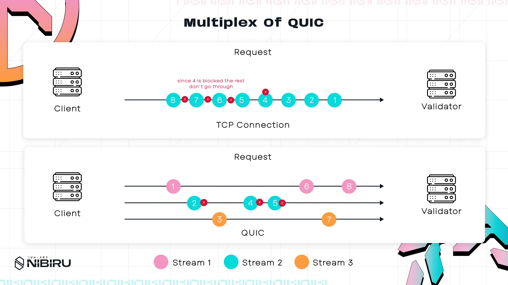

# NibiruBFT: QUIC

Within the Nibiru Lagrange Point roadmap, integrating QUIC (Quick UDP Internet Connections) into NibiruBFT’s networking stack stands out as a critical step forward—tackling the performance hurdles of traditional TCP while preserving instant finality and robust BFT guarantees. {synopsis}

## TL;DR / Takeaways

1.  QUIC reduces handshake overhead and eliminates TCP’s head-of-line blocking, improving block propagation and consensus speed
2. QUIC cuts connection setup costs from 3 RTTs (TCP) to 1 or 0 RTT, improving validator reconnections and overall efficiency
3. Validators experience seamless connection migration and can switch IPs or network paths without disrupting ongoing communication, increasing network resilience
4. Stream multiplexing allows multiple transactions and messages to be processed simultaneously, preventing delays from single packet losses
5. Dynamic flow control adjusts data transmission in real-time based on network conditions, optimizing performance and preventing congestion

## 1 - Summary

Adopting QUIC (Quick UDP Internet Connections) in [CometBFT’s peer-to-peer (p2p)](https://docs.cometbft.com/v0.37/spec/p2p/) protocol presents a significant opportunity to upgrade blockchain networking. CometBFT—long a bedrock for several ecosystems—depends on a TCP/IP foundation that, while reliable, introduces bottlenecks such as head-of-line (HOL) blocking and time-consuming handshake overheads. 

Although CometBFT remains dependable, the growing demands of Nibiru’s ecosystem highlight the need for an improved transport layer. **NibiruBFT** extends CometBFT and benefits from the same networking stack; once QUIC is introduced, it can help preserve sub-2-second block times and robust BFT guarantees under heavier loads and more geographically distributed validators.

QUIC’s implementation on the Solana blockchain has been proven to be battle-tested in a blockchain environment. Integrating QUIC as NibiruBFT’s networking layer and taking advantage of QUIC’s architectural advantages—including stream multiplexing, RTT-driven flow control, and seamless connection migration—directly allows Nibiru to address networking bottlenecks without significant tradeoffs on security. 

## 2 - The Need for Improvement in CometBFT TCP-based Networking

### 2.1 Mounting Complexity of Blockchain Networks

Modern blockchain environments, especially as exemplified by Nibiru, handle soaring transaction volumes and expanding validator counts. This surge intensifies networking demands: not only must nodes rapidly propagate large blocks, they also need to exchange time-sensitive consensus votes. CometBFT uses Transmission Control Protocol (TCP) to handle these tasks reliably, but TCP’s fundamental design can struggle under this high-pressure scenario. When heavy data volumes mix with sequential packet ordering and expensive connection handshakes, network congestion and consensus slowdowns become more likely.

### 2.2 Where QUIC Fits

QUIC shifts away from traditional TCP transport paradigms by offering stream multiplexing, dynamic flow control, and connection migration. The result is a protocol that preserves reliability while reducing many legacy constraints. For NibiruBFT, which inherits its networking layer from CometBFT, QUIC stands out as an evolutionary upgrade that can address specific bottlenecks—like head-of-line blocking and multi-RTT handshakes—without compromising the ordering guarantees needed for consensus.

## 3 - Overview: Key QUIC Features

The following sections outline the main upgrades QUIC brings:

1. Stream Multiplexing: Minimizes head-of-line blocking by allowing multiple parallel data flows.
2. RTT-Driven Flow Control: Uses dynamic congestion algorithms to prevent overload and react swiftly to real-time network conditions.
3. Connection Migration: Maintains active sessions even when validators switch IP addresses or network paths.

By the end, we’ll see how these components can reshape CometBFT’s p2p architecture to better serve the demands of NibiruBFT.

<!-- TODO: img -->

## 4 - TCP Limitations

### 4.1 Head-of-Line (HOL) Blocking

**The Bottleneck**

TCP guarantees in-order delivery of packets. If one packet (say #4) is delayed or lost, all subsequent packets (#5, #6, etc.) are halted. This is “head-of-line blocking.” In a typical consensus round, a validator might send block proposals, vote messages, and block parts. Imagine a 1MB block divided into 16KB chunks—64 parts total—over TCP. If part #4 is lost, subsequent parts wait, causing significant slowdowns for large data transfers across Nibiru’s validator network.

<!-- TODO: img -->

When the network is congested, this domino effect can make entire streams of data wait behind a single lost packet, leading to raised memory usage and potential missed consensus deadlines. Validators may fail to finalize blocks on time, not because votes were lost, but because the network was stuck trying to re-fetch one small missing piece.

### 4.2 Handshake Overhead

**Defining the Handshake**

In Nibiru’s context, a handshake is the protocol by which two validators authenticate and confirm they’re running compatible software. CometBFT’s P2P networking, which operates over TCP, enforces a two-phase process: an **authentication handshake** (Station-to-Station, or STS) and a **verification handshake**. 

<aside>


The STS (Station-to-Station) handshake is a cryptographic protocol that enables two parties to securely exchange ephemeral keys and authenticate each other using digital signatures. This confirms the identity of a validator to another validator and vice versa.

The verification handshake acts as a secondary check to validate that the authenticated cryptographic keys align with the expected PeerID stored in the network’s addressing system (e.g., the signed hash of the public key). This ensures the proven identity matches the pre-known identifier.

</aside>

The STS handshake alone requires 2 round-trip times (RTTs): one for exchanging ephemeral keys and one for signature verification. An additional RTT confirms that both validators use the same version. Hence, a fresh connection can cost 3 RTTs.

<!-- TODO: img -->

**Impact on Decentralized, Global Networks**

Over stable, low-latency connections, these RTTs might be tolerable. But in a worldwide setting, many validators function with high-latency or intermittent connections (e.g., mobile networks or distant data centers). Each time a validator goes offline, it must re-run the entire process, forcing it to spend 3 RTTs just to reconnect. This overhead disrupts throughput and finality across the Nibiru ecosystem, because CometBFT forms the backbone of NibiruBFT. The more global and large-scale the network, the more pronounced the pain becomes.

## 5 - QUIC Key Components

### 5.1 Stream Multiplexing Architecture

**Parallel Data Flows**

QUIC’s primary remedy to TCP’s single-lane design is **stream multiplexing**. Each stream manages its own sequence space and is delivered independently. If part #4 of a block is lost on one stream, parts #5–#64 can continue on their respective streams without delay. Although this doesn’t wholly eliminate HOL blocking within a single stream, it localizes the impact. One slow receiver can’t clog other critical transmissions.

<figure>
  
  <figcaption>[Figure] QUIC’s multiplexing feature ensures that packet loss on one pathway doesn’t affect other streams, maintaining high throughput even amid challenging network conditions.</figcaption>
</figure>


**Optimizations with Priority**

Although QUIC doesn’t inherently mandate a built-in priority framework, it can be configured or extended to support more advanced scheduling. Implementations may allow time-sensitive messages—such as consensus votes—to be assigned higher priority, while bulk data transfers (for example, block parts) can be paused or deprioritized under network strain. By dropping packets from these lower-priority channels first, such an approach keeps critical validator messages flowing reliably and on time.


<aside>


Think of TCP as callers routed by a single receptionist—if that receptionist gets stuck, everyone in line is delayed. QUIC is akin to each department in a building having its own receptionist (separate streams). A jam in one department doesn’t force all others to idle.

</aside>

<!-- TODO: img -->

### 5.2 Granular RTT-Driven Flow Control

**MsQuic and Hybrid Slow Start**

Microsoft’s QUIC implementation, [MsQuic](https://github.com/microsoft/msquic), and other QUIC stacks employ dynamic adjustments to stream window sizes based on RTT, packet loss, and application speeds. A core technique is called Hybrid Slow Start. During the initial “quiet” phase of a connection, QUIC’s window expands exponentially (doubling on each successful round trip) to quickly identify available bandwidth. As the network becomes more congested—signaled by increasing RTT or losses—QUIC pivots to an additive increase and eventually lowers the window if packet loss occurs.

```python
if network_quiet:
    window *= 2      # exponential growth
elif packet_loss:
    window *= 0.7    # multiplicative decrease
else:
    window += 1/RTT  # additive increase
```

### 5.2.1 Hybrid Slow Start

Once RTT or loss metrics exceed certain thresholds, the protocol exits slow start early to avoid flooding the network. This method ensures stability by proactively halting exponential growth well before mass packet drops begin.

### 5.2.2 Multiplicative Decrease and Dynamic Flow Control

If packet loss happens, QUIC slashes its transmission window (e.g., down to 70% of the current size in MsQuic). This prevents further overload, stabilizing the flow. Unlike TCP’s fixed approaches, QUIC’s dynamic system adapts constantly based on real-time measurements, supporting agile shifts that match changing blockchain traffic patterns.

### 5.2.3 Why Flow Control Matters for NibiruBFT

During consensus rounds, networks often alternate between heavy block traffic and bursts of smaller vote messages. A purely loss-triggered TCP mechanism might react too late, leading to “congestion collapse” or missed consensus deadlines. QUIC’s sophisticated feedback loops allow it to spot early signs of congestion (e.g., spiking RTT) and reduce data flow accordingly. Even better, these parameters can be tuned to meet blockchain timing requirements. If consensus demands sub-2-second finality, QUIC can tailor window sizes in real-time to ensure votes meet strict delivery requirements.

<aside>


Picture the Nibiru network as a highway. Traditional flow control says only 10 vehicles at 60 mph can enter at once, period—fine on a calm day, disastrous if it starts raining or traffic spikes. QUIC is a traffic controller who raises speeds and throughput when roads are empty, then slows everything down quickly upon congestion or poor driving conditions, maximizing efficiency without creating gridlock.

</aside>

<!-- TODO: img -->

### 5.3 Connection Migration Efficiency

TCP connections bind to a specific IP and port. When that IP changes—perhaps due to load balancers, network failover, or a validator shifting from Wi-Fi to Ethernet—the entire connection resets. Under TCP, the receiver node cannot distinguish a reconnection, because the TCP connection is specified by a 4-tuple consisting of [Source IP, Source Port, Destination IP, Destination Port]. When any of these parameters in the tuple are changed, the receiver node sees this as a new connection. 

On the other hand, QUIC replaces IP dependency with Connection IDs, decoupling the connection from IP and port. These Connection IDs facilitate connection migration, allowing receiver node to recognize that a reconnection is occurring. This allows QUIC to preserve session state: encryption keys are preserved without needing to re-establish the connection from scratch.

QUIC enforces a path validation step, requiring a 1-RTT check before fully switching data flow to the new path. This ensures a malicious actor can’t hijack a session simply by impersonating a different IP address. For NibiruBFT validators, which may use multiple internet routes, seamlessly migrating connections is invaluable to sustaining block propagation and consensus messaging.

### 5.3.1 Further Comparison to TCP

With TCP, temporary network partitions or IP flips mean creating fresh connections with empty flow-control states, leading to slow ramp-ups. QUIC utilizes Connection IDs to preserve states across partitions. Once connectivity is restored, the protocol can resume high-priority streams instantly, using existing RTT data to calibrate throughput. This difference drastically improves consensus recovery times and strengthens overall network stability in partial failure scenarios.

### 5.3.2 Round-Trip Time Analysis: QUIC vs. CometBFT P2P

In CometBFT’s legacy model, establishing a validator connection can cost 3 RTTs: 2 for authentication (the Station-to-Station handshake) and 1 for version verification. QUIC typically needs 1 RTT for a new connection and 0 RTT when rejoining a known peer—because it integrates TLS-like security into the handshake itself. What this means is that upon connection, a node can begin transmitting data after just 1 RTT, or immediately if the connection is a reconnection to a known peer.

For decentralized setups like Nibiru, where nodes often endure suboptimal connections, reducing handshakes from 3 RTTs to 1 or 0 is a major advantage. Early tests by Google showed meaningful load-time improvements in poor environments and moderate boosts elsewhere. In a web3 context with globally scattered nodes, it should be assumed that poor networking conditions are the norm. Fewer re-transmission events and lower reconnection overhead translate directly into smoother networking performance.

## 6 - Conclusion

QUIC’s enhancements tackle the most pressing performance issues in CometBFT’s P2P architecture—the very foundation on which NibiruBFT operates. By combining stream multiplexing, RTT-based flow control, and connection migration, QUIC delivers a stronger blueprint for blockchain communication under heavy load or network stress.

Successfully implementing these features does require meticulous tuning to accommodate blockchain-specific needs such as tight consensus deadlines and multi-VM transaction bursts. Yet the payoff is clear: faster block propagation, fewer stalls, and better overall resilience. As Nibiru’s validator community grows and throughput demands escalate, QUIC-based networking becomes a critical component in ensuring that the chain can handle its global ambitions while maintaining sub-2-second finality.

In essence, introducing QUIC is like upgrading from a single-lane road to a modern highway with dynamic traffic lights and the ability to seamlessly change lanes. Traffic jams are more contained, throughput is higher, and the entire journey becomes smoother—vital qualities for a blockchain aiming to service global DeFi applications and a broad decentralized user base.

<!-- TODO: img -->

**References & Further Reading**

- [QUIC Protocol (RFC 9000)](https://www.notion.so/NibiruBFT-Quick-UDP-Internet-Connections-QUIC-18ad2597a03c800bb419fd2b828e398d?pvs=21)
- [CometBFT P2P Spec](https://docs.cometbft.com/v0.37/spec/p2p/)
- Nibiru Research Team’s internal experiments with QUIC under high-latency links
