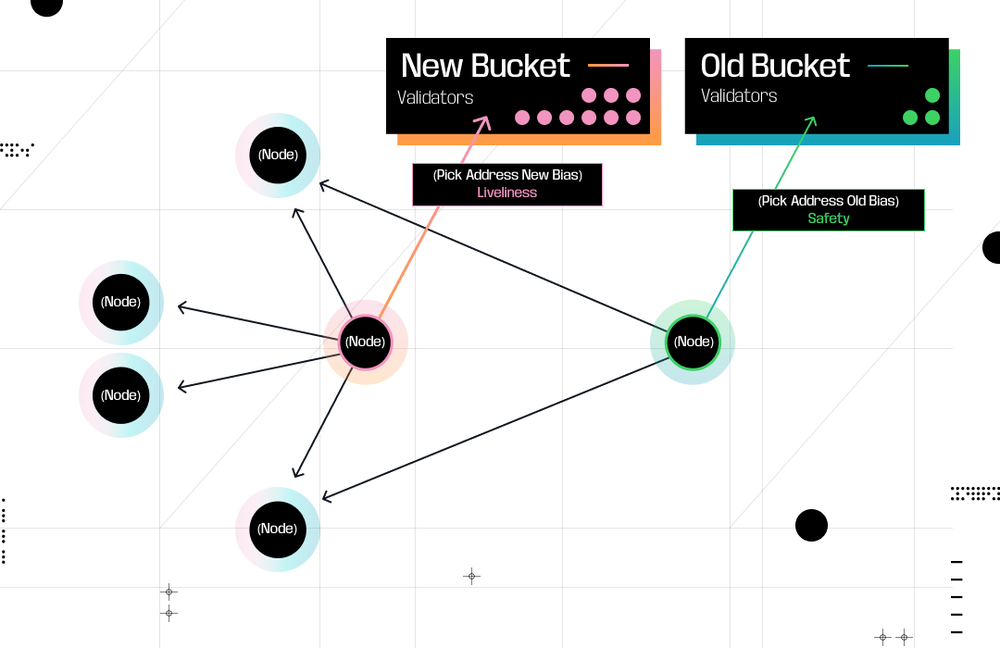
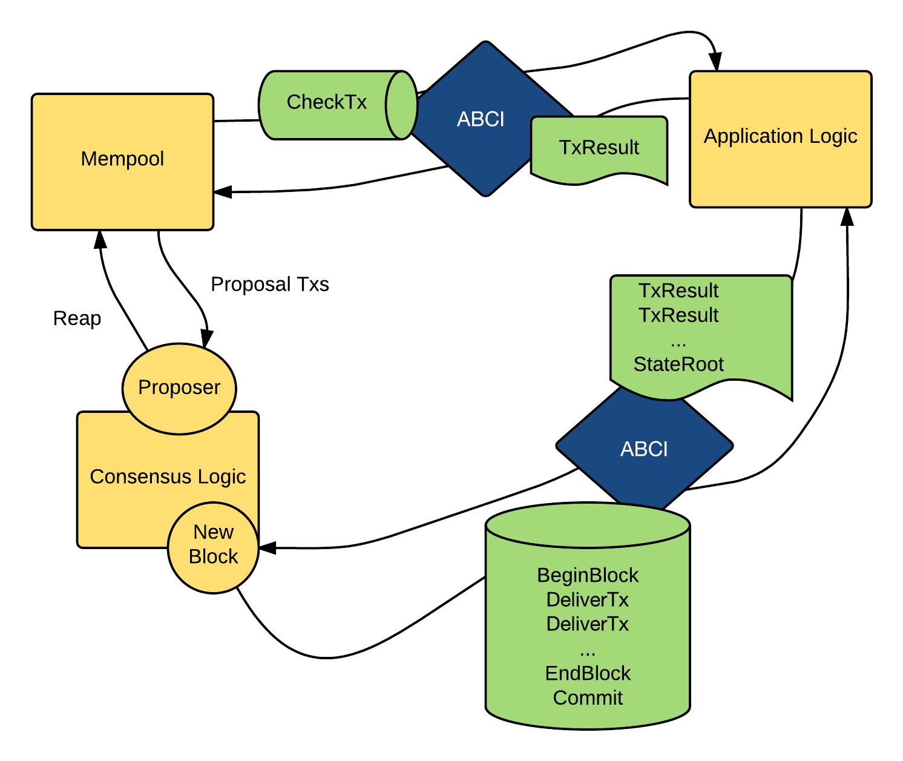
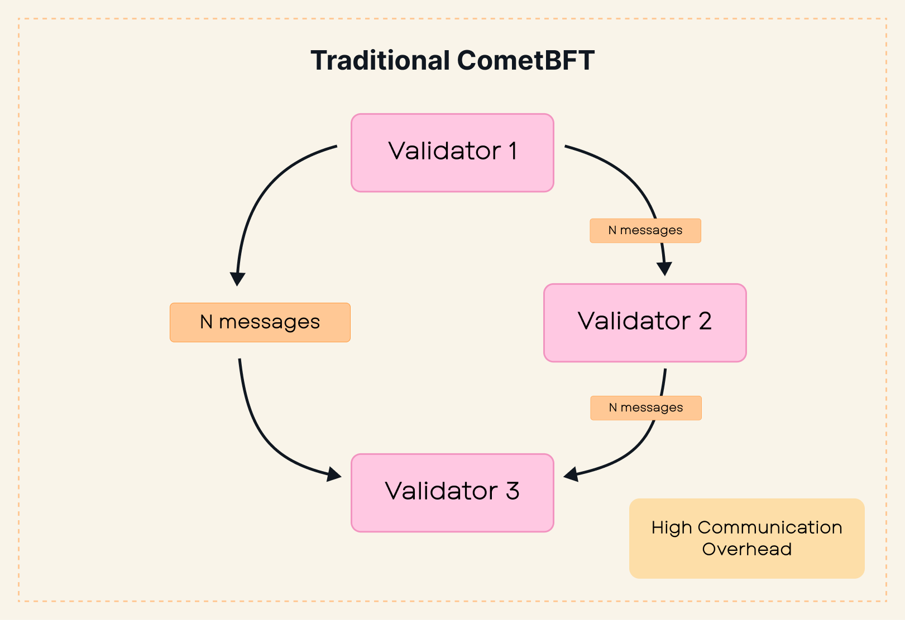
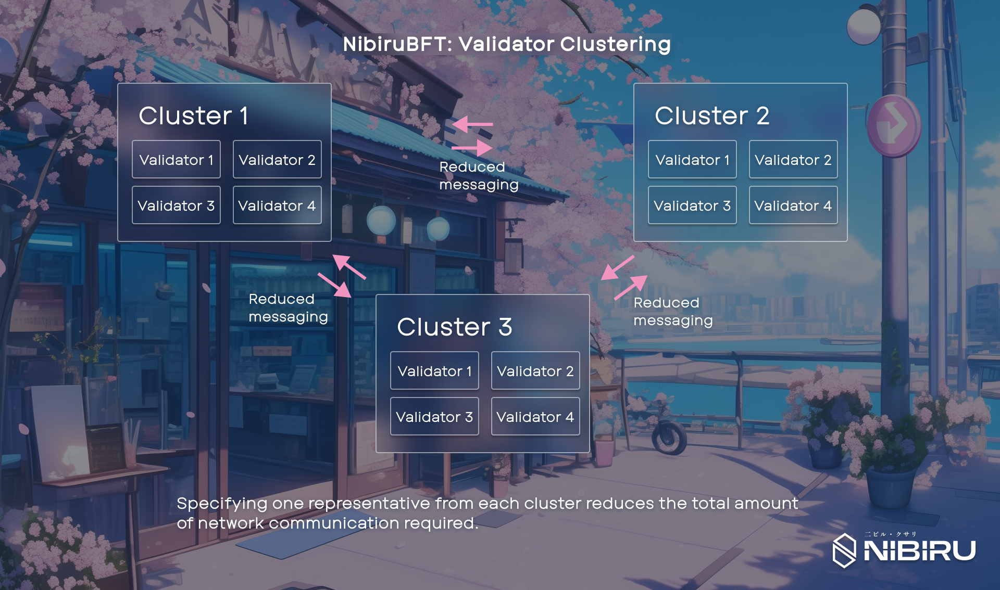
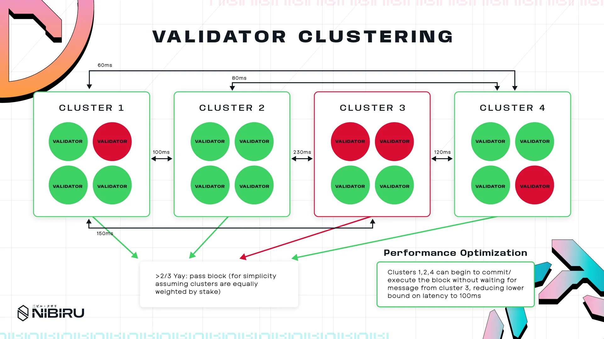

# NibiruBFT: Validator Clustering 

Nibiru Research is exploring methods to enhance the scalability and decentralization of consensus mechanisms. One promising direction involves modifying the CometBFT consensus algorithm to reduce communication overhead. Specifically, we are investigating a multi-layered consensus system that structures validator nodes into distinct "validator clusters”. {synopsis}

## CometBFT Consensus Algorithm

To contextualize this approach, it's useful to review CometBFT. The Cosmos SDK framework enables the development of customizable Layer-1 blockchains, facilitating applications that prioritize security and speed. The SDK abstracts these core functionalities, simplifying development.

<figure>
  
  <figcaption>[Figure] CometBFT: The architectural flow of ABCI message handling in CometBFT, showing how transactions move from the Mempool through CheckTx validation, while the Consensus Logic, led by a Proposer, manages block creation. The Application Logic processes transactions via two ABCI interfaces: one for individual transaction results and another for block-level operations (BeginBlock, DeliverTx, EndBlock, and Commit), ensuring a systematic approach to state management and consensus.</figcaption>
</figure>

CometBFT, the successor to Tendermint, is widely used by IBC blockchains built with the Cosmos SDK. Its architecture features an ABCI message handling flow, where transactions move from the Mempool through CheckTx validation. While CometBFT offers strong security guarantees and instant finality, it faces scalability constraints compared to other consensus algorithms.

<figure>

  <figcaption>[Figure] Tendermint consensus process: showing how a new block height initiates a round of proposals, followed by prevoting and precommitting phases. The paths in blue represent successful block validation flows, while red paths indicate scenarios where consensus wasn't reached and a new round is needed. The critical "+2/3" thresholds are clearly marked at decision points, showing where supermajority agreement is required to proceed with block commitment. The polka dancers in the corner playfully reference the algorithm's "polka" mechanism for achieving consensus.</figcaption>
</figure>

CometBFT, like Tendermint, is a Byzantine Fault Tolerant (BFT) State Machine Replication algorithm operating under a partial synchrony model. BFT guarantees consensus even with up to $f$ faulty nodes, given a total of $3f+1$ nodes. The partial synchrony model relies on Global Stabilization Time (GST) to bound message delivery and processing, ensuring safety through redundancy and liveness through timeouts.

## CometBFT's Communication Protocol

CometBFT utilizes a gossip protocol, where validators flood messages to propagate information throughout the network, even before GST. This design enhances resilience against network partitions and delays. The Peer Exchange (PEX) reactor manages peer discovery and connectivity, determining which validators a node connects to.

> *Analogy:*  Think of a **gossip protocol** like a rumor spreading in a busy town square: each person shouts the news to anyone who will listen, making sure it reaches everyone around them. This approach keeps the network resilient to failures or delays. The **PEX reactor** is like a social coordinator, deciding which validators should connect to each other so that messages spread efficiently across the network.

Validators broadcast messages through gossip across the network so that, even if parts of the network go down or slow, information still reaches everyone.

## Peer Exchange and Discovery

The `MaxNumOutboundPeers` parameter in CometBFT’s configuration specifies the maximum number of peers a validator should connect to. When a validator’s outbound connections fall below this number, the PEX reactor’s `EnsurePeers` function is invoked. This function, called by the continuous `EnsurePeersRoutine` subroutine, selects a new address to dial using a biased random selection method.

::: tip
**Bias Parameter**: This parameter determines how likely it is to select older, trusted peers over newer, less reliable ones. When a validator has fewer connections, the bias is low, making it more likely to choose established peers. As the validator’s peer count increases, the bias rises, favoring connections with newer peers.
:::

The selection process is executed via the `PickAddress()` function in the PEX reactor, which draws from two buckets: one for older, reliable peers and another for newer, less reliable peers. This mechanism balances safety and liveness by ensuring validators maintain robust connections in both pre-GST and post-GST conditions. In pre-GST conditions, prioritizing reliable peers enhances stability. In post-GST conditions, connecting to newer peers promotes liveness, with fallback to existing connections if new ones fail. This redundancy ensures that, as long as 2f+1 validators are not faulty, consensus progresses safely.

**Invite the Dependable, Then Expand: A Community Event Analogy**: 
Imagine you’re hosting a community event and have a maximum number of invitations to send out. If you haven’t filled all the slots, you’re likely to invite your most reliable friends first, because you want to ensure the event has a stable, trustworthy core. Once you’ve secured enough of those dependable attendees, you start sending invites to new acquaintances—expanding your reach and increasing the event’s vibrancy. Even if some of the new invitees don’t show up, you still have enough of your close friends on board to keep the event running smoothly.

## The "$n^2$ Communication Problem"

Despite its robustness, the gossip-based peer exchange mechanism results in the “n^2 communication problem,” where messaging complexity scales quadratically with the number of validators. In the worst case, if each validator’s peer subset overlaps significantly, messaging complexity approaches that of a fully connected network.

This redundancy, while ensuring fault tolerance, increases communication overhead as the validator set grows, making consensus slower and more computationally expensive.
This scalability issue has practical consequences:

1. **Validator Economics**: Running a validator becomes less economically viable due to higher resource requirements, deterring smaller participants.
2. **User Experience**: End users face longer block times due to slower consensus.
3. **Centralization Risks**: Smaller validator sets exacerbate centralization, as smaller stakeholders are forced to delegate to larger validators who take a cut of rewards.

## Validator Clustering: A Proposed Solution

Validator clustering addresses the $n^2$ communication problem by splitting validators into clusters, or groups of validators to be considered one representative entity. Validators within each cluster run consensus up to the pre-commit step, aggregate their votes, and then participate in a second layer of consensus at the group level using the CometBFT algorithm. This approach reduces messaging complexity from $O(n^2)$ to $O((n/c)^2)$, where $c$ is the number of clusters.

<figure>
  
  <figcaption>[Figure] Traditional CometBFT consensus introduces significant communication overhead, with complexity scaling quadratically with number of validators.</figcaption>
</figure>

<figure>

  <figcaption>[Figure] Validator clustering transforms the traditional all-to-all validator communication pattern into a hierarchical structure with group leaders, dramatically reducing network overhead while preserving byzantine fault tolerance.</figcaption>
</figure>

## Example of Communication Overhead Reduction

In traditional CometBFT, 100 validators with a communication overhead of 10,000 messages could operate effectively. With validator grouping:

- **Grouping Factor of 5**: Supports 223 validators.
- **Grouping Factor of 10**: Supports 316 validators.

## Additional Optimizations

Several optimizations can enhance this approach:

1. **Early Commit**: Similar to CometBFT’s ability to move to the commit phase when 2/3 of validators pre-commit, the block can be committed once a majority of groups agree, without waiting for votes from all group leaders.
2. **Geographic Grouping**: Grouping validators geographically can reduce latency, speeding up intra-group consensus.

<figure>
  
  <figcaption>[Figure] A possible “optimistic” optimization (extending the idea that once ⅔ stake weight has approved the block, the block is finalized). By clustering validators accommodating to network topology, NibiruBFT can decrease the lower bound on latency in the best case.</figcaption>
</figure>

3. **Slow Clustering**: Clustering of consistently slow validators (with a summed stake <1/3) allows performant clusters to reach inter-cluster consensus faster, without being held back by the slow cluster.

## General Implementation Considerations

The Nibiru Chain research team believes the best approach to validator clustering implementation is to use CometBFT to handle intra-cluster consensus, with a dedicated x/clustering module to manage cluster formation, any optimizations, and inter-cluster consensus. 

While a fully consensus-level modification may be the "purest" and most performant approach, it requires significant changes to CometBFT and would lead to many upstream compatibility issues. On the other hand, a largely application layer-level approach that involves delegating cluster formation, any optimizations, and intra- and inter-cluster consensus operations to the x/clustering module would require replicating significant portions of CometBFT logic. This again results in large upstream compatibility issues, as well as likely being the least performant due to heavy communication overhead between the application and consensus layers.

## Optimization Implementation Considerations

For more in depth detail regarding implementation of secondary geoclustering and slow clustering, see the whitepaper here. <!-- link to whitepaper to be inserted-->

## Challenges and Open Questions

The intra-group consensus algorithm is a critical component of this design. Using CometBFT for intra-group consensus has potential downsides:

1. **Timeouts**: Introducing additional timeouts may slow consensus and introduce new attack vectors.
2. **Dynamic Slashing**: Penalties for repeated timeouts could mitigate some issues but require careful implementation.

Alternatively, a different intra-group consensus algorithm could be used, potentially improving speed. However, this would complicate GST assumptions and require extensive research to ensure safety. Falling back to the original CometBFT algorithm in case of timeouts ensures liveness, leveraging its proven reliability.

## Research and Further Considerations

Nibiru is actively exploring potential implementations and working to prove the correctness of this mechanism for both safety and liveness. Validator grouping has the potential to significantly improve scalability, throughput, and decentralization, aligning with the Web3 ethos and addressing key limitations in blockchain development.
