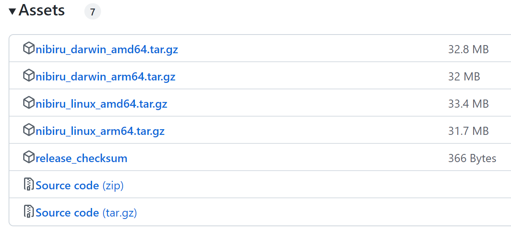

# ⚙️ Installing the Nibiru Binary

Instructions on building and installing the `nibid` binary. `nibid` is a command line client for the Nibiru blockchain. Nibiru users can use nibid to send transactions to the Nibiru network, query data from the chain, and run nodes. To install the `nibid` binary, you can either (1) download the binary from the NibiruChain/nibiru releases page (2) or build the binary directly from the source code. {synopsis}

## Install Option 1 | Use our bash script

```bash
curl -s https://get.nibiru.fi/! | bash
```

Or, if you would like to get a specific version, use:

```bash
curl -s https://get.nibiru.fi/@v1.0.0! | bash
```

**NOTE**: The `!` sign in the URL makes the script move the binary to `/usr/local/bin` after downloading it. For this, it will ask you for `sudo` password. If you would like to skip this, just ommit the `!` sign from the URL.

## Install Option 2 | Downloading the binary

You'll need one of the `darwin_` binaries if you're using MacOS and one of the `linux_` binaries if you're using something like Ubuntu or WSL.

To know whether you'll need the `amd64` or `arm64`, run one of the following commands:

```bash
dpkg --print-architecture
# returns "amd64" on Ubuntu
```

```bash
uname -m
# returns values like x86_64, i686, arm, and aarch64
```

Download the binary from the [NibiruChain/nibiru releases](https://github.com/NibiruChain/nibiru/releases) page (the current testnet is `v1.0.0`). The assets are at the bottom after the release notes.



After downloading the tar file containing the binary, you'll need to unpack it. Here's an example command for unpacking the tar file.

```bash
tar -xvf nibiru_linux_amd64.tar.gz && mv nibirud nibid
# The tar file unpacks with "nibirud" as the default name, so we rename it here.
```

Finally, add the `nibid` binary to your `$PATH` with one of the methods below.

```bash
# Add to shell config
export PATH=<path-to-nibid>:$PATH
```

```bash
# Or, copy directly to a /bin folder
cp nibid /bin/nibid
```

## Install Option 3 | Building from the Source Code

### 2.1 — Install make and gcc

```bash
sudo apt-get update
sudo apt-get upgrade
sudo apt install git build-essential ufw curl jq snapd --yes
```

### 2.2 — Install Go

The installation process for Go depends on your OS. Nibiru is meant to build with a Unix system such as MacOS, Ubuntu, or WSL. Please install Go v1.18 using the instructions at [go.dev/doc/install](https://go.dev/doc/install). For Ubuntu, you can use:

```bash
wget https://golang.org/dl/go1.18.2.linux-amd64.tar.gz
sudo tar -C /usr/local -xzf go1.18.2.linux-amd64.tar.gz
```

You'll also want to set the following environment variables in your shell config (e.g. `.bashrc`, `.zshrc`).

```bash
export GOROOT=/usr/local/go
export GOPATH=$HOME/go
export GO111MODULE=on
export PATH=$PATH:/usr/local/go/bin:$HOME/go/bin
```

### 2.3 — Compile the source code

To build the binary from source, begin by cloning the `NibiruChain/nibiru` repo.

```bash
cd $HOME
git clone https://github.com/NibiruChain/nibiru
cd nibiru
git checkout v1.0.0
make install
```

## Post-installation

Running these commands should have made `nibid` available in your `$PATH`. You should now be able to view a list of all available commands:

```bash
nibid
```

::: tip
If the "`nibid: command not found`" error message is returned, confirm that the Golang binary path is correctly configured by running the following command (or setting it in your shell config):
```bash
export PATH=$PATH:$(go env GOPATH)/bin
```
:::

---

## Local development

Lastly, you can run the chain for local development with

```bash
make localnet
```

After opening another terminal, you'll be able to use the full suite of `nibid` commands.

## Docker Engine

You'll need Docker to run commands that use external containers like `make proto-gen`. Instructions for installing Docker can be found [here](https://docs.docker.com/engine/install/).

---

## Next Steps

#### Learn more about the [`nibid` Command-Line Interface][page-cli]

#### [Setup Cosmovisor][page-cosmovisor]

#### Run a Full Node

- [Run a Full Node on Testnet][page-testnet]
- [Setup a Validator Node][page-validator]

#### [What's a node?][page-node-daemon]

[page-cosmovisor]: ../../run-nodes/testnet/cosmovisor
[page-testnet]: ../../run-nodes/testnet
[page-validator]: ../../run-nodes/validators
[page-node-daemon]: ../../run-nodes/testnet/node-daemon
[page-cli]: ./
