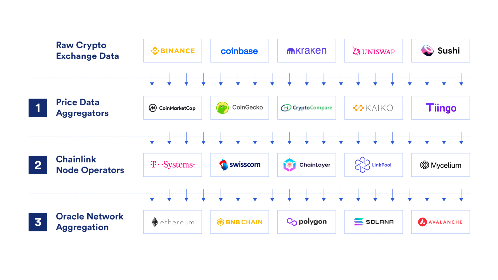

# Oracle Designs in Web3

This page provides backgrond information on some of the most prevalent
consensus-based oracles for price feed data, including Chainlink, Pyth, and the
Nibiru Oracle Mechanism. {synopsis}

## Related Oracle Pages

1. [Nibiru Oracle (EVM) - Usage Guide](../../dev/evm/oracle.md)
1. [Integrating with Oracles on Nibiru](../../dev/tools/oracle/index.md)
1. [Using the Band Protocol Oracle on Nibiru](../../dev/tools/oracle/band-oracle.md)

## Nibiru Oracle Module

The [Nibiru Oracle module](./index.md) connects the Nibiru blockchain to external data sources,
which is essential for decentralized finance (DeFi). It works by having validator
nodes act as oracles, collectively voting on exchange rates for various crypto
asset pairs. 

This decentralized approach aims to prevent manipulation and single points of
failure by aligning incentives between validators and traders, making potential
attacks more costly and difficult. The process involves validators submitting
price proposals, with the system calculating a weighted median to establish the
official on-chain exchange rate.

The module features a structured voting cycle (PreVote, VotePeriod, PostVote) for
oracles to reach consensus on exchange rates. Technical aspects include slashing
mechanisms to penalize inaccurate or non-participating validators and reward
systems for those providing accurate data. By comparing oracle inputs against a
reference standard, the module ensures data correctness.

## Chainlink

ChainLink relies on a network of independent node operators who are rewarded
with LINK tokens in exchange for honest and high-quality performance as
oracles. These independent nodes deposit LINK tokens as collateral and are
punished for poor performance, whether malicious or not.

A smart contract may request data, which triggers an “event”. Node operators
listen for these events and in turn grab the requested off-chain data from a
variety of external sources and send it over as a transaction.

The data is first aggregated by the Chainlink Nodes at the data source level.
The provided responses are then in turn aggregated at the Node Operator level.

## Pyth Oracle

Pyth is focused on financial market data and partners with over 70 established
firms, including large exchanges and market making firms. By connecting
directly to their API, they’re able to quickly provide prices for commodities,
US equities, and cryptocurrencies.

Data publishers include Jump Trading Group, Chicago Trading Company, Jane
Street, and many more. These data publishers stake PYTH tokens as collateral to
incentivize good behavior, and are rewarded for providing timely and reliable
data. Those relying on the data may elect to pay small fees in order to gain
protection from oracle failures.

## MakerDAO

MakerDAO is the largest DeFi protocol and enables collateral loans in the form
of their decentralized stablecoin DAI. They use a price feed oracle to
determine the prices of the posted collateral, in order to trigger liquidations
when appropriate.

Price feeds are collected by individuals operating pseudonymously, as well as
organizations who operate with public identities. Example organizations include
well-known DeFi entities such as dYdX, 0x, and Gnosis. Those providing these
price fees are voted on by MKR token holders, and these prices are inputted
into what’s known as the Oracle Security Module (OSM). The OSM delays prices by
an hour in order to freeze an oracle in the event of any issue or compromise.
