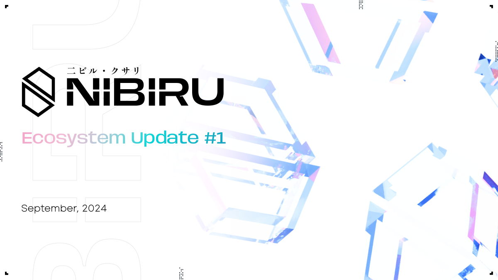

# Nibiru Ecosystem Update #1 - Sep 2024

A detailed update on the growth and development of the Nibiru blockchain
ecosystem over the last year. Throughout this time, Nibiru reached its V1 mainnet
network launch and entered a new chapter centered on  shepherding quality teams
to build, deploy on, and make Nibiru their home. {synopsis}

Prepared By: [The Nibiru Team](https://nibiru.fi/team)

- You can now find the [full list of Nibiru Ecosystem Updates here](https://nibiru.fi/docs/ecosystem/updates/).
- This page is available [as a PDF](/docs/ecosystem/updates/nibiru-eco-01-sep-2024.pdf).
- Authors: Unique Divine, Jonathan Chang, Erick Pinos

## 1 | Key Takeaways / TL;DR

1. Nibiru EVM on Testnet Q2 2024. This has accelerated business development and ecosystem efforts drastically. Many Ethereum-based teams have begun building on Nibiru since early development networks (devnets) with plans to co-launch later this year.
2. Nibiru EVM Audit Q3 2024 (now) with mainnet on the horizon.
3. [Native USDC](https://www.circle.com/blog/bridged-usdc-standard) is supported on Nibiru via IBC and we have been approved and signed for a [LayerZero](https://layerzero.network/) integration as well.
4. The Nibiru blockchain network launched for public use alongside the $NIBI token earlier this year on March 12th, following the community sale on CoinList that was held on February 1st.
5. Parallel optimistic execution has been achieved. - Code complete with release planned for an upgrade following Nibiru V2.

**Legal Terms for this Ecosystem Update**

*This Ecosystem Update is provided by the Nibiru team. The Nibiru project is led by the Matrix Foundation (referred to herein as “Nibiru,” “we,” and “us”) and supported by various unrelated entities, including Nibi, Inc. and its respective personnel, as well as other entities and personnel that the Matrix Foundation has engaged for services, some of whom are mentioned in or have contributed to this update.*

*The information provided in this Update does not constitute investment advice, financial advice, trading advice, legal advice, or any other form of advice. The contents of this document are for general informational purposes only, are subject to change without notice, and does not constitute any form of contract or obligation on the part of Nibiru. This Update does not replace, amend, or override any applicable terms of service, agreements, or legal obligations associated with the project.*

*A complete Legal Disclosure is provided at the end of this document. By accessing this Update, you acknowledge that you have read, understood, and agree to be bound by the terms set forth in this section and in the full Legal Disclosure. If you do not agree to these terms, please do not access or use any information contained within this document.*

## 2 | Product Development & Ecosystem Updates

### 2.1 - Progress on the Roadmap to Date

**2.1.1 Parallel Optimistic Execution**

Code complete as of June 19, 2024, this performance improvement to the chain is
planned as one of the upgrades following Nibiru’s V2 release.

**2.1.2 [Nibiru EVM](https://nibiru.fi/docs/evm/evm-alpha-test.html)** (Nibiru’s
V2 Upgrade)

Nibiru EVM is a fully backward compatible upgrade to Nibiru that makes it power
an EVM-equivalent execution environment, supporting an Ethereum JSON-RPC
interface, Solidity contracts, and tools like Ethers and Metamask out of the box
with no code changes.

Since development began in April 2024, this has been our top development priority
(more on this in a later section). Usable releases started rolling out in June
2024, and we’ve focused on bringing the feature to the point of audit and
production readiness. Our strategy here was to constantly keep builders using
Nibiru EVM under our feet while we continue to build it out to better know which
features to prioritize or eliminate from scope.

**2.1.3 Bridge integration with major liquidity providers**

When first deploying the chain, we wanted to make sure that Nibiru would not be
isolated in terms of user reach so that users of prominent chains could easily
move over assets. The most common approach for projects is to set up new bridge
connections that create wrapped tokens and further fragment liquidity. Our
approach was different.

Nibiru leverages several [IBC-based liquidity
routers](https://nibiru.fi/blog/posts/63-how-to-bridge) that, under the hood, use
a combination of Axelar, Wormhole (Gateway), and Noble to enable users to bridge
assets. Here, Noble provides native issuance of [Circle via Cross-Chain Transfer
Protocol](https://www.circle.com/blog/native-usdc-now-available-on-noble), while
the other bridges are asset-agnostic. This helps Nibiru avoid creating
unnecessary new versions of tokens that would not be usable on other chains.

As a next step, we're in discussions to support [Circle's official Bridged USDC
standard](https://www.circle.com/blog/bridged-usdc-standard) as a direct
connection on the Nibiru EVM. Nibiru has also been approved for an integration
with LayerZero. You can look out for more details on that in an upcoming
announcement.

**2.1.4 Development of Core dApps**

The goal in the earliest point of Nibiru’s project lifecycle was to launch a native perpetuals DEX, spot DEX, and stablecoin in the months following the launch, however it became apparent that efforts were better spent on improving the underlying base layer to create a more open-ended ecosystem.

We like to frame this as the chain having two kinds of users that ultimately dictate our downstream KPIs. Those are (1) the users that broadcast transactions or interact with products directly (**consumers**) and (2) the users that build and ship usable applications using Nibiru as the base layer (**product developers**). Our initial focus on internally developed applications made sense from the perspective of a focus on consumers, but this focus served as a double-edged sword in that it dissuaded product developers from creating competing applications.

Based on the feedback of some of the earliest builders on Nibiru and the longer-term growth trajectory we could see from shipping our general purpose features faster, the perpetual futures DEX was deprioritized around the beginning of 2024 in favor of streamlining the timeline for Nibiru EVM.

Thanks to successful business development efforts in sourcing multiple DEXs, we saw no need in continuing to develop Nibi-Swap (spot AMM) since third party founders are launching on both the EVM and Wasm.

As of now, the perpetual futures application has production-ready smart contracts. It is undergoing an external audit by Oak Security and additional quality assurance, as the codebase has significantly evolved since the last audit. This application is being developed in collaboration with CodedEstate, a team working on a separate real-world asset (RWA) application on Nibiru.

**2.1.5 Fungible and non-fungible token creation for dApps**:

Ethereum uses the ERC-20 standard for fungible tokens, where each token is represented by a smart contract on Ethereum with special properties. Blockchains built with the Cosmos-SDK use Bank Coins as the standard for fungible tokens by default. Coins are simpler, do not require the deployment of smart contracts, and are automatically IBC-compatible, but many chains do not have a mechanism for external builders to create new assets without interacting with the maintainers of the chain.

Nibiru developed a module that allows the permissionless creation of Bank Coins so that native, IBC-compatible tokens could be created by third-party applications. To take that a step further, we built in native compatibility between this IBC standard and the ERC20 standard as part of Nibiru EVM. Bank coins like NIBI and USDC or ETH from IBC can seamlessly be used as ERC20s on the EVM and vice versa.

**2.1.6 [Brand Refresh](https://x.com/NibiruChain/status/1777060570711134209)**: A fresh look reminiscent of a Neo Tokyo aesthetic.

**2.1.7 Community Sale**

Nibiru successfully conducted a [Community Sale on Coinlist](https://cointelegraph.com/press-releases/nibiru-chain-secures-12m-to-fuel-developer-focused-l1-blockchain) with oversubscribed interest. The initial allocation of $3M USD sold out in 9 minutes, and an additional $3M extension sold out within 11 minutes. By the end, this sale had 842% in pre-funded excess interest, attracting 42,713 registrants and over 5,000 purchasers.

**2.1.6  X Airdrop and T Airdrop**

Nibiru offered two community airdrop opportunities with participation beginning from 2023 that continued until the time of the network's public launch in March, 2024. These campaigns in combination with press, advertisements, and consistent content marketing helped grow the community substantially from less than 100,000 members to more than half a million.

**2.1.7 Asia Expansion & Nibiru Grants**

We hired [Yura (Seoul), Nicholas](https://alexablockchain.com/nibiru-chain-ventures-into-asia/) (HK), and Kuen (India) with numerous events and sourcing efforts spent in the region. The [Nibiru Grants](https://venturebeat.com/games/nibiru-offers-15m-in-developer-grants-for-building-on-its-blockchain/) program was formally kicked off for ecosystem building efforts, though we do note a strong preference for project investments rather than grants, as this better aligns interests between dApp + Nibiru.

**2.1.8 Token Listings for NIBI & Mainnet Launch**

[Listed](https://decrypt.co/221309/nibiru-chain-debuts-public-mainnet-along-with-four-major-exchange-listings) on Bybit, Gate.io, Kucoin, MEXC, and BitMart, with mainnet being launched at the same time.

**2.1.9 [Blossom Program](https://nibiru.fi/blog/posts/059-blossom-ambassador-program.html)**

Expansion of the ambassador program with Blossom, providing Nibiruns the opportunity to advance and join through organic contributions and attracting consistent, high-quality contributions by regularly replacing inactive users with new, active participants.

**2.1.10 EVM Upgrades**: Naturally, these come later after the V2 launch.

### 2.2 - Why Focus Efforts on Launching Nibiru EVM?

If you return to the earliest point in the project history while the Nibiru team was just forming in January 2022, CosmWasm on Terra was the second most prominent smart contract layer after Ethereum’s EVM in terms of user adoption. At the time, building with Rust-based CosmWasm contracts was a clear choice and direction many in the market were moving towards due to Terra’s success and several technical advantages. Wasm smart contracts are designed around improved security, are impervious to re-entrancy attacks (the most common smart contract vulnerabilities in Ethereum) and denial of service attacks, are interoperable/modular in that they enable cross-chain calls with IBC-enabled chains, and offer the performance benefits of WebAssembly.

In spite of these advantages, it became more and more clear over time that, despite the EVM’s technical drawbacks, there were already established network effects to accelerate its adoption, and the vast majority of new dApp teams want to continue building on the EVM.  Our business development efforts consistently encountered teams strongly committed to EVM development, reluctant to port their contracts to Rust. This was one of several reasons for us to prioritize native EVM equivalence ahead of other features in our multi-year strategy. Dapps get to retain optionality and ease of integration coming from platforms like Ethereum L1, L2s, Tron, and Binance Smart Chain.

The initial development efforts on Nibiru EVM were [announced](https://www.theblock.co/post/298436/nibiru-evm-to-transform-ethereum-capabilities-for-tomorrows-web3) this June. We quickly brought it to a usable version on testnet that many Ethereum-based ecosystem projects have been using to prepare for the upgrade’s mainnet launch. We have worked diligently with these projects to ensure an on-time blockbuster launch that both the developers and retail community will be excited about.

### 2.3 - Ecosystem Highlights

Ecosystem is the most crucial element of building a successful Layer 1. To date, there are a number of projects building on Nibiru in areas like DeFi, Gaming, and RWA finance. The most promising ones are as follows:

| **Project** | **Description** | **Status** |
| --- | --- | --- |
| [HiYield](https://www.hiyield.xyz/) | Tokenized Treasury Bills | Live on Devnet |
| [Astrovault](https://astrovault.io/) | Sustainable Revenue-generating Spot DEX | Finalizing devnet integration |
| [LayerBank](https://layerbank.finance/) | EVM-based Lending Platform | Finalizing devnet integration |
| [Eris Protocol (ampNIBI)](https://www.erisprotocol.com/) | Liquid-staking platform on the bank and ERC-20 standard. | Launched on Mainnet |
| [Kryptonite](https://app.kryptonite.finance/nibiru) | Liquid-staking platform on the CosmWasm CW20 standard | Launched on Mainnet |
| [Sai](https://sai.fun/) | Competitive perpetual futures DEX enabling the creation of markets on any asset | Finalizing integration on devnet. Smart contracts are currently under audit. |
| [Frax Finance](https://frax.finance/) | Fractional Stablecoin Ecosystem | Co-incentivizing pools to launch on Nibiru. Further integrations on the roadmap. |
| [dTrinity](https://dtrinity.org/) | Discounted Stablecoin Loans and automated | In Development |
| [PRDT](https://prdt.finance/) | Prediction Market | In Development |
| [SilverSwap](https://silverswap.io/) | Uni V4-based Spot DEX | In Development |
| [Nebula](https://nebulalending.io/) | Lending Platform | In Development |
| [SWIFY (Panoray)](https://www.panoray.com/) | Concentrated Liquidity Spot DEX | Live on Devnet |
| Cosmos Millions | No-loss lottery | In Development |
| [OpenMark](https://x.com/OpenMarkNFT) | NFT Marketplace | Live on Devnet |
| [Routescan Explorer](https://routescan.io/) | EVM explorer built by the team powering the explorers for Avalanche and Optimism | Finalizing integration on devnet and mainnet |
| [Euclid Protocol](https://www.euclidprotocol.io/) | Unified Liquidity Layer using Virtual Routing and Forwarding (VRF) | Live on Devnet |
| [Omni](https://www.omnipump.io/) | DEX and launchpad for fair launches and memecoins | Finalizing integration on devnet |

## 4 | Main Priorities Going Forward

### 4.1 - Design Campaigns to Drive Usage

Alongside Nibiru’s V2 upgrade (Nibiru EVM), we’re placing a strong emphasis on coordinating the launch of several third-party applications together as part of a broader strategic initiative. The aim is to amplify network effects through a unified marketing campaign, making it easier for new users to understand, simpler to run ads for, and more effective in driving usage and liquidity.

The general structure is as follows:

1. The timeline of events will include pre-launch activities, on-chain missions, fixed-rate incentives that scale with usage, and liquidity lock events.
2. dApps will be required to undergo QA testing, smart contract audits, and plan user incentives. The ability to be highlighted within the program has been an effective selling point when interacting with ecosystem partners and a great way to kick off interest.
3. These sub-campaigns will start over the next few months with the Nibiru EVM release and continue to evolve throughout 2025.
4. Liquidity lock events are the final phase and essentially refer to simple structured products that will make it easier for organic external liquidity to serve as fuel for protocol-owned liquidity and get deposited into yield-bearing applications.

### 4.2 - Branch Out to Emerging dApps Verticals

While dApp interactions have included a wide range of verticals including DeFi, RWAs, gaming, NFTs, SocialFi, marketplaces, memecoins, and prediction markets, there are arguably only a few niches that have reached “product-market fit” with sufficient liquidity, volume, and consistent user traction.

One such method of evaluating roughly this is to look at the some of the top [categories](https://defillama.com/categories) in terms of TVL, volume, and active users, which include the major model variations of lending platforms, DEXs, derivatives, vaults, and RWAs. NFTs, memecoins, and prediction markets don’t necessarily screen as well on TVL but generate sufficient volume and user interest to those outside the ecosystem.

The ecosystem team has been focusing its efforts on verticals that have reached PMF or appear to be on the cusp of doing so. Though we’re focused on consumer applications in the DeFi and RWA areas for immediate growth, the table below includes some of the rationale behind other sectors we target in outbounds:

| **Area** | **Commentary** |
| --- | --- |
| GameFi | GameFi appears to be on the cusp of hitting an inflection point, but it’s not there yet. Gaming studios still suffer from long lead times between initial game funding and final development with vague projections being made using early game demos. The future of GameFi likely hinges on two fronts: AAA gaming studios with brand name IPs such as “Pokemon”, “Call of Duty”, or “League of Legends” and genuinely fun, hyper-casual games that are more “Game” than “Fi”.  We’re optimistic about GameFi’s potential yet realistic about its hurdles and closely monitoring this space. We’re  looking for projects that combine solid gameplay with effective go-to-market strategies. Someone can build a good game, but if there’s no awareness of the brand, it will be difficult to attract users, so there must still be a clear solution for bootstrapping the zero to one. |
| SocialFi | Similar to GameFi, SocialFi has high potential for growth but faces the challenge of competing against entrenched Web2 giants, making it difficult for decentralized alternatives to break through without a compelling value proposition. SocialFi’s success will depend on offering distinct advantages with Web3 technology that centralized platforms cannot or will not replicate. |
| Real World Assets (RWAs) | RWAs are gaining traction, particularly in on-chain treasury bills, receivables, and corporate credit. These offerings provide crypto investors a way to diversify and hedge against crypto’s volatility. Areas such as on-chain venture, private equity, and real estate appear to be the next frontier, however these areas face a classic cold start problem in requiring a critical mass of market participants to become truly viable. Eventually, we anticipate RWAs to reach a tipping point,  where adoption will accelerate quickly similar to the internet’s growth curve. Our strategy is to remain agile and ready to capitalize on emerging trends in the space, supporting projects for which we have strong conviction. |
| Prediction Markets and Memecoins | Flavor of the month as of late, prediction markets and memecoins have recently surged in popularity, offering easy entry points for new users. However, their impact is double-edged. While memecoins allow for simple utility, much of the capital injected accrues only to insiders and early adopters, leading to many new retail users of crypto feeling disillusioned, left-behind, or exploited. A big topic of discussion on crypto Twitter (CT) has been how many crypto products resemble sophisticated games where advanced users profit at the expense of newcomers in multiple iterations. Success often hinges on anticipating narratives/trends before they materialize as mainstream. 

We tend to lean more in favor of prediction markets in this category since they address concerns we have with memecoin platforms around fairness and sustainability. Prediction markets are quite profitable relative to their maintenance and development costs. |
| NFTs and Other Marketplace Platforms | We've noticed a growing interest in on-chain marketplaces and platforms that simplify blockchain integration. While these projects are gaining traction, they don't always shine in traditional metrics like TVL, which makes their impact harder to quantify at first glance.
The challenge here is twofold. First, there's still some friction when it comes to crypto transactions. Your average user isn't as comfortable buying an item with ETH as they are with a credit card. Second, the user base for these platforms is still relatively small compared to giants like Amazon or Shopify. This makes it a tough sell to vendors who are used to the massive reach of traditional e-commerce.
Now, we've seen some progress. Coinbase Commerce, for instance, has made it easier for merchants to accept crypto payments. But let's be real - we're not out of the woods yet. The user experience still needs work, and we need to find ways to make these platforms more appealing to both vendors and customers.
Despite these hurdles, we're keeping a close eye on this space. The potential for truly decentralized, borderless marketplaces is huge. As the technology improves and user adoption grows, we could see some really innovative platforms emerge. |

## 5 | How You Can Help

### 5.1 - Connecting Us with New Multi-chain Dapps

As we expand the Nibiru ecosystem, we actively engage with dApps from other chains that are interested in building across multiple platforms. We offer these teams support through technical onboarding, liquidity agreements, milestone-based grants, and selective strategic investments.

Identifying high-quality projects that are looking to build on new chains or expand to a multi-chain environment is a continual priority. Equally important is providing them with the necessary capital and strategic backing to accelerate their go-to-market timelines. Once these dApps are deployed on Nibiru’s mainnet, they will require ongoing GTM support in critical areas such as team building, community engagement, and marketing.

### 5.2 - Supporting Dapps that are Already Building on Nibiru

Several projects within the Nibiru ecosystem are currently raising funds. Many were in [the highlight table from section 2.3](https://docs.google.com/document/d/1XIRck7ONEiQlcZJBid8iEdB2yAZCRcnI1305Evzlr6g/edit#heading=h.clm1a7bhknic): [Euclid Protocol](https://www.euclidprotocol.io/), [dTRINITY](https://dtrinity.org/), [PRDT](https://prdt.finance/), [LayerBank](https://layerbank.finance/) , [SilverSwap](https://silverswap.io/), [Omni](https://www.omnipump.io/). If you’re interested in connecting with any of these teams, we can help facilitate introductions and provide our perspective on the opportunities, as we have invested in a couple of these projects ourselves.

Additionally, some stakeholders have expressed interest in contributing liquidity to upcoming ecosystem projects. In response, we are developing an internal liquidity program that will enable investors to contribute to a broader liquidity pool. This pool will be allocated toward upcoming dApps, functioning similarly to a liquid token ecosystem fund.

## 6 | Near-Term Expectations

1. Finish the Nibiru EVM security audit and remission changes, as this will further concretize the date for its launch.
2. Bring as many of the apps as possible in the [“Ecosystem Highlights” section](https://docs.google.com/document/d/1XIRck7ONEiQlcZJBid8iEdB2yAZCRcnI1305Evzlr6g/edit#heading=h.clm1a7bhknic) to the “Live on Devnet/Mainnet” stage, signifying readiness to participate in the V2 campaign, points program, and liquidity lock initiative.
3. Source additional teams to build prediction markets and structured products on top of the current set of DeFi applications.
4. Finish the security audit of Nibiru’s perpetual futures DEX, Sai Perps.

## 7 | Contact Us

Feel free to reach out via any public platform listed in the [Nibiru Community Hub](https://nibiru.fi/docs/community). You can also use this [Nibiru Contact Form](https://forms.gle/8uuDX5Y8kYmx87ck8) to reach the Nibiru Team directly, though all Nibiru contributors are urged to be reachable in open community channels.

## 8 | Legal Disclosure

**No Offer or Solicitation:** This Update does not constitute an offer to sell or a solicitation of an offer to buy any securities, tokens, or any other form of investment in any jurisdiction. The distribution or dissemination of this document may be restricted by law in certain jurisdictions, and it is the responsibility of any person in possession of this Update to comply with any such laws and regulations.

**No Rights to Token-holders**: Purchase of NIBI tokens or any other digital assets mentioned herein (each and collectively the “*Tokens*”) does not represent or confer any ownership right or stake, share, security, or equivalent rights, or any right to receive future revenue shares, dividends, intellectual property rights or any other form of participation in or relating to Nibiru, any of its affiliates, Nibiru and its related products, and/or services or any part thereof. The reader acknowledges and accepts that at no time and under no circumstances shall they be entitled, as a holder of any Tokens, to vote, receive dividends or be deemed the holder of equity or capital stock of any entity for any purpose, nor will anything contained herein be construed to confer on the reader such rights.

**Forward-Looking Statements:** Certain statements contained in this Update may be forward-looking, including but not limited to plans, goals, and expectations regarding the future business, operations, and performance of the project. These statements are based on current beliefs, assumptions, and projections and are subject to risks, uncertainties, and changes beyond the control of the project. Actual results may differ materially from those expressed or implied in any forward-looking statements.

**Regulatory Status:** The regulatory status of the Tokens and blockchain technology, digital assets, and cryptocurrencies generally is uncertain and evolving. This Update and the project described within may be impacted by legal, regulatory, and compliance requirements. It is the responsibility of potential participants to determine whether they can legally acquire, hold, or participate in Nibiru’s activities under the laws of their jurisdiction.

**No Liability:** Nibiru, its affiliates, contractors, and their respective officers, employees, and agents shall not be held liable for any loss, damage, or liability arising out of or in connection with the use of this Update, the project, or any associated products or services. Participation in the project and any related activities is done at your own risk.

**No Guarantees:** There is no guarantee or assurance that the project, its platform, or the Tokens described in this Update will achieve any of its goals, intended outcomes, or objectives. The value and functionality of any Tokens are not guaranteed, and they may be subject to significant volatility, market forces, and other risks. Token holders should not expect to have the ability to influence the management or decision-making of Nibiru.

**Risk Factors:** Participation in the project and the use of tokens involve significant risks, including but not limited to financial, regulatory, technological, and market risks. It is strongly recommended that participants fully understand these risks before engaging with the project or acquiring any tokens.

**Independent Advice:** Readers of this Update should seek independent professional advice regarding their individual circumstances before engaging in any activity related to the project.

**Amendments and Updates:** Nibiru reserves the right to amend, modify, or update this Update or any of the information herein at any time without prior notice. It is the responsibility of readers to stay informed of any changes.
