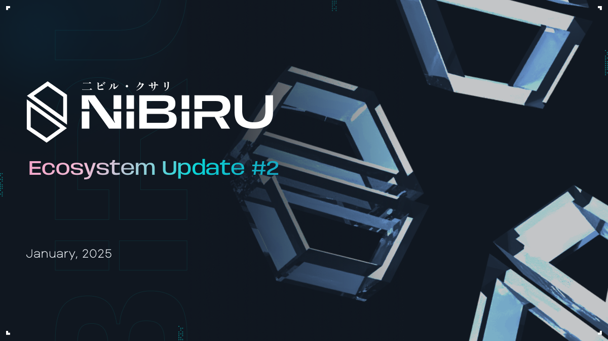

# Nibiru Ecosystem Update #2 - Jan 2025

This document provides an update on the Nibiru blockchain ecosystem as of January
2025. Since the last update in Sep 2024, the code for Nibiru V2 (Nibiru EVM) has
reached feature completion and the team has successfully completed two audits.
Astrovault also launched their [exchange app and
farms](https://nibiru.fi/ecosystem/apps/astrovault) on Nibiru.   
Key developments include the MultiVM architecture and a series of EVM upgrades featuring dynamic gas computation, streamlined precompiles, and improved security. This Ecosystem Update also introduces Nibiru Lagrange Point, an extension to Nibiru’s roadmap that takes inspiration in structure from the multi-year Ethereum roadmap.  {synopsis}

Prepared By: [The Nibiru Team](https://nibiru.fi/team)

- You can now find the [full list of Nibiru Ecosystem Updates here](https://nibiru.fi/docs/ecosystem/updates/).
- This page is available [as a PDF](/docs/ecosystem/updates/nibiru-eco-02-jan-2025.pdf).
- Authors: Unique Divine, Jonathan Chang, Erick Pinos, Gabe Whitlatch, Brandon Suzuki, Harvey Liu 

## 1 | Key Takeaways / TL;DR

1. **Nibiru V2, also known as the Nibiru EVM Upgrade**: Our last update highlighted the technical development progress of Nibiru EVM, an improvement that makes Nibiru a high-performance EVM-equivalent execution engine, starting from the milestone of bringing an MVP to testnet in June 2024. Since then, we’ve made the VM more feature rich. Now, Nibiru unifies the EVM and Wasm VM as one MultiVM environment without introducing Layer 2 or bridge dependencies. We’ve implemented dynamic gas computation and streamlined precompiles for enhanced interoperability with Wasm and IBC, bolstered security with ante handler guards and improved gas refund mechanisms. Additionally, Nibiru expands its [set of ecosystem partnerships with Oku Trade’s Uniswap V3 deployment and SubQuery](https://nibiru.fi/ecosystem), conducted real transaction-based testing and benchmarking on devnets, and upgraded user experience through seamless MetaMask connectivity and the [development of EVM Explorers](https://nibiru.fi/docs/community/explorers.html#nibiru-block-explorers).
2. **Nibiru Lagrange Point:** We’re making public the early sections of a new technical roadmap called “Nibiru Lagrange Point” designed to enhance Nibiru’s scalability, decentralization, and level of innovation more and more over time. Lagrange Point incorporates features like the FunToken Mechanism (EVM-Wasm asset fusion), Pipeline-Aware Reordered Execution (PARE), MEV Block Lanes, and Boneh–Lynn–Shacham (BLS) Signatures to reduce overhead, drive 40,000+ “real” TPS, and strive for quantum resistance.
3. **Ecosystem Focus:** Nibiru's ecosystem strategy prioritizes sophisticated DeFi products and culturally relevant trends. Particular emphasis has been on DeFi-flavored apps like yield-bearing tokens, structured products, derivatives, in addition to culturally relevant trends and attention-based apps like memecoins and NFTs. Several contributors are also delving into research on how to meaningfully incorporate AI beyond social media agent creation (e.g. Virtuals).
4. **EVM Points Program on the Horizon:** Following the Nibiru V2 upgrade, there are plans for a large initiative where incentives, reward multipliers, and other benefits can be earned for onchain contributions in liquidity or from completing other high-impact tasks (e.g., futures trading).

**Table of Contents**
- [1 | Key Takeaways / TL;DR](#1--key-takeaways--tldr)
- [2 | Product Development & Ecosystem Updates](#_2-product-development-ecosystem-updates)
  - [2.1 - Refresher: About Nibiru](#_2-1-refresher-about-nibiru)
  - [2.2 Nibiru EVM (Nibiru V2 Upgrade)](#_2-2-nibiru-evm-nibiru-v2-upgrade)
  - [2.3 Sai.fun: Bringing Perps to Nibiru](#_2-3-saifun-bringing-perps-to-nibiru)
  - [2.4 - Forms for Prospective Ecosystem Participants](#_2-4-forms-for-prospective-ecosystem-participants)
  - [2.5 - New Ecosystem Projects](#_2-5-new-ecosystem-projects)
  - [2.6 - Existing Ecosystem Highlights](#_2-6-existing-ecosystem-highlights)
- [3 | Main Priorities Going Forward](#_3-main-priorities-going-forward)
  - [3.1 - Onchain Usage Campaigns | Nibiru EVM Points Program](#_3-1-onchain-usage-campaigns--nibiru-evm-points-program)
  - [3.2 - dApps Vertical Focus, Outlook, and Thoughts](#_3-2-dapps-vertical-focus-outlook-and-thoughts)
  - [3.2.1 Structured Products & DeFi](#_3-2-1-structured-products-defi)
  - [3.2.2 Stablecoins, RWAs and Prediction Markets](#_3-2-2-stablecoins-rwas-and-prediction-markets)
  - [3.2.3 Attention Economy - Memecoins & NFT Communities](#_3-2-3-attention-economy---memecoins--nft-communities)
  - [3.2.4 Attention Economy - AI Agents & AI Infra](#_3-2-4-attention-economy---ai-agents--ai-infra)
- [4 | Early Insight into the Nibiru Lagrange Point Technical Roadmap](#_4-early-insight-into-the-nibiru-lagrange-point-technical-roadmap)
  - [FunToken Mechanism](#funtoken-mechanism)
  - [PARE (Pipeline-Aware Reordered Execution)](#pare-pipeline-aware-reordered-execution)
  - [MEV Block Lanes](#mev-block-lanes)
  - [Block SDK](#block-sdk)
  - [NibiruBFT Validator Groupings](#nibirubft-validator-groupings)
  - [Validator Set Size](#validator-set-size)
  - [Boneh–Lynn–Shacham (BLS) Signatures](#boneh-lynn-shacham-bls-signatures)
  - [Quantum Resistant Cryptography (QRC)](#quantum-resistant-cryptography-qrc)
- [5 | How You Can Help](#_5-how-you-can-help)
  - [5.1 - Connecting Us with New Multi-chain App Teams](#_5-1-connecting-us-with-new-multi-chain-app-teams)
  - [5.2 - Supporting Apps that are Already Building on Nibiru](#_5-2-supporting-apps-that-are-already-building-on-nibiru)
  - [LayerBank (Lending)](#layerbank-lending)
  - [Euclid (Cross-chain Liquidity Infra)](#euclid-cross-chain-liquidity-infra)
  - [Nebula (lending)](#nebula-lending)
  - [Astrovault (DEX)](#astrovault-dex)
  - [Syfu](#syfu)
- [6 | Team Updates](#_6-team-updates)
- [7 | Near-Term Expectations](#_7-near-term-expectations)
- [8 | Legal Disclosure](#_8-legal-disclosure)

**Legal Terms for this Document**

*This Ecosystem Update is provided by the Nibiru team. The Nibiru project is led
by the Matrix Foundation (referred to herein as "Nibiru," "we," and "us") and
supported by various unrelated entities, including Nibi, Inc., and its respective
personnel, as well as other entities and personnel that the Matrix Foundation has
engaged for services, some of whom are mentioned in or have contributed to this
update.*

*The information provided in this Update does not constitute investment advice,
financial advice, trading advice, legal advice, or any other form of advice. The
contents of this document are for general informational purposes only, are
subject to change without notice, and does not constitute any form of contract or
obligation on the part of Nibiru. This Update does not replace, amend, or
override any applicable terms of service, agreements, or legal obligations
associated with the project.*

*A complete Legal Disclosure is provided at the end of this document. By
accessing this Update, you acknowledge that you have read, understood, and agree
to be bound by the terms set forth in this section and in the full Legal
Disclosure. If you do not agree to these terms, please do not access or use any
information contained within this document.*

## 2 | Product Development & Ecosystem Updates

### 2.1 - Refresher: About Nibiru

Nibiru is a high-performance blockchain that integrates multiple virtual machines (MultiVM) into its architecture, achieving fast finality, a block time of less than 1.8 seconds finality, and robust security. Backed by $20.5 million in funding from NGC Ventures, HashKey Capital, Kraken Ventures, and Tribe Capital, Nibiru enables developers to build and deploy smart contracts across different virtual machines, such as the Ethereum Virtual Machine (EVM) and WebAssembly (Wasm), without the need for secondary chains or rollups. This monolithic architecture ensures parallel execution, strong consensus, and a streamlined user experience—suiting both sophisticated DeFi use cases and more retail-friendly applications like memecoins and NFTs.

[**Nibiru Lagrange Point**](https://docs.google.com/document/d/1j5w4JGKq9iL5-BGStvotRGYwjuD0HOZSc6IWf-UakP4/edit?tab=t.0#heading=h.u8u9puvm4s09): Nibiru has designed a series of technical upgrades and innovations to improve the chain’s scalability, decentralization, and  that combines FunToken (unifying EVM–Wasm tokens), PARE for higher throughput, miner-extractable value (MEV) Lanes for orderly transaction flow, and optimized validator dynamics (including Boneh–Lynn–Shacham (BLS) Signatures) to reduce overhead and speed up block times. This design addresses bottlenecks across every layer of the stack, paving the way for advanced DeFi, real-world assets (RWAs), AI-driven bots, and high-traffic cultural projects—all running seamlessly on a single platform.

Beyond technical innovations, Nibiru pursues a broad ecosystem strategy—merging deeply integrated DeFi components (like structured products, stablecoins, and on-chain derivatives) with the cultural resonance of NFTs, AI personas, and memecoins. This blend of functionality and creativity positions Nibiru to support a wide spectrum of use cases.

**Nibiru EVM Points Program**: We’re adding an initiative to the mix that will reward chain-wide engagement by tracking both social activity and onchain evidence of meaningful usage, such as total value locked (TVL). Points will be allocated daily, with multipliers for activities like perpetual futures trading or using other applications. Over time, these points can be redeemed for concrete rewards, creating a durable incentive model and cross-pollination of  liquidity throughout Nibiru’s evolving on-chain ecosystem.

[**Website**](https://nibiru.fi/) | [**About Nibiru**](https://nibiru.fi/papers/nibiru-intro.pdf) | [**Docs / Whitepaper**](https://nibiru.fi/docs) | [**X/Twitter**](https://x.com/NibiruChain)

### 2.2 Nibiru EVM (Nibiru V2 Upgrade)

Nibiru’s MultiVM approach marks a turning point in blockchain development, combining sub-2-second finality, robust reliability, and frictionless cross-VM interoperability into a single, monolithic chain. Despite never incurring a mainnet outage, Nibiru continues to push boundaries with a major upgrade—originally hinted at in a [June 2024 blog post](https://nibiru.fi/blog/posts/60-nibiru-evm)—nearing completion. With security reviews from Code4rena’s Zenith already underway and a second [competitive audit kicked off on November 11](https://x.com/NibiruChain/status/1856064806463385807), the platform is poised for a seamless transition to production-ready status.

By embedding multiple virtual machines directly into the base layer, Nibiru eliminates reliance on external bridges or layer-2 solutions, empowering developers to freely choose among different environments (e.g., EVM, Wasm) for their applications. This design not only ensures unified liquidity and trustless asset management through FunToken but also supports parallel execution for concurrent transaction processing, further enhancing throughput. As a result, end users enjoy a smooth experience with multi-VM dApps that retain both robust security and sub-2-second finality, effectively bridging the best attributes of multiple blockchain ecosystems under one reliable, high-performance roof.

Since September 2024, the team has been [making strides](https://github.com/NibiruChain/nibiru) in enhancing the EVM integration. The focus has been on boosting performance, tightening security, and expanding the ecosystem to provide a more seamless and robust experience for developers and users alike.

**2.2.1 - EVM and Performance Upgrades**

One of the improvements has been the dynamic gas computation for the FunToken precompile, which has made gas usage more efficient and adaptable. This change ensures that transactions run smoother and more cost-effectively, benefiting both developers and end-users. Additionally, the team streamlined precompiles for modules like x/oracle and x/bank, simplifying interactions within the EVM and enhancing interoperability with CosmWasm contracts.

Event handling saw upgrades as well. By enabling ABCI events to be emitted as EVM events, tracking and debugging transactions became much more straightforward. The transition to using typed events for transaction logs has also improved the clarity and efficiency of event tracking, making it easier to monitor and analyze smart contract activities.

**2.2.2 - Security**

Security has been a top priority. The introduction of an authz guard has been crucial in preventing unauthorized Ethereum transactions, adding an extra layer of protection around default module functionalities. Additionally, improvements to gas refund safety mechanisms have addressed potential vulnerabilities, ensuring that gas handling processes are both secure and reliable.

The team also tackled race conditions within EVM precompiles by implementing comprehensive unit tests and optimizing the reversion processes. These efforts have prevented issues like infinite token minting and maintained the consistency of the state database during transaction executions.

**2.2.3 - Ecosystem Integrations and Expansions**

Nibiru has broadened its ecosystem integrations by supporting major oracle solutions such as ChainLink. This integration enhances data reliability and provides developers with more flexible options for incorporating external data into their smart contracts. Furthermore, the team has begun integrating with powerful data querying tools like The Graph and SubQuery, enabling more sophisticated and data-driven decentralized applications.

Asset management has also been enhanced with the addition of liquid staked NIBI (stNIBI) to the asset registry, supporting more versatile staking mechanisms and expanding the platform's asset portfolio.

**2.2.4 - Testing and Quality Assurance**

To ensure the reliability of their EVM integration, the Nibiru transitioned from using mocked calls to conducting real transaction-based tests. This shift has provided a more accurate picture of how the system performs under actual conditions. Scheduled end-to-end tests have been established for EVM endpoints on devnet-3, allowing continuous monitoring and early detection of any issues. These rigorous testing practices help maintain a stable and trustworthy platform.

**2.2.5 - User Experience Improvements**

User experience has seen notable enhancements as well. The team resolved several user-facing issues, such as improving staking processes with popular wallets like Keplr and ensuring seamless connectivity with MetaMask. These fixes make it easier for users to interact with the blockchain, whether they're staking tokens or managing their wallets, thereby boosting overall satisfaction and accessibility. Additionally, the development of an [EVM Explorer](https://evm-explorer.nibiru.fi/) has improved the visibility and usability of EVM-related data.

### 2.3 Sai.fun: Bringing Perps to Nibiru

Sai.fun has made significant strides toward redefining the perpetual futures market by leveraging oracle-based pricing instead of a traditional funding rate model. By using both native and custom oracle for margin checks and PnL calculations, the protocol avoids mark vs. index price discrepancies and reduces the risk of forced liquidations. Instead of periodic funding payments between longs and shorts, Sai implements a continuous borrowing fee that adjusts based on net open interest imbalances—helping protect liquidity providers from excessive risk while still providing traders with transparent, predictable costs.

On the development front, Sai’s team has been refining its Wasm-based contracts and user-facing interface in anticipation of a Q1 2025 mainnet launch on the Nibiru blockchain. The protocol’s partnership with Coded Estate—a real estate platform bringing properties on-chain—highlights Sai’s aim to expand perpetual trading beyond just crypto assets. In addition, upcoming marketing initiatives, potential token launches, and passive liquidity offerings all underscore Sai’s broader vision of becoming a cornerstone for DeFi traders and liquidity providers alike.

### 2.4 - Forms for Prospective Ecosystem Participants

1. If you’d like to propose creative or culture-oriented initiatives for the Nibiru ecosystem, please fill out our [**Request for Community (RFC) form**](https://docs.google.com/forms/d/e/1FAIpQLSdMlGWm39ytW8XJWyJ8_iO3DiAjh_OJUuqnfxgPbbYP5F7rBA/viewform?usp=send_form).
2. For projects or teams interested in partnering with Nibiru or exploring ecosystem collaboration, please complete our [**Ecosystem and Partner Contact Form**](https://docs.google.com/forms/d/e/1FAIpQLSfstYs9Gkvcw3yW7ivYHP1rPV3ifCCCHsvwOWSN3tNBhjpwkA/viewform).
3. You can also view or submit [**RFPs for Ecosystem Apps**](https://www.notion.so/9365f31b339f4ce69ac25d88dd519690?pvs=21), where we regularly update app proposals and participation opportunities.

### 2.5 - New Ecosystem Projects

| **Project** | **Description** | **Status** |
| --- | --- | --- |
| [Abracadabra](https://abracadabra.money/) | Lending/Leveraged Yield Farming Product Suite | Active DAO proposal detailed in [Abracadabra Improvement Proposal (AIP-62)](https://forum.abracadabra.money/t/rfc-deploy-mimswap-and-abracadabra-on-nibiru-chain/4819/3). |
| [Aviatrix](https://www.aviatrix.xyz/) | Aviation-Themed Crash Game | NIBI supported for wagering, 71K EUR volume in NIBI |
| [Balanced Network](https://balanced.network/) | Cross-Chain Swaps and RWA Backed Stablecoin Platform | Live on Testnet. Mainnet Ready. |
| [BRKT](https://www.brkt.gg/) | Binary & Bracket-Style Prediction Market | Partnership Announced. In Development |
| [Every Finance](https://www.every.finance/) | Managed funds, volatility targeting products and index funds | In Development |
| [Gemach](https://gemach.io/) (Product Suite) | GLend: Lending Platform. GBot: Telegram wallet/sniper bot, trading Bot and Autonomous Trading AI Agents. D.A.T.A: Token aggregator | Partnership Announced. In Development |
| [Ichi](https://ichi.org/) | Automated Liquidity Strategies for DeFi Yield | Partnership Signed. In Development |
| [Lunaris](https://www.lunaris.finance/) | Looping and Lending Platform | In Development |
| Level.money (lvlUSD) | Restaked yield-bearing USD stablecoin. Team backed by Dragonfly and Polychain Capital | Working with LayerZero to bring onchain restaking yield-bearing USD to Nibiru. In Development. |
| [MIMSwap](https://app.abracadabra.money/#/pools) | Stableswap AMM in the Abracadabra Ecosystem | RFC submitted. Abracadabra Improvement Proposal (AIP) in Progress |
| [Oku Trade](https://oku.trade/) | DEX Aggregator / Uniswap V3 Deployer | Live on Testnet with native Uniswap V3 contracts. Mainnet Ready. |
| [OpenEden](https://openeden.com/tbill) | Tokenized T-Bills | Working with LayerZero to bring onchain treasuries as yield-bearing tokens to Nibiru. In Development. |
| [Syrup](https://syrup.fi/) | Tokenized Private Credit | Working with LayerZero to bring onchain private credit as yield-bearing tokens to Nibiru. In Development. |
| [Virtual Labs (VDEX)](https://virtuallabs.network/) | Perps Platform | In Development |

### 2.6 - Existing Ecosystem Highlights

| **Project** | **Description** | **Status** |
| --- | --- | --- |
| [Astrovault](https://astrovault.io/) | Cross-Chain Value Capture Spot DEX | Launched on Mainnet, $200k in liquidity pools seeded |
| [Bima](https://bima.money/) | Liquid Staking Bitcoin | Working on Mainnet Beta. Will start deployment on Nibiru by Jan end. |
| [DTrinity](https://dtrinity.org/) | Subsidized Borrowing and Stablecoin | Plan to deploy stablecoin mechanism vault after EVM Mainnet |
| [Euclid Protocol](https://www.euclidprotocol.io/) | Unified Liquidity Layer using Virtual Routing and Forwarding (VRF) | Live on Testnet |
| [Eris (stNIBI)](https://www.erisprotocol.com/) | Liquid Staking Platform and Slow Burn Arbitrage Protocol. | Launched on Mainnet, $1m in TVL split across 15 validators |
| [Frax Finance](https://frax.finance/) | Fractional Stablecoin Ecosystem | Co-incentivizing pools to launch on Nibiru. Further integrations on the roadmap. |
| [Galaxy Exchange](https://galaxy.exchange/) / [Swing](https://swing.xyz/) | Cross-Chain Bridging & Swap Protocol | Live on Mainnet. Bridging NIBI earns points as part of Swing Points Program. |
| [HiYield](https://www.hiyield.xyz/) | Tokenized Treasury Bills | Live on Testnet |
| [Kryptonite](https://app.kryptonite.finance/nibiru) | Liquid Staking Platform on CosmWasm CW20 Standard. | Liquidity Migrated to Eris |
| [LayerBank](https://layerbank.finance/) | EVM-based Cross-Chain Lending Platform | Plan to deploy on EVM Mainnet |
| [LayerZero](https://layerzero.network/) | Omnichain Interoperability Protocol | Live on Testnet |
| [Nebula](https://nebulalending.io/) | Lending Platform | Live on Testnet |
| [Nexus Finance](https://nexusfi.xyz/) | Lending | Mainnet is live on the backend on Wasm. Working on Frontend will be done by this week. |
| [Nexus Network](https://www.nexusnetwork.live/) | Restaked NIBI | In Development. |
| [OmniPump / OmniSwap](https://www.omnipump.io/) | DEX and Launchpad for Fair Launches and Memecoins | Live on Testnet |
| [OpenMark](https://x.com/OpenMarkNFT) | NFT Marketplace | Live on Testnet |
| [PRDT](https://prdt.finance/) | Fast Paced Prediction Market | Live on Testnet. Active Co-Marketing of Upcoming Incentives |
| [Routescan Explorer](https://routescan.io/) | EVM Explorer built by the team powering the Explorers for Avalanche and Optimism | EVM Testnet Explorer Live |
| [Sai](https://sai.fun/) | Competitive perpetual futures DEX enabling the creation of markets on any asset | Finalizing integration on DevNet. Audit completed. Building Indexer specific to perps for liquidations & Front-End |
| [SilverSwap](https://silverswap.io/) | Uniswap V4-based Spot DEX | Live on Testnet |
| [Swify](https://x.com/SwifyFoundation) | Concentrated Liquidity Spot DEX | Live on Testnet |
| [TanX](https://tanx.fi/) | Non-Custodial Orderbook Spot DEX | Live on Testnet |
| Via Labs | Bridged USDC | Live on Testnet |

## 3 | Main Priorities Going Forward

### 3.1 - Onchain Usage Campaigns | Nibiru EVM Points Program

Nibiru’s upcoming Nibiru EVM Points Program will reward active user participation in the chain’s EVM ecosystem by assigning points based on both social and onchain contributions, with daily totals tracked via platforms Galxe and Merkle.

[Galxe](https://www.galxe.com/quest) is well suited to avoiding bot contributions, identifying and rewarding loyal participants, and providing a flexible tool that can help Nibiru acquire and retain more onchain and offchain users. [Merkle (merkle.angle.money)](https://merkl.angle.money/) offers many of the same benefits but excels even more at detailed tracking for onchain usage metrics. For example, the Merkl integration with Nibiru will facilitate average TVL tracking across time at a measurement rate of 15 minutes per snapshot to reward points for contributed liquidity.

In the coming weeks, several teams will come out with more information on how to get higher multipliers for one-time tasks, custom quests for specific applications, trading on Sai.fun’s perpetual markets, and depositing to yield vaults. Several app teams have expressed interest in introducing boosts or contributing token incentives with the goal of fueling long-term liquidity rather than short-lived farming.

### 3.2 - dApps Vertical Focus, Outlook, and Thoughts

Nibiru’s ecosystem strategy centers on two key elements that drive layer-1 success:

1. **Proven Product-Market Fit**: generating transactions, revenue, and liquidity.
2. **Capturing Attention**: culture, memes, NFTs, AI agents.

With more risk appetite returning to crypto, users and developers alike are chasing higher yields and looking for “next-level” DeFi innovation. At the same time, culture-oriented projects (memecoins, NFT communities, AI-driven “reply guy” agents) capture significant mindshare and help funnel new participants onto the chain.

Below is an overview of Nibiru’s key ecosystem focus areas. If you encounter projects in these categories seeking funding, please send their fundraising details, and our team will take it from there.

### 3.2.1 Structured Products & DeFi

1. **Vaults & Yield Aggregators**: DeFi users want simpler yet powerful yield strategies. Tools that automate and bundle complex positions (e.g., liquid staking, leveraged farming) are in high demand.
2. **Rehypothecation & Advanced Leverage**: LP tokens or stablecoins can be re-used as collateral to allow more capital efficiency. This "stacking" of positions requires well-designed risk parameters.
3. **Copy Trading**: Less experienced users can deposit into curated vaults/pools created by skilled traders or AI-driven bots to replicate their performance.
4. **Modular/Leveraged Lending**: Protocols such as Aave, Kamino, Morpho, Fluid, and Moonwell drive revenue by introducing sophisticated liquidity pooling methods, refined yield optimization, and innovative leveraged approaches. They implement leverage loops, for example in Fluid’s combination of lending and AMM functionality, and apply dynamic interest models such as Morpho’s peer-to-peer layer on top of Aave or Compound. In addition, they support isolated or cross-margin lending, adopt liquid staking or restaking tokens to boost composability, and employ modular architectures like Uni v4 Hooks or Morpho/Euler extensions that allow for quickly creating specialized yield or asset pools.
5. **Perpetuals and On-Chain Derivatives**: Platforms like Hyperliquid (CEX-like experience with user co-ownership) showcase how on-chain derivatives can rival centralized exchanges with low fees and high speeds.

### 3.2.2 Stablecoins, RWAs and Prediction Markets

1. **High-Yield Stablecoins**: Circle (USDC) and Tether (USDT) historically accrued the most stablecoin revenue. New models like Usual give back yield to tokenholders, aligning with crypto’s low take-rate ethos. These tokens effectively redistribute protocol profits to users, rather than capturing it centrally.
2. **Real World Assets (RWAs)**: Beyond tokenized T-bills and simpler credit products, the early focal points of on-chain real-world assets (RWAs), a growing wave of more complex offerings—such as on-chain venture funds, private equity, and corporate bonds—has begun to broaden DeFi’s scope. At the same time, tokenized investment models are making what were once exclusive options like venture or private equity accessible to smaller retail participants, although compliance and KYC measures remain considerations. As these expanded RWA categories continue to evolve, user demand for real-world–backed yields will increasingly extend beyond the purely crypto-native sector and better merge Web2 with Web3.
3. **Prediction Markets**: With fewer major political events on the horizon, prediction markets have begun shifting their emphasis toward sports. In many jurisdictions, traditional sportsbooks, which operate in highly regulated or centralized environments, frequently misprice betting lines or impose steep fees / trading restrictions, creating space for decentralized markets to offer more competitive odds and attract a broader global audience. This dynamic presents an opportunity for market makers on-chain to supply liquidity and exploit mispriced spreads, thereby carving out a new niche for DeFi participants seeking near real-time volume and diversification beyond strictly financial or political markets.

### 3.2.3 Attention Economy - Memecoins & NFT Communities

Memecoins often serve as accessible on-ramps for newcomers, with hype fueled by Telegram sniping bots and easy credit card purchase flows through platforms like Moonshot. While memecoin mania keeps overall engagement high, it also creates a pathway for retail users to transition into more substantive dApps such as DEXs and lending once they are already on the chain. Meanwhile, NFTs form a vibrant ecosystem centered on marketplaces like OpenMark, memecoin launchpads like Omni, and the DN-404 bridging mechanism that links NFT-based art, collectible shards, and the potential for gacha-style reward incentives. By mixing NFT collectibles with memecoin fervor, communities can broaden participation and tap into fresh marketing angles. Increasingly, memecoin and NFT crowds overlap: many prominent NFT collections now issue their own tokens, generating cyclical hype and prompting Nibiru to offer small success-based grants for these teams if they demonstrate meaningful traction.

### 3.2.4 Attention Economy - AI Agents & AI Infra

Within this broader culture and attention landscape, AI agents play a pivotal role in bolstering on-chain growth. Nibibara, an AI-driven capybara persona, demonstrates how “reply guy” KOL bots can serve as brand ambassadors, producing daily promotional campaigns and social conversation around the chain.

In DeFi specifically, AI-based strategy managers can automate structured vault creation, manage liquidity, and speed up overall on-chain adoption by lowering the technical barrier for newcomers. As multiple AI agents coordinate across marketing, development, and trading tasks, they can even spawn entire decentralized applications autonomously, thereby accelerating the chain’s ecosystem evolution.

Within AiFi / DeFAI, agents can be used as a platform to execute more complicated trades in a more convenient manner. Leading platforms in the market appear to be pre-product and uncertain how they’ll reach mainstream adoption as of yet.

## 4 | Early Insight into the Nibiru Lagrange Point Technical Roadmap

**Nibiru Lagrange Point** is what we’re using to refer to a series of ambitious technical improvements to the Nibiru blockchain. Think of Nibiru Lagrange Point as a forward-peering, living whitepaper. Note that all of the content below is highly preliminary, reflecting early-stage research. Much of it may change before any final release, and only selected features will eventually be part of an official or larger announcement.

A Lagrange point is a relative position in an orbit where the combined gravitational pull of two large bodies, such as the Earth and the Sun, together with the orbital motion of a smaller object, balances out in such a way that the smaller object can remain in place with minimal fuel and course corrections. These “sweet spots” in orbital mechanics are uniquely valuable for long-duration scientific and observational missions, because they allow satellites or space telescopes to “park” in relatively stable orbits for extended periods.

In Babylonian mythology, Nibiru is a crossing place linked to the god Marduk, marking pivotal transitions in the heavens. While not historically or scientifically related, it loosely parallels the modern idea of a Lagrange point—a gravitational “sweet spot” where forces balance so that an object can remain in a stable position. Both concepts highlight special, pivotal locations.

The name, “Nibiru Lagrange Point”, for a forward-looking roadmap is meant to serve as a reminder to balance prioritization between problem solving that’s more immediate and pragmatic and problem solving that’s more long-term and exciting.

**Introducing a suite of breakthrough innovations to solve the toughest challenges in blockchain technology.**

With Lagrange Point, we’re unifying EVM and Wasm tokens without third-party bridges, improving transaction ordering for higher throughput, containing MEV in dedicated lanes, and pushing the boundaries of consensus and cryptographic efficiency.

These interlocking features collectively elevate throughput, enhance security, and simplify user and developer experiences—paving the way for truly high-performance applications and a resilient Web3 ecosystem at scale.

### FunToken Mechanism

**Seamless EVM–Wasm token unification without trust-based bridges.**

Nibiru’s [FunToken mechanism](https://nibiru.fi/docs/evm/funtoken.html) replaces clunky, centralized bridge mechanics by merging ERC-20 (EVM) and Bank Coin (Wasm) tokens for seamless cross-VM. This eliminates the need for wrapped tokens, ensuring consistent supply tracking across VMs while simplifying developer workflows. Thanks to a specialized precompile contract interface, developers can focus on building dApps rather than reinventing cross-chain logic, resulting in faster transfers, simpler UX, and unified liquidity.

### PARE (Pipeline-Aware Reordered Execution)

**A hybrid execution model that improves throughput in high-contention environments.**

PARE merges optimistic and deterministic approaches, avoiding expensive rollbacks (as in optimistic systems) and complex multi-version structures (as in deterministic models). Instead, it dynamically reorders transactions based on real-time conflict likelihood, segmenting workloads into “reordering blocks.” This proactive method boosts throughput, reduces latency, and limits bottlenecks—even in high-contention scenarios. The result is simpler architecture with fewer rollbacks, making PARE ideally suited for both permissioned and permissionless networks looking to scale beyond the average 2.75 parallelizable Ethereum transactions per block.

### MEV Block Lanes

**A protocol-level mechanism to contain MEV in segregated “top-of-block” spaces.**

MEV Lanes in Nibiru’s Block SDK isolate MEV-related transactions to a single lane at the start of each block. This prevents searchers from inflating gas prices across the entire network and ensures critical tasks—such as oracle updates or liquidations—can proceed unimpeded. While acknowledging that MEV can’t be eliminated, this approach offers a simpler alternative to private auction systems like Flashbots, creating clear boundaries for MEV extraction and reducing its harmful externalities.

### Block SDK

**A lane-based alternative to single-lane gas auctions.**

By dividing transactions into dedicated “lanes” (e.g., “fast” vs. “default”), Block SDK and Mempool Lanes ensure that time-sensitive tasks don’t contend with routine or speculative transactions. Each lane has separate resource allocations and gas markets, mitigating bidding wars and unpredictable fee spikes. This architecture allows for more predictable ordering, improved user experience, and better handling of congestion while also highlighting new considerations around cross-lane MEV risks.

### NibiruBFT Validator Groupings

**Mitigating n^2 messaging overhead to scale validator sets.**

Nibiru’s research team introduces validator grouping in CometBFT (Tendermint consensus successor) to combat the notorious n^2 communication bottleneck. Validators are split into smaller groups that complete consensus within their subgroup before aggregating for a second-layer consensus. This approach significantly reduces messaging overhead from n^2 to (n/x)^2, enabling larger validator sets (e.g., from 100 to 300+) and thereby strengthening decentralization—without sacrificing Byzantine Fault Tolerance or instant finality.

### Validator Set Size

**Balancing scalability with genuine decentralization.**

While larger validator sets appear more decentralized, in-house analysis reveals that a small fraction of validators can still control enough stake to halt networks. CometBFT’s gossip-based protocol also experiences quadratic overhead with more validators, slowing block times. By temporarily limiting slots for minimal-stake validators, Nibiru optimizes speed and usability without reducing security or changing practical governance distributions. In parallel, we continue to explore more efficient consensus strategies that may someday support larger validator sets without significant performance penalties.

### Boneh–Lynn–Shacham (BLS) Signatures

**A step toward higher throughput and lower block verification overhead.**

Nibiru is investigating BLS signatures to aggregate multiple validator signatures into a single proof, replacing the per-validator overhead of ECDSA. Aggregation substantially reduces block space usage and speeds up verification, clearing the path for 40K+ TPS and even faster block times. Though transitioning to BLS requires careful engineering—especially around gossip redundancy and bitfield management—it aligns with Nibiru’s commitment to pairing robust security with elite scalability.

### Quantum Resistant Cryptography (QRC)

**Ensuring post-quantum security without compromising performance from ECC to lattice-based ML-DSA/Falcon and extended Keccak-256 or XMSS.**

By migrating from Elliptic Curve Cryptography (ECC) to lattice-based algorithms like ML-DSA (Crystals Dilithium) and Falcon, Nibiru would safeguard against quantum attacks enabled by Shor’s and Grover’s algorithms. These post-quantum solutions maintain robust security while preserving performance, ensuring that private keys stay secure and transactions remain tamper-resistant. Nibiru is also exploring hash function enhancements—extending Keccak-256’s bit length or adopting XMSS—to future-proof data integrity in a quantum-capable world.

## 5 | How You Can Help

### 5.1 - Connecting Us with New Multi-chain App Teams

We’re always eager to speak with teams that are exploring multi-chain expansion, particularly those whose solutions align with Nibiru’s core verticals like advanced DeFi, real-world assets, AI tools, or culture-driven experiences. If you come across promising protocols or founders seeking to deploy on additional chains, please send them our way. Our onboarding process includes tailored technical support, access to strategic investments / liquidity, and go-to-market collaboration. We also coordinate cross-promotion efforts and co-branding opportunities with other ecosystem participants.

### 5.2 - Supporting Apps that are Already Building on Nibiru

Several projects in the Nibiru ecosystem are preparing major updates, and we’re here to facilitate introductions to potential investors, exchanges, talent, market makers, or strategic partners. Many of these teams have stood out for their innovations in memecoin launchpads, advanced lending, AI-driven vaults, or tokenized real-world assets, and we encourage interested backers to reach out for details. Additionally, our upcoming liquidity program will aggregate capital from investors and direct it toward dApps that demonstrate strong user growth and long-term viability, providing them with both a financial boost and ongoing advisory support. In short, we want to ensure that every project building on Nibiru—whether a small emerging team or a more established brand—has the resources, community connections, and technical backing needed to thrive.

### LayerBank (Lending)

LayerBank is a leading decentralized lending platform designed to serve as a liquidity hub across all EVM-compatible Layer 2 and rollup chains. By offering access to a wide range of assets and earning opportunities through its multi-chain lending markets, LayerBank aims to unify the fragmented liquidity of various Layer 2s into a single, extensive liquidity pool with the introduction of cross-chain lending functionality in Q4 2024. As the largest lending platform on Layer 2 networks, LayerBank supports over eight chains, including Scroll, zkLink, Bitlayer, Linea, BOB, Manta, Mode, and Bsquared, and has been operating safely for over a year, maintaining its position as a decentralized, multi-chain-based leader in the lending space.

LayerBank boasts impressive key metrics, including a TVL of over $400M, loan volume exceeding $50M, and a user base of more than 693,800. The platform is supported by a strong community with 50K+ Discord members and 150K+ Twitter followers, and has formed over 30 strategic partnerships with top chains and protocols such as EtherFi, Renzo, and StakeStone. For more information, visit their [Website](https://layerbank.finance/), follow them on [Twitter](https://twitter.com/LayerBankFi),, and explore their [Dune Analytics](https://dune.com/anti_dump25/layerbank).

### Euclid (Cross-chain Liquidity Infra)

[Euclid Protocol](https://euclidprotocol.io/) is transforming cross-chain DeFi with its unified liquidity and execution layer. Launching its first Stable Liquidity Mining Program, Euclid integrates over 50 networks across EVM, Cosmos, and Solana, allowing users to deposit any stable asset. The platform’s Virtual Settlement Layer (VSL) and Euclid Messaging Protocol (EMP) reduce cross-chain swap fees by 80%, enable instant transactions with minimal slippage, and provide multiple routing options through its smart router, which combines Depth First Search (DFS) and Liquidity First Search (LFS) algorithms. These advancements allow Euclid to outperform traditional aggregators, cross-chain bridges, and multi-chain AMMs.

Euclid has gained significant traction with its testnet live on 8+ EVM and CosmWasm L1s and plans to expand to 50+ blockchains. The platform has over 15K registrants for its Incentivized Testnet and secured more than $20M in committed liquidity. Backed by investors like Awesome People Ventures and Nibiru Ventures, Euclid is raising funds with $900K already committed from seven investors. The Liquidity Mining Program offers 20M $EUCL tokens over an eight-month lockup, with a commitment deadline of February 25. Learn more through [Twitter (X)](https://x.com/EuclidProtocol) or schedule a meeting via [Calendly](https://www.calendly.com/euclidswap).

### Nebula (lending)

Nebula Lending is a cross-chain lending platform that leverages DEX LP collateralization, yield tranching, and user-centric risk management to deliver a superior decentralized finance experience. Founded by industry experts James from Fengbushi Capital, serial DeFi entrepreneur Casey, Peter from LBANK, and Rus from HTX, Nebula Lending aims to optimize capital efficiency and enhance revenue generation across multiple blockchain networks. By integrating these innovative features, Nebula Lending provides users with flexible lending options and robust risk management tools, setting a new standard in the DeFi ecosystem.

The platform has demonstrated strong traction, attracting over 2,000 users to its testnet within the first 24 hours. Prospective investors and users can explore more about Nebula Lending through their [website](https://nebulalending.io/), review the [Whitepaper](https://docs.google.com/document/d/1qtdrdU8rowA8qRXoi3lW78eZnghB58zRyGMhxMgtQxI/edit), and engage with the [Nebula Protocol](https://app.nebulalending.io/). Stay connected and receive updates via their [Twitter](https://twitter.com/NebulaLending_) and [Telegram](https://t.me/NebulaLending_Official), or schedule a meeting through [Calendly](https://calendly.com/itisrussellshen/russell-shen) for more information.

### Astrovault (DEX)

[Astrovault ($AXV)](https://www.coingecko.com/en/coins/astrovault) is an innovative decentralized exchange (DEX) designed to maximize capital efficiency and revenue generation through concentrated liquidity. By leveraging a unique liquidity routing system that combines Depth First Search (DFS) and Liquidity First Search (LFS) algorithms, Astrovault reduces trading fees by 80% and enables instant transactions with minimal slippage across 50+ blockchains. Unlike traditional DEXs, Astrovault’s tokenomics incorporate a buyback and burn mechanism for the $AXV token, ensuring a deflationary supply while providing liquidity providers with $AXV incentives through a sustainable inflationary model. With a TVL of approximately $4M, Astrovault stands out as the primary DEX on Archway, offering real yield through diversified revenue streams from trading fees, staking rewards, and protocol-owned liquidity (POL).

The platform has traction with $4M in TVL and plans to expand its liquidity pools, enhance security safeguards, and integrate real-time oracle data for optimal asset management. Astrovault aims to become a sustainable and leading DEX in the Wasm ecosystem by providing competitive yields for liquidity providers and fostering a strong connection with its community through governance and strategic investments in supported assets.

### Syfu

SyFu is an innovative payments and rewards platform based in Japan, seamlessly blending DePIN and GameFi elements to enhance everyday transactions. By integrating with over 5,000 financial institutions through partners like MoneyForward and Saltedge, SyFu allows users to earn crypto rewards and unique NFTs, such as the popular Manekineko collection, simply by making purchases at a wide range of retailers. The platform gamifies the spending experience, enabling users to nurture and evolve their NFTs based on their economic activity, creating an engaging and dynamic way to interact with their financial habits. Additionally, SyFu offers a credit card that not only provides traditional benefits but also serves as collateral for higher credit lines, further incentivizing user participation and loyalty.

Led by a seasoned team with a proven track record, including founders who successfully sold their previous venture Synchrolife, SyFu is poised to revolutionize the Japanese fintech and web3 landscape. The platform leverages strong partnerships with major brands and strategic investors like KDDI and Mitsubishi, ensuring robust market penetration and widespread adoption. SyFu’s dual-token system and NFT marketplace position it uniquely within the ecosystem, offering both financial and gamified rewards that appeal to a broad user base. With a vibrant community and a solid foundation in data-driven loyalty programs, SyFu is set to create significant value for users and partners alike, driving the next wave of innovation in consumer finance and digital rewards.

## 6 | Team Updates

Since the last update in September 2024, Nibi, Inc. made one additional hire:

[**Dave Kaplan**](https://nibiru.fi/team/dave-kaplan) | *General Counsel* at Nibi, Inc.

Dave joined Nibi, Inc. as General Counsel in November 2024 after serving as Senior Counsel at Horizons Law & Consulting, where he worked alongside the ex-Solana General Counsel. He previously held General Counsel roles at the Web3 accelerator Advanced Blockchain and at layer-1 AXEL, having earlier spent nine years in Big Law at Kenyon & Kenyon LLP handling complex litigation and IP matters. With extensive experience in token fundraising, offshore structuring, AML/KYC compliance, and product launch strategies, Kaplan now directs legal, regulatory, and strategic affairs for Nibiru. A registered U.S. patent attorney licensed in Nevada, New York, and New Jersey, he also regularly speaks at blockchain events, covering topics like tokenomics, decentralized governance, and data privacy.

## 7 | Near-Term Expectations

1. Complete the security audit of Sai, the perpetual futures DEX
2. Fine-tune FunToken components for mainnet launch
3. Deploy key dApps on mainnet and roll out supporting points campaigns
4. Continue engaging with priority verticals in the ecosystem
5. Invite new communities to collaborate, expanding use cases and integrations
6. Rely on your support and engagement as idea partners in growing the Nibiru ecosystem

## 8 | Legal Disclosure

**No Offer or Solicitation**

This Update does not constitute an offer to sell or a solicitation of an offer to
buy any securities, tokens, or any other form of investment in any jurisdiction.
The distribution or dissemination of this document may be restricted by law in
certain jurisdictions, and it is the responsibility of any person in possession
of this Update to comply with any such laws and regulations.

**No Rights to Token-holders**

Purchase of NIBI tokens or any other digital assets mentioned herein (each and
collectively the "*Tokens*") does not represent or confer any ownership right or
stake, share, security, or equivalent rights, or any right to receive future
revenue shares, dividends, intellectual property rights or any other form of
participation in or relating to Nibiru, any of its affiliates, Nibiru and its
related products, and/or services or any part thereof. The reader acknowledges
and accepts that at no time and under no circumstances shall they be entitled, as
a holder of any Tokens, to vote, receive dividends or be deemed the holder of
equity or capital stock of any entity for any purpose, nor will anything
contained herein be construed to confer on the reader such rights.

**Forward-Looking Statements**

Certain statements contained in this Update may be forward-looking, including but
not limited to plans, goals, and expectations regarding the future business,
operations, and performance of the project. These statements are based on current
beliefs, assumptions, and projections and are subject to risks, uncertainties,
and changes beyond the control of the project. Actual results may differ
materially from those expressed or implied in any forward-looking statements.

**Regulatory Status**

The regulatory status of the Tokens and blockchain technology, digital assets,
and cryptocurrencies generally is uncertain and evolving. This Update and the
project described within may be impacted by legal, regulatory, and compliance
requirements. It is the responsibility of potential participants to determine
whether they can legally acquire, hold, or participate in Nibiru’s activities
under the laws of their jurisdiction.

**No Liability**

Nibiru, its affiliates, contractors, and their respective officers, employees,
and agents shall not be held liable for any loss, damage, or liability arising
out of or in connection with the use of this Update, the project, or any
associated products or services. Participation in the project and any related
activities is done at your own risk.

**No Guarantees**

There is no guarantee or assurance that the project, its platform, or the Tokens
described in this Update will achieve any of its goals, intended outcomes, or
objectives. The value and functionality of any Tokens are not guaranteed, and
they may be subject to significant volatility, market forces, and other risks.
Token holders should not expect to have the ability to influence the management
or decision-making of Nibiru.

**Risk Factors**

Participation in the project and the use of tokens involve significant risks,
including but not limited to financial, regulatory, technological, and market
risks. It is strongly recommended that participants fully understand these risks
before engaging with the project or acquiring any tokens.

**Independent Advice**

Readers of this Update should seek independent professional advice regarding
their individual circumstances before engaging in any activity related to the
project.

**Amendments and Updates**

Nibiru reserves the right to amend, modify, or update this Update or any of the
information herein at any time without prior notice. It is the responsibility of
readers to stay informed of any changes.
