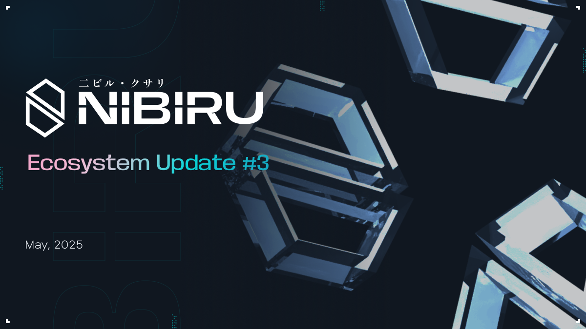
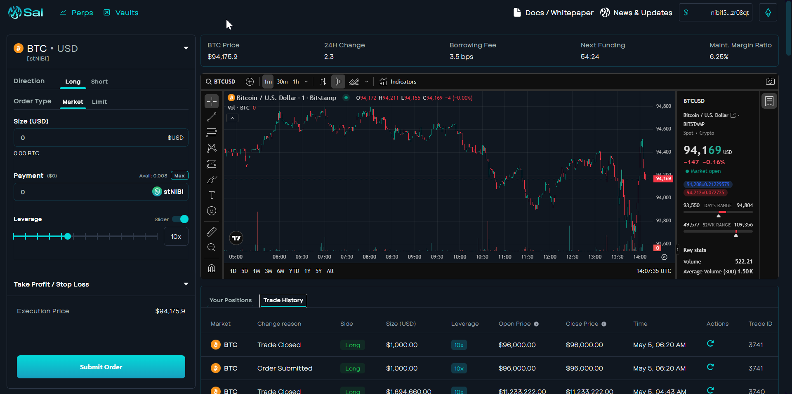
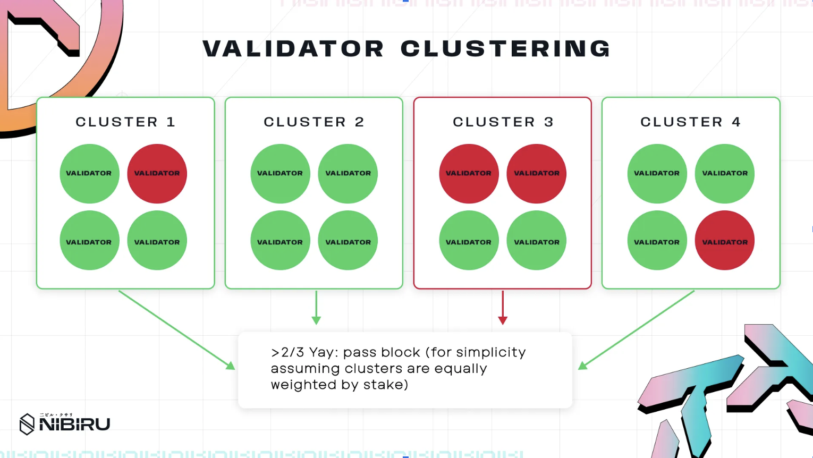
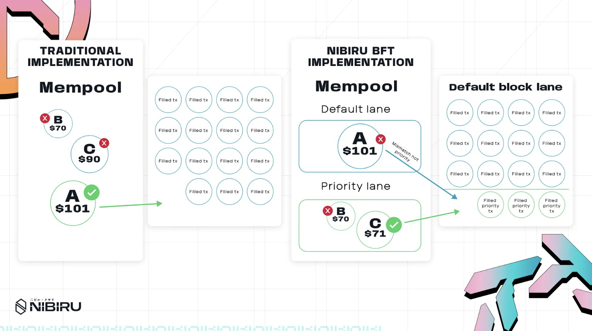

# Nibiru Ecosystem Update #3 - May 2025

Nibiru V2 is now feature-complete, audited, and live with its first wave of
ecosystem deployments. This update further details Nibiru Lagrange Point, a
roadmap for long-term scalability, and highlights progress across real-world
assets, structured products, and user incentive programs designed to drive
durable adoption. {synopsis}

Prepared by [The Nibiru Team](https://nibiru.fi/team)

- You can find the [full list of Nibiru Ecosystem Updates here](https://nibiru.fi/docs/ecosystem/updates/).
- Authors: [Harvey Liu](https://nibiru.fi/team/harvey-liu), [Brandon Suzuki](https://nibiru.fi/team/brandon-suzuki), [Unique Divine](https://nibiru.fi/team/unique-divine), [Jonathan Chang](https://nibiru.fi/team/jonathan-chang), [Erick Pinos](https://nibiru.fi/team/erick-pinos), [Gabe Whitlatch](https://nibiru.fi/team/gabe-whitlatch), 

## 1 | Key Takeaways / TL;DR

1. **Nibiru V2 ("Nibiru EVM Upgrade"):** Nibiru Multi VM unifies EVM and Wasm into
   a single environment without requiring Layer 2 or bridge dependencies.
2. **Nibiru Lagrange Point:** 
    1. NibiruBFT: A modified CometBFT consensus engine, NibiruBFT touts faster
       block times, priority-enshrined block and mempool lanes, more robust and
    seamless networking, and increasingly lightweight storage and verification.
    2. Nibiru Adaptive Execution: This enhancement of Nibiru's execution engine
       will bring faster block times and increased throughput through a novel
    reordering concurrency design that will increase parallelizability, all while
    operating seamlessly with Nibiru’s Multi VM design.
3. **Nibiru App Ecosystem:** Deployments of consumer applications and
   infrastructure, comprised of DEXs, bridges, launchpads, and structured
products to go live in tandem. Notable mentions include LayerZero & Stargate, Syrup Finance, Element
Marketplace, Sai Perps, MIMSwap, Abracadabra, and LayerBank.
4. **EVM Points Program:** The program will reward on-chain contributions for
   sustained liquidity and DeFi usage, leveraging Merkl’s liquidity solutions and
Galxe’s support to enhance Nibiru’s ecosystem. This will kick start the
ecosystem, encourage long-term growth, and help drive liquidity on the chain and
usage of apps like Sai Perps.
5. **Structured Products & RWAs in Focus:** Nibiru centers business development
   efforts around structured products and real yield, building utilities on top
of stNIBI, SyrupUSDC, and Sai Liquidity Provision (SLP) vaults.

#### Table of Contents

- [1 | Key Takeaways / TL;DR](#1--key-takeaways--tldr)
- [2 | Product Development & Ecosystem Updates](#2--product-development--ecosystem-updates)
  - [2.1 - Key Deployments](#21---key-deployments)
  - [2.2 - Network Upgrades on Mainnet](#22---network-upgrades-on-mainnet)
  - [2.3 - App Ecosystem: New Deployments](#23---app-ecosystem-new-deployments)
  - [2.4 - App Ecosystem: Existing App Highlights](#24---app-ecosystem-existing-app-highlights)
- [3 | Near-Term Execution Plans](#3--near-term-execution-plans)
  - [3.1 - Sai Perps Nears Launch on Nibiru](#31---sai-perps-nears-launch-on-nibiru)
  - [3.2 - Onchain Usage Campaigns | Nibiru EVM Points Program (Update)](#32---onchain-usage-campaigns--nibiru-evm-points-program-update)
- [4 - Lagrange Point, NibiruBFT, and the Nibiru Execution Engine](#4---lagrange-point-nibirubft-and-the-nibiru-execution-engine)
  - [4.1 - NibiruBFT - Validator Clusters, BLS Signatures, Multi-Lane Blocks, &](#41---nibirubft---validator-clusters-bls-signatures-multi-lane-blocks-)
  - [4.2 Nibiru Adaptive Execution: The Next Evolution of PARE](#42-nibiru-adaptive-execution-the-next-evolution-of-pare)
  - [4.3 MultiVM Architecture: Seamless EVM & Wasm (and More)](#43-multivm-architecture-seamless-evm--wasm-and-more)
  - [4.4 Quantum-Resistant Cryptography (QRC)](#44-quantum-resistant-cryptography-qrc)
  - [4.5 The Road to Nibiru V3](#45-the-road-to-nibiru-v3)
- [5 - Why Nibiru Is Betting on Yield, RWAs & Structured Products to Lead Real Adoption](#5---why-nibiru-is-betting-on-yield-rwas--structured-products-to-lead-real-adoption)
    - [Real-World Assets have Shown Tangible Progress](#real-world-assets-have-shown-tangible-progress)
    - [Structured Products](#structured-products)
- [6 | Legal Disclosure](#6--legal-disclosure)

#### Legal Terms for this Document

*This Ecosystem Update is provided by the Nibiru team. The Nibiru project is led
by the Matrix Foundation (referred to herein as "Nibiru," "we," and "us") and
supported by various unrelated entities, including Nibi, Inc., and its respective
personnel, as well as other entities and personnel that the Matrix Foundation has
engaged for services, some of whom are mentioned in or have contributed to this
update.*

*The information provided in this Update does not constitute investment advice,
financial advice, trading advice, legal advice, or any other form of advice. The
contents of this document are for general informational purposes only, are
subject to change without notice, and does not constitute any form of contract or
obligation on the part of Nibiru. This Update does not replace, amend, or
override any applicable terms of service, agreements, or legal obligations
associated with the project.*

*A complete Legal Disclosure is provided at the end of this document. By
accessing this Update, you acknowledge that you have read, understood, and agree
to be bound by the terms set forth in this section and in the full Legal
Disclosure. If you do not agree to these terms, please do not access or use any
information contained within this document.*

## 2 | Product Development & Ecosystem Updates

Nibiru’s ecosystem offers compelling experiences and real value: true ownership,
steady rewards, and lasting value. it blends core DeFi primitives with emerging
use cases. Here’s how each component fits together: Below is an overview of how
Nibiru’s apps come together to create a flywheel, combining practical DeFi with
broader appeal for all kinds of users:

[**Website**](https://nibiru.fi/) | [**About Nibiru**](https://nibiru.fi/papers/nibiru-intro.pdf) | [**Docs / Whitepaper**](https://nibiru.fi/docs) | [**X/Twitter**](https://x.com/NibiruChain)

### 2.1 - Key Deployments

#### Bridge to Nibiru: Simplified With LayerZero & Stargate

LayerZero enables Stargate as Nibiru’s canonical bridge for assets like USDC, USDT, and WETH, ensuring secure and rapid connectivity within the ecosystem.

#### Oku.Trade for Advanced Trading

Oku brings Uniswap’s V3 AMM contracts to Nibiru enabling concentrated liquidity for LPs and various order types for users looking to swap.

#### Syrup for Sustainable High Yields

Maple’s Syrup platform provides overcollateralized lending yield >10% on USDC ensuring sustainable composable yield throughout the ecosystem 

#### LayerBank for Borrowing

LayerBank is a lending marketplace where assets like uBTC can be used as collateral, allowing users to capital efficient without leaving the Nibiru ecosystem. 

#### Abracadabra for Stableswap and Leveraged Yields  

Abracadabra enables leveraged yield opportunities with stable subsidized borrow rates. While MIMSwap brings an advanced stableswap for pegged assets.   

#### BIMA for Bitcoin-Backed Lending

Bima lets you use BTC as collateral to mint USBD, a stablecoin backed by BTC derivatives. USBD earns sUSBD, boosting capital efficiency through automated yield strategies.

#### Sai Perps Exchange

A decentralized futures platform offering leveraged trading with fast finality and deep liquidity, all while letting users maintain full custody of their funds.

#### Element NFT Marketplace

The flagship NFT marketplace on Nibiru, Element aggregates listings, simplifies bulk transactions, and enables creators to mint and launch collections easily.

### 2.2 - Network Upgrades on Mainnet

[v2.2.0](https://github.com/NibiruChain/nibiru/releases/tag/v2.2.0-p1) - Mar 27, 2025: 

- During this time, we published and iterated on the @nibiruchain/solidity and @nibiruchain/evm-core packages. The [@nibiruchain/solidity package](https://nibiru.fi/docs/dev/evm/npm-solidity.html) includes Nibiru EVM contracts, ABIs for Nibiru-specific precompiles, and interfaces for core protocol functionality. And the [@nibiruchain/evm-core package](https://nibiru.fi/docs/dev/evm/npm-evm-core.html) is a TypeScript library for use in building applications that leverage functionality custom to the Nibiru EVM.
- The NIBI token, stNIBI token (liquid staked NIBI), and Astrovault’s AXV now have canonical ERC20 representations on Nibiru and can be managed with EVM wallets like MetaMask, Phantom, and Coinbase Wallet.
- This upgrade included enhancements for EVM transaction indexing. We improved log encoding on the EVM, the marshaling of logs, and stabilized service shutdown procedures. These changes collectively result in more reliable transaction tracking.

[v2.1.0](https://github.com/NibiruChain/nibiru/releases/tag/v2.1.0) - Feb 25, 2025:

- The most significant changes from the v2.1.0 mainnet upgrade were the addition of the [ICS-08-wasm IBC client](https://github.com/NibiruChain/nibiru/issues/2061) and update of Wasm VM to v1.5.8.
- Traditionally, IBC light clients in Cosmos SDK chains were **hardcoded in Go**, requiring an on-chain governance vote and coordinated upgrade (hard fork) to add new client types or upgrade existing ones.
- This upgrade introduces a **Wasm VM** that can host light client bytecode compiled from any language (Rust, C/C++, Go, etc.), standardizing the interface to ICS-02 and acting as a **proxy light client**
- This is important because it makes it possible to add new IBC light clients to Nibiru without a coordinated upgrade by validators. The process also becomes less error prone because developers on Nibiru won’t need to worry about as many intricacies of different consensus algorithms, change the blockchain codebase to add new light clients, or go through a multi-stage code release.

### 2.3 - App Ecosystem: New Deployments

| **Project** | **Description** | **Status** |
| --- | --- | --- |
| [Algebra](http://algebra.finance/) | DEX Engine | Licensed to use their service integrations and tooling on Nibiru |
| [Band](https://www.bandprotocol.com/) | Cross-chain data oracle platform with real world data and APIs | Launched on Mainnet |
| [Gelato](https://www.gelato.network/) | Enterprise-grade rollup infrastructure | Deployed on Mainnet |
| [Element](https://element.market/) | NFT Marketplace | Live on Mainnet |
| [Friendly](https://www.friendly.market/) | Lending Platform | Live on Testnet |
| [Hyperlane](https://www.usenexus.org/) | Permissionless interoperability protocol | In Development |
| [Gamma](https://app.gamma.xyz/discover) |  | In Development |
| [Merkl](http://merkl.xyz/) | Protocol and platform for streaming incentives onchain | In Development |
| [ProtoFire](https://protofire.io/) | Smart-contract based multisig wallet. SAFE deployment.  | Launched on Mainnet |
| [Stargate](https://stargate.finance/) | Fully composable liquidity transport protocol / bridge | Launching USDC, USDT, wETH on Mainnet. |
| [Supra](https://supra.com/) | Extreme throughput, native oracle services. | Launched on Mainnet |
| [Unstoppable Domains](https://unstoppabledomains.com/) | Decentralized domain names | Live on Mainnet. 300+ domains minted |
| [B² Network (uBTC)](https://www.bsquared.network/) | Bitcoin with proof-of-stake rewards from B² Network, an EVM compatible, Bitcoin Layer 2 Network | Will be supported via Hyperlane |

### 2.4 - App Ecosystem: Existing App Highlights

| **Project** | **Description** | **Status** |
| --- | --- | --- |
| [Abracadabra](https://abracadabra.money/) | Lending/Leveraged Yield Farming Product Suite | Passed [Abracadabra Improvement Proposal (AIP-62)](https://forum.abracadabra.money/t/rfc-deploy-mimswap-and-abracadabra-on-nibiru-chain/4819/3) |
| [Astrovault](https://astrovault.io/) | Cross-Chain Value Capture Spot DEX | Launched on Mainnet, $116k in liquidity |
| [Aviatrix](https://www.aviatrix.xyz/) | Aviation-Themed Crash Game | NIBI supported for wagering |
| [Balanced Network](https://balanced.network/) | Cross-Chain Swaps and RWA Backed Stablecoin Platform | Working on Mainnet Beta |
| [Bima](https://bima.money/) | Liquid Staking Bitcoin | Working on Mainnet Beta |
| [BRKT](https://www.brkt.gg/) | Binary & Bracket-Style Prediction Market | Live on Mainnet, Markets TBD |
| [DTrinity](https://dtrinity.org/) | Subsidized Borrowing and Stablecoin | In Development |
| [Eris Protocol (stNIBI)](https://www.erisprotocol.com/) | Liquid Staking Platform and Slow Burn Arbitrage Protocol. | Live on Mainnet, $800k in TVL |
| [Euclid Protocol](https://www.euclidprotocol.io/) | Unified Liquidity Layer using Virtual Routing and Forwarding (VRF) | Live on Testnet |
| [Every Finance](https://www.every.finance/) | Managed funds, volatility targeting products and index funds | In Development |
| [Galaxy Exchange](https://galaxy.exchange/) / [Swing](https://swing.xyz/) | Cross-Chain Bridging & Swap Protocol | Live on Mainnet   Bridging NIBI earns points as part of Swing Points Program. |
| [Gemach AI](https://gemach.io/) | DeFAI agent | Live on Mainnet. Supports several dapps and swapping. |
| [Gemach Lend](https://gemach.io/) | Lending Platform | In Development |
| [GBot](https://gemach.io/) | Telegram wallet/sniper bot | In Development |
| [HiYield](https://www.hiyield.xyz/) | Tokenized Treasury Bills | Live on Testnet |
| [Ichi](https://ichi.org/) | Automated Liquidity Strategies for DeFi Yield | Partnership Signed. In Development |
| [LayerBank](https://layerbank.finance/) | EVM-based Cross-Chain Lending Platform | In Development |
| [LayerZero](https://layerzero.network/) | Omnichain Interoperability Protocol | Launched on Mainnet |
| [MIMSwap](https://app.abracadabra.money/#/pools) | Stableswap AMM in the Abracadabra Ecosystem | [Proposal (AIP-62)](https://forum.abracadabra.money/t/rfc-deploy-mimswap-and-abracadabra-on-nibiru-chain/4819/3) Passed. In Development |
| [Nebula](https://nebulalending.io/) | Lending Platform | Live on Testnet |
| [Oku Trade](https://oku.trade/) | DEX Aggregator / Uniswap V3 Deployer | Live on Testnet with native Uniswap V3 contracts. Mainnet Ready. |
| [OmniPump](https://www.omnipump.io/) | Launchpad for Fair Launches and Memecoins | Launched on Mainnet |
| [OmniSwap](http://omniswap.ai/) | AMM DEX | Launched on Mainnet |
| [OpenEden](https://openeden.com/tbill) | Tokenized T-Bills | Will be available via LayerZero |
| [OpenMark](https://x.com/OpenMarkNFT) | NFT Marketplace | Launched on Mainnet |
| [PRDT](https://prdt.finance/) | Fast Paced Prediction Market | Live on Testnet |
| [Routescan Explorer](https://routescan.io/) | EVM Explorer built by the team powering the Explorers for Avalanche and Optimism | Launched EVM Testnet Explorer and EVM Mainnet Explorer |
| [Sai](https://sai.fun/) | Competitive perpetual futures DEX enabling the creation of markets on any asset | Contracts on testnet. App development soon to reach mainnet in early Q2. |
| [SilverSwap](https://silverswap.io/) | Uniswap V4-based Spot DEX | Deployed contracts on mainnet. Soon to launch app. |
| [Swify](https://x.com/SwifyFoundation) | Concentrated Liquidity Spot DEX | Live on Testnet. Mainnet Ready |
| [Syrup](https://syrup.fi/) | Tokenized Private Credit | Will be available via LayerZero |
| [TanX](https://tanx.fi/) | Non-Custodial Orderbook Spot DEX | In Development |
| [Virtual Labs (VDEX)](https://virtuallabs.network/) | Perps Platform | In Development |
| [Via Labs](https://vialabs.io/) | Bridged USDC | Launched on Mainnet |

## 3 | Near-Term Execution Plans

1. Deploy key dApps on mainnet followed by incentive campaigns to bootstrap liquidity into Nibiru’s DeFi ecosystem. 
2. Continue partnerships with priority dApps in the ecosystem to encourage and continue developing novel structured products. 
3. Actively onboard new communities to build and collaborate on Nibiru, focusing on verticals like DeFi, structured products and real-world assets (RWAs), DePIN/AI, and NFT ecosystems.
4. Improve Sai’s user experience starting with advanced order types, institutional functionality and additional forms of collateral that will connect with the ecosystem.

### 3.1 - Sai Perps Nears Launch on Nibiru

<!-- TODO: edit -->

Sai is finalizing core features to bring perpetual futures trading and advanced liquidity vaults to the Nibiru blockchain. Key highlights include:

- **Wasm Contract Refinements**: Sai’s development team has tightened integration between its Wasm-based smart contracts and Nibiru’s consensus layer, improving security and efficiency over traditional EVM options.
- **Oracle Enhancements**: Both native and custom oracle feeds have been fine-tuned for most accurate margin checks and PNL calculations, reducing forced liquidations and avoiding index price discrepancies.
- **Adaptive Borrowing Fee Upgrades**: A borrowing mechanism that dynamically responds to open interest imbalances, protecting liquidity providers.
- **Code Audits & Testing**: Multiple internal audits and testnet evaluations have strengthened contract reliability. The team has also stress-tested liquidity vault epochs to limit withdrawal shocks during high volatility.
- **Product Expansion**: Sai will soon feature tokenized real estate in partnership with Coded Estate. Sai will also include additional asset classes such as commodities and indexes.

### 3.2 - Onchain Usage Campaigns | Nibiru EVM Points Program (Update)

Nibiru has integrated with Merkl to track TVL focused missions on complex DeFi
focused dApps while Galxe will similarly support Nibiru applications leveraging
their large network of users and social based tasks. The points program is
designed to reward users who commit liquidity for longer durations, and the team
is actively onboarding new protocols with incentives such as multipliers for
those that contribute meaningful TVL and revenue that is particularly valuable to
the ecosystem's long-term health.

## 4 - Lagrange Point, NibiruBFT, and the Nibiru Execution Engine

In the last Nibiru Ecosystem Update, we introduced a forward-thinking suite of
upgrades to tackle blockchain’s hardest challenges: unified EVM–Wasm assets
(FunToken), advanced transaction execution with multiple facets of
parallelization, MEV minimization (Block Lanes), validator scaling, and even
post-quantum cryptography. Since then, Nibiru has evolved and fleshed out those
concepts into a coherent, production-focused package.

### 4.1 - NibiruBFT - Validator Clusters, BLS Signatures, Multi-Lane Blocks, &
QUIC

**4.1.1 Validator Clustering**

Previously, the “validator groupings” concept aimed to fix CometBFT’s n²
messaging overhead. Now, under NibiruBFT consensus:

- Clusters: Validators are dynamically shuffled into clusters each epoch for an
intra-cluster consensus to achieve a precommit state.
- Intra-Cluster → Inter-Cluster: Each cluster only needs one representative in
the final commit, drastically cutting message complexity from O(n²) down to
roughly (n/k)², given n>>k.

Beyond simple grouping, secondary Geo-Clustering further optimizes intra-cluster
latency by grouping nodes with lower RTT (round-trip times). This ensures block
finality remains fast, even as the validator set grows significantly.

We also propose that a dynamically epoch-assigned cluster that does not respect
stake weights be implemented to contain consistently underperforming validators
to further reduce the lower bound on consensus.

**4.1.2 BLS Signature Aggregation**

We teased BLS before for lighter block headers and faster verifications:

- Two-Stage Aggregation: Within each cluster, signatures on the proposed block
are aggregated into one BLS signature. Representatives then aggregate again at
the top level.
- Size & Speed: A single aggregated signature scales far better than one ECDSA
signature per validator, enabling networks with hundreds of validators without
bloated headers or inefficient verification.
    - Faster verification results in faster block times and reduced header size
    allows for increased block space allocated for transactions.

**4.1.3 Multi-Lane Mempool and Block Structure**

We propose the segregation of lanes within both mempools and within blocks:

- Multiple Transaction Lanes: Priority lane(s) dedicated to critical transactions
(e.g. oracles, liquidations) while a default, non-prioritized lane exists for
regular transactions.
- MEV Containment: MEV transactions are specified in the MEV lane, containing MEV
behavior solely to this lane.
    - Lane-Based Gas Auctions: Each lane has its own “gas market,” preventing
    bidders from blocking crucial transactions through gas wars (e.g. MEV
    behavior cannot outcompete oracle updates due to dedicated block and mempool
    space reserved for high priority transactions)

**4.1.4 QUIC Networking for Faster Consensus**

Traditional TCP-based networking can suffer from latency spikes and cumbersome
handshakes (connection establishment). QUIC integration in NibiruBFT networking
facilitates:

- Faster Connection Setup: Fewer round-trips, so validators synchronize quickly.
- Stream Multiplexing: Packet loss in one data stream doesn’t stall others.
- Connection Migration: Maintains session parameters even if a node’s IP address
changes (reducing unnecessary handshake overhead and avoiding cumbersome
parameter discovery).

All these changes align to keep networking robust and latency efficient, allowing
for larger validator sets and increased throughput, while also prioritizing
blockchain health and facilitating a seamless, safe environment for end users.

### 4.2 Nibiru Adaptive Execution: The Next Evolution of PARE

Our previous “PARE” (Pipeline-Aware Reordered Execution) concept reappears as
Nibiru Adaptive Execution:

- Reordering Blocks: Transactions are partitioned into groups of transactions
called “reordering blocks.”
- Real-Time Conflict Tracking: Transaction read/write sets are tracked to
dynamically reorder transaction blocks, executing blocks with high predicted
contention sums first.
- Parallel Execution: Non-conflicting transactions run concurrently; only true
conflicts trigger rollbacks.

By proactively reordering, we minimize “harmful delays” and reduce the overhead
of constant rollbacks. This is critical in high-frequency DeFi contexts with many
concurrent trades.

### 4.3 MultiVM Architecture: Seamless EVM & Wasm (and More)

**4.3.1 Unified Assets & Execution**

The old Lagrange Point text touted “FunToken” to unify EVM and Wasm assets
without bridging. That’s now under the broader MultiVM design:

- Native EVM: No sidechains or bridging. Ethereum tools (Metamask, Remix,
Hardhat) work natively on Nibiru.
- Wasm: Rust-based contracts and robust security features (re-entrancy
protection).
- Shared State: Thanks to a unified bank module, EVM- and Wasm-based tokens share
the same supply - no wrapped illusions.
- Parallelization: With Adaptive Execution, non-conflicting EVM and Wasm
transactions can execute in parallel.

Future expansions could embed additional VMs (Move VM, Solana VM) into the same
first-class environment.

### 4.4 Quantum-Resistant Cryptography (QRC)

Nibiru’s earlier mention of post-quantum security has been more fleshed out, but
is still being fine tuned and slated as a long term pursuit:

- ML-DSA Signatures: Replacing ECDSA with a lattice-based scheme (ML-DSA) that’s
believed to be secure against current quantum attacks (e.g. resistant to Shor’s
algorithm, unlike ECDSA).
- Future-Proofing: As quantum computing matures, Nibiru remains on track to
preserve security, an important differentiator for enterprise-grade apps.

### 4.5 The Road to Nibiru V3

When “Nibiru Lagrange Point” was first introduced, a roadmap outline to unify
VMs, mitigate MEV, handle concurrency, and prepare for quantum safety was
created. Now, the core pieces have evolved into:

1. NibiruBFT → A reimagined consensus layer with validator clustering, BLS
signatures, multi-lane mempools/blocks, and QUIC.
2. Adaptive Execution → Next-gen concurrency management (the new face of PARE).
3. MultiVM → EVM, Wasm, and future VMs all secured by one chain.
4. Quantum-Resistant Cryptography → Gradual rollout of ML-DSA (lattice-based) and
enhanced hashing.

Each piece stands on its own but also complements the others - reducing overhead
at the consensus layer, boosting throughput in execution, and enabling
frictionless cross-VM dApp development. The result is true high performance,
decentralized infrastructure, equipped to serve DeFi at scale and beyond.

## 5 - Why Nibiru Is Betting on Yield, RWAs & Structured Products to Lead Real Adoption

Yield-bearing stablecoins pose a challenge to profit margins of traditional
issuers. Despite promises of broader on-chain market exposure, synthetic assets
continue to face obstacles related to liquidity and regulation. Conversely,
real-world assets (RWAs), ranging from tokenized T-bills to real estate, hold the
potential to democratize access, provided compliance is effectively managed.

Meanwhile, structured products, such as Nibiru's proposed delta-neutral stNIBI
vault, leveraged SyrupUSDC vault, and hedged SLP positions, are simplifying
intricate DeFi mechanisms, enabling accessible and sustainable returns for users.
Macroeconomic factors like inflation and fears of recession may renew interest in
gold and on-chain hedges, even as the excitement experimental assets such as
memecoins and AI narratives diminishes.

Institutional players are increasing their involvement with stronger risk
management frameworks, suggesting that while retail enthusiasm cools, broader
adoption is developing under more measured, long-term strategies.

#### Real-World Assets have Shown Tangible Progress

Tokenized T-bills and credit lines introduced investors to real yields secured by
off-chain collateral. Now, builders are expanding into real estate, venture
funds, and private equities. While these products will require KYC for regulatory
compliance, they hint at a future where exclusive asset classes become accessible
to retail clients.

#### Structured Products

Structured products have continued to emerge as relevant in the next iteration of
DeFi, but for sustainable yield. Early adopters increasingly prefer automated
vaults that take care of strategy selection, leverage, and risk management. These
solutions simplify complex DeFi mechanics like leveraged staking, exotic options
overlays, and multi-layer lending into user-friendly products.

Within structured products, Nibiru is exploring several example vaults such as:

- **Delta-neutral stNIBI Vault:** A vault like this might liquid stake NIBI, then
short NIBI on Sai, earning ~30% APY while minimizing directional risk. This could
provide compelling and sustainable returns.
- **Leveraged SyrupUSDC Vault:** Deposit USDC, loop it via Syrup on platforms
like Abracadabra. With controlled leverage, yields can exceed 40%, assuming
disciplined risk thresholds.
- **Hedged SLP Position:** Provide LP on ETH/BTC/SOL, short the same assets on
Sai. Capture trading fees while neutralizing price swings.

Each of these strategies compresses layered DeFi mechanics into single-token
entries that aren’t purely speculative. Less noise and more signal.

## 6 | Legal Disclosure

**No Offer or Solicitation**

This Update does not constitute an offer to sell or a solicitation of an offer to
buy any securities, tokens, or any other form of investment in any jurisdiction.
The distribution or dissemination of this document may be restricted by law in
certain jurisdictions, and it is the responsibility of any person in possession
of this Update to comply with any such laws and regulations.

**No Rights to Token-holders**

Purchase of NIBI tokens or any other digital assets mentioned herein (each and
collectively the "*Tokens*") does not represent or confer any ownership right or
stake, share, security, or equivalent rights, or any right to receive future
revenue shares, dividends, intellectual property rights or any other form of
participation in or relating to Nibiru, any of its affiliates, Nibiru and its
related products, and/or services or any part thereof. The reader acknowledges
and accepts that at no time and under no circumstances shall they be entitled, as
a holder of any Tokens, to vote, receive dividends or be deemed the holder of
equity or capital stock of any entity for any purpose, nor will anything
contained herein be construed to confer on the reader such rights.

**Forward-Looking Statements**

Certain statements contained in this Update may be forward-looking, including but
not limited to plans, goals, and expectations regarding the future business,
operations, and performance of the project. These statements are based on current
beliefs, assumptions, and projections and are subject to risks, uncertainties,
and changes beyond the control of the project. Actual results may differ
materially from those expressed or implied in any forward-looking statements.

**Regulatory Status**

The regulatory status of the Tokens and blockchain technology, digital assets,
and cryptocurrencies generally is uncertain and evolving. This Update and the
project described within may be impacted by legal, regulatory, and compliance
requirements. It is the responsibility of potential participants to determine
whether they can legally acquire, hold, or participate in Nibiru’s activities
under the laws of their jurisdiction.

**No Liability**

Nibiru, its affiliates, contractors, and their respective officers, employees,
and agents shall not be held liable for any loss, damage, or liability arising
out of or in connection with the use of this Update, the project, or any
associated products or services. Participation in the project and any related
activities is done at your own risk.

**No Guarantees**

There is no guarantee or assurance that the project, its platform, or the Tokens
described in this Update will achieve any of its goals, intended outcomes, or
objectives. The value and functionality of any Tokens are not guaranteed, and
they may be subject to significant volatility, market forces, and other risks.
Token holders should not expect to have the ability to influence the management
or decision-making of Nibiru.

**Risk Factors**

Participation in the project and the use of tokens involve significant risks,
including but not limited to financial, regulatory, technological, and market
risks. It is strongly recommended that participants fully understand these risks
before engaging with the project or acquiring any tokens.

**Independent Advice**

Readers of this Update should seek independent professional advice regarding
their individual circumstances before engaging in any activity related to the
project.

**Amendments and Updates**

Nibiru reserves the right to amend, modify, or update this Update or any of the
information herein at any time without prior notice. It is the responsibility of
readers to stay informed of any changes.
