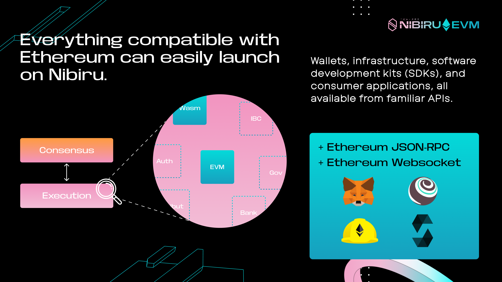

# Nibiru EVM

Nibiru EVM is a novel, EVM-equivalent execution layer natively built into the
Nibiru blockchain. Nibiru EVM preserves full compatibility with EVM bytecode and
the Ethereum JSON-RPC API, ensuring seamless portability for EVM developers.
{synopsis}

<!-- Developers can leverage existing familiarty with Ethereum and Ethereum Virtual -->
<!-- Machine (EVM) tooling to build on Nibiru, while users can benefit from faster -->
<!-- transaction processing. -->

| In this Section | Synopsis |
| --- | --- |
| [Why Nibiru EVM?](./#why-nibiru-evm) | A brief primer on the EVM portion of Nibiru's Execution Engine. |
| [Precompiles](./precompiles/index.md) | Understand the extensions to Nibiru EVM that give it functionality beyond what's present in the default Ethereum Virtual Machine. |
| [FunToken Mechanism](./funtoken.md) | Clean, multi-VM composability for fungible tokens (FunTokens). |
| [News on Nibiru EVM](./news/README.md) | Latest articles and press releases on Nibiru EVM |

## Why Nibiru EVM?

1. **ERC-20 tokens elevate to an interchain standard**:
   Nibiru's unique "FunToken" (fungible token) mechanism modularizes ERC-20 tokens and
the "Bank Coins". Through a precompile contract, ERC-20 tokens can be
seamlessly registered as "FunTokens" on Nibiru. These FunTokens are fully
compatible with the Inter-Blockchain Communication (IBC) protocol, enabling their
free movement and usage across connected blockchains.
2. **Interopability Across Virtual Machines (VMs)**: Nibiru EVM was designed to be compatible with Wasm VM and Inter-Blockchain Communication (IBC). Nibiru accounts are VM-agnostic, and [Ethereum contracts can call Wasm contracts](./precompiles/nibiru.md) and vice versa.
3. **Fast Settlement and Superior Scalability**: Nibiru benefits from parallel optimistic execution, instant finality, and sub 2-second settlements.  This creates a **better experience for Web3 users** and a promising platform for application developers as well. 

4. **Toolchain Compatibility and Flexibility**: Applications from Ethereum can easily launch on Nibiru and tap into a multi-chain liquidity layer using IBC, Circle CCTP, and LayerZero. At the same time, Rust develpers can access everything with Wasm. Choose your own stack without causing fragmentation.

5. **Inexpensive gas fees**: Nibiru keeps gas fees low, making it more economical for
   users to interact with applications on the network.

## Benefits to Developers

Any application that can exist on Ethereum can launch on Nibiru without
difficulty and benefit from its parallel optimistic execution and instant
finality. Nibiru's EVM execution environment gives developers the ability to
build and deploy applications in a familiar EVM environment with a lower barrier
to entry, extending Nibiru’s core functionality in Wasm (WebAssembly) with the
extensive user base and developer community of Ethereum. 

Builders will now be able to use existing tooling like Solidity, Hardhat, Remix,
and Metamask, all while enjoying the performance benefits of Nibiru. 

## Transaction Throughput on Ethereum

The Ethereum blockchain only allows for about 20-40 transactions per second (TPS) for
all Ethereum users. When the limit is reached, users are forced to compete
against each other for their transactions to be included, which drives up gas fees during periods of congestion.

<!-- This was a deliberate decision in Ethereum’s design. Ethereum requires that its -->
<!-- nodes (computers running the Ethereum software) have a way of coming to consensus -->
<!-- on the current state of things; the way they do this is by processing every -->
<!-- transaction in Ethereum’s history; i.e., if you’ve ever used Ethereum, every -->
<!-- Ethereum full node has a copy of your transactions in its blockchain ledger. -->

<!-- One of the Ethereum community’s precepts, being an open, decentralized, peer to -->
<!-- peer system, is that it should be reasonably accessible for anyone to run an -->
<!-- Ethereum node and validate the chain for themselves; i.e., if it gets too -->
<!-- expensive (in terms of hardware requirements / computational resources), this -->
<!-- undercuts the fundamental goal of decentralization. The combination of these two -->
<!-- factors — every node has to process every transaction, and we want it to be -->
<!-- relatively feasible to run a node — means Ethereum transaction throughput has to -->
<!-- be capped fairly low. -->

## Ethereum Virtual Machine (EVM)

The Ethereum Virtual Machine (EVM) is a decentralized computation engine that
runs on thousands of interconnected computers (nodes) using Ethereum clients. It
serves as the execution environment for smart contracts on a network that
implements the Ethereum protocol. The EVM ensures deterministic computation,
meaning every node produces the exact same result given the same initial state
and transaction, maintaining the integrity and consistency of the blockchain.

The Nibiru EVM is responsible for storing and executing Ethereum smart contracts
on Nibiru in an isolated runtime, which means the code running inside the EVM
cannot access external systems such as the filesystem. This isolation enhances
security and predictability in smart contract execution.

Nibiru implements the Ethereum protocol to offer compatibility and
interoperability with existing Ethereum-based applications. Nibiru maps to a
different [consensus engine](../arch/#consensus-engine) yet leverages an
execution environment that is equivalent in capabilities to Ethereum's.

## Is Nibiru EVM a separate chain, layer 2, or rollup running in tandem with the base layer?

Ethereum protocol functionality on Nibiru is not a separate blockchain. It is a
purely additive upgrade (V2 on mainnet). Distinct from things like Layer 2s,
optimistic or zero-knowledge (ZK) rollups, and side chains, Nibiru EVM is a piece
of the broader [Nibiru Execution Engine](../arch/README.md). 

It is one possible
avenue for executing state changes to be included in a block similar to other
types of [transaction messages](../concepts/tx-msgs.md). Non-EVM transactions and
EVM transactions can co-exist within the same block.

<!-- ## Functinonality like Ethereum -->

<!-- You can use Nibiru to do all of things done on Ethereum, including use and create Web3 -->
<!-- applications. The main difference is that transactions are less expensive and -->
<!-- execute faster. -->

## EVM-equivalent versus Ethereum-equivalent

Nibiru EVM is **EVM-equivalent** but not quite Ethereum-equivalent.  
> "[It is] exactly like Ethereum "from within", but [has] some differences on the outside, particularly in data structures like the block structure and state tree.
> The goal [with EVM-equivalence] is to be fully compatible with existing applications, but make some minor modifications to Ethereum to make development easier and to make proof generation faster." - Vitalik

If something is fully and uncompromisingly **Ethereum-equivalent**, is means that it
> "[does] not change any part of the Ethereum system to make it easier to generate
proofs. [It does] not replace hashes, state trees, transaction trees, precompiles
or any other in-consensus logic, no matter how peripheral." - Vitalik (in the
context of zero-knownledge proofs)

Reference: [Vitalik Buterin, 2022. The different types of ZK-EVMs](https://vitalik.eth.limo/general/2022/08/04/zkevm.html)

## Programming Language Support

### Solidity and Vyper

Nibiru EVM makes the Nibiru blockchain Ethereum compatible, allowing trustless
deployment of Solidity and Vyper smart contracts, or any other language the
compiles to EVM bytecode.

### Rust

In addition to EVM bytecode, Nibiru's execution engine supports [Wasm (WebAssembly) smart contracts](../ecosystem/wasm/index.md). This allows developers to write smart contracts in Rust that compile downto Wasm bytecode.

Notably, these Rust/Wasm contracts can be called directly from smart contracts
on the EVM. This is made possible by the Nibiru [Wasm precompile](./precompiles/index.md), which enables EVM contracts to invoke and execute Wasm contracts. This multi-VM interoperability is compatible with standard Ethereum development libraries like ethers.js.

## Other Articles

1. [Nibiru Precompiles](./precompiles/index.md)
1. [News on Nibiru EVM](./news/README.md)
1. [Jan 27, 2025 - Stages of the Nibiru EVM (Nibiru V2) Launch](./news/2025-01-27-prelude.md)
1. [Jun 4, 2024 - Alpha Testing Release](./news/evm-alpha-test.md)

<!-- ## Frequently Asked Questions -->

<!-- ## Finality -->

<!-- Fast finality is important for people that need to move assets quickly around  Finality is the moment when a blockchain transaction cannot be altered, canceled, or reversed. -->

<!-- ## Common Questions -->

<!-- ... -->

<!-- Developers frustrated by high gas fees -->
<!-- Lower speed and transaction throughput -->

<!-- 
Other pages

- [ ] CTA to Developers to go to evm section 
- [ ] Ethereum JSON-RPC  
- [ ] Ethereum Accounts 
- [ ] Ethereum Smart Contracts
- [ ] Go-Ethereum (Geth) -> Less risk surface for security concerns or hacks

-->
