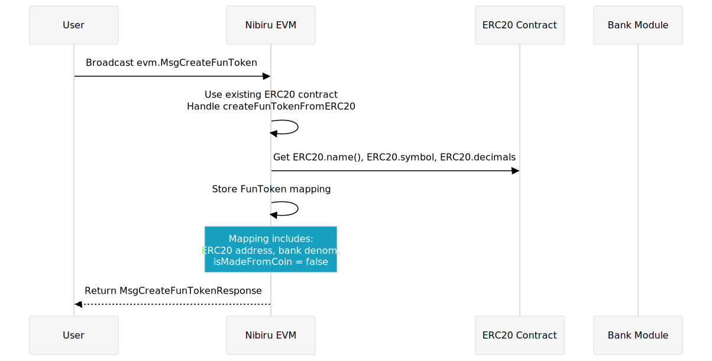
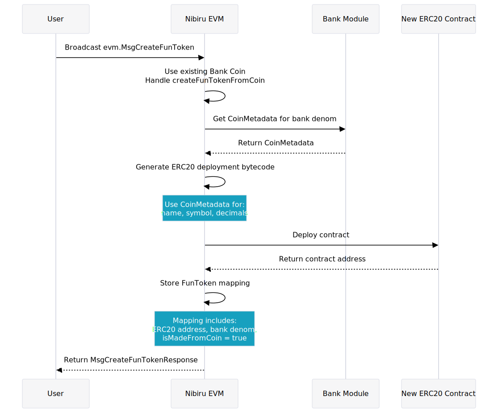

# FunToken Mechanism

The FunToken mapping mechanism creates canonical connections between different
types of fungible tokens on Nibiru. It is possible to create a `FunToken` mapping from an existing ERC20
or Bank Coin. This enables the asset to move across virtual machines (VMs)
cleanly. {synopsis}

## Use Cases and Benefits

The FunToken mechanism provides several key advantages for the Nibiru ecosystem:

1. **Multi-VM Interoperability**: FunTokens enable seamless movement of assets
   between Nibiru's EVM and non-EVM environments. This allows users to utilize
Bank Module assets like NIBI and external IBC tokens (ICS20) in Ethereum-based protocols.
Similarly, ERC20 tokens can be composed with other Nibiru modules, Wasm smart
contracts, and IBC tokens on Nibiru's EVM! This interoperability creates a unified
ecosystem where assets can flow freely between different blockchain environments.

2. **Enhanced Liquidity**: FunTokens increase the total liquidity available
   across both VMs. This helps reduce liquidity fragmentation and prevents Web3
applications from being siloed to their original VM. The result is a more dynamic
and liquid ecosystem that can support a wider range of financial activities. This
opens up possibilities for multi-VM apps that utilize the strengths of both
environments.

3. **Unified User Experience**: For end-users, `FunTokens` offer a consistent
   experience across the Nibiru ecosystem by reducing
the complexity in managing multiple token standards and facilitating
easier onboarding. Users familiar with either Ethereum or the interchain can
stick to familiar wallets without concerns of underying technical differences.

4. **Ecosystem Growth**: The FunToken mechanism can catalyze ecosystem growth by
   attracting projects and users from different ecosystems. For example,
LayerZero assets or USDC minted natively on Nibiru EVM can be brought to the rest
of the interchain and help Nibiru serve as a hub that brings tangible utility to
other blockchains and users.

## Definition: FunToken

A `FunToken` is a fungible token mapping between a bank coin and a corresponding
ERC-20 smart contract. Bank coins here refer to tokens like NIBI, IBC
coins (ICS-20), and token factory coins, which are each represented by the
"[Bank Coins](../concepts/bank-coin.md)".

```go
import (
 github_com_NibiruChain_nibiru_v2_eth "github.com/NibiruChain/nibiru/v2/eth"
)

type FunToken struct {
 // Hexadecimal address of the ERC20 token to which the `FunToken` maps
 Erc20Addr github_com_NibiruChain_nibiru_v2_eth.EIP55Addr 

 // bank_denom: Coin denomination in the Bank Module.
 BankDenom string 

 // True if the `FunToken` mapping was created from an existing bank coin and
 // the ERC-20 contract gets deployed by the module account. False if the
 // mapping was created from an externally owned ERC-20 contract.
 IsMadeFromCoin bool 
}
```

## How are FunToken Mappings Created?

Nibiru's EVM Module implements a transaction message (TxMsg) called
"evm.MsgCreateFunToken", a state transition that creates a mapping between a
Bank Coin and ERC20 token.

```go
// MsgCreateFunToken: Arguments to create a "FunToken" mapping. Either the ERC20
// contract address can be given to create the mapping to a bank coin, or the
// denomination for a bank coin can be given to create the mapping to an ERC20.
type MsgCreateFunToken struct {
 // Hexadecimal address of the ERC20 token to which the `FunToken` maps
 FromErc20 *github_com_NibiruChain_nibiru_v2_eth.EIP55Addr 

 // Coin denomination in the Bank Module.
 FromBankDenom string 

 // Sender: Address for the signer of the transaction.
 Sender string 
}
```

If the mapping is generated from an ERC20, this TxMsg creates a Bank Coin to go
with it, and if the mapping's generated from a coin, the EVM
deploys an ERC20 contract for which it will be the owner. The resulting deployed
ERC20 is guaranteed is embedded in the Nibiru binary (x/evm/embeds/ERC20Minter.sol).

The `FunToken.isMadeFromCoin` field reflects which one of these situations is in
effect.

## FunToken from ERC20

This diagram (click to expand) outlines what happens when a user creates a
`FunToken` mapping from an existing ERC20 token contract.

<!-- Diagram code in neighboring file (./funtoken.txt) -->
<a href="../img/evm/funtoken-from-erc20-flow.svg" target="_blank">

</a>

It does not matter if
that ERC20 contract is "Ownable", just that the contract properly implements the
ERC20 specification.

## FunToken from Bank Coin

This diagram (click to expand) outlines what happens when a user creates a
`FunToken` mapping from an existing Bank Coin.

<!-- Diagram code in neighboring file (./funtoken.txt) -->
<a href="../img/evm/funtoken-from-bank-coin-flow.svg" target="_blank">

</a>

## Understanding Metadata for ERC20s and Bank Coins

We refer to the the following parts of an ERC20 as its metadata.

| Field | Description |
| --- | --- |
| name | A human-readable name for the token. Example: "Ethereum". |
| symbol | Shorter ticker symbol. Example: "ETH" |
| decimals | The number of decimal places to divide from the onchain amount to get the display amount. For example, this is 18 for ETH because wei is the smallest unit of ether, and $10^{18} \;\text{wei} = 1 \;\text{ETH}$  |

There are similar fields for Bank Coin metadata.

| Field | Description |
| --- | --- |
| Name | Same as `ERC20.name`. |
| Symbol | Same as `ERC20.symbol`. |
| Description | (Optional) A longer description than "Name". |
| DenomUnits | A sequence of denomination-exponent pairs going from lowest to highest exponent. The exponent represents the power of 10 that one must raise the "BankCoin.Base" to in order to equal the given "DenomUnit.Denom". For example, 1 NIBI  = 1,000,000 unibi, implying the "NIBI" is a denom unit with an exponent of 6 and base of "unibi". |
| Base | Base denomination. The `DenomUnit.Denom` with an exponent of 0.   |

## How are FunTokens Used?

Once a FunToken mapping is created, it enables seamless conversion between the ERC20 token and the corresponding Bank Coin. Here's what happens when users interact with these mappings:

### Key Points

- The total value (Bank Coins + ERC20 tokens) remains constant throughout these operations.
- Conversions are atomic as they happen within the same blockchain.
- Users can freely move assets between Nibiru's native environment and its EVM, enabling cross-VM composability.

### Converting ERC20 to Bank Coin

1. A user calls a special [FunToken precompile contract](./precompiles/nibiru.md#funtoken-precompile) to send ERC20 tokens to a "nibi"-prefixed Bech32 address. This call initiates an ERC20 transfer to the EVM module under the hood.
2. The EVM module escrows the ERC20 tokens.
3. Equivalent Bank Coins are minted and sent to the user's Nibiru account.
4. The total supply of the Bank Coin increases, while the circulating supply of the ERC20 decreases.

### Converting Bank Coin to ERC20

1. A user sends a transaction to convert Bank Coins to ERC20 tokens.
2. The Bank module burns the specified amount of Bank Coins.
3. The EVM module releases an equivalent amount of ERC20 tokens from escrow (for existing ERC20s) or mints new tokens (for ERC20s created by the module).
4. The ERC20 tokens are sent to the user's Nibiru account using its Ethereum address.

This information provides a clear picture of how the FunToken mappings facilitate asset movement between different parts of the Nibiru ecosystem. It helps users and developers understand the practical implications of these mappings and how they can be utilized in various scenarios.

## Related Pages

- [Bank Coins](../concepts/tokens/bank-coins.md)
- [ERC20 Tokens](../concepts/tokens/erc20.md)
- [Tokens on Nibiru](../concepts/tokens/index.md)
