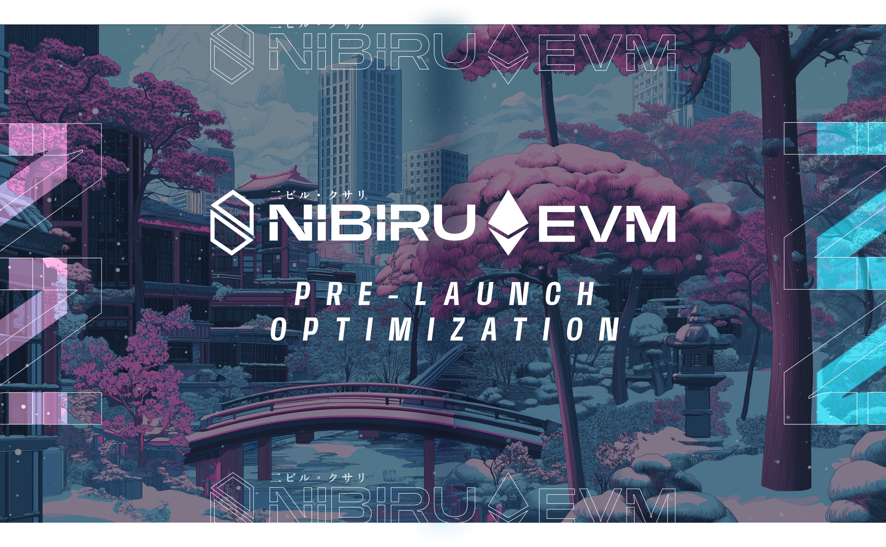

# Nibiru EVM (Nibiru V2) Codebase Finalized Following Rigorous Security Audits

Nibiru, a secure and high-performance blockchain, has reached successful code completion for its upcoming Nibiru EVM (Nibiru V2) upgrade. {synopsis}

- Date: January 23, 2025
- [Latest Articles on Nibiru EVM](./README.md)

> "This milestone marks a key step in the evolution of Nibiru," stated Unique Divine, Co-founder of Nibiru and CEO of Nibi, Inc. "Smoothly launching an initiative like this is about doing small things right to make a big difference. Nibiru places a heavy emphasis on security for users and their digital assets. The audits and resulting mitigation changes help ensure that the new generation of apps on Nibiru will deploy in a safe and efficient environment."

These security audits of Nibiru focused on the core L1 logic. The team started with a consultative security audit in October 2024 by Zenith, where Code4rena assembled a curated team of auditors tailored to the project’s specific codebase and needs. After addressing potential security findings from this audit, the team sponsored a competitive Code4rena audit in November 2024.  This second audit expanded its scope to include Nibiru’s Ethereum JSON-RPC, in addition to the core L1 and the Nibiru EVM.

## What is Nibiru EVM (Nibiru V2)?

The Nibiru EVM Upgrade, also called Nibiru V2, is a "purely additive" enhancement to Nibiru that makes it an EVM-equivalent execution engine. This allows Ethereum-based application development teams to more easily build on Nibiru and take advantage of widely used tools like MetaMask and Coinbase Wallet.

The team's [Jan 2025 Ecosystem Update](https://nibiru.fi/docs/ecosystem/updates/nibiru-eco-update-02.html) also mentions the launch of several products on top of Nibiru V2, including a Uniswap V3 deployment by Oku, Astrovault's cross-chain value capture DEX, tokenized private credit and T-bills, and Bridged USDC.

## Nibiru Lagrange Point: A Glimpse into the Future

Building upon the progress of the Nibiru EVM upgrade, Nibiru is unveiling the initial stages of its ambitious "Nibiru Lagrange Point" roadmap. This roadmap outlines a series of innovative advancements designed to further enhance the scalability, decentralization, and user experience on Nibiru.

Nibiru Lagrange Point combines:

- FunToken Mechanism, a unification of EVM and non-EVM tokens that don't rely on third-party bridges
- Pipeline-Aware Reordered Execution (PARE) for higher throughput
- Optimized validator dynamics in NibiruBFT, including Boneh–Lynn–Shacham (BLS) Signatures and novel grouping algorithms to reduce overhead and speed up block times.
- Mempool Lanes for orderly transaction flow

These design innovations are meant to "address bottlenecks across every layer of the stack, paving the way for advanced DeFi, real-world assets (RWAs), AI-driven bots, and high-traffic cultural projects—all running seamlessly on a single platform", according to Harvey Liu, Research Engineer at Nibi, Inc.

## About Nibiru

Nibiru is a high-performance MultiVM blockchain that achieves fast finality, a
block time of less than 1.8 seconds, and robust security. Backed by $20.5 million
in funding from NGC Ventures, HashKey Capital, Kraken Ventures, and Tribe
Capital, Nibiru enables developers to build and deploy smart contract
applications interoperable across multiple virtual machines, such as the Ethereum Virtual Machine (EVM) and WebAssembly (Wasm).

- [Latest Nibiru Ecosystem Update - Jan 2025](https://nibiru.fi/docs/ecosystem/updates/nibiru-eco-update-02.html): Deep dive on Nibiru’s growth and development
- [Nibiru Community Hub](https://nibiru.fi/docs/community/): News, socials, and community links
- [Nibiru/Security-Reports・GitHub](https://github.com/NibiruChain/nibiru/tree/main/security-reports): Audits and security reports
