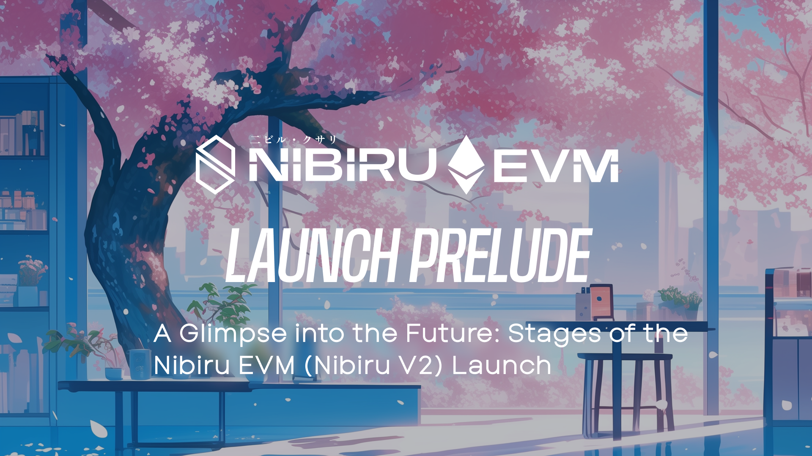
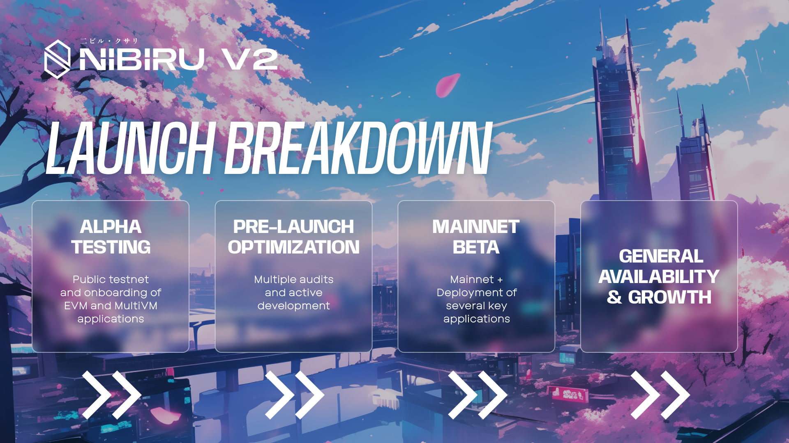
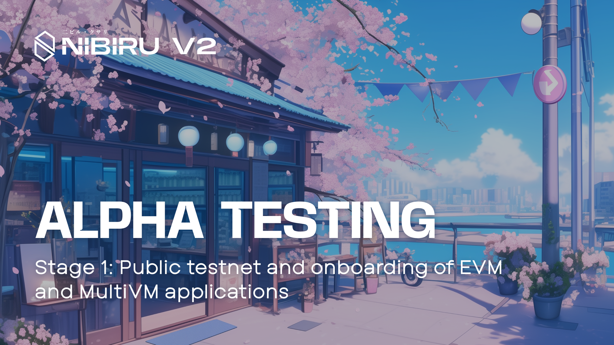
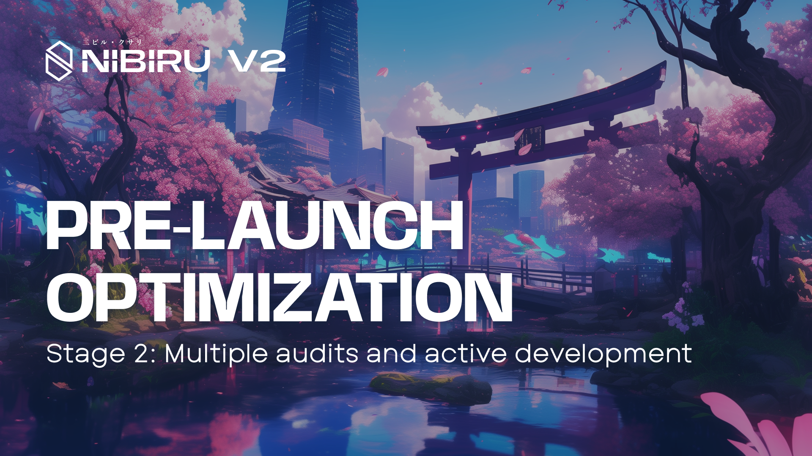
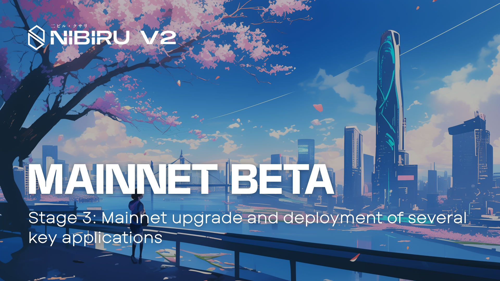
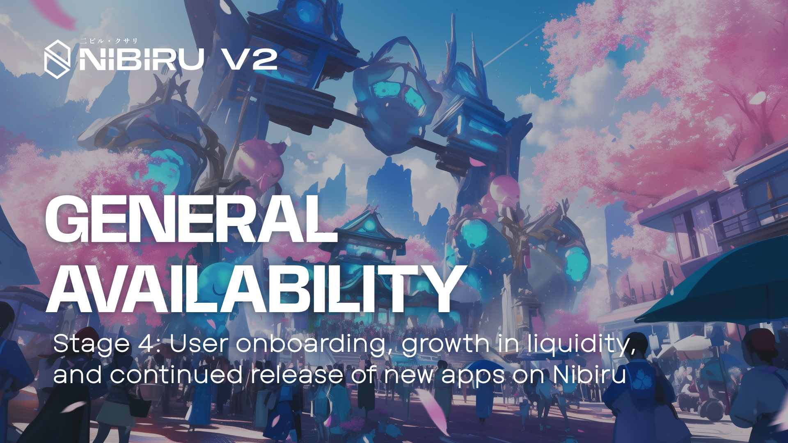

# Stages of the Nibiru EVM (Nibiru V2) Launch

- Date: January 27, 2025
- [Latest Articles on Nibiru EVM](./README.md)

The Nibiru EVM (Nibiru V2) is an “additive” upgrade that offers risk mitigation and an orderly deployment path for applications on Nibiru. This article explains how the different stages of the launch will work.  {synopsis}

By introducing EVM (Ethereum Virtual Machine) compatibility alongside its existing WebAssembly (Wasm) smart contract support, Nibiru provides a streamlined development experience for builders familiar with Ethereum’s ecosystem—without compromising on performance, security, or usability.

With the successful completion of all audits, Nibiru is soon to enter its Mainnet
Beta stage (Stage 3).

## Stage 1: Alpha Testing

The Alpha Testing Release is the initial phase in which Nibiru EVM’s features are
publicly tested on a dedicated testnet. This stage kicked off in an [announcement
on June 4, 2024](./evm-alpha-test.md). This environment allows early adopters
and developers to:

1. **Experiment** with Nibiru EVM’s functionalities and identify potential issues.
2. **Give feedback** on performance, tooling compatibility, and user experience.
3. **Influence development** by highlighting areas for improvement or optimization.

Through alpha testing, the Nibiru team gathers invaluable feedback from the
community and teams building on Nibiru, helping refine and prioritize different
areas of the codebase. Developers benefit from an early look at the new
capabilities, while end users can look forward to enhanced reliability and
performance by the time of mainnet launch.

## Stage 2: Pre-Launch Optimization

Following the alpha testnet relase, a thorough pre-launch optimization period commences. This stage involves:

1. Security Audits: Third-party reviews of the EVM code, consensus mechanisms,
   and core blockchain logic.
2. Quality Assurance (QA): Additional testing to address reported bugs and
   vulnerabilities discovered during Alpha.
3. Performance Tuning: Enhancements to transaction throughput, tooling, and
   developer workflow based on feedback. 

This rigorous review helps ensure that Nibiru EVM is both secure and reliable
before being opened to a wider audience, laying the groundwork for the subsequent
mainnet release.

## Stage 3: Mainnet Beta

In the third phase, Mainnet Beta Release, the Nibiru Cataclysm-1 network upgrades
to Nibiru V2. This marks a significant transition where:

1. Validator Operators Upgrade: Node operators coordinate a chain upgrade to
   activate EVM functionality.
2. Key Infrastructure Deployment: Oracles, block explorers (for the EVM),
   LayerZero integration, bridged USDC, and multisigs are set up to facilitate
secure transactions and asset movement.
3. Ecosystem Apps Go Live: Applications tested during the Alpha phase (or
   developed afterward) migrate to mainnet. DeFi protocols, gaming platforms, and
more can now harness Nibiru’s high-performance architecture with EVM
compatibility. 

During this beta phase on mainnet, the chain is effectively
operational for early use, but the team may still introduce incremental
improvements or fixes if needed. This process helps ensure that
the network is stable and reliable before moving to full availability.

Many of the “new” and “coming soon” apps on Nibiru’s ecosystem page migrate to
the real thing (mainnet) at this time, helping validate the upgrade in a live
setting.

## Stage 4: General Availability and Growth

After confirming stability in the Mainnet Beta Release, Nibiru transitions to
General Availability—the phase where Nibiru EVM and several of its core
applications can be considered ready for
widespread use. Key areas of focus here include:

1. User Onboarding: Simplified paths for new participants, such as user-friendly
   wallets, developer tutorials, and funding opportunities for project teams.
2. Liquidity Expansion: Incentive programs, bridging solutions, and partnerships
   to boost liquidity across the ecosystem, fostering healthy markets for assets
and tokens.
3. Ecosystem Development: Continuous growth of DApps in DeFi, gaming, NFTs,
   real-world asset tokenization, and more. 

By this point, Nibiru’s EVM and Wasm applications operate will coexist in a
robust, multi-VM blockchain designed to scale with global demand. Features such
as high throughput, fast finality, and enhanced security aim to deliver a
streamlined experience for users and developers alike.

## About Nibiru

Nibiru is a high-performance blockchain designed for exceptional speed, security,
and interoperability. Nibiru boasts block times under 1.8 seconds, instant
finality, and an innovative MultiVM architecture that capitalizes on the
advantages of Ethereum and alternative smart contract environments
simultaneously. Backed by leading investors such as NGC Ventures, HashKey
Capital, Kraken Ventures, and Tribe Capital, Nibiru aims to create the go-to hub
for next generation Web3 applications.
