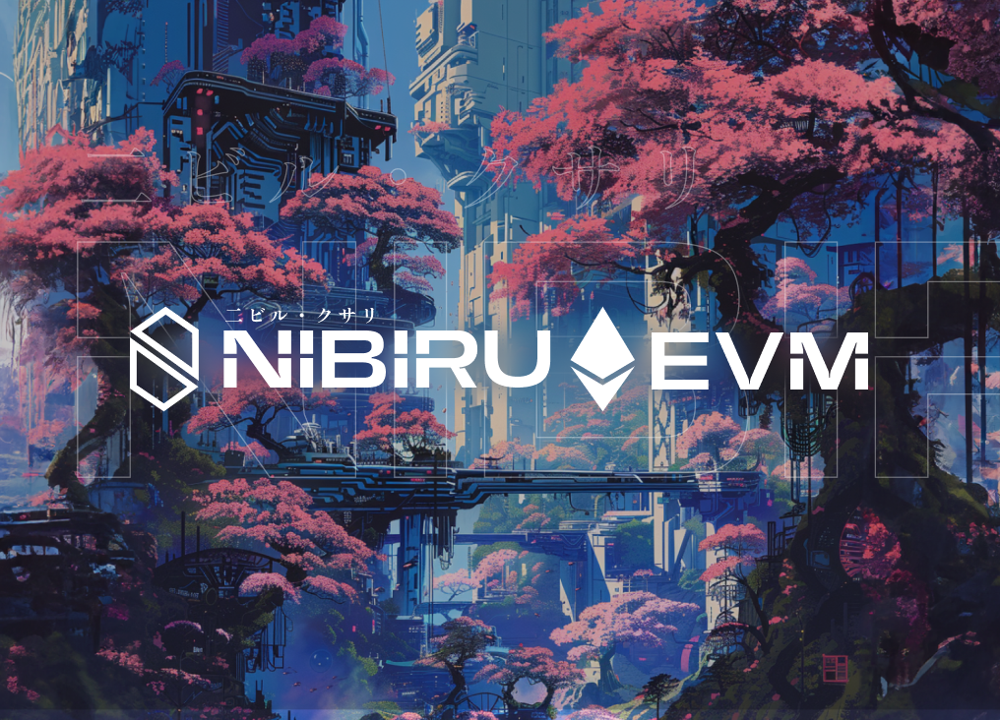

# Alpha Testing Release

Offering parallel optimistic execution, security, and enhanced developer productivity, Nibiru EVM enables Ethereum developers to easily launch applications without any modifications. {synopsis}

- Date: June 4, 2024
- [Latest Articles on Nibiru EVM](./README.md)

[Nibiru](https://nibiru.fi/), a breakthrough Layer-1 blockchain, has unveiled Nibiru EVM, a novel and  high-performance Ethereum Virtual Machine (EVM) equivalent execution environment in the protocol’s [latest v2 release](https://github.com/NibiruChain/nibiru/releases/tag/v2.0.0-evm.1).

## About Nibiru EVM

Nibiru EVM is purpose-built to increase the flexibility of applications that can exist on Nibiru and address the inefficiencies  present in the Ethereum blockchain, which is limited to approximately 20 transactions per second (TPS). This limitation leads to high transaction fees and restricts the design space for developers that hope to create performance-intensive consumer applications. In contrast, Nibiru EVM is capable of reaching speeds of over 10,000 TPS even with just single-threaded execution.

> “Launching a chain is a race to build trust and demonstrate the real-world utility crucial for widespread adoption. Innovating on and improving the EVM is simply one of the ways we’re going to do that. ”  - Unique Divine, Co-Founder of Nibiru Chain.

Nibiru developed a versatile technology that opens the door for Ethereum-based tokens and applications to interact with multiple virtual machines, to benefit from the fast transaction processing, and to further streamline user experience without the compromises of using Layer-2 scaling solutions.

With EVM developers accounting for over 90% of the total value locked (TVL) across all smart contract ecosystems, Nibiru's approach to EVM compatibility will be crucial for attracting liquidity and enabling the growth of its ecosystem. Nibiru EVM signifies a major step forward in its mission to drive mainstream Web3 adoption. By providing developers with a powerful, secure, and easy-to-use environment for building dApps, Nibiru is poised to attract a myriad of projects across various sectors like DeFi and gaming.

## Accelerating Ecosystem Development Using Ethereum's Foundations

Any application that can exist on Ethereum can easily launch on Nibiru and benefit from its parallel optimistic execution and instant finality. Nibiru's EVM execution environment gives developers the ability to build and deploy applications in a familiar EVM environment with a lower barrier to entry, extending Nibiru’s core functionality in Wasm (WebAssembly) with the extensive user base and developer community of Ethereum. Builders will now be able to use existing tooling like Solidity, Hardhat, Remix, and Metamask, all while enjoying the performance benefits of Nibiru.

## Nibiru in Early Innings

Nibiru has been operational on mainnet since March 2024, supporting [Wasm (Web Assembly)](https://nibiru.fi/docs/ecosystem/wasm/) smart contracts written in the Rust programming language. In two months, the blockchain has seen more than 6 million transactions from more than half a million unique wallets.

With the upcoming launch of Nibiru EVM, Ethereum developers can look forward to a high-performance execution environment that maintains compatibility and enhances scalability. Nibiru is set to play a pivotal role in the future of decentralized applications, driving further innovation and mainstream adoption.
