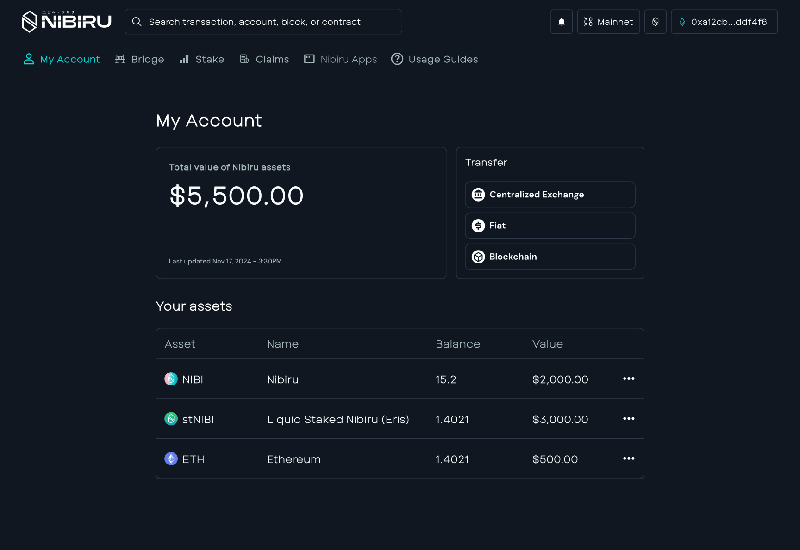

# Liquid Staked Nibiru (stNIBI)

Liquid Staked NIBI (stNIBI) is a fungible, staked variant of the [Nibiru token,
NIBI](../nibi.md). When users liquid stake their NIBI tokens using the Eris Protocol
smart contracts, they receive stNIBI in return. This approach allows users to
bolster network security and earn staking rewards while maintaining liquidity and
the ability to explore DeFi opportunities. {synopsis}

<!-- Based on initial draft from -->
<!-- https://www.notion.so/nibiru/Liquid-Staking-on-Nibiru-Docs-119d2597a03c80da98bdd20318c9c9c7?pvs=4Vg -->

| In this Section | Synopsis |
| --- | --- |
| [Benefits of Liquid Staking](#solution-liquid-staking-with-stnibi) | Understand the rationale behind stNIBI. |
| [Guide: How to Liquid Stake on Nibiru](../../use/liquid-stake.md) | Get started with step-by-step instructions on liquid staking. |
| [Onchain Addresses and Denomination for stNIBI](#onchain-addresses-and-denomination-for-stnibi) | Deep dive on the mechanics and underlying processes behind how stNIBI (liquid staked Nibiru) works |  
| [Where Can You See stNIBI in Your Wallet?](#where-can-you-see-stnibi-in-your-wallet)  | Discover how to view and manage stNIBI holdings in various wallets |
| [How to redeem NIBI from your stNIBI](#how-to-redeem-nibi-from-your-stnibi) | Explore how to convert stNIBI back to NIBI tokens 

## The Problem

In many Proof-of-Stake (PoS) protocols, staking involves locking your tokens for
extended periods of time in exchange for predictable rewards and access to
participate in decentralized governance. While this approach guarantees a return
denominated in those tokens, this locked manner of staking  means you can't
invest or trade in more profitable markets or put the capital to use in
applications.   

## Solution: Liquid Staking with stNIBI

Liquid staking through stNIBI addresses these limitations. It allows you to earn
rewards and secure the network without locking your tokens. This is possible by
liquid staking NIBI tokens via Eris Protocol. In exchange, you receive a liquid
tokens (stNIBI) that can be traded or used within Nibiru ecosystem and broader
Web3 landscape—all while continuing to earn staking rewards. 

1. **Maintain Liquidity** - Use stNIBI in Nibiru’s ecosystem while the NIBI
   that backs it remains staked
2. **Auto-compounding** - Staking rewards automatically accrue to your stNIBI.
   This happens because the redeemable value in underlying NIBI increases as more staking rewards
  flow to the protocol smart contracts.
3. **Simplified Experience** - No need to manually claim and restake rewards
4. **Enhanced Security** - Increased staking participation strengthens network
   security
5. **Ecosystem Growth** - Liquid staking enables broader DeFi integration. You
   can use stNIBI as collateral in lending protocols, provide liquidity, or
capitalize on other yield opportunities.
6. **Risk Mitigation** - pread your stake across multiple validators, reducing single-point-of-failure risks.

## Onchain Addresses and Denomination for stNIBI

| Version of stNIBI | Address or Denomination |
| --- | --- |
| [Bank Coin Denomination](../../concepts/tokens/bank-coins.md) | tf/nibi1udqqx30cw8nwjxtl4l28ym9hhrp933zlq8dqxfjzcdhvl8y24zcqpzmh8m/ampNIBI |
| ERC20 Address on Nibiru | 0xcA0a9Fb5FBF692fa12fD13c0A900EC56Bb3f0a7b  |
| ERC20 Address on Ethereum | Deploying soon on Nibiru EVM  |

[Nibiru Docs - Where Can You See stNIBI in Your Wallet?](#where-can-you-see-stnibi-in-your-wallet)

## Security and Audits

These security of Eris Protocol, which produces stNIBI and coordinates its
validator selections, is a top priority. Multiple audits have been conducted to
help ensure the safety and reliability of the smart contracts deployed on Nibiru: 

1. [Oak Security. 2023-02-15. Audit Report - Eris Protocol v1.0.pdf](https://github.com/oak-security/audit-reports/blob/ba83bd7d48391dda861c60ccadaccb910eb2e5b5/Eris%20Protocol/2023-02-15%20Audit%20Report%20-%20Eris%20Protocol%20v1.0.pdf)
2. [SCV-Security. 2022-09-23. Eris Protocol - Amplified Staking - Audit Report v1.0.pdf](https://rawcdn.githack.com/SCV-Security/PublicReports/670859b4f4fe0d113568a058db0241b9f20fb61b/Eris%20Protocol/Eris%20Protocol%20-%20Amplified%20Staking%20-%20Audit%20Report%20v1.0.pdf)
3. [SCV-Security. 2023-03-28. Eris Protocol - Tokenfactory Contract - Audit Report v1.0.pdf](https://rawcdn.githack.com/SCV-Security/PublicReports/670859b4f4fe0d113568a058db0241b9f20fb61b/Eris%20Protocol/Eris%20Protocol%20-%20Tokenfactory%20Contract%20-%20Audit%20Report%20v1.0.pdf)

## Common Questions on stNIBI

### Where Can You See stNIBI in Your Wallet?

Both stNIBI and NIBI can be seen in any standard wallet interface. 
You'll typically see stNIBI displayed as "Liquid Staked Nibiru (Eris)". Currently stNIBI is not supported in the Leap Wallet UI, but this will be addressed shortly. While you may not see stNIBI in the Leap Wallet interface, you can confirm your stNIBI holdings on the [staking webapp](https://app.nibiru.fi/stake#liquid) or by switching to a wallet with stNIBI registered.

Digital assets like this are called [Bank Coins](../../concepts/tokens/bank-coins.md). 
These assets also have canonical representations as [ERC20 tokens](../../concepts/tokens/erc20.md) too, meaning you can .

### How to redeem NIBI from your stNIBI

There are two options. 
1. **Instant Liquidity**: You can sell stNIBI on an exchange as a liquid token or
   swap to another asset.
2. **Unstaking**:  Redeem stNIBI back with Eris Protocol to get the underlying
   NIBI that compounded and accrued rewards over time. This process is subject to
the network's unbonding time.

## Reference Links

- [Tokens - Bank Coins](../../concepts/tokens/bank-coins.md)
- [Tokens - ERC20 Tokens](../../concepts/tokens/erc20.md)
- [Eris Protocol Docs - Amplifier](https://docs.erisprotocol.com/products/amplifier/)
- [Eris Protocol - Web App](https://www.erisprotocol.com/nibiru/amplifier/NIBI)
- [Nibiru EVM](../../evm/README.md) 
- [Everything You Need to Know About Staking Yield on Nibiru](../staking.md)
