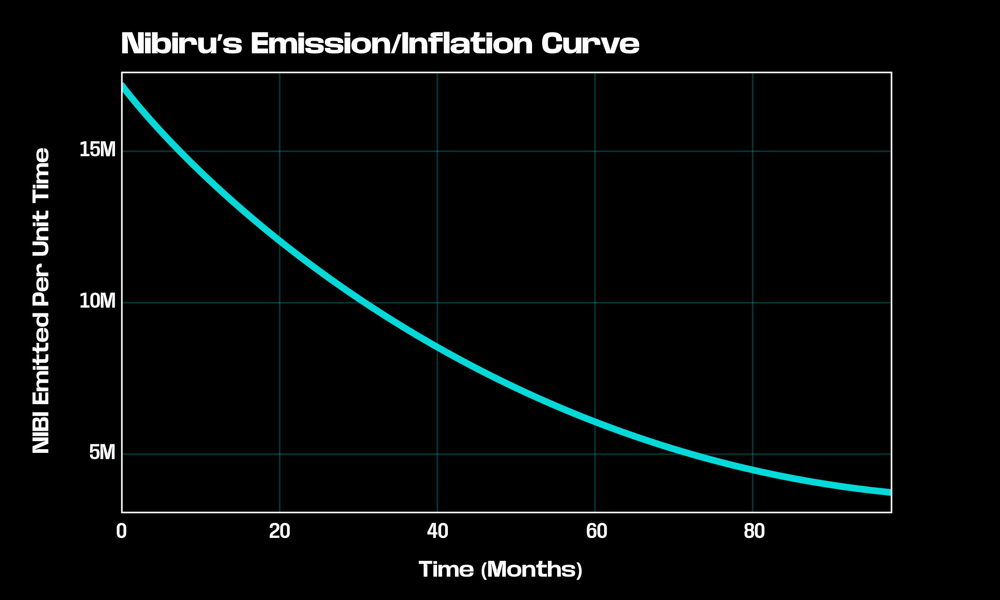
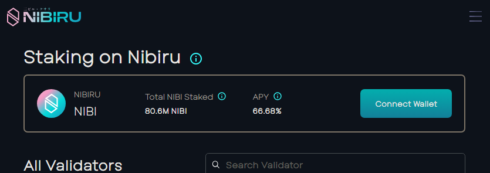
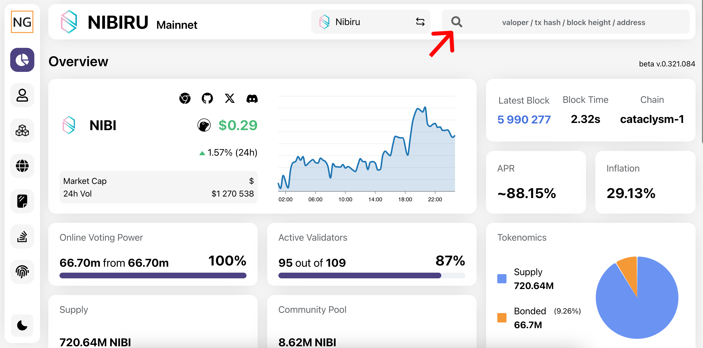
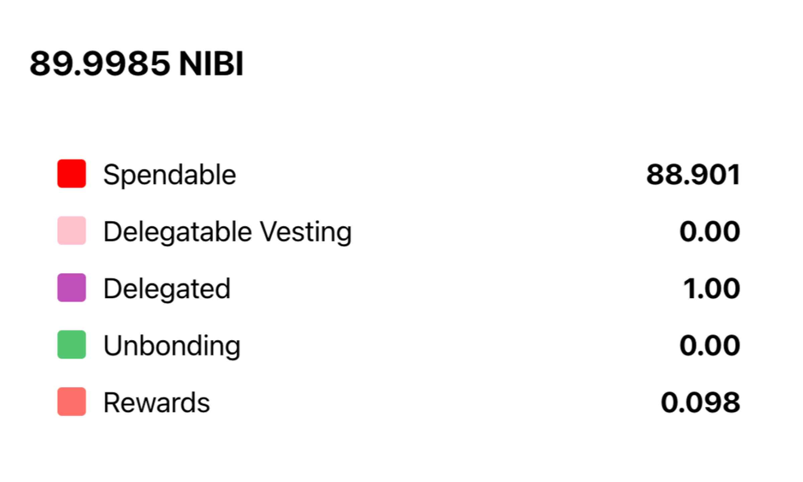

# Staking Yield on Nibiru

Explore Nibiru Chain's transparent and predictable staking model, designed around emissions toward a fixed, fully-diluted supply. This article focuses on understanding the annual percentage yield (APY) for staking. {synopsis}

## Liquid Staking on Nibiru
As of 2025-03-01, [liquid staking](https://app.nibiru.fi/stake#liquid) via Eris Protocol is natively supported. 

## How Nibiru's Staking Emissions Differ from Other Chains?

The emission of [Nibiru (NIBI) tokens](https://nibiru.fi/docs/learn/nibi.html) is designed to be fixed and predictable. The creation of NIBI tapers off over time, following a decay equation that ensures a steady decrease in new $NIBI issuance.

Nibiru has a capped supply, meaning the total amount of NIBI will not exceed 1.5 billion (subject to protocol governance). 

This limited and known supply creates a predictable economic environment. This mechanism ensures a decreasing inflation rate over time, providing stakeholders with a predictable staking model. 

Many chains adjust their emission rates for proof of stake based on the percentage of tokens staked relative to the number of tokens out in circulation (minted minus burned). 

In contrast, Nibiru has a predictable rate of emissions over eight years, sort of like Bitcoin except over a shorter time window. This allows users to calculate their potential rewards with greater accuracy and reliability.

## How to Calculate Staking Yield on Nibiru

Staking yield can be calculated from the amount of emitted tokens for the entire network and the amount of NIBI tokens you have staked relative to the rest of the network.  In other words, take the amount of tokens emitted to stakers and multiply by the percentage coming to you. 

$$
\text{Rewards Earned} =  \left( \frac{\text{Your Stake}}{\text{Total Stake}} \right) \cdot (\text{tokens emitted})
$$

$$
\text{Yield }(\%) = \left( \frac{\text{Rewards Earned}}{\text{Your stake}} \right) = \left( \frac{\text{tokens emitted}}{\text{Total Stake}} \right)
$$

For example, If 1000 tokens are emitted, you make up 20% of the stake for the network, and you are staking 500 tokens, that means you’ll earn 200 tokens in rewards (20% of 1000) and thus experience 40% yield (because 200 is 40% of 500).

This is where the annual percentage yield (APY) value comes from in the Nibiru web app’s staking interface. We simply display the yield percentage based on the total stake over the course of a year.

## Using Block Explorers to View Staked Tokens

To view your staked assets on the Nibiru, you have several [Block Explorers](https://nibiru.fi/docs/community/explorers.html) to choose from. Explorers enable you to search the history of Nibiru for transactions, blocks, accounts, smart contracts, and other activities on the Nibiru blockchain.

For this example, we will demonstrate the Mainnet Explorer. This tool allows users to search for their wallet address and see detailed information about their staked $NIBI, including the amount staked or unstaked, rewards earned, and more. The Block Explorer allows stakeholders to easily monitor their staking activities. 

For a detailed guide on how to stake, check out our blog post on [how to stake](https://nibiru.fi/blog/posts/055-staking-guide.html).

### How do I view my staked $NIBI?

1. Go to the [Nibiru Mainnet Explorer](https://nibiru.explorers.guru/)
2. Insert your NIBI wallet address in the search bar.
    
  
    
3. "Delegated" refers to the amount of $NIBI that has been staked.
    
  

## Conclusion

Understanding how APR is calculated on Nibiru offers valuable insights into the mechanics of staking rewards. The fixed inflation model of Nibiru provides transparency and predictability, allowing stakeholders to comprehend the reward structure clearly. Additionally, tools like the Nibiru Block Explorer enhance your ability to track and monitor staked assets at all times.

Ready to start staking? Visit the [web app](https://app.nibiru.fi/stake) to begin. For a detailed guide on [how to stake](https://nibiru.fi/blog/posts/055-staking-guide.html), check out Nibiru’s blog post.

## References: Staking on the Nibiru Blockchain

1. [Tokenomics | Nibiru (NIBI) Token Unlocks and Vesting](https://nibiru.fi/docs/learn/tokenomics.html) : This section goes over the **tokenomics** and release schedule of NIBI, the staking and utility token of **Nibiru** Chain
2. [Nibiru (NIBI) Token](https://nibiru.fi/docs/learn/nibi.html): Nibiru tokens, commonly called "NIBI" tokens, are the native cryptocurrency of the Nibiru blockchain.
3. [Guide: Staking on Nibiru](https://nibiru.fi/docs/use/stake.html): Put your NIBI to work and earn rewards for staking. Staking lets you earn rewards by helping verify transactions and secure the Nibiru blockchain.
4. [#63 | How to Bridge to Nibiru Chain](https://nibiru.fi/blog/posts/63-how-to-bridge)
5. Nibiru Inflation Module: This implements the [on-chain logic](https://github.com/NibiruChain/nibiru/tree/main/x/inflation) that manages when NIBI gets minted. 

## Disclaimer

> This is not an offering or the solicitation of an offer to purchase tokens. This document may contain hypothetical, future/forward-looking and/or projected figures which are not guaranteed. Although we strive for exact accuracy, actual numbers may vary. The Nibiru Foundation (MTRX Services, Ltd.) makes no representation or warranty, express or implied, as to the completeness or accuracy of this presentation and it is subject to change without notice.
>
