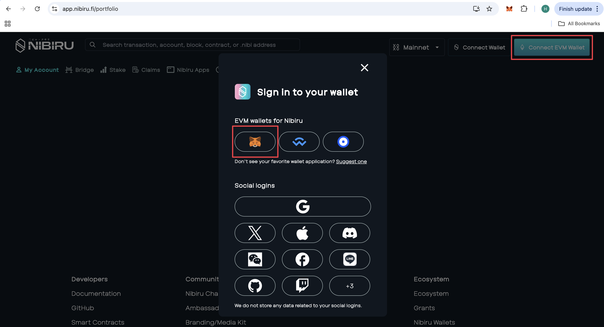
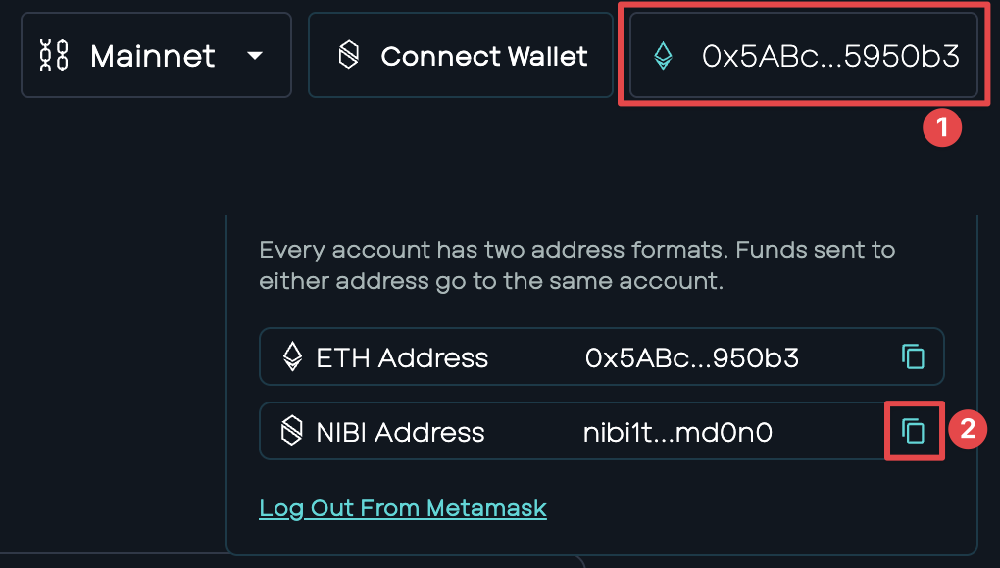
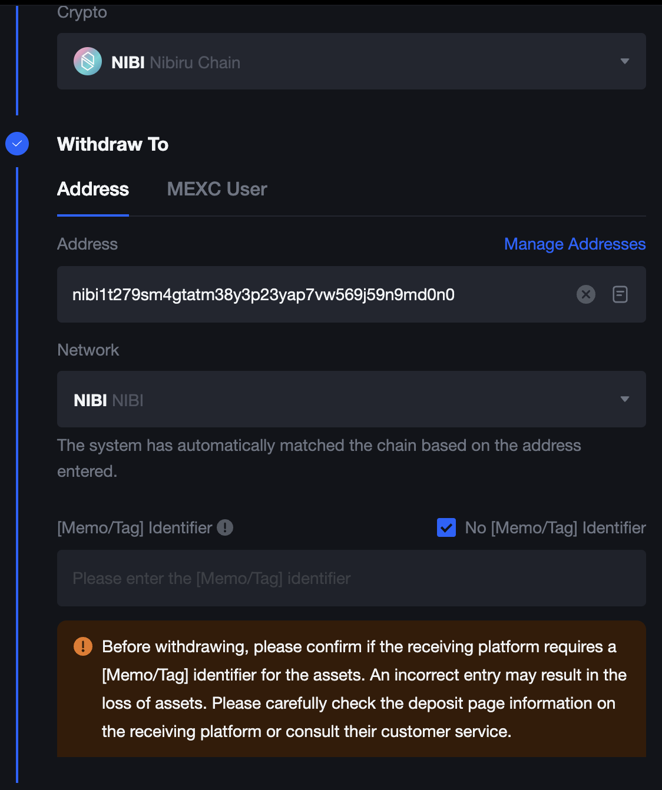
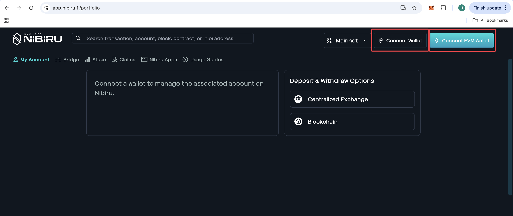
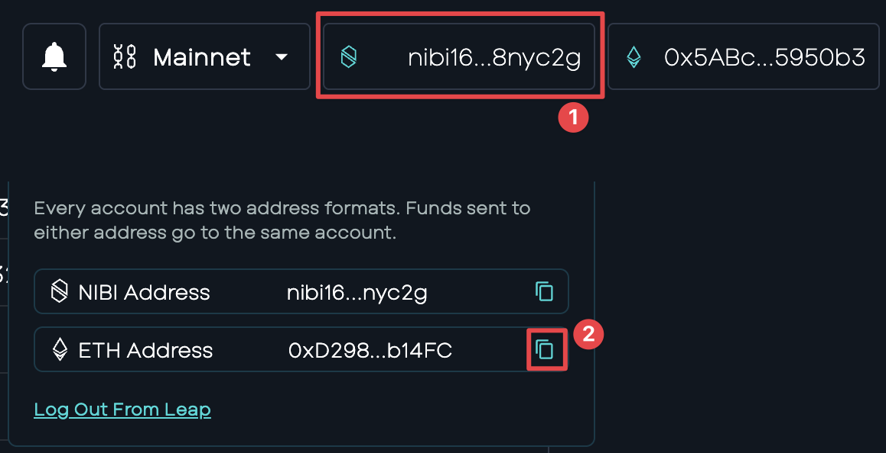
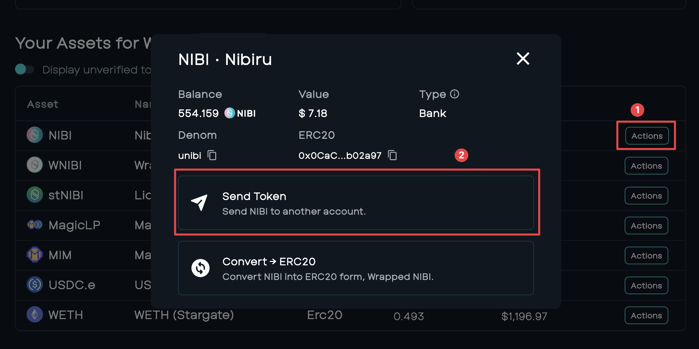
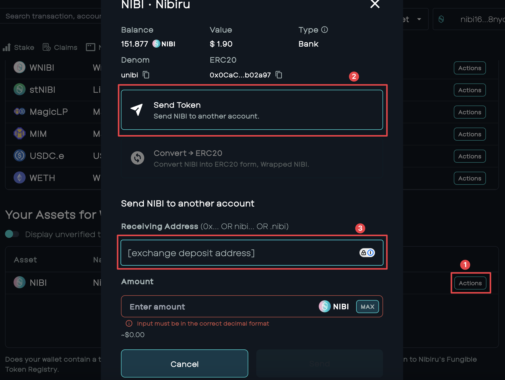

# Guide: Withdraw/Deposit with Centralized Exchanges (EVM)

This guide is a walkthrough on how to deposit to/withdraw from $NIBI-supported centralized exchanges via EVM. {synopsis}

## Withdrawing from Centralized Exchange to EVM

1 | Head to the [Nibiru Web App](https://app.nibiru.fi/portfolio) and connect your EVM wallet.

2 | Click the EVM address and copy the NIBI derivation of your EVM wallet.

3 | Head to the CEX and use the copied address as the withdrawal address and follow the exchange instructions. No memo/tag is needed.

4 | Upon confirmation, your funds will arrive and display in your EVM wallet.

## Depositing to Centralized Exchange from EVM 

1 | Create an [IBC Wallet](https://nibiru.fi/docs/wallets/).

2 | Head to the [Nibiru Web App](https://app.nibiru.fi/portfolio) and connect your EVM wallet with the $NIBI funds to be deposited, as well as your IBC wallet.

3 | With both wallets connected, click the NIBI address and copy the EVM derivation of your IBC wallet.

4 | With the EVM derivation of your IBC wallet copied, send over your $NIBI from your EVM wallet using the copied address as the destination address. You can do this in your EVM wallet directly, or using the web app, as shown below.

5 | Once funds have arrived in your IBC wallet, using either your IBC wallet directly or using the web app (shown below), deposit your funds to the exchange deposit address. 

6 | Upon confirmation, your funds will arrive and display in the exchange.
