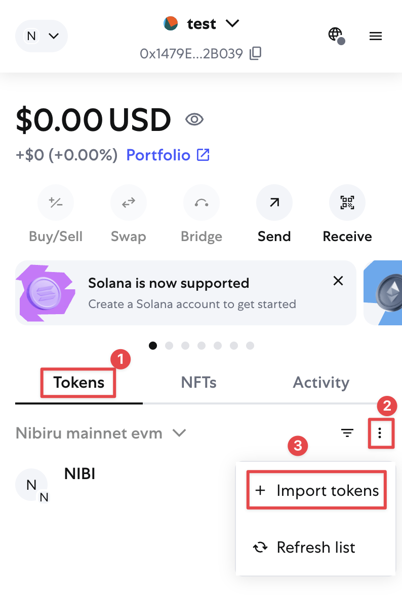
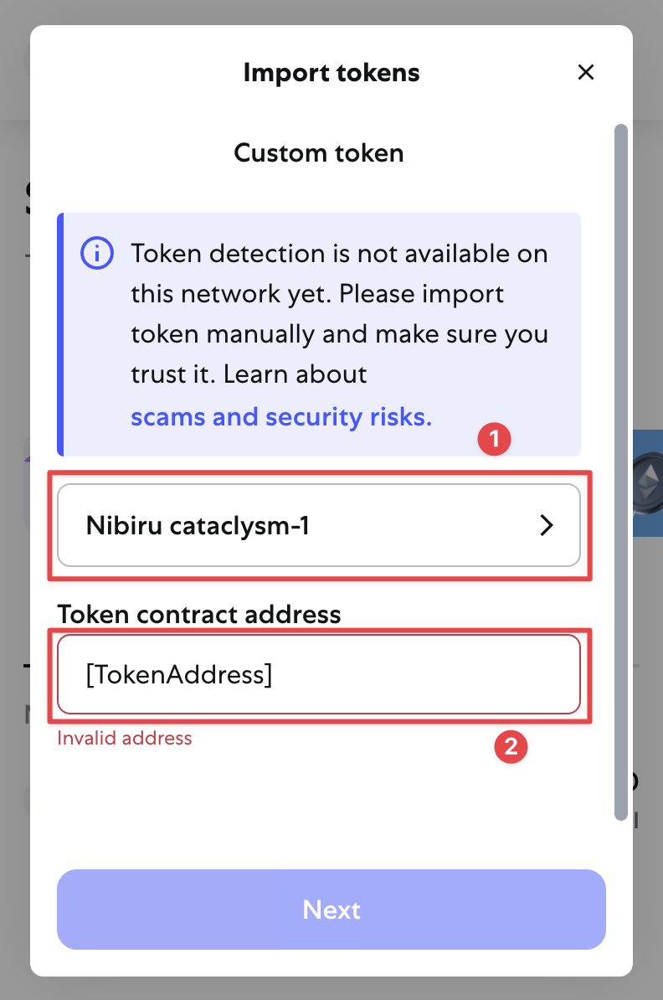
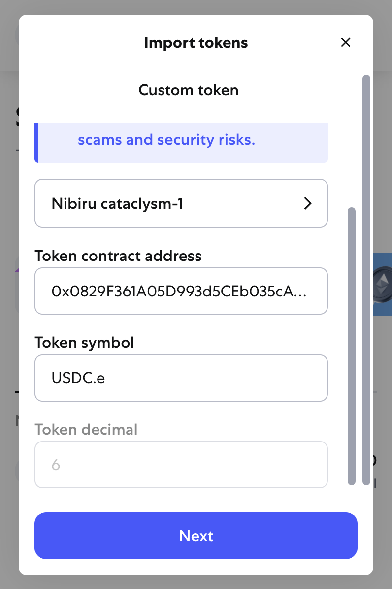
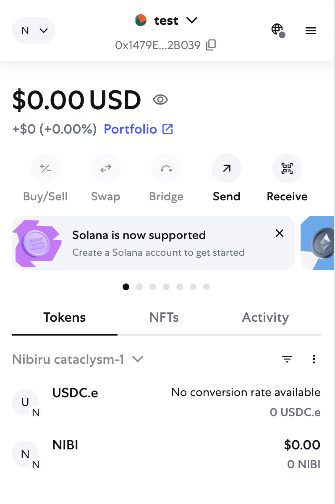

# Guide: Importing a Token on MetaMask (EVM)

This guide is a walkthrough on how to manually import a token into your MetaMask Wallet. Commonly used assets in the Nibiru EVM ecosystem can be found [here](../wallets/common-tokens-evm.md). {synopsis}

## Walkthrough

1 | Open your MetaMask and ensure you are connected to Nibiru Cataclysm-1 Mainnet. If you are not, the EVM RPC is: `https://evm-rpc.nibiru.fi`

2 | After ensuring you are connected to Nibiru Cataclysm-1 EVM Mainnet, select the token view and click on the three dots to open the dropdown and click "Import tokens" 

3 | Select "Nibiru cataclysm-1", or your own given name, under the network selector. Paste the token's contract address under the contract address selector. Wait, do not click next. In this demonstration, we will import `0x0829F361A05D993d5CEb035cA6DF3446b060970b` (Stargate USDC)

4 | In time, the token information will populate your MetaMask.

5| Once the information has populated your MetaMask, click "Next" and on the following screen, click "Import". Your imported token should now be visible in your MetaMask Wallet.

