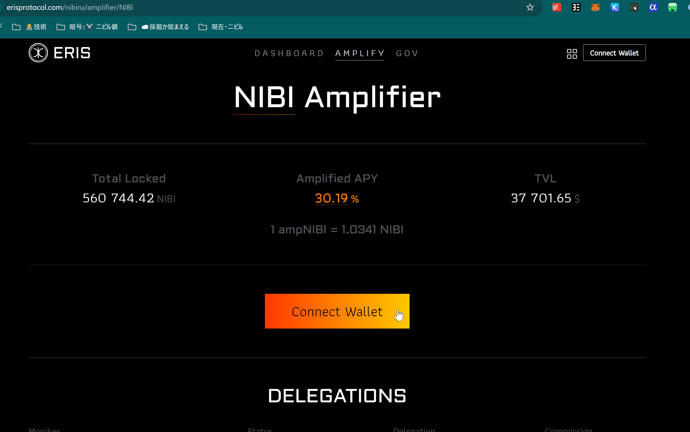
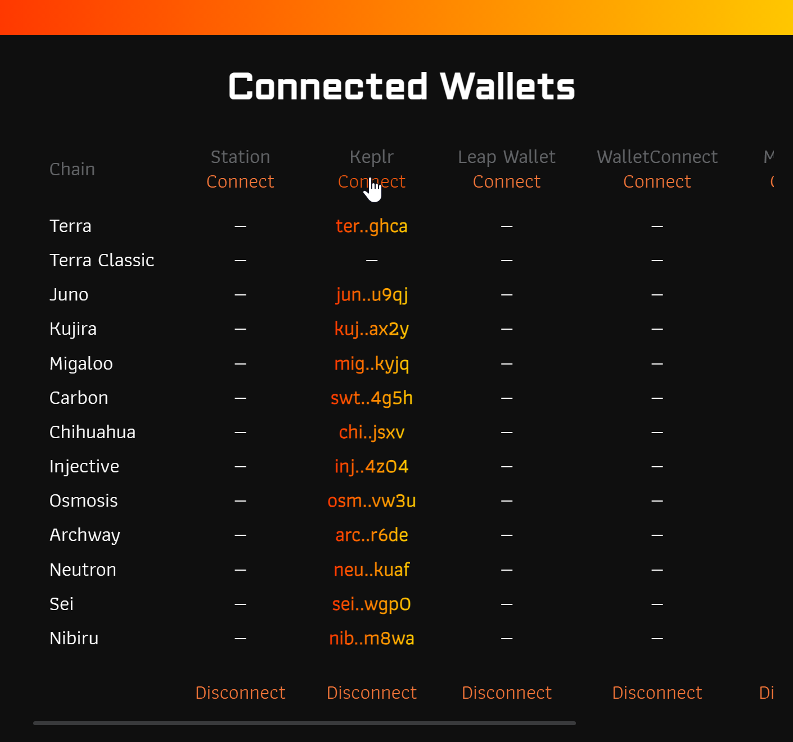
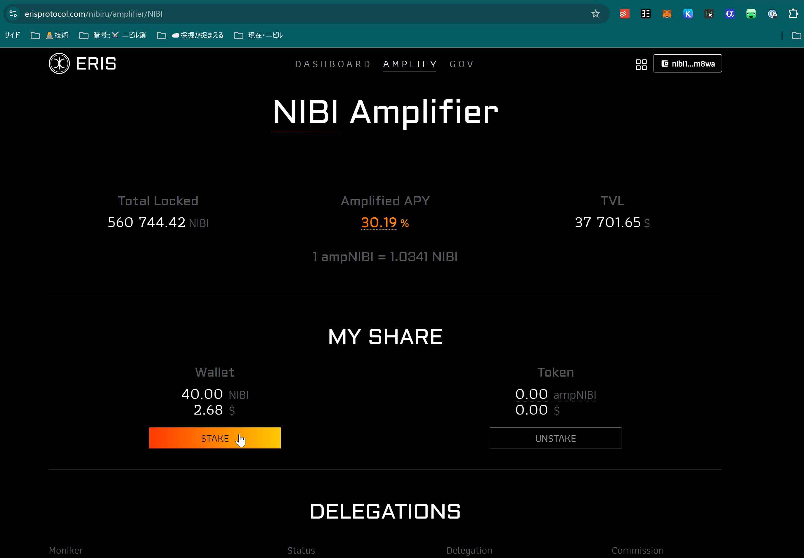
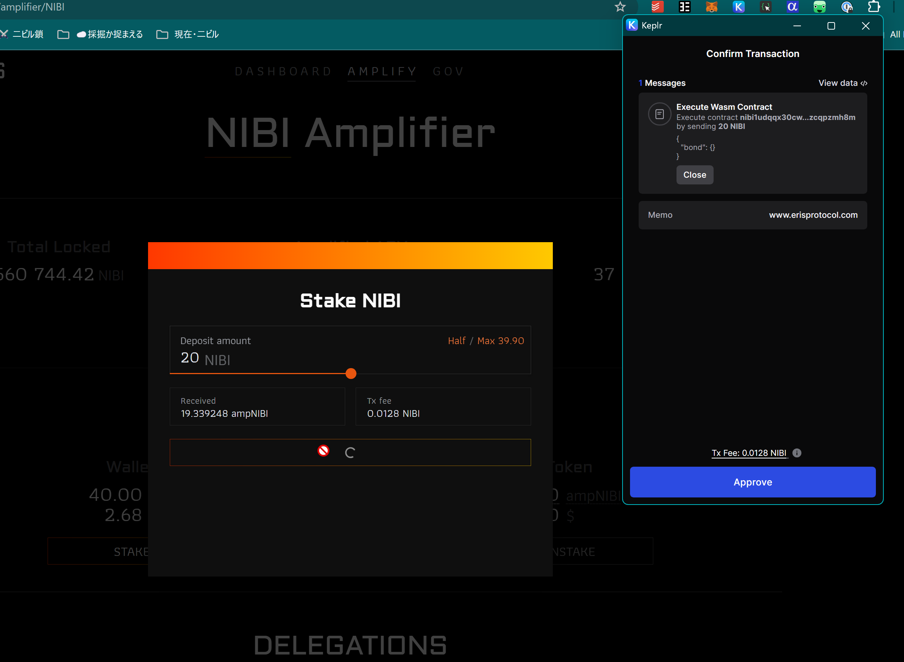

# Guide: Liquid Staking on Nibiru (stNIBI)

This guide is a walkthrough on how to liquid stake NIBI via Eris Protocol and
[receive stNIBI](../learn/liquid-stake/index.md). Liquid staking allows you to
put NIBI to work and earn rewards automatically while retaining the ability to
trade or use stNIBI in blockchain applications. {synopsis}

## Liquid Staking Nibiru with Eris Protocol

1 | Head to the [Eris Protocol
application](https://www.erisprotocol.com/nibiru/amplifier/NIBI) to access the
"Amplifier" on Nibiru.

2 | Connect one of the available [Nibiru wallet options](../wallets/index.md).

3 | After accepting the connection requests to the connected wallet, you can
click "Stake" to liquid stake. 

4 | Select a deposit amount and click the button to broadcast a transaction that
invokes the Eris smart contracts.

## More on Liquid Staking through Eris Protocol

- [Liquid Staked Nibiru (stNIBI)](../learn/liquid-stake/index.md)
- [Follow Eris Protocol (`@eris_protocol`) on Twitter/X](https://x.com/eris_protocol)
- [Everything You Need to Know About Staking Yield on Nibiru](../learn/staking.md)
- [Security and Audits - Eris Protocol](../learn/liquid-stake/index.md#security-and-audits)
