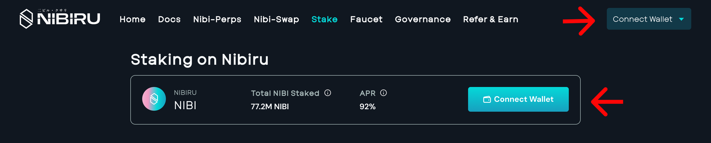
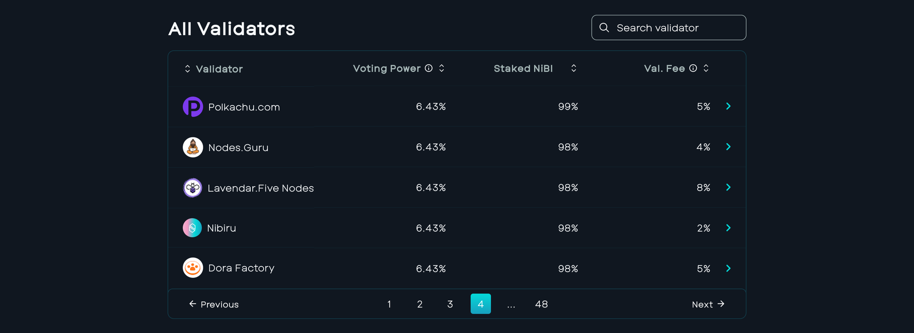
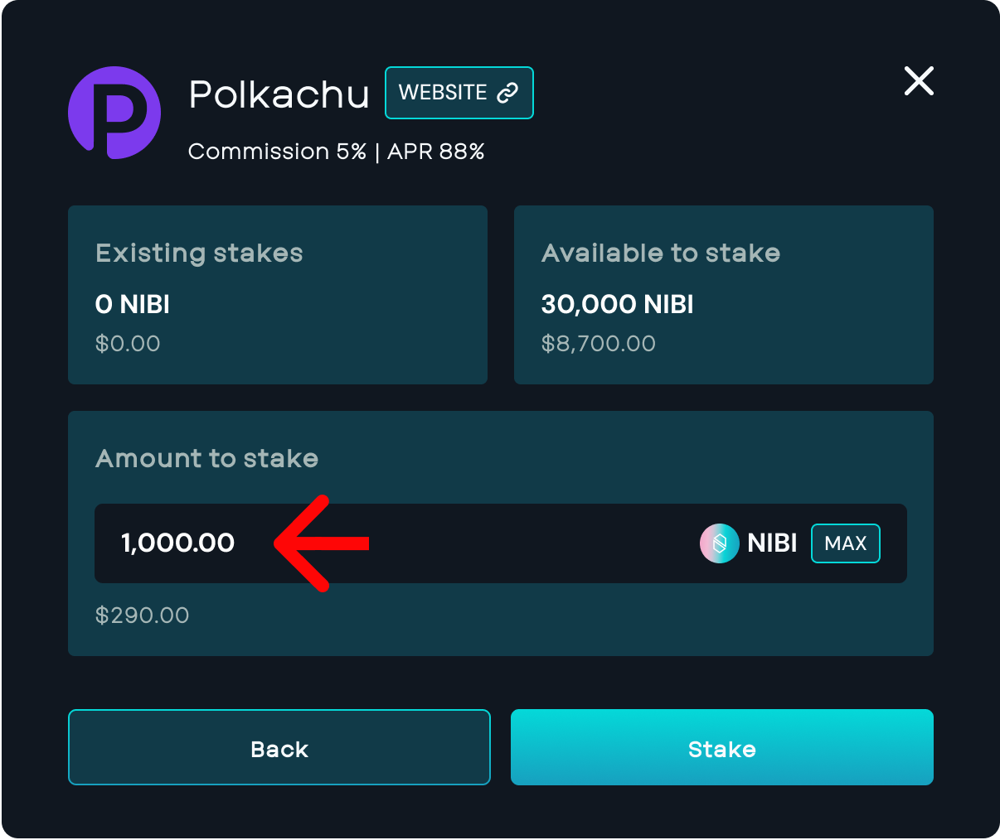
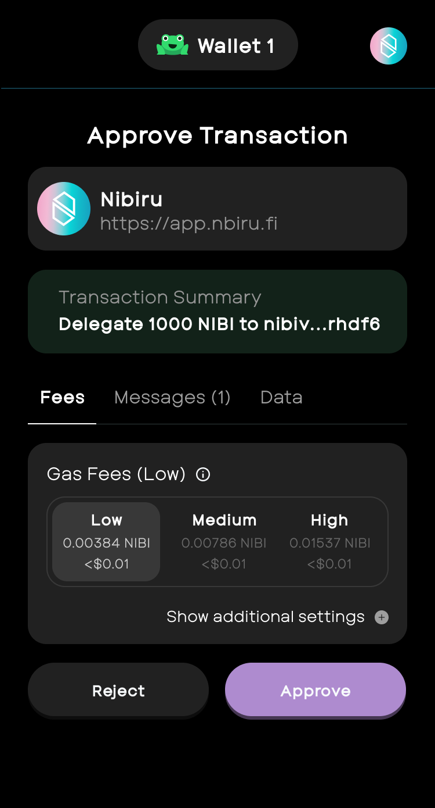
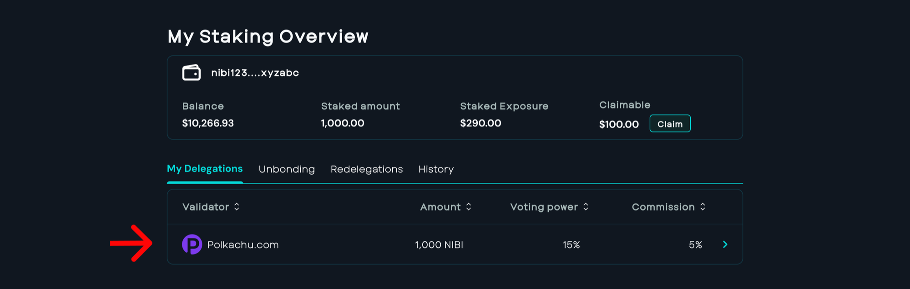
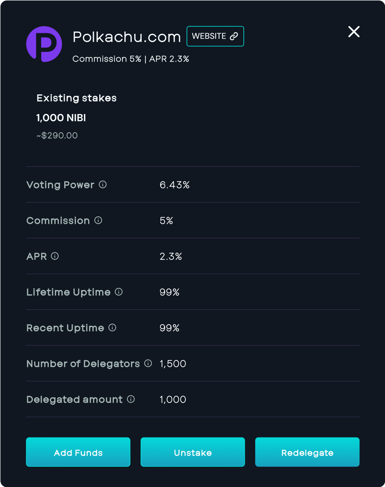
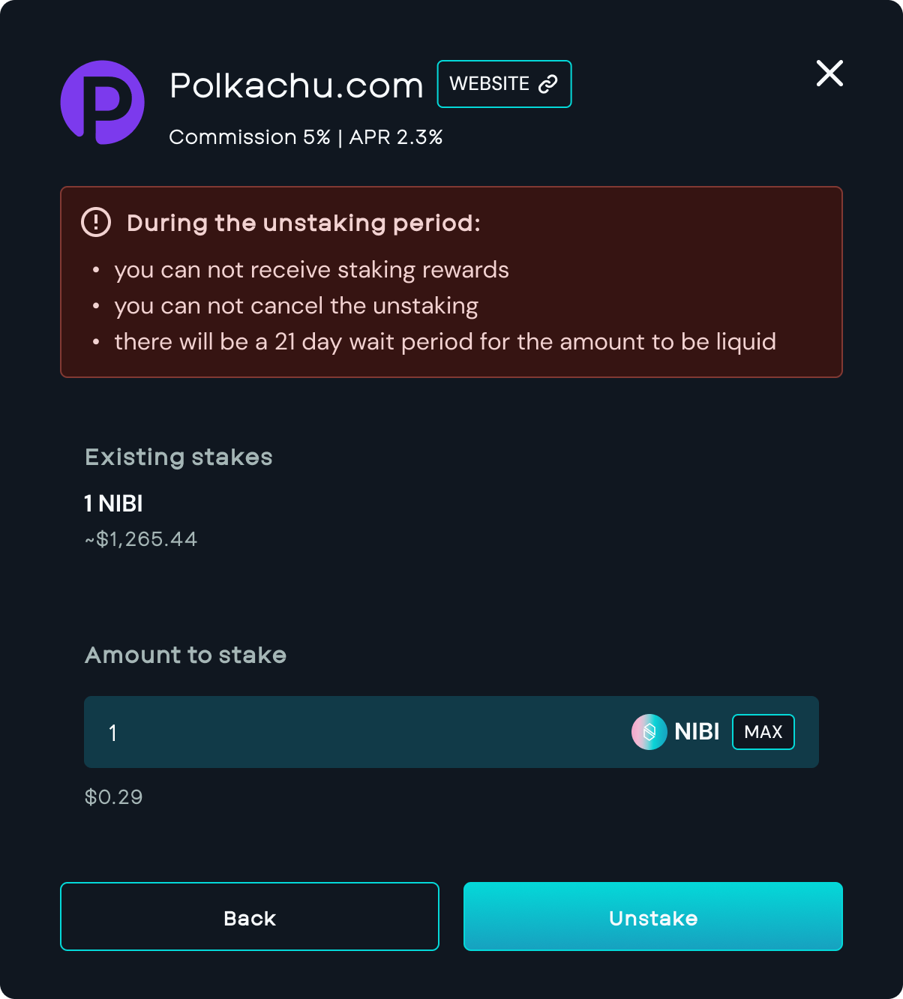
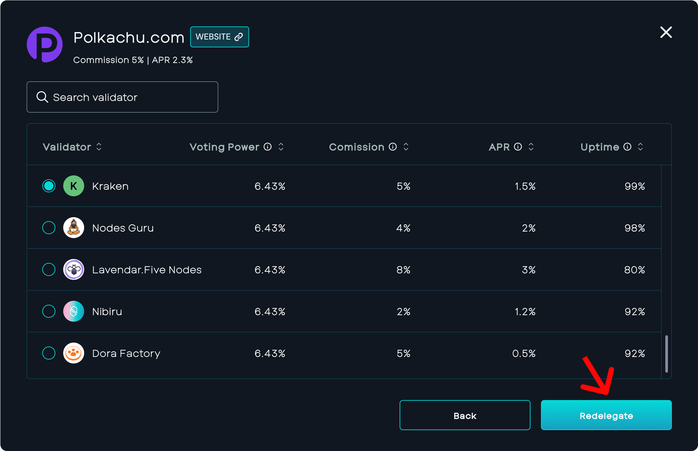

# Guide: Staking on Nibiru

Put your [NIBI](../learn/nibi.md) to work and earn rewards for staking. Staking lets you earn rewards
by helping verify transactions and secure the Nibiru blockchain. {synopsis}

<!-- ## Pre-requisite -->

<!-- - [Anatomy of an SDK application](./README.md) {prereq} -->
<!-- - [Lifecycle of an SDK transaction](./README.md) {prereq} -->

#### Table of Contents
[[toc]]

## How to stake NIBI

1. [Visit the Nibiru Web App](https://app.nibiru.fi/stake) either from a desktop
   or mobile device.
2. Click “Connect Wallet” and use Leap or Keplr.
   

3. Choose a validator to stake with. While you don't have to pick Nibiru's validator, there are many validators available for delegation.
   

4. Insert the amount of NIBI to stake
   

5. Click “**Stake”**
6. Next, **“Approve”** the transaction
   

7. You will now see the validators you've staked NIBI to.
   

## How to unstake NIBI or switch validators

1. Under “My Delegations,” select the Validator you want to unstake from.
2. You’ll see the option to either “Unstake” or “Redelegate” your NIBI.
   

3. If you “Unstake” NIBI, the unbonding process will take 21 days.
   

However, if you choose to “Redelegate” NIBI, you can stake it with another validator.

   

4. After 21 days of initiating the unstake, the NIBI will automatically return to the address.

## Liquid Staking on the Horizon

Soon, users will have the ability to participate in Liquid Staking. Liquid staking opens up the doors for many new possibilities:

1. Staking tokens across different DeFi protocols, allows users to explore new investment opportunities while still earning passive income from staking.
2. Liquid Staking improves the scalability of blockchain networks by allowing more efficient use of capital. This aspect is crucial for the sustained growth and adoption of blockchain tech across different sectors.

## Related Questions

#### 1. How often do users receive staking emissions?

   Stakers receive emissions from the network accrued over the day (once per 24 hours), and the rate of emissions adjusts every 30 days.

#### 2. How often do users get regular rewards?

   Rewards are distributed daily.

#### 3. Do users need to claim staking rewards manually or are they claimed automatically?

   Users must manually claim their staking rewards through the Nibiru Web App UI.

#### 4. Are coins frozen when a user stakes them?
  
   Staked tokens become non-transferable and illiquid.

#### 5. Is there an unstaking period?

   Yes, there is a 21-day period for unstaking also known as unbonding. However, the unbonding process can be canceled at any time.

#### 6. Can users re-delegate from one validator to another?

   Users can re-delegate from one validator to another. The first re-delegation occurs immediately, but subsequent re-delegations (from the 2nd to the 3rd delegator) require a 21-day waiting period.

## About Nibiru Chain

Nibiru is a breakthrough L1 blockchain and smart contract ecosystem sporting superior throughput and unparalleled security. Nibiru aims to be the most developer-friendly and user-friendly smart contract ecosystem, leading the charge toward mainstream Web3 adoption by innovating at each layer of the stack: dApp development, infra, consensus, a comprehensive dev toolkit, and value accrual.

---

Disclaimer

> No representation or warranty is made, express or implied, with respect to the
future performance of any digital asset, financial instrument or other market or
economic measure. Recipients should consult their advisors before making any
investment decision. The Nibiru Foundation (MTRX Services, Ltd.) is not
registered or licensed in any capacity with the U.S. Securities and Exchange
Commission or the U.S. Commodity Futures Trading Commission.
