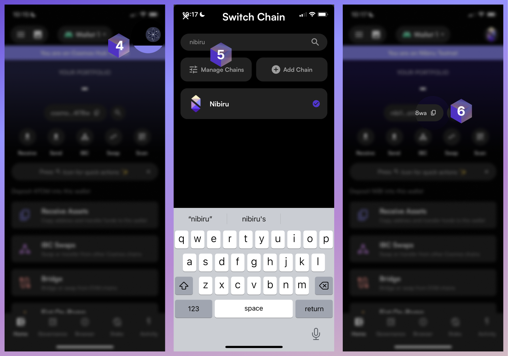

# Create a Nibiru Wallet Address

If you're looking to obtain a Nibiru Chain address, you're in the right place.
{synopsis}

There are a few steps you'll need to complete to get a Nibiru wallet address.

1. Install a **wallet** extension or application.
2. Create an **account** or recover an existing one using a **mnemonic phrase**.
3. Connect to your desired instance of Nibiru Chain. For example, mainnet,
   permanent testnet, etc.
4. Copy your Nibiru address.

## 1 & 2 | Wallet Installation and Account Creation 

Follow these tutorials to set up Leap wallet or Keplr if you have not already:

- [How-To: Setup Leap Wallet (For Beginners)](./setup-leap.html) 
- [How-To: Set Up Keplr Wallet (For Beginners)](./setup-keplr.html) 

## 3 | (Mobile) Copy your Nibiru Address

Our **recommended wallet for Nibiru is Leap Wallet**. After installing the
mobile app on Android or iOS and creating an account, you can continue on to
complete the following steps.

:::tip
Note that if you instead use Keplr, you'll need to upgrade to Keplr V2. 
:::

:::tip
Q: Is there a difference between the address for mainnet and testnet?  
A: **No, the address is the same for both networks**. While the address itself may be the same, transactions and accounts on testnet and mainnet are separate. Transactions intended for one network do not affect the other.
:::

## 3 | (Desktop) Connect to Nibiru Chain

Open [Nibiru's Web App (app.nibiru.fi)](https://app.nibiru.fi) and connect your
wallet. 

## 4 | (Desktop) Copy your Nibiru Address

You can copy your address from a wallet browser extension or from this
button on the top-right:

<!-- ## Troubleshooting -->
<!---->
<!-- ... -->
