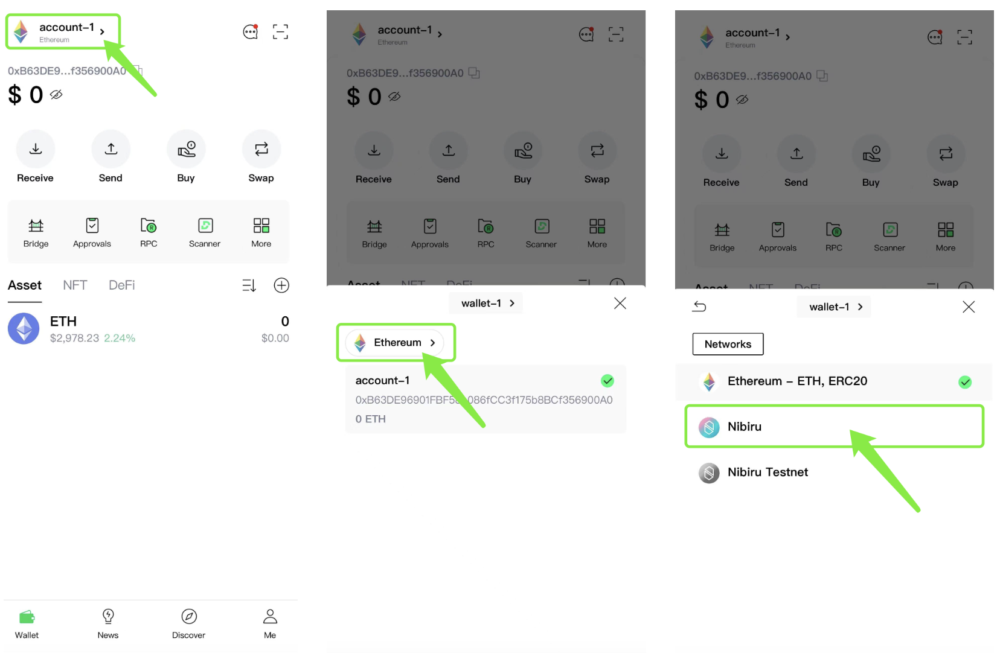
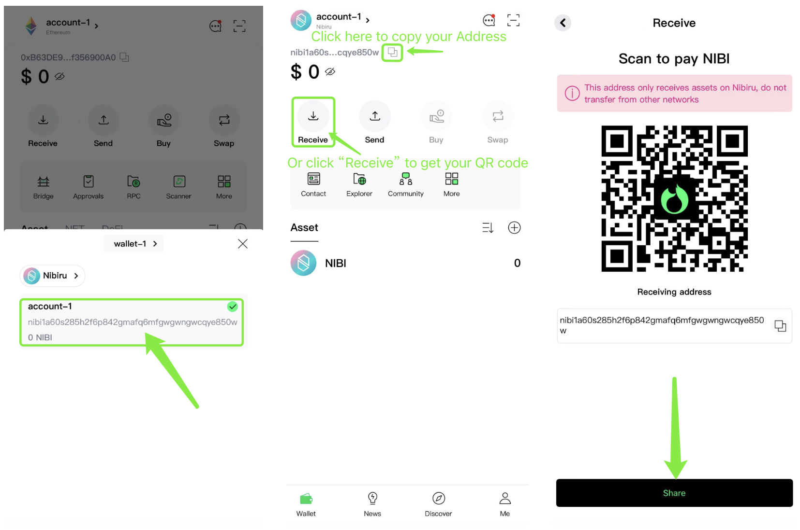

# How to Set Up Fox Wallet

- [Install and Create a Fox Wallet](#install-and-create-a-fox-wallet)
- [Fox Wallet Mobile: Finding Your Nibiru Chain Address](#fox-wallet-mobile-finding-your-nibiru-chain-address)

## Install and Create a Fox Wallet

Download Fox Wallet from their official [website](https://foxwallet.com/).

<iframe width="100%" style="aspect-ratio: 14/9; border-radius: 1.5rem;" src="https://www.youtube.com/embed/IprCHXjexkQ?si=1Fwbfx2Mbuu5S3m2" title="Install And Create Your FoxWallet" frameborder="0" allow="accelerometer; autoplay; clipboard-write; encrypted-media; gyroscope; picture-in-picture; web-share" allowfullscreen></iframe>

## Fox Wallet Mobile: Finding Your Nibiru Chain Address

Completing the above 6 steps will copy your "nibi" address to your clipboard. A
testnet address and mainnet address for Nibiru are identical. 

