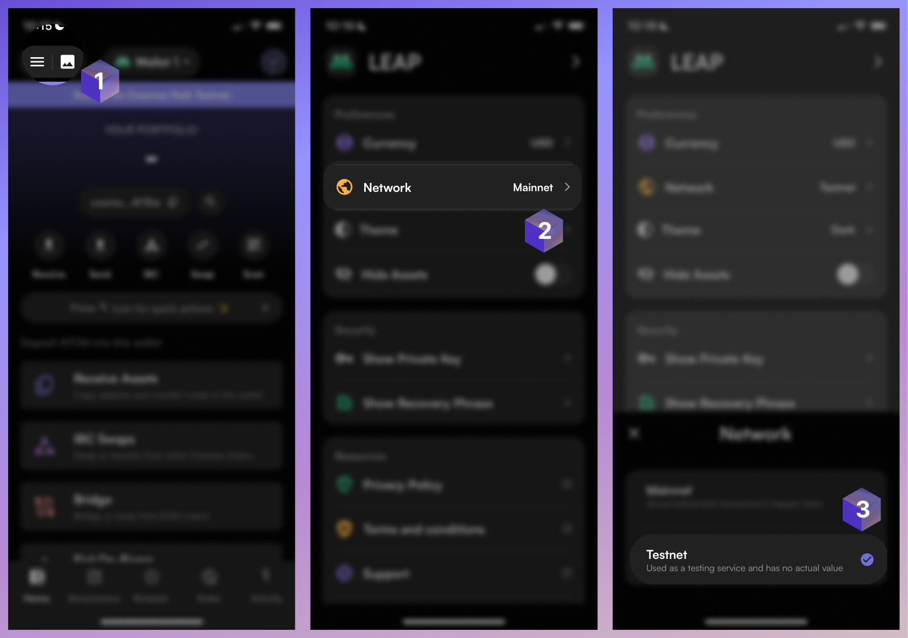
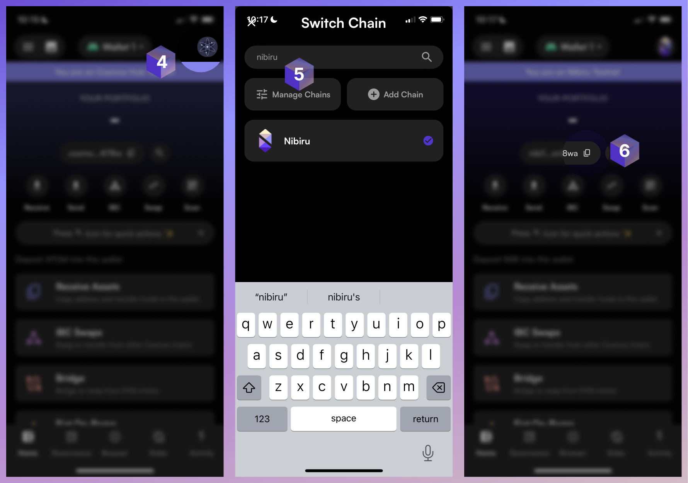

# How to Set Up Leap Wallet

Setup guides on the recommended Nibiru Chain wallet. {synopsis}

- [Install and Create a Leap Wallet](#install-and-create-a-leap-wallet)
- [Leap Wallet Mobile: Finding Your Nibiru Chain Address](#leap-wallet-mobile-finding-your-nibiru-chain-address)

## Install and Create a Leap Wallet

<iframe width="100%" style="aspect-ratio: 14/9; border-radius: 1.5rem;" src="https://www.youtube.com/embed/ocubHAZil2A" title="Install And Create A Leap Wallet | Up And Running In The Cosmos" frameborder="0" allow="accelerometer; autoplay; clipboard-write; encrypted-media; gyroscope; picture-in-picture; web-share" allowfullscreen></iframe>

## Leap Wallet Mobile: Finding Your Nibiru Chain Address

Completing the above 6 steps will copy your "nibi" address to your clipboard. A
testnet address and mainnet address for Nibiru are identical. 

## Leap Wallet (Desktop)

On Desktop, simply follow the desktop-specific instructions on the ["Create a Nibiru Wallet Address"](./create-addr.html) page.
