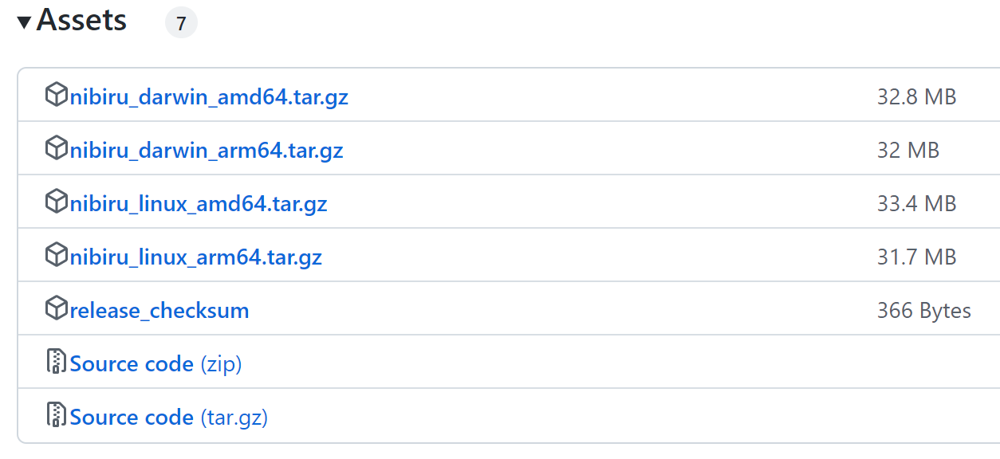

# Install the Nibiru CLI

{{ $frontmatter.description }}

<!-- toc -->
- [Option 1: Install with Bun or npm](#option-1-install-with-bun-or-npm)
- [Option 2: Use the Bash installer](#option-2-use-the-bash-installer)
- [Option 3: Download a release binary](#option-3-download-a-release-binary)
- [Option 4: Build from source](#option-4-build-from-source)
  - [Install build tools](#install-build-tools)
  - [Install Go](#install-go)
  - [Compile the source code](#compile-the-source-code)
- [Post-installation](#post-installation)
- [Local development](#local-development)
- [Docker Engine](#docker-engine)
- [Next steps](#next-steps)
<!-- tocstop -->

## Option 1: Install with Bun or npm

Install the CLI globally with [Bun](https://bun.sh/docs/installation):

```bash
bun install --global @nibiruchain/nibiru
nibiru version
```

Or use npm:

```bash
npm install --global @nibiruchain/nibiru
nibiru version
```

These commands install the npm default version. The package supports Linux and
macOS on x64 and arm64. On Windows, use WSL. Keep optional dependencies enabled
so the package manager installs the binary for your platform.

The launcher requires [Node.js](https://nodejs.org/en/download) on your `PATH`,
including when you install with Bun. It exposes the command `nibiru`, which runs
the native `nibid` binary and forwards all arguments. Replace `nibid` with
`nibiru` when following the other CLI guides.

## Option 2: Use the Bash installer

```bash
curl -s https://get.nibiru.fi/! | bash
```

To install a specific version:

```bash
curl -s https://get.nibiru.fi/@v2.19.0! | bash
```

The `!` suffix moves the binary to `/usr/local/bin` and may prompt for your
`sudo` password. Omit `!` to download without moving the binary.

## Option 3: Download a release binary

Download an archive from the [Nibiru releases](https://github.com/NibiruChain/nibiru/releases)
page. Expand the release's assets to find the download links. Choose `darwin`
for macOS or `linux` for Linux and WSL.

Check your CPU architecture:

```bash
uname -m
```

Use an `amd64` archive for `x86_64`, or an `arm64` archive for `arm64` or `aarch64`.



For example, extract the Linux amd64 archive for version `v2.19.0`:

```bash
tar -xzf nibid_2.19.0_linux_amd64.tar.gz
```

Add the directory containing `nibid` to your shell configuration, replacing
`/path/to/nibid-directory` with its actual path:

```bash
export PATH="/path/to/nibid-directory:$PATH"
```

Or install the binary in `/usr/local/bin`:

```bash
sudo install -m 755 nibid /usr/local/bin/nibid
```

## Option 4: Build from source

### Install build tools

Install Git, a C compiler, and [just](https://github.com/casey/just#installation).
On macOS, install the Command Line Tools and `just`:

```bash
xcode-select --install
brew install just
```

On Ubuntu or WSL, install Git and the compiler tools, then install `just`
using its installation guide:

```bash
sudo apt-get update
sudo apt-get install --yes git build-essential
```

### Install Go

Install Go with [Homebrew](https://brew.sh):

```bash
brew install go
go version
```

For other installation methods, follow the [official Go installation instructions](https://go.dev/doc/install).
Use a Go version that satisfies the selected release's `go.mod` requirement.

### Compile the source code

Clone the repository, select the release, and install `nibid`:

```bash
git clone https://github.com/NibiruChain/nibiru
cd nibiru
just install
```

## Post-installation

For Bun or npm installs, check the version and available commands:

```bash
nibiru version
nibiru --help
```

For the Bash installer, manual download, or source build, use:

```bash
nibid version
nibid --help
```

If your shell cannot find the command, check the installation's bin directory:

- Bun: run `bun pm bin --global` and add that directory to your `PATH`.
- npm: run `npm prefix --global` and add the returned directory's `bin` subdirectory to your `PATH`.
- Bash installer: check `/usr/local/bin` if you used the `!` suffix.
- Manual download: add the directory where you extracted `nibid`.
- Source build: add Go's bin directory as described in the tip below.

::: tip
If you see `nibid: command not found` after building from source, add Go's bin
directory to your `PATH`:

```bash
export PATH="$(go env GOPATH)/bin:$PATH"
```

Save this line in your shell configuration and reload it.
:::

## Local development

Print and run the embedded single-node localnet script:

```bash
nibid localnet --script | bash
```

For Bun or npm installs, use:

```bash
nibiru localnet --script | BINARY=nibiru bash
```

Setting `BINARY=nibiru` makes the script use the npm launcher for node commands.
Stop any running localnet before running the script. It resets local chain data
under `$HOME/.nibid` before starting the node. Open another terminal to query the
local chain or send transactions.

## Docker Engine

Some repository workflows use Docker containers. Follow the
[Docker Engine installation instructions](https://docs.docker.com/engine/install/)
when working with those workflows.

---

## Next steps

- [Use the Nibiru CLI][page-cli]
- [Set up Cosmovisor][page-cosmovisor]
- [Run a full node][page-full-node]
- [Set up a validator][page-validator]
- [Learn about the node daemon][page-node-daemon]

[page-cosmovisor]: ../../run-nodes/full-nodes/cosmovisor.md
[page-full-node]: ../../run-nodes/full-nodes/index.md
[page-validator]: ../../run-nodes/validators
[page-node-daemon]: ../../run-nodes/full-nodes/node-daemon.md
[page-cli]: ./
