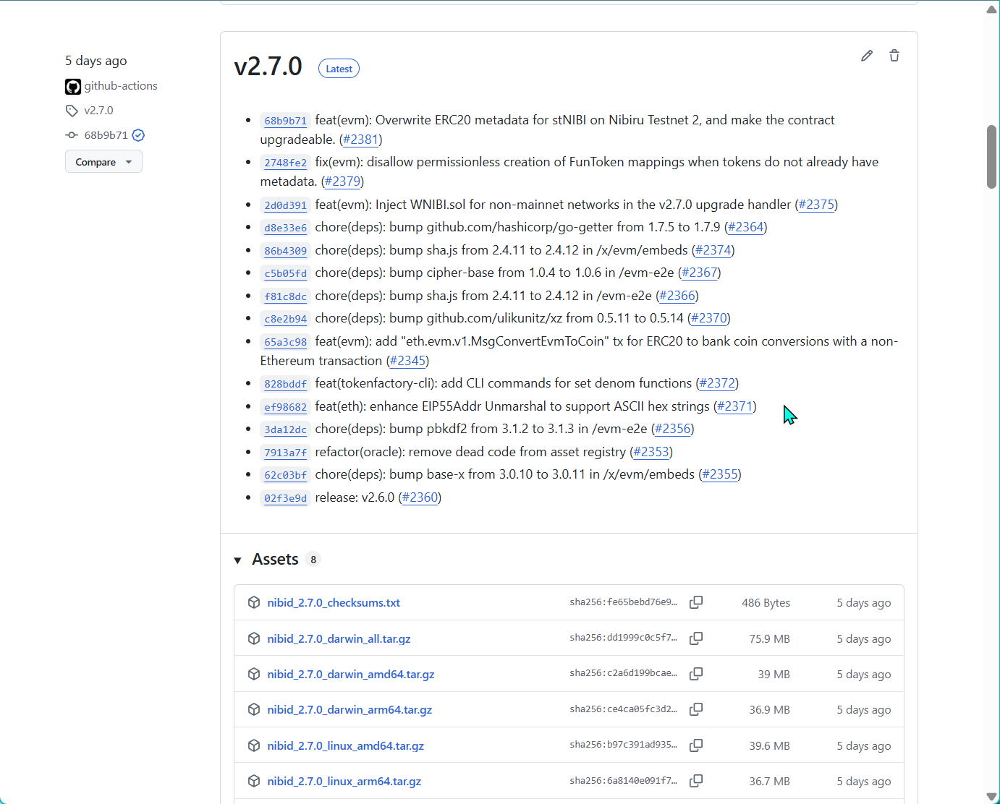
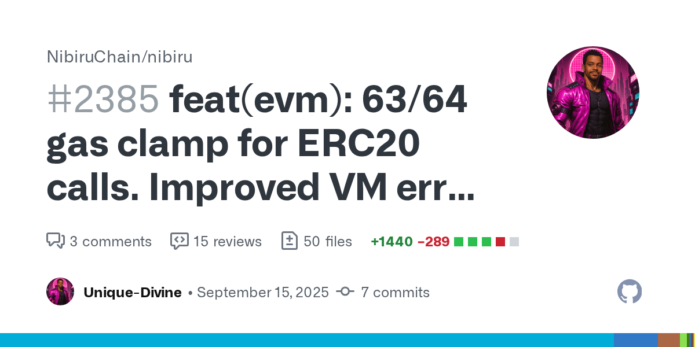
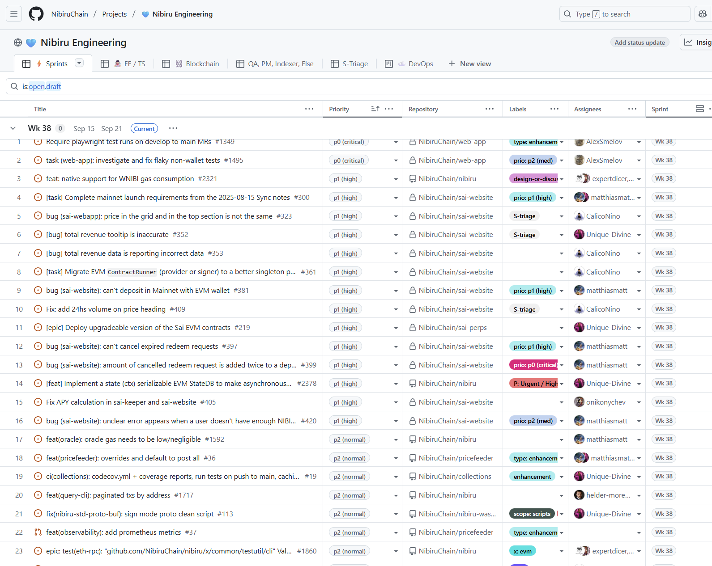

# NAN 001: Genesis of NANs, Nibiru v2.7.0, and BTC on Nibiru

*Posted by [Unique](https://uniquedivine.com/web3/nibiru/nibi-inc/) on 2025-09-19*

> *[Update #3 - May 2025](./nibiru-eco-update-03.md) < [Nibiru Advancement Notes (NANs)](./index.md) > [NAN 002](./nan-002.md)*

<!-- > *[Nibiru Advancement Notes (NANs)](./index.md) > [NAN 001](./nan-001.md) > [NAN 002](./nan-002.md)* -->

The team at Nibiru has been building nonstop for a few years now, since well
before the project left stealth. That's great that we've been active. But in my
opinion, we've done a poor job of providing updates about our progress to keep
everyone in the loop.

This post marks the "genesis" of **Nibiru Advancement Notes (NANs)**, a recurring
series meant to fix that gap. NANs are not marketing updates or improvement
proposals. They're working notes that capture the context, decisions, tradeoffs,
lessons, and nuance that comprises internal discusssions and meeting minutes but
gets entirely lost in public-facing communication.

My goal here is simple. More transparency, clearer insight into process, and the
creation of a living, semi-structured history of how and why Nibiru evolves over time.

## Nibiru v2.7.0 Upgrade

The Nibiru v2.7.0 upgrade passed as its on-chain proposal and went live on Thursday, Sep 18, 2025. Everything went smoothly.

This upgrade was bigger than most, particularly because it gets executed differently depending on which network it's applied to. The upgrade does one thing for a local instance of the Nibiru node software and a different thing on testnet or on mainnet.

<figure style="margin: 2rem 0;">

<figcaption class="docs-figcaption"> Nibiru Release v2.7.0 on GitHub</figcaption>
</figure>

#### Highlights

The upgrade brought in two main features. The first new feature was changing the
logic for cross-VM fungible tokens to handle WNIBI automatically.

In any Bank ⇄ EVM conversions that happen outside of
an EVM precompile, NIBI ⇄ WNIBI is handled like other fungible token mappings.
And, nodes that run the Nibiru software on testnets or other networks come with
WNIBI.sol preloaded at the same contract address it would normally have on
mainnet. This is good because it makes the chain easier to test, and rigorous
testing is the primary defense anyone has against hacks.

The second new feature we added was a new transaction type that enables certain non-EVM accounts to send and manage ERC20 tokens that may be sent to them. When I say "Non-EVM accounts", I mean Wasm contracts and accounts with public key type "`cosmos.crypto.secp256k1.PubKey`" created with Keplr, Leap, or general IBC interactions.

Sai, a trading app building on top of Nibiru, is implemented in Rust contracts that compile to Wasm with a Solidity wrapper and full EVM support. This new transaction was the last piece of the puzzle in bringing Sai's first version to mainnet. Well, that and making sure the app works properly. The dev team is continuing to grind on that to see that the app can be brought to during the Block Party Season 2 campaign.

#### Bug Squashing

Working on these two changes for v2.7.0, we also discovered and resolved other bugs that have pained app developers in tandem.

One bug related to "out of gas" errors that erased other information from Ethereum transactions on Nibiru. And another bug where creating fungible token mappings on Nibiru was highly error-prone because the transaction was not defensive.

A user could create some token in either virtual machine (VM), an ERC20 token or a Bank Coin, and forget to give it a "name" or "symbol" metadata or forget to set non-zero decimals. Then creating the fungible token counterpart in the other VM would result in a newly created token with missing metadata.

All of this has been resolved and cleaned up.

#### Impact on Users/Builders & Next Steps

Developers can expect smoother cross-VM behavior and less friction when deploying
apps. While no immediate patch is needed, the roadmap toward v2.8 and v3 already
includes further improvements for mainnet and developer experience.

## Bitcoin Bridging: Coinbase Wrapped BTC (cbBTC) on Nibiru

Our team finished the hard part: convincing teams of builders and miners to
migrate BTC liquidity over to Nibiru. The only problem was that we didn't have a
simple and trustworthy onboarding path for BTC to make its way to Nibiru.

**First Attempt: WBTC**. Initially, we thought WBTC would be a shoe in since it's
already got a LayerZero OFT that could be connected to us. But it's not
permissionless.  It turned out there was huge paywall standing
in the way of us bringing this form of BTC and BTC yields to Nibiru.

Back to the drawing board. Although less well known, there are several competitors to WBTC as wrapped Bitcoin alternatives that would still give Nibirun end users the onboarding experience we're looking for.

**Second Attempt: tBTC**. The token tBTC would've been great to use, but that
required a new Wormhole integration, or it would force people to have to bridge
twice. Once to a "neighboring" blockchain that has native token issuance via
Womhole, and then again to get to or from Nibiru. Not really an option for us.

**Third Attempt: BTC.b**. At this point, we were growing disillusioned with
permissioned apps being marketed as permissionless. Some of our team members came
to Nibiru from Avalanche, so we then got in touch with Ava Labs about using
BTC.b, one of the larger wrapped Bitcoin tokens coming from the Bitcoin
blockchain over to Avalanche for its peg.

BTC.b had what we needed, an OFT contract under the management of a team that
supports new integrations, and noteworthy usage and liquidity up into the tens of
millions. We came to find out that BTC.b is largely *abandoned* in terms of its
aptitude for integrations with new chains. Or maybe abandoned is too extreme.
"Dormant" would be more accurate.

**Final Path: cbBTC**. We finally iterated our way to Coinbase Wrapped BTC (cbBTC) from this continued
effort. It had traction, was paired against the right assets on exchanges, and
had a clear pathway for us to launch OFTs for cbBTC without being blocked by the
slowness of other teams. This was the pragmatic choice, and it worked.

So cbBTC became Bitcoin on Nibiru.

We set up bridging for the new token both on Stargate and in the Nibiru web app.
And there's some starter liquidity for `cbBTC:stNIBI` and `uBTC:cbBTC` on Oku on
Nibiru.

## Nibiru documentation improvements

Clear docs are important just like clear code. As of late, we focused on making
Nibiru's documentation faster, easier to navigate, and more complete.

1. Layout: Reorganized with a more intuitive structure.
2. Themes: Now supports both light and dark mode.
3. Performance: Shortened page load times cut significantly.

We also fixed a common pain point with oracle feeds. I noticed that builders on
Nibiru often have trouble finding the oracle feed information, more so for the
EVM in particular. We've updated the content there so that, even if someone ends
up on the wrong page, they can still easily find information on the
ChainLink-like contracts that many apps will rely upon.

We've helped set up several omnichain fungible tokens (OFTs) powered by LayerZero
on Nibiru too. And I think those have a similar problem as the oracle contracts,
where it's hard to find reference info. We're working to add detailed, actionable
documentation for all of the key tokens working their way into the Nibiru
ecosystem.

## Composite Oracle Feeds

One gap we saw with oracle feeds was that a single pair often isn't enough. For
example, you might want `yieldBTC/USD`, but the raw feeds available are
`yieldBTC/BTC` and `BTC/USD`. Builders were either stitching those together
off-chain or relying on external middleware, which creates friction and extra
trust assumptions.

To solve this, we rolled out composite oracle feeds. These let multiple oracle pairs be combined into a single Chainlink-style feed that's ready to use on-chain. It keeps things standardized and familiar for developers who already know how to integrate Chainlink data feeds, while pushing more of the heavy lifting into the protocol itself.

<figure style="margin: 2rem 0;">

<figcaption class="docs-figcaption">Pull Request #2385 · NibiruChain/nibiru - evm: 63/64 gas clamp for ERC20 calls. Improved VM error surfacing. Add composite Chainlink-like oracle</figcaption>
</figure>

Composite feeds are already live in production and serving real price data. That means apps can plug into them directly without custom logic, and integrations get simpler, safer, and more consistent. This is part of a broader effort to reduce rough edges for builders and make Nibiru's oracle system more flexible as new assets come online.

## More on the Sai Perps App

We tend to work in one-week sprints. And the past few weeks have been a huge push
for the team to get Sai in working order for a mainnet release with the launch of
Nibiru Block Party season 2. 

But with several developers working on overlapping code at rapid speeds, we
encountered some challenges where we didn't have the Sai app in a working state
on the upstream, dev branch. That made it hard to do quality assurance.

<figure style="margin: 2rem 0;">

<figcaption class="docs-figcaption">Nibiru Engineering GitHub Project</figcaption>
</figure>

So our frontend and QA devs worked on solid per-merge QA and proposed what I'll
call a "surgeon's checklist" for us to help prevent regressions. It's a
lightweight process not yet automated for lack of time, but it's helping make the
app more stable as development continues.

Although I'm not yet happy with the state of the app, I do commend the work
output of the devs working on Sai, covering everything from a novel Multi-VM
indexer, surfacing of new and crucial improvements for Nibiru, database and API
construction, and pumping out frontend changes with fewer than 5 folks working on
it.

## Closing Thoughts

That's it for now. More to come soon.

## Related Content 

- [All Nibiru Advancement Notes (NANs)](./index.md#nibiru-advancement-notes-nans)
- [Next Update - NAN 002: Liquidity Surges, New Omnichain Fungible Tokens, Node Economics, and Sai's Path to Mainnet](./nan-002.md)

