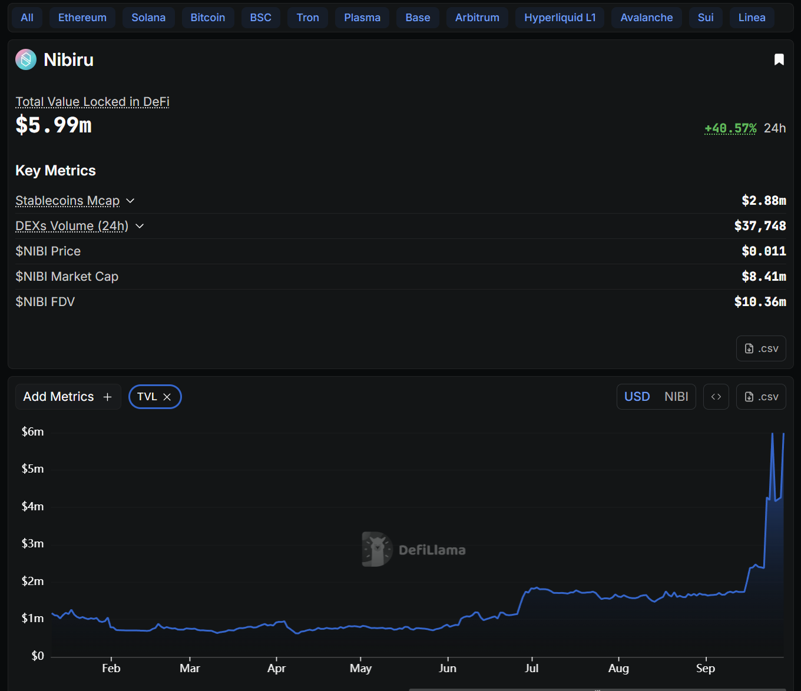
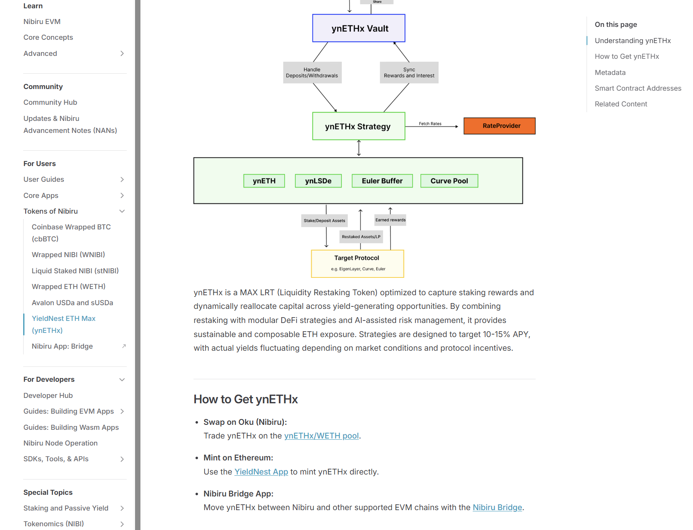

# NAN 002: Liquidity Surges, New Omnichain Fungible Tokens, and Sai's Path to Mainnet

*Posted by [Unique](https://uniquedivine.com/web3/nibiru/nibi-inc/) on 2025-09-28*

<!-- > *[NAN 001](./nan-001.md) < [Nibiru Advancement Notes (NANs)](./index.md)* -->
> *[NAN 001](./nan-001.md) < [Nibiru Advancement Notes (NANs)](./index.md) > [NAN 003](./nan-003.md)*

A few months ago, Nibiru’s onchain activity was measured in its earliest
millions. Today, liquidity is multiplying, yield assets are arriving, and the
first native trading app is nearing launch. NAN 002 picks up where the story left
off. Liquidity is scaling, new omnichain assets are live, and Sai is approaching
mainnet readiness. Each piece strengthens the others, and together help create a
more usable and resilient Nibiru.

## Nibiru Liquidity on the Rise

Nibiru’s tracked liquidity has grown sharply since NAN 001, rising from about $1
million to over $5 million. More than half of that growth came from over $2.5
million in stablecoin inflows now circulating onchain.  

<figure style="margin: 2rem 0;">

<figcaption class="docs-figcaption">Nibiru total value locked (TVL) chart on DeFiLlama as of 2025-09-28.</figcaption>
</figure>

A large share of the deposits have gone into automated liquidity management
projects like Ichi, Gamma Strategies, and Steer Protocol. These teams provide
easy-to-use vaults that handle the complexities of concentrated liquidity on
Uniswap V3, making it possible for more participants to earn from passive LPing
without needing to manage positions by hand. Most of this activity has been
visible through pools on Oku, Nibiru’s Uniswap V3 deployment.  

Just as Block Party Season 1 brought several live apps, Season 2 is already
bringing deeper liquidity, new launches, and Sai, the first trading app built by
the Nibiru team. Although liquidity in the form of TVL is only one measure of
progress, the steady inflows signal that app builders and partners are
committing meaningful capital to the ecosystem. This marks a clear milestone in
the chain’s evolution.

## Opening New Yield Doors: Omnichain Fungible Tokens (OFTs) on Nibiru

The primary cross-chain messaging infrastructure on the Nibiru EVM is LayerZero.
To open up ease of bridging and access to liquidity, the team worked to set up
and launch omnichain fungible tokens (OFTs) for key assets from other EVM chains.
Standard assets like USDC, WETH, and WNIBI, and also yield-bearing assets like
ynETHx, uBTC, sUSDa, and stNIBI.   

Each of these OFTs has dedicated pages on the Nibiru website that highlight
whether to obtain these assets, how to bridge them, and what their onchain
contract addresses are on chains like Base, Ethereum, and Nibiru.

<figure style="margin: 2rem 0;">

<figcaption class="docs-figcaption">Example token page for ynETHx</figcaption>
</figure>

These OFTs matter because they lower the barrier for users to onboard with
familiar assets while also widening Nibiru’s surface of passive yield
opportunities. Yield-bearing tokens in particular can compose with vaults, perps,
and other DeFi elements on the chain, giving builders more primitives to work
with.

Current highlights include:

- [Yield Nest ETH Max (ynETHx)](../../use/tokens/ynethx.md): YieldNest ETH MAX
(ynETHx) is a LayerZero OFT token representing YieldNest's ETH-based strategies.
Designed to maximize returns on ETH and LSD assets.
- [Liquid Staked NIBI (stNIBI)](../../use/tokens/stnibi.md): Liquid Staked NIBI
(stNIBI) is the liquid staked variant of the Nibiru token (NIBI). It allows users
to earn staking rewards automatically while retaining liquidity, enabling stNIBI
to be traded or used across Nibiru applications instead of being locked up.
- [Wrapped NIBI (WNIBI)](../../use/tokens/wnibi.md): ERC-20 version of NIBI.
Analogous to WETH.
- [Coinbase Wrapped BTC (cbBTC)](../../use/tokens/cbbtc.md): A wrapped Bitcoin ERC-20 token issued by Coinbase on
  the Ethereum blockchain.
- [Avalon Labs USDa and sUSDa](../../use/tokens/avalon-susda.md)
   - **USDa** is Avalon Labs' omnichain stablecoin, minted via the CeDeFi
   (Centralized decentralized finance) CDP (collateralized debt position)
   system. It can be created by depositing collateral (currently FBTC, with more
   assets to come) or by converting USDT 1:1. One of USDa's unique features is
   the guarantee of conversion back to USDT at a 1:1 ratio through the Avalon
   vault on Ethereum.
   - **sUSDa** is the yield-bearing version of USDa. Users can deposit USDa into
   the Avalon Savings Account to receive sUSDa, which accrues yield sourced from
   USDa borrowing rates and revenues from Avalon's lending platform. Yields have
   the potential to reach sustainable double-digit APRs, incentivized to
   maintain a staking ratio under 50%.

B Squared Network has also integrated uBTC, a token offering native BTC yields.
Hyperlane is the bridge used to bring uBTC to Nibiru, and there are pools to
access uBTC live on Oku. We'll soon have a page with detailed information on uBTC
as well.

## Sai Perps Updates

### End-to-End Testing Across Wasm and EVM

Sai continues to progress toward mainnet launch. One of the major steps forward
has been the addition of a new suite of end-to-end tests. These spin up a fresh
Nibiru blockchain from scratch, deploy all of Sai’s Wasm contracts, and then run
through market creation and trades across multiple order types. Because Sai is a
multi-VM app built in Wasm with full EVM support via Nibiru’s precompiles, the
tests cover both Wasm-only flows and EVM trading paths. This ensures the full
stack behaves as intended before new code makes its way upstream.

### Fixing Gas Estimation for Reliable Trade Execution

We were working through issues with selecting accurate gas values when
broadcasting trades. In practice, the app’s suggested gas limits for opening and
closing positions were often too low, leading to unnecessary “out of gas”
failures. That bug has now been fixed. Gas is dynamically estimated with a
buffer, giving traders a smoother experience with fewer failed transactions and a
more mature feel overall.

### Frontend Improvements: Loading States and Faster Queries

On the frontend, we added loading states for app startup and when switching
markets, so users see clearer feedback when new data is streaming in. At the same
time, async state management was cleaned up to cut down on redundant queries and
improve responsiveness.

### Backend Enhancements: Accurate SLP Vault Revenue and APY

On the backend, the indexer was extended to track total revenue across SLP vaults
and to generate more accurate profit and APY calculations. This makes vault
performance data more reliable and reduces discrepancies that previously came
from approximations.

### Upgradeable EVM Interface for Smooth Contract Updates

Next up is further testing of Sai using an upgradeable EVM interface. The system
will adopt a transparent proxy pattern so smart contract upgrades can happen
cleanly without requiring manual changes in the frontend. This is a near-term
milestone on the path to mainnet release.  

## Closing Thoughts

Liquidity is deepening, yield assets are finding their place onchain, and Sai is
moving closer to mainnet. Each of these threads strengthens the others: OFTs
expand the surface for passive yield, liquidity vaults make participation easier,
and Sai will showcase what's possible when trading, yield, and infrastructure
come together.

Season 2 is about proving that Nibiru can support not just launches, but
sustained usage and growth. Sai, as the first trading app built by the Nibiru
team, is expected to play a leading role here while remaining part of a broader
ecosystem puzzle.

The purpose of NANs is to document this momentum clearly and consistently. If you
have feedback or questions, reach out on [Telegram, Discord, or
directly](../../community/index.md). These notes are meant to spark dialogue as
much as they are to capture decisions.

## Related Content

- [All Nibiru Advancement Notes (NANs)](./index.md#nibiru-advancement-notes-nans)
- [Last Update - NAN 001: Genesis of NANs, Nibiru v2.7.0, and BTC on Nibiru](./nan-001.md)
