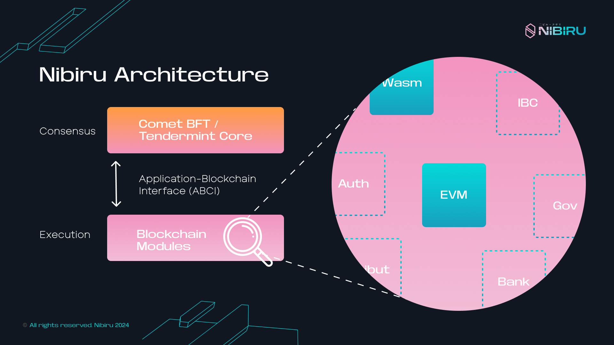

---
# https://vitepress.dev/reference/default-theme-home-page
layout: home

hero:
  name: "Nibiru Docs"
  text: "High-performance, Built-in Yield. "
  tagline: >-
    Discover the power of lightning-fast execution and seamless Multi VM
    interoperability. 
  actions:
    - theme: brand
      text: Build on Nibiru
      link: /dev/
    - theme: alt
      text: User Guides
      link: /use/

features:
  - title: Developer Hub - Build on Nibiru
    details: >-
      Everything you need to develop smart contract applications for the
      decentralized web.
    link: "/dev/"
    icon:
      dark: "https://nibiru.fi/_astro/built-for-speed.H-2o_o6I.png"
      light: "https://nibiru.fi/_astro/built-for-speed.H-2o_o6I.png"
  - title: User Guides
    details: >-
      Kickstart your journey as a user of Nibiru. Learn how to create wallets,
      stake NIBI, participate in campaigns, or use the Nibiru web app.
    link: "/use/"
    icon:
      dark: "https://nibiru.fi/_astro/multi-vm-base.CO13EFlt.png"
      light: "https://nibiru.fi/_astro/multi-vm-base.CO13EFlt.png"
  - title: Core Concepts
    details: >-
      Build an understanding of the core concepts behind how Nibiru works. Topics
      explored in this section provide a solid foundation on Web3 and the Nibiru
      blockchain.
    link: "/concepts/"
    icon:
      dark: "https://nibiru.fi/_astro/structured-products.mCEFVVaR.png"
      light: "https://nibiru.fi/_astro/structured-products.mCEFVVaR.png"
  - title: Explore Nibiru Apps
    details: >-
      Enjoy simplicity with transparency. Trade, borrow, and earn with a variety
      of DeFi applications building on Nibiru. 
    link: "https://nibiru.fi/ecosystem"
    icon:
      dark: "https://nibiru.fi/_astro/multi-vm-base.CO13EFlt.png"
      light: "https://nibiru.fi/_astro/multi-vm-base.CO13EFlt.png"

---

## For Users

Engage with Nibiru's fast-growing community or get started by accessing a wealth of resources and tutorials below.

- [Nibiru Community Hub](./community/)
- [Nibiru Web App](https://app.nibiru.fi/)
- [Guide: Set Up a Nibiru Chain Wallet](./wallets/)
- [Guide: Staking on Nibiru](./use/stake.html)

## For Devs

<!-- <template> -->
<!--   <HeroBoxes :boxes="boxesDevs" /> -->
<!-- </template> -->

- [Smart Contract Sandbox (NibiruChain/nibiru-wasm)](https://github.com/NibiruChain/nibiru-wasm/tree/main)
- [TypeScript SDK: NibiJS](./dev/tools/kickstart.html)
- [Rust SDK: `nibiru_std`](https://github.com/NibiruChain/nibiru-wasm/tree/main/contracts#example-contracts)
- [Golang SDK: Gonibi](./dev/tools/go-sdk.html)
- [Python SDK](./dev/tools/py-sdk.html)

<!-- <a href="./dev/"> -->
<!--  -->
<!-- </a> -->

## Learn About Nibiru

Nibiru acts as a permission-less platform for developers to deploy secure,
production-grade smart contracts.

- [Smart Contracts on Nibiru](./concepts/wasm/)
- [Learn: Core Concepts](./concepts/tx-msgs.html)
- [Learn: Blockchain Modules](./arch/)

<!-- <template> -->
<!--   <HeroBoxes :boxes="boxesEnd" /> -->
<!-- </template> -->

<!-- <a href="./future/"> -->
<!--  -->
<!-- </a> -->

