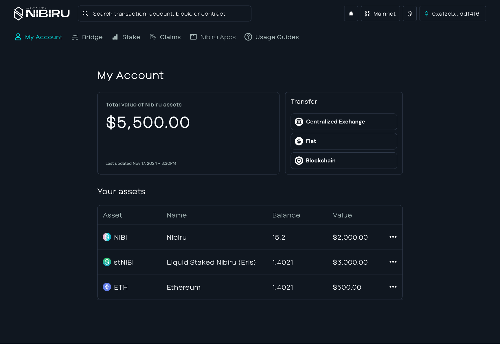

# Liquid Staked Nibiru (stNIBI)

{{ $frontmatter.description }}

| In this Section | Synopsis |
| --- | --- |
| [Benefits of Liquid Staking](#solution-liquid-staking-with-stnibi) | Understand the rationale behind stNIBI. |
| [Guide: How to Liquid Stake on Nibiru](../../use/liquid-stake.md) | Step-by-step instructions on liquid staking. |
| [Onchain Addresses and Denomination for stNIBI](#onchain-addresses-and-denomination-for-stnibi) | Bank denom and Nibiru EVM contract for stNIBI. |
| [Where Can You See stNIBI in Your Wallet?](#where-can-you-see-stnibi-in-your-wallet) | View and manage stNIBI holdings. |
| [How to redeem NIBI from your stNIBI](#how-to-redeem-nibi-from-your-stnibi) | Convert stNIBI back to NIBI. |

## The Problem

In many Proof-of-Stake (PoS) protocols, staking involves locking your tokens for
extended periods of time in exchange for predictable rewards and access to
participate in decentralized governance. While this approach can provide returns
denominated in those tokens, locked staking means you cannot easily trade the
capital or use it in applications.

## Solution: Liquid Staking with stNIBI

Liquid staking through stNIBI addresses these limitations. You earn rewards and
help secure the network while holding a liquid token. When you liquid stake NIBI
through Eris Protocol, you receive **stNIBI**, which you can trade or use across
the Nibiru ecosystem while staking rewards accrue.

1. **Maintain liquidity** — Use stNIBI in Nibiru applications while the underlying NIBI remains staked.
2. **Auto-compounding** — Rewards increase the NIBI value redeemable per stNIBI over time.
3. **Simplified experience** — No need to manually claim and restake rewards for liquid staked positions.
4. **Enhanced security** — More staking participation strengthens network security.
5. **Ecosystem growth** — Use stNIBI as collateral, in liquidity pools, or in other DeFi integrations.
6. **Risk mitigation** — Eris Protocol spreads stake across multiple validators.

## Onchain Addresses and Denomination for stNIBI

These identifiers match the [Nibiru token registry](https://github.com/NibiruChain/nibiru/tree/main/token-registry) (`official_bank_coins.json` and `official_erc20s.json`).

| Representation | Address or denomination |
| --- | --- |
| [Bank Coin](../../concepts/tokens/bank-coins.md) | `tf/nibi1udqqx30cw8nwjxtl4l28ym9hhrp933zlq8dqxfjzcdhvl8y24zcqpzmh8m/ampNIBI` |
| [ERC20 on Nibiru EVM](../../concepts/tokens/erc20.md) | `0xcA0a9Fb5FBF692fa12fD13c0A900EC56Bb3f0a7b` |

stNIBI on Nibiru is available as a bank coin (Wasm/IBC) and as an ERC20 on Nibiru
EVM via FunToken mapping. See also the [stNIBI token page](../../use/tokens/stnibi.md).

## Security and Audits

Security of Eris Protocol, which issues stNIBI and coordinates validator selection,
is a top priority. Multiple audits cover the contracts deployed on Nibiru:

1. [Oak Security. 2023-02-15. Audit Report - Eris Protocol v1.0.pdf](https://github.com/oak-security/audit-reports/blob/ba83bd7d48391dda861c60ccadaccb910eb2e5b5/Eris%20Protocol/2023-02-15%20Audit%20Report%20-%20Eris%20Protocol%20v1.0.pdf)
2. [SCV-Security. 2022-09-23. Eris Protocol - Amplified Staking - Audit Report v1.0.pdf](https://rawcdn.githack.com/SCV-Security/PublicReports/670859b4f4fe0d113568a058db0241b9f20fb61b/Eris%20Protocol/Eris%20Protocol%20-%20Amplified%20Staking%20-%20Audit%20Report%20v1.0.pdf)
3. [SCV-Security. 2023-03-28. Eris Protocol - Tokenfactory Contract - Audit Report v1.0.pdf](https://rawcdn.githack.com/SCV-Security/PublicReports/670859b4f4fe0d113568a058db0241b9f20fb61b/Eris%20Protocol/Eris%20Protocol%20-%20Tokenfactory%20Contract%20-%20Audit%20Report%20v1.0.pdf)

## Common Questions on stNIBI

### Where Can You See stNIBI in Your Wallet?

You can view stNIBI as a bank coin in IBC wallets (for example Keplr or Fox) when
the asset is registered, or as an ERC20 in MetaMask on Nibiru EVM. The staking
web app lists liquid staked balances on the [Liquid tab](https://app.nibiru.fi/stake#liquid).

stNIBI exists as a [Bank Coin](../../concepts/tokens/bank-coins.md) and as a
canonical [ERC20](../../concepts/tokens/erc20.md) on Nibiru EVM. To import the
ERC20 in MetaMask, see [Token Addresses (Nibiru EVM)](../../wallets/common-tokens-evm.md).

### How to redeem NIBI from your stNIBI

1. **Instant liquidity** — Sell or swap stNIBI on a market that lists it.
2. **Unstaking** — Redeem stNIBI through Eris Protocol or the [Nibiru staking app](https://app.nibiru.fi/stake#liquid) to receive underlying NIBI (subject to unbonding time).

## Reference Links

- [Tokens - Bank Coins](../../concepts/tokens/bank-coins.md)
- [Tokens - ERC20 Tokens](../../concepts/tokens/erc20.md)
- [Guide: Liquid Staking on Nibiru (stNIBI)](../../use/liquid-stake.md)
- [Liquid Staked NIBI (stNIBI) — token page](../../use/tokens/stnibi.md)
- [Eris Protocol Docs - Amplifier](https://docs.erisprotocol.com/products/amplifier/)
- [Eris Protocol - Web App](https://www.erisprotocol.com/nibiru/amplifier/NIBI)
- [Nibiru EVM](../../evm/index.md)
- [Staking Yield on Nibiru](../staking.md)
