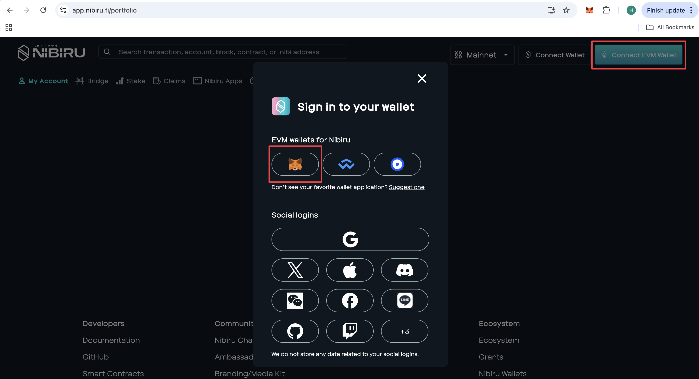
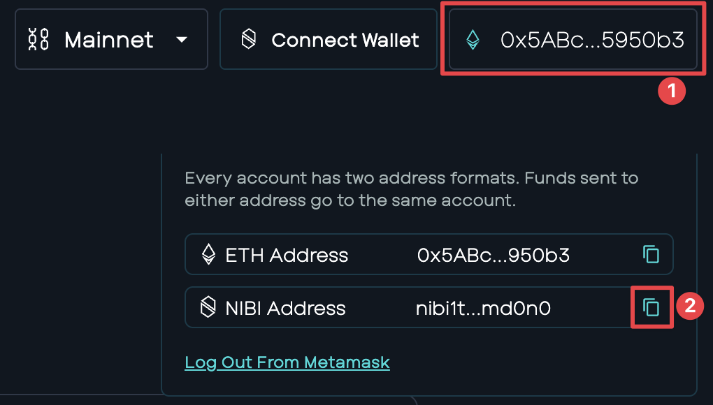
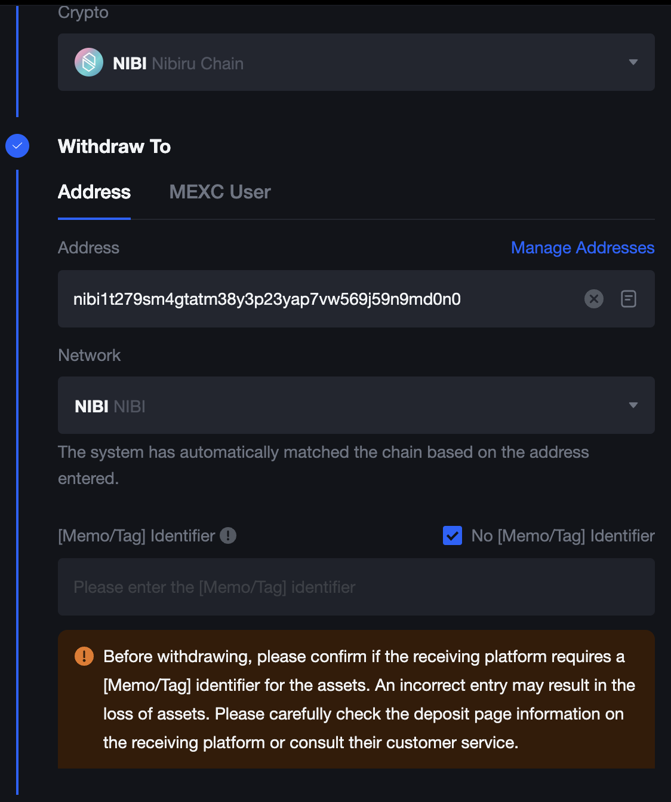
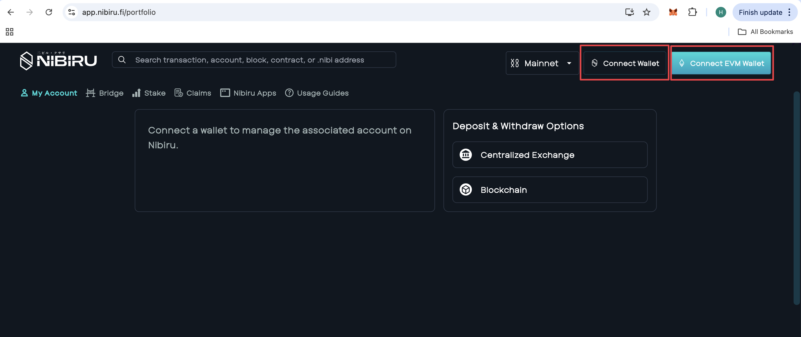
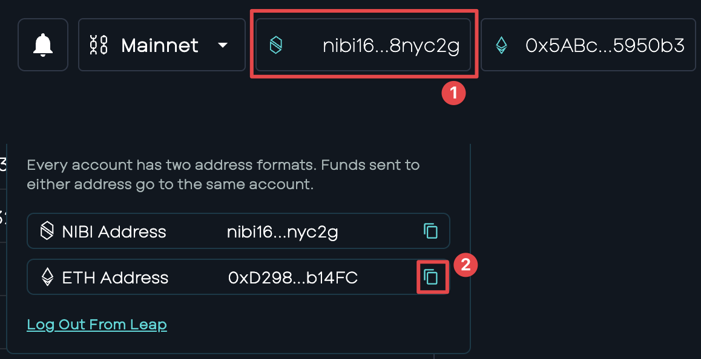
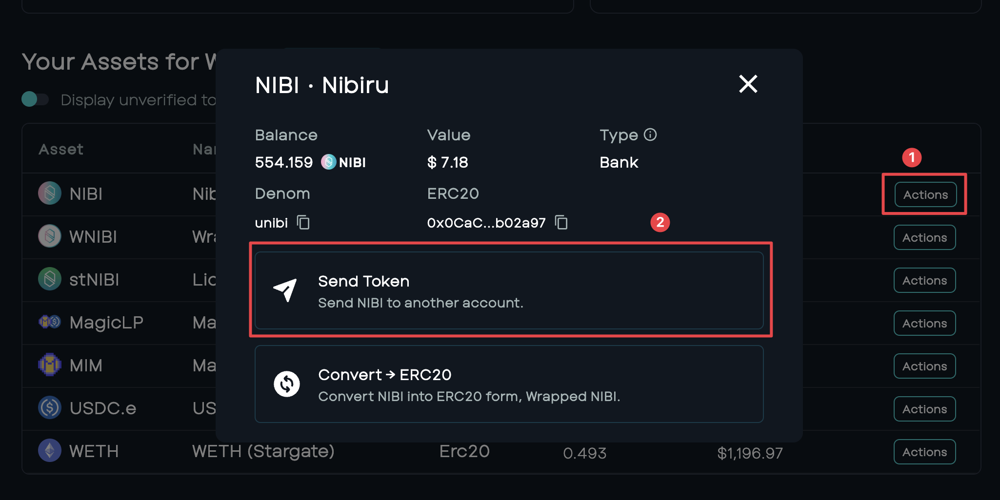
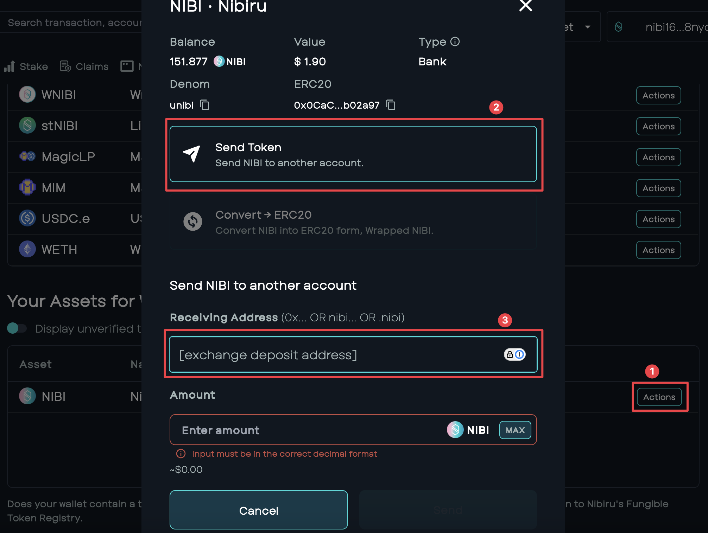

# Guide: Withdraw/Deposit with Centralized Exchanges (EVM)

{{ $frontmatter.description }}

1. [How to Buy NIBI on an Exchange](#how-to-buy-nibi-on-an-exchange)
2. [How to Send NIBI from the Web App to a CEX like MEXC, Kucoin, Bybit, or Gate.io](#how-to-send-nibi-from-the-web-app-to-a-cex-like-mexc-kucoin-bybit-or-gateio)
3. [Withdrawing from Centralized Exchange to EVM](#withdrawing-from-centralized-exchange-to-evm)
4. [Depositing to Centralized Exchange from EVM](#depositing-to-centralized-exchange-from-evm)

## How to Buy NIBI on an Exchange

<iframe width="110%" style="aspect-ratio: 14/9; border-radius: 1.5rem; left: -20%;" src="https://www.youtube.com/embed/p-k3azoZPBM?list=PLF9oBuDueh44qpG8G9VKsIKOt9_nC4GCa" title="How to Buy NIBI and Send to Nibiru Web App" frameborder="0" allow="accelerometer; autoplay; clipboard-write; encrypted-media; gyroscope; picture-in-picture; web-share" allowfullscreen></iframe>

## How to Send NIBI from the Web App to a CEX like MEXC, Kucoin, Bybit, or Gate.io

<iframe width="110%" style="aspect-ratio: 14/9; border-radius: 1.5rem; left: -20%;" src="https://www.youtube.com/embed/SVw1PPP2-hg?list=PLF9oBuDueh44qpG8G9VKsIKOt9_nC4GCa" title="How to Send NIBI from the Web App to a CEX like MEXC, Kucoin, Bybit, or Gate.io" frameborder="0" allow="accelerometer; autoplay; clipboard-write; encrypted-media; gyroscope; picture-in-picture; web-share" allowfullscreen></iframe>

## Withdrawing from Centralized Exchange to EVM

1 | Head to the [Nibiru Web App](https://app.nibiru.fi/portfolio) and connect your EVM wallet.

2 | Click the EVM address and copy the NIBI derivation of your EVM wallet.

3 | Head to the CEX and use the copied address as the withdrawal address and follow the exchange instructions. No memo/tag is needed.

4 | Upon confirmation, your funds will arrive and display in your EVM wallet.

## Depositing to Centralized Exchange from EVM 

1 | Create an [IBC Wallet](https://nibiru.fi/docs/wallets/).

2 | Head to the [Nibiru Web App](https://app.nibiru.fi/portfolio) and connect your EVM wallet with the $NIBI funds to be deposited, as well as your IBC wallet.

3 | With both wallets connected, click the NIBI address and copy the EVM derivation of your IBC wallet.

4 | With the EVM derivation of your IBC wallet copied, send over your $NIBI from your EVM wallet using the copied address as the destination address. You can do this in your EVM wallet directly, or using the web app, as shown below.

5 | Once funds have arrived in your IBC wallet, using either your IBC wallet directly or using the web app (shown below), deposit your funds to the exchange deposit address. 

6 | Upon confirmation, your funds will arrive and display in the exchange.
