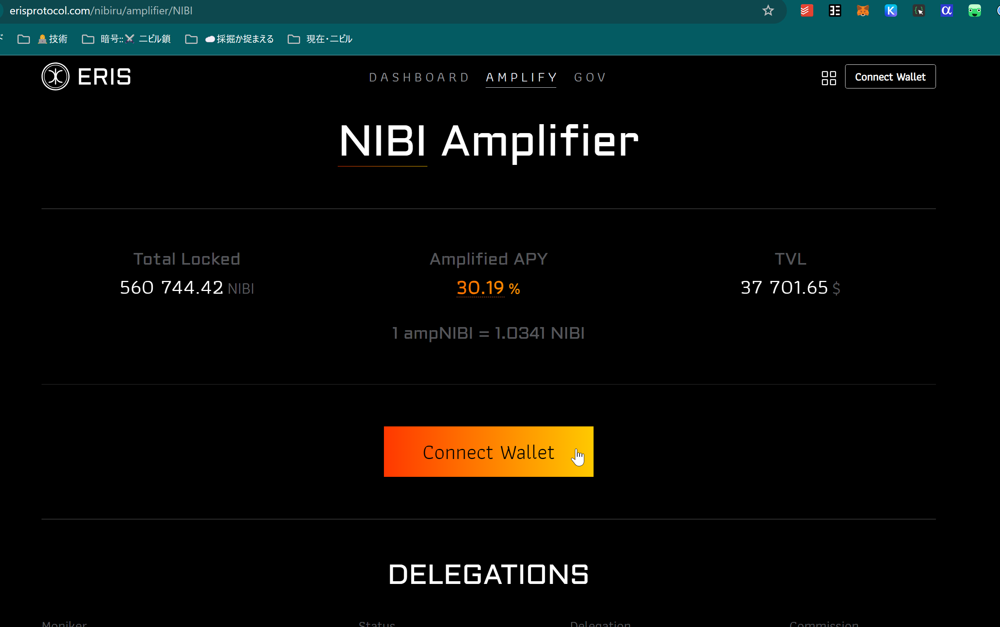
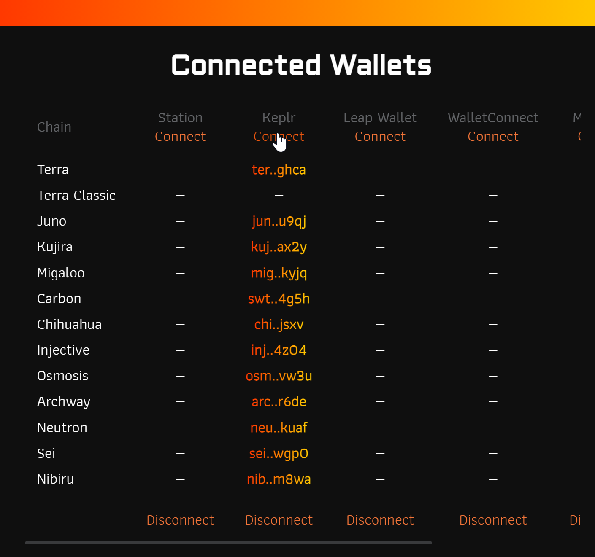
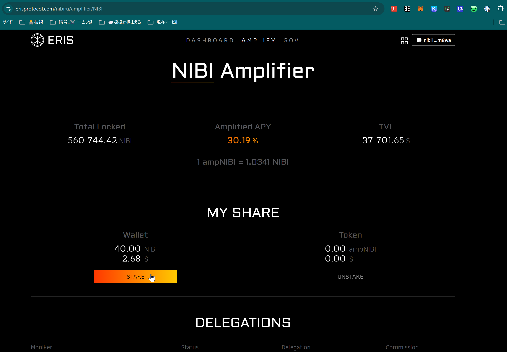
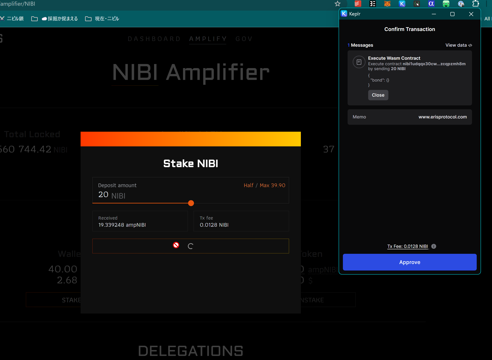

# Guide: Liquid Staking on Nibiru (stNIBI)

{{ $frontmatter.description }}

## How to Liquid Stake NIBI on Nibiru EVM

<iframe width="110%" style="aspect-ratio: 14/9; border-radius: 1.5rem;" src="https://www.youtube.com/embed/xoKwCQr47wA?list=PLF9oBuDueh44qpG8G9VKsIKOt9_nC4GCa" title="How to Liquid Stake NIBI on Nibiru EVM" frameborder="0" allow="accelerometer; autoplay; clipboard-write; encrypted-media; gyroscope; picture-in-picture; web-share" allowfullscreen></iframe>

## Liquid Staking Nibiru with Eris Protocol

1 | Head to the [Eris Protocol
application](https://www.erisprotocol.com/nibiru/amplifier/NIBI) to access the
"Amplifier" on Nibiru.

2 | Connect one of the available [Nibiru wallet options](../wallets/index.md).

3 | After accepting the connection requests to the connected wallet, you can
click "Stake" to liquid stake. 

4 | Select a deposit amount and click the button to broadcast a transaction that
invokes the Eris smart contracts.

## More on Liquid Staking through Eris Protocol

- [Liquid Staked Nibiru (stNIBI)](../learn/liquid-stake/index.md)
- [Follow Eris Protocol (`@eris_protocol`) on Twitter/X](https://x.com/eris_protocol)
- [Everything You Need to Know About Staking Yield on Nibiru](../learn/staking.md)
- [Security and Audits - Eris Protocol](../learn/liquid-stake/index.md#security-and-audits)
