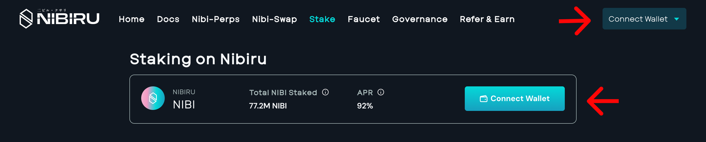
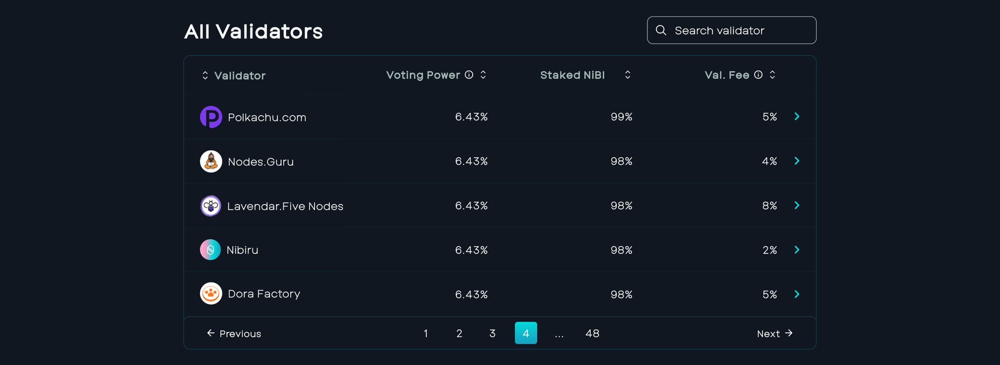
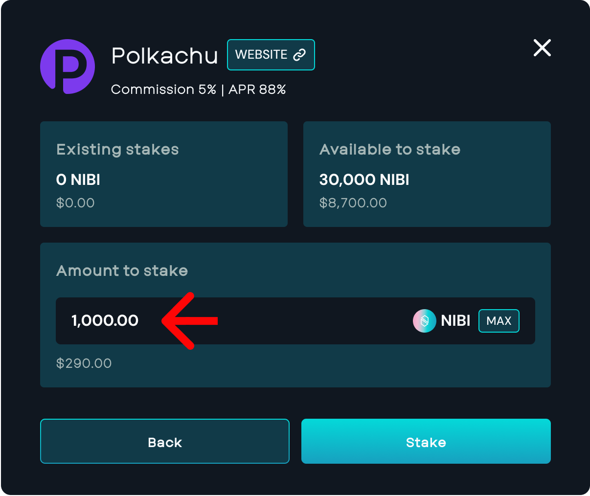
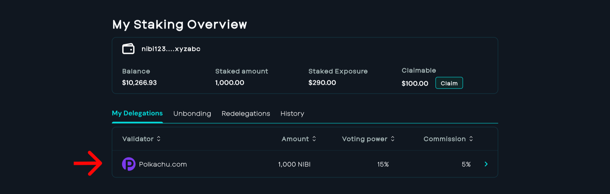
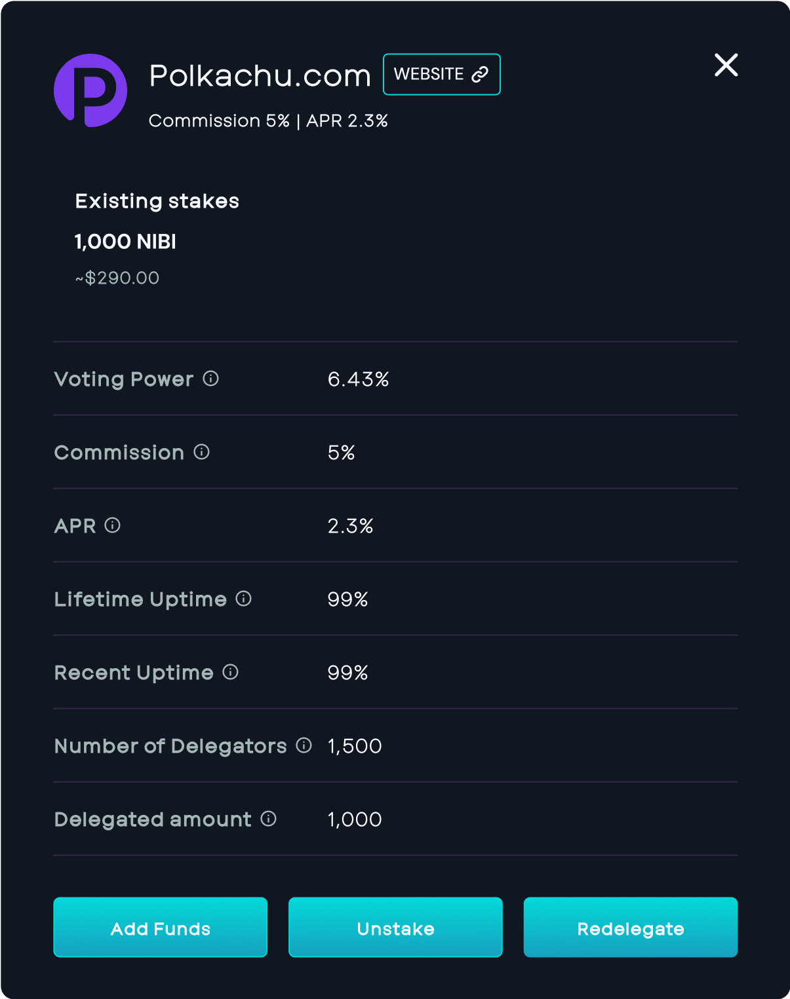
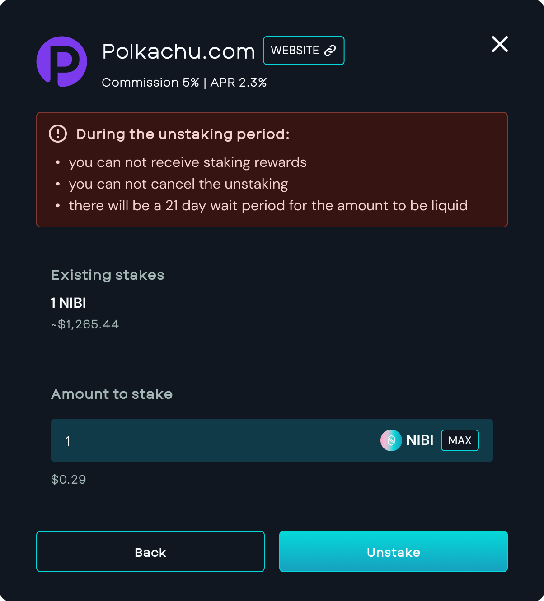
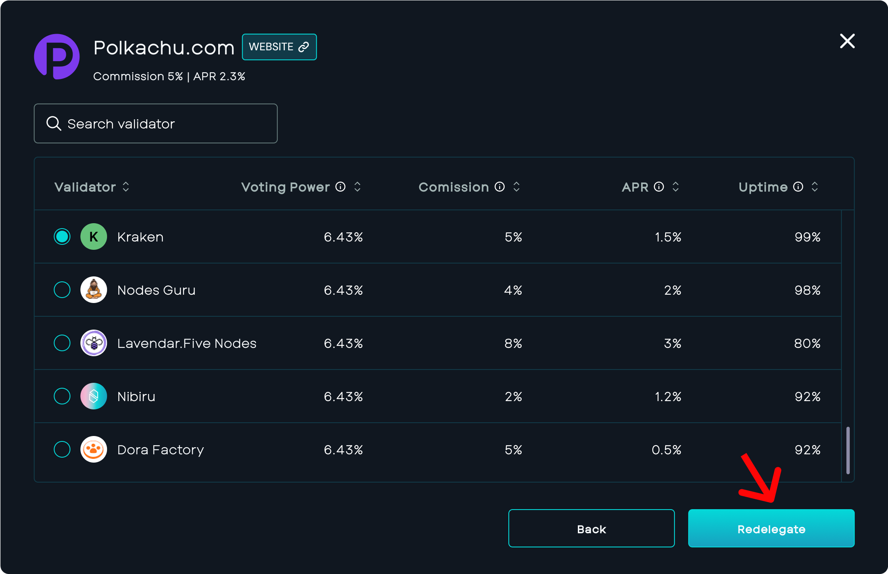

# Guide: Staking on Nibiru

{{ $frontmatter.description }}

<!-- ## Pre-requisite -->

<!-- - [Anatomy of an SDK application](./index.md) {prereq} -->
<!-- - [Lifecycle of an SDK transaction](./index.md) {prereq} -->

#### Table of Contents

- [How to stake NIBI](#how-to-stake-nibi)
- [How to unstake NIBI or switch validators](#how-to-unstake-nibi-or-switch-validators)
- [Liquid staking with stNIBI](#liquid-staking-with-stnibi)
- [Related Questions](#related-questions)
    - [1. How often do users receive staking emissions?](#1-how-often-do-users-receive-staking-emissions)
    - [2. How often do users get regular rewards?](#2-how-often-do-users-get-regular-rewards)
    - [3. Do users need to claim staking rewards manually or are they claimed automatically?](#3-do-users-need-to-claim-staking-rewards-manually-or-are-they-claimed-automatically)
    - [4. Are coins frozen when a user stakes them?](#4-are-coins-frozen-when-a-user-stakes-them)
    - [5. Is there an unstaking period?](#5-is-there-an-unstaking-period)
    - [6. Can users re-delegate from one validator to another?](#6-can-users-re-delegate-from-one-validator-to-another)
- [About Nibiru Chain](#about-nibiru-chain)

## How to stake NIBI

1. [Visit the Nibiru Web App](https://app.nibiru.fi/stake) either from a desktop
   or mobile device.
2. Click “Connect Wallet” and use Keplr, Fox, or another [supported IBC wallet](../wallets/index.md).
   

3. Choose a validator to stake with. While you don't have to pick Nibiru's validator, there are many validators available for delegation.
   

4. Insert the amount of NIBI to stake
   

5. Click “**Stake”**
6. Next, **“Approve”** the transaction in your connected wallet.

7. You will now see the validators you've staked NIBI to.
   

## How to unstake NIBI or switch validators

1. Under “My Delegations,” select the Validator you want to unstake from.
2. You’ll see the option to either “Unstake” or “Redelegate” your NIBI.
   

3. If you “Unstake” NIBI, the unbonding process will take 21 days.
   

However, if you choose to “Redelegate” NIBI, you can stake it with another validator.

   

4. After 21 days of initiating the unstake, the NIBI will automatically return to the address.

## Liquid staking with stNIBI

Liquid staking is available in the [Nibiru web app](https://app.nibiru.fi/stake#liquid).
When you liquid stake NIBI through Eris Protocol, you receive **stNIBI** (liquid
staked NIBI). You keep a transferable token while the underlying NIBI remains
staked and rewards accrue to stNIBI over time.

- **Step-by-step guide:** [Guide: Liquid Staking on Nibiru (stNIBI)](./liquid-stake.md)
- **How stNIBI works:** [Liquid Staked Nibiru (stNIBI)](../learn/liquid-stake/index.md)

Use the **Liquid** tab on the staking page to stake, view balances, or redeem stNIBI.
Native staking on this page (validator delegations above) is separate from liquid
staking: native rewards are claimed manually in the app, while stNIBI compounds
through the liquid staking token.

## Related Questions

#### 1. How often do users receive staking emissions?

   Stakers receive emissions from the network accrued over the day (once per 24 hours), and the rate of emissions adjusts every 30 days.

#### 2. How often do users get regular rewards?

   Rewards are distributed daily.

#### 3. Do users need to claim staking rewards manually or are they claimed automatically?

   Users must manually claim their staking rewards through the Nibiru Web App UI.

#### 4. Are coins frozen when a user stakes them?
  
   Staked tokens become non-transferable and illiquid.

#### 5. Is there an unstaking period?

   Yes, there is a 21-day period for unstaking also known as unbonding. However, the unbonding process can be canceled at any time.

#### 6. Can users re-delegate from one validator to another?

   Users can re-delegate from one validator to another. The first re-delegation occurs immediately, but subsequent re-delegations (from the 2nd to the 3rd delegator) require a 21-day waiting period.

## About Nibiru Chain

Nibiru is a breakthrough L1 blockchain and smart contract ecosystem sporting superior throughput and unparalleled security. Nibiru aims to be the most developer-friendly and user-friendly smart contract ecosystem, leading the charge toward mainstream Web3 adoption by innovating at each layer of the stack: dApp development, infra, consensus, a comprehensive dev toolkit, and value accrual.

---

Disclaimer

> No representation or warranty is made, express or implied, with respect to the
future performance of any digital asset, financial instrument or other market or
economic measure. Recipients should consult their advisors before making any
investment decision. The Nibiru Foundation (MTRX Services, Ltd.) is not
registered or licensed in any capacity with the U.S. Securities and Exchange
Commission or the U.S. Commodity Futures Trading Commission.
