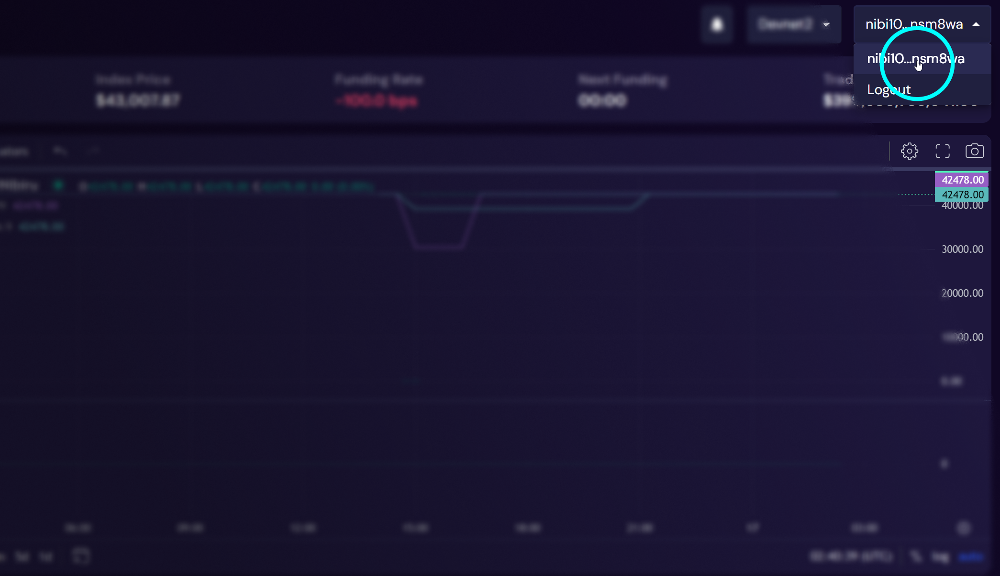

# Create a Nibiru Wallet Address

{{ $frontmatter.description }}

There are a few steps you'll need to complete to get a Nibiru wallet address.

1. Install a **wallet** extension or application.
2. Create an **account** or recover an existing one using a **mnemonic phrase**.
3. Connect to your desired instance of Nibiru Chain. For example, mainnet,
   permanent testnet, etc.
4. Copy your Nibiru address.

## 1 & 2 | Wallet Installation and Account Creation 

Follow these tutorials to set up Keplr or Fox Wallet if you have not already:

- [How-To: Set Up Keplr Wallet (For Beginners)](./setup-keplr.html) 
- [How-To: Set Up Fox Wallet](./setup-fox.md)

## 3 | (Mobile) Copy your Nibiru Address

We **recommend Keplr** for IBC interactions on Nibiru. After installing the
mobile app on Android or iOS and creating an account, open your Nibiru account in
Keplr and copy your address from the account details screen.

:::tip
Note that Keplr mobile requires Keplr V2.
:::

:::tip
Q: Is there a difference between the address for mainnet and testnet?  
A: **No, the address is the same for both networks**. While the address itself may be the same, transactions and accounts on testnet and mainnet are separate. Transactions intended for one network do not affect the other.
:::

For a screenshot walkthrough on mobile, see [How to Set Up Fox Wallet](./setup-fox.md#fox-wallet-mobile-finding-your-nibiru-chain-address).

## 3 | (Desktop) Connect to Nibiru Chain

Open [Nibiru's Web App (app.nibiru.fi)](https://app.nibiru.fi) and connect your
wallet. 

## 4 | (Desktop) Copy your Nibiru Address

You can copy your address from a wallet browser extension or from this
button on the top-right:

<!-- ## Troubleshooting -->
<!---->
<!-- ... -->
