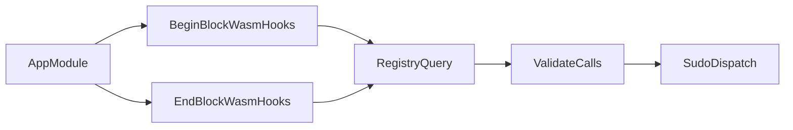

# Nibiru - /x/wasm

Module `x/wasm` is Nibiru's Cosmos SDK integration for CosmWasm smart contracts. The package wraps `wasmvm`, persists code and contract state, exposes gRPC/CLI interfaces, and handles IBC port callbacks. Most of the core lifecycle (store, instantiate, execute, migrate, sudo) comes from the upstream wasmd fork; Nibiru adds chain-specific behavior such as Wasm block hooks.

```bash
⚡ NibiruChain/Nibiru/x/wasm
├── 📂 cli              # `nibid` query and tx commands for the wasm module
├── 📂 docs-wasmd       # Vendored upstream wasmd docs (integration, upgrading, events)
├── 📂 exported         # Cross-module interfaces (legacy param subspace)
├── 📂 ibctesting       # Multi-chain IBC test harness for wasm integration tests
├── 📂 ioutils          # Gzip and wasm-bytecode detection for code uploads
├── 📂 keeper           # Core keeper: wasmvm lifecycle, IBC, msg/query servers, ABCI hooks
│   └── 📂 wasmtesting  # Mock wasm engine and keeper doubles for unit tests
├── 📂 testdata         # Shared CosmWasm fixture binaries and embed helpers
├── 📂 testutil         # Path helpers (`FixturePath`) for tests loading fixtures
├── 📂 types            # Module types, params, codec, genesis, protobuf msgs/queries
├── ibc.go              # Port-level IBC handler delegating to keeper callbacks
├── module.go           # AppModule wiring, node flags, ABCI begin/end hooks
├── alias.go            # Deprecated re-exports of types and keeper symbols
├── 01-gov-txs.md       # Governance proposal types for the wasm lifecycle
├── 02-ibc.md           # IBC contract interaction spec
└── README.md
```

Related paths outside this directory:

- directory [proto/cosmwasm/wasm/v1/](../../proto/cosmwasm/wasm/v1/) — protobuf definitions for msgs, queries, and genesis
- directory [app/](../../app/) — module wiring into `NibiruApp`
- repo [nibi-wasm](https://github.com/NibiruChain/nibiru-wasm) — Rust smart contracts and package `nibiru-std` (contract side, not chain module code)

## Hacking

Install command `just` to run repo-level recipes. From the repository root, run command `just -l` to list them.

### Go tests

Run wasm package tests from the repository root:

```bash
go test ./x/wasm/...
go test ./x/wasm/keeper
```

Some tests require a live localnet or CGO-enabled `wasmvm`. See [CLAUDE.md](../../CLAUDE.md) for `just test`, `just test-fast`, and localnet setup.

### Keeper test file naming

Directory `x/wasm/keeper/` uses two test package conventions:

| Package | Filename pattern | Purpose |
| --- | --- | --- |
| `keeper_test` | `X_test.go` | External (black-box) tests against the public keeper API |
| `keeper` | `X_unit_test.go` | Internal unit tests with access to unexported symbols |

Package `keeper/wasmtesting` holds test doubles (mock wasm engine, mock keepers). It is not a test package itself.

### Test fixtures

- Package `testdata` embeds sample contract bytecode (`HackatomContractWasm`, `ReflectContractWasm`, etc.) via file `contracts.go`
- Directory `x/wasm/testdata/` holds `.wasm` binaries, gzip fixtures, and the block-hooks tester contract
- Function `FixturePath` in package `testutil` resolves absolute paths under `x/wasm/` for CLI and IBC tests

## Nibiru-specific behavior: Wasm block hooks

At begin-block and end-block, function `AppModule.BeginBlock` and function `AppModule.EndBlock` in file `module.go` call into keeper methods `BeginBlockWasmHooks` and `EndBlockWasmHooks` (file `keeper/abci_hooks.go`).



Flow:

1. Read the registry contract address from `SudoKeeper.WasmBlockHooksContract`. If unset, the hook is a no-op.
2. Smart-query the registry with `{"begin_block_plan":{}}` or `{"end_block_plan":{}}`.
3. Decode the response as a list of type `WasmSudoMsgCall` (`contract_addr`, `msg`).
4. Validate each item (address format, non-empty JSON object payload, size limits). Constants `WasmBlockHookMaxDispatches` and `WasmBlockHookMaxPayloadJSONSize` bound the plan.
5. Execute each valid target via `Keeper.Sudo` in an isolated cache context. A target failure emits event type `wasm_block_hook_failure` and does not block later targets.

Tests in file `keeper/abci_hooks_test.go` exercise this flow against fixture contract `wasm_block_hooks_tester.wasm` in directory `testdata/`.

## Configuration

Add the following section to file `config/app.toml`:

```toml
[wasm]
# Maximum SDK gas (wasm and storage) allowed for x/wasm smart queries
query_gas_limit = 300000
# Memory cache size for Wasm modules kept in memory to speed up instantiation (MiB, not bytes)
memory_cache_size = 300
```

The same values can be set via CLI flags on command `start`:

```bash
--wasm.memory_cache_size uint32   # MiB (NOT bytes); 0 disables cache (default 100)
--wasm.query_gas_limit uint       # Max gas for smart queries (default 3000000)
```

Note: the TOML example above uses `query_gas_limit = 300000`, while the CLI default is `3000000`. Set both explicitly if you need them to match.

## Events

Wasm transactions emit several event layers useful for indexers and explorers.

### Module message events

Every `MsgInstantiateContract` or `MsgExecuteContract` emits a `message` event tagged with the contract and signer. The module attribute is always `wasm`. Attribute `code_id` appears only on instantiate (so you can subscribe to new instances); it is omitted on execute. Attribute `action` is auto-added by the Cosmos SDK with value `store-code`, `instantiate`, or `execute`:

```json
{
    "Type": "message",
    "Attr": [
        {
            "key": "module",
            "value": "wasm"
        },
        {
            "key": "action",
            "value": "instantiate"
        },
        {
            "key": "signer",
            "value": "cosmos1vx8knpllrj7n963p9ttd80w47kpacrhuts497x"
        },
        {
            "key": "code_id",
            "value": "1"
        },
        {
            "key": "_contract_address",
            "value": "cosmos14hj2tavq8fpesdwxxcu44rty3hh90vhujrvcmstl4zr3txmfvw9s4hmalr"
        }
    ]
}
```

### Bank transfer events

If funds move to or from a contract as part of the message, standard bank `transfer` events appear. For example, instantiating with an initial balance in the same `MsgInstantiateContract` adds:

```json
[
    {
        "Type": "transfer",
        "Attr": [
            {
                "key": "recipient",
                "value": "cosmos14hj2tavq8fpesdwxxcu44rty3hh90vhujrvcmstl4zr3txmfvw9s4hmalr"
            },
            {
                "key": "sender",
                "value": "cosmos1ffnqn02ft2psvyv4dyr56nnv6plllf9pm2kpmv"
            },
            {
                "key": "amount",
                "value": "100000denom"
            }
        ]
    }
]
```

### Contract custom events

Contracts can emit custom events on execute (not on init). Each contract gets its own `wasm` event. If one contract calls another, you may see one event per contract. Contract attributes pass through verbatim; the module adds `_contract_address` with the emitting contract. Example from an escrow contract releasing funds:

```json
{
    "Type": "wasm",
    "Attr": [
        {
            "key": "_contract_address",
            "value": "cosmos14hj2tavq8fpesdwxxcu44rty3hh90vhujrvcmstl4zr3txmfvw9s4hmalr"
        },
        {
            "key": "action",
            "value": "release"
        },
        {
            "key": "destination",
            "value": "cosmos14k7v7ms4jxkk2etmg9gljxjm4ru3qjdugfsflq"
        }
    ]
}
```

### Pulling this all together

Invoke an escrow contract to release to the designated beneficiary. The escrow was previously loaded with `100000denom`. In this transaction, send `5000denom` along with `MsgExecuteContract`; the contract releases the full balance (`105000denom`) to the beneficiary.

You should see four event groups: (1) transfer of funds to the contract, (2) contract custom event for the release, (3) transfer from contract to beneficiary, and (4) generic x/wasm execute event (always present; the custom event in (2) is optional and only as reliable as the contract):

```json
[
    {
        "Type": "transfer",
        "Attr": [
            {
                "key": "recipient",
                "value": "cosmos14hj2tavq8fpesdwxxcu44rty3hh90vhujrvcmstl4zr3txmfvw9s4hmalr"
            },
            {
                "key": "sender",
                "value": "cosmos1zm074khx32hqy20hlshlsd423n07pwlu9cpt37"
            },
            {
                "key": "amount",
                "value": "5000denom"
            }
        ]
    },
    {
        "Type": "wasm",
        "Attr": [
            {
                "key": "_contract_address",
                "value": "cosmos14hj2tavq8fpesdwxxcu44rty3hh90vhujrvcmstl4zr3txmfvw9s4hmalr"
            },
            {
                "key": "action",
                "value": "release"
            },
            {
                "key": "destination",
                "value": "cosmos14k7v7ms4jxkk2etmg9gljxjm4ru3qjdugfsflq"
            }
        ]
    },
    {
        "Type": "transfer",
        "Attr": [
            {
                "key": "recipient",
                "value": "cosmos14k7v7ms4jxkk2etmg9gljxjm4ru3qjdugfsflq"
            },
            {
                "key": "sender",
                "value": "cosmos14hj2tavq8fpesdwxxcu44rty3hh90vhujrvcmstl4zr3txmfvw9s4hmalr"
            },
            {
                "key": "amount",
                "value": "105000denom"
            }
        ]
    },
    {
        "Type": "message",
        "Attr": [
            {
                "key": "module",
                "value": "wasm"
            },
            {
                "key": "action",
                "value": "execute"
            },
            {
                "key": "signer",
                "value": "cosmos1zm074khx32hqy20hlshlsd423n07pwlu9cpt37"
            },
            {
                "key": "_contract_address",
                "value": "cosmos14hj2tavq8fpesdwxxcu44rty3hh90vhujrvcmstl4zr3txmfvw9s4hmalr"
            }
        ]
    }
]
```

Events with the same `Type` may be merged somewhere in the stack, so you might see one `transfer` event combining both transfers. Verify against raw transaction logs when indexing.

## Further reading

| Topic | Location |
| --- | --- |
| CLI commands (`nibid query wasm`, `nibid tx wasm`) | directory [x/wasm/cli/](cli/) |
| REST and gRPC API | directory [proto/cosmwasm/wasm/v1/](../../proto/cosmwasm/wasm/v1/) |
| IBC contract model (one port per contract, channel handshake) | file [02-ibc.md](02-ibc.md) |
| Governance proposals for wasm lifecycle | file [01-gov-txs.md](01-gov-txs.md) |
| Upstream wasmd integration and upgrading notes | directory [docs-wasmd/](docs-wasmd/) |
| Rust contracts and `nibiru-std` | repo [nibi-wasm](https://github.com/NibiruChain/nibiru-wasm) |
